# Keys and Identity in Nostr

!!! info "Learning Objectives"
    After this lesson, you'll understand:
    
    - How cryptographic keys work in Nostr
    - The difference between private and public keys
    - Key formats and encoding (hex, npub, nsec)
    - Best practices for key management
    - How identity works without usernames

## Introduction

In Nostr, your identity is entirely based on cryptographic keys. Unlike traditional social media where you create an account with a username and password, Nostr uses public-key cryptography to establish and verify your identity.

## Understanding Cryptographic Keys

### What are Cryptographic Keys?

Cryptographic keys are pairs of mathematically related numbers used for:

- **Authentication**: Proving you are who you claim to be
- **Digital Signatures**: Ensuring messages haven't been tampered with
- **Encryption**: Keeping communications private (optional in Nostr)

### The Key Pair

Every Nostr identity consists of two keys:


## Private vs Public Keys: The Essential Difference

Understanding the difference between private and public keys is crucial for using Nostr safely and effectively.

### Private Keys: Your Secret Identity

Your private key is like a **master password** that controls your entire Nostr identity.

#### **What it does:**
- **Signs events** - Proves you authored a message
- **Controls identity** - Only you can post as "you"
- **Enables authentication** - Proves ownership of your account
- **Cannot be recovered** - If lost, your identity is gone forever

#### **Security Rules:**
- ❌ **NEVER share** with anyone
- ❌ **NEVER post** publicly or in messages
- ❌ **NEVER store** in plain text
- ✅ **ALWAYS backup** securely
- ✅ **ALWAYS encrypt** when storing

#### **Think of it like:**
- Your house key - only you should have it
- Your signature - uniquely identifies you
- Your bank PIN - gives access to everything

### Public Keys: Your Public Identity

Your public key is your **address** on Nostr - it's how others find and verify you.

#### **What it does:**
- **Identifies you** - Your unique address on Nostr
- **Verifies signatures** - Others can confirm your messages are authentic
- **Enables discovery** - People can find and follow you
- **Safe to share** - No security risk in sharing

#### **Sharing Rules:**
- ✅ **Safe to share** publicly
- ✅ **Post in bio** or profiles
- ✅ **Share in messages** 
- ✅ **Display on websites**
- ✅ **Include in QR codes**

#### **Think of it like:**
- Your email address - others need it to contact you
- Your phone number - safe to share, identifies you
- Your mailing address - public information

### The Mathematical Relationship

```mermaid
graph LR
    A[Private Key<br/>🔐 Secret] -->|generates| B[Public Key<br/>🌐 Public]
    A -->|signs| C[Message]
    B -->|verifies| C
    C -->|authentic?| D{✓ Valid}
```



Private and public keys are mathematically linked:
- **One-way relationship**: Private key generates public key
- **Cannot reverse**: Public key cannot reveal private key
- **Cryptographic proof**: Signatures prove private key ownership

### Real-World Analogy

Think of it like a **wax seal** system:

- **Private Key** = Your unique seal stamp (keep secret!)
- **Public Key** = The pattern your seal makes (everyone can see)
- **Signature** = Pressing your seal on a document
- **Verification** = Others checking if the seal pattern matches yours

### Common Mistakes to Avoid

!!! danger "Critical Errors"
    
    **Sharing Private Keys**
    ```
    ❌ "Here's my nsec1abc123..." (NEVER DO THIS!)
    ✅ "Here's my npub1xyz789..." (Safe to share)
    ```
    
    **Confusing Key Types**
    ```
    ❌ Posting private key thinking it's public
    ❌ Trying to follow someone using their private key
    ✅ Always double-check key prefixes (nsec vs npub)
    ```
    
    **Insecure Storage**
    ```
    ❌ Saving private key in notes app
    ❌ Emailing private key to yourself
    ✅ Using secure password managers or hardware wallets
    ```

## Private Keys

Your private key is the **secret** that proves ownership of your identity.

### Characteristics

- **Secret**: Never share this with anyone
- **Unique**: Each private key is randomly generated
- **Powerful**: Can create signatures for any event
- **Irreplaceable**: If lost, your identity is lost forever

### Format Examples

=== "Hex Format"

    ```
    d63b64d9c2c4f8c7b8e9f1a2b3c4d5e6f7a8b9c0d1e2f3a4b5c6d7e8f9a0b1c2
    ```

=== "nsec Format (Bech32)"

    ```
    nsec1mclkfkwu2n7v0wuwn6d2kwx56mn0029ceuxr6ul6xjm2k6l7qxsqrxqhp8
    ```

### Generating a Private Key

=== "JavaScript"

    ```javascript
    import { generatePrivateKey } from 'nostr-tools'
    
    const privateKey = generatePrivateKey()
    console.log('Private key:', privateKey)
    // Output: d63b64d9c2c4f8c7b8e9f1a2b3c4d5e6f7a8b9c0d1e2f3a4b5c6d7e8f9a0b1c2
    ```

=== "Python"

    ```python
    from nostr.key import PrivateKey
    
    private_key = PrivateKey()
    print(f"Private key: {private_key.hex()}")
    // Output: d63b64d9c2c4f8c7b8e9f1a2b3c4d5e6f7a8b9c0d1e2f3a4b5c6d7e8f9a0b1c2
    ```

=== "Rust"

    ```rust
    use nostr_sdk::prelude::*;
    
    let keys = Keys::generate();
    println!("Private key: {}", keys.secret_key().display_secret());
    ```

## Public Keys

Your public key is your **identity** in Nostr - it's how others recognize you.

### Characteristics

- **Public**: Safe to share with everyone
- **Derived**: Mathematically derived from your private key
- **Immutable**: Always the same for a given private key
- **Verifiable**: Others can verify your signatures with it

### Format Examples

=== "Hex Format"

    ```
    02a1b2c3d4e5f6a7b8c9d0e1f2a3b4c5d6e7f8a9b0c1d2e3f4a5b6c7d8e9f0a1b2
    ```

=== "npub Format (Bech32)"

    ```
    npub15xdvv02wuha0hpkx6x0z7g3mgh4w0l9fxqcr6nxvhm2k6l7qxsqg8t5c4
    ```

### Deriving Public Key

=== "JavaScript"

    ```javascript
    import { getPublicKey, nip19 } from 'nostr-tools'
    
    const privateKey = 'd63b64d9c2c4f8c7b8e9f1a2b3c4d5e6f7a8b9c0d1e2f3a4b5c6d7e8f9a0b1c2'
    const publicKey = getPublicKey(privateKey)
    
    console.log('Public key (hex):', publicKey)
    console.log('Public key (npub):', nip19.npubEncode(publicKey))
    ```

=== "Python"

    ```python
    from nostr.key import PrivateKey
    
    private_key = PrivateKey.from_hex('d63b64d9c2c4f8c7b8e9f1a2b3c4d5e6f7a8b9c0d1e2f3a4b5c6d7e8f9a0b1c2')
    public_key = private_key.public_key
    
    print(f"Public key (hex): {public_key.hex()}")
    print(f"Public key (npub): {public_key.bech32()}")
    ```

## Key Formats and Encoding

Nostr uses different formats for displaying keys to users:

### Hex Format
- **Raw format**: 64 character hexadecimal string
- **Use case**: Internal processing, APIs
- **Example**: `d63b64d9c2c4f8c7b8e9f1a2b3c4d5e6f7a8b9c0d1e2f3a4b5c6d7e8f9a0b1c2`

### Bech32 Format (NIP-19)
- **User-friendly**: Includes checksums and prefixes
- **Private keys**: Start with `nsec1`
- **Public keys**: Start with `npub1`
- **Benefits**: Error detection, easier to copy/paste

!!! tip "Format Conversion"
    Most Nostr libraries provide functions to convert between formats:
    
    ```javascript
    import { nip19 } from 'nostr-tools'
    
    // Hex to bech32
    const npub = nip19.npubEncode(hexPublicKey)
    const nsec = nip19.nsecEncode(hexPrivateKey)
    
    // Bech32 to hex
    const { type, data } = nip19.decode(npub)
    ```

## Digital Signatures

Your private key is used to create digital signatures that prove authenticity:

### How Signatures Work

1. **Create Event**: You compose a message or event
2. **Hash Content**: The event content is hashed
3. **Sign Hash**: Your private key signs the hash
4. **Attach Signature**: The signature is included with the event
5. **Verify**: Others use your public key to verify the signature

### Example: Signing an Event

=== "JavaScript"

    ```javascript
    import { finishEvent } from 'nostr-tools'
    
    const event = {
        kind: 1,
        created_at: Math.floor(Date.now() / 1000),
        tags: [],
        content: 'Hello Nostr!'
    }
    
    const signedEvent = finishEvent(event, privateKey)
    console.log('Signed event:', signedEvent)
    ```

=== "Python"

    ```python
    from nostr.event import Event
    from nostr.key import PrivateKey
    import time
    
    private_key = PrivateKey()
    
    event = Event(
        kind=1,
        content="Hello Nostr!",
        created_at=int(time.time())
    )
    
    private_key.sign_event(event)
    print(f"Signed event: {event.to_json()}")
    ```

## Identity Without Usernames

### Traditional vs Nostr Identity

| Traditional Social Media | Nostr |
|--------------------------|-------|
| Username + Password | Cryptographic Keys |
| Platform controls identity | You control identity |
| Can be banned/suspended | Censorship resistant |
| Tied to one platform | Portable across clients |
| Password can be reset | Keys cannot be recovered |

### Benefits of Cryptographic Identity

!!! success "Advantages"
    
    - **True Ownership**: You own your identity, not a platform
    - **Portability**: Use the same identity across all Nostr clients
    - **Censorship Resistance**: No central authority can ban you
    - **Verification**: Cryptographic proof of authenticity
    - **Privacy**: No personal information required

!!! warning "Responsibilities"
    
    - **Key Security**: You must protect your private key
    - **No Recovery**: Lost keys mean lost identity
    - **Backup Important**: Always backup your keys securely

## Key Management Best Practices

### Secure Storage

!!! danger "Never Do This"
    
    - Store private keys in plain text files
    - Share private keys via email or messaging
    - Use the same key across multiple devices without encryption
    - Store keys in browser localStorage without encryption

!!! success "Best Practices"
    
    - Use hardware wallets when possible
    - Encrypt private keys with strong passwords
    - Use secure key management software
    - Create offline backups in multiple locations
    - Consider using key derivation for multiple identities

### Key Backup Strategies

=== "Paper Backup"

    ```
    1. Write down your private key (nsec format)
    2. Store in a fireproof safe
    3. Consider multiple copies in different locations
    4. Use tamper-evident storage
    ```

=== "Digital Backup"

    ```
    1. Encrypt with strong password
    2. Store on multiple devices
    3. Use cloud storage with encryption
    4. Regular backup verification
    ```

=== "Hardware Wallet"

    ```
    1. Use dedicated hardware device
    2. Secure with PIN/passphrase
    3. Backup seed phrase securely
    4. Test recovery process
    ```

## Multiple Identities

You can have multiple Nostr identities for different purposes:

### Use Cases

- **Personal**: Your main social identity
- **Professional**: Work-related content
- **Anonymous**: Privacy-focused interactions
- **Bot**: Automated accounts
- **Testing**: Development and experimentation

### Managing Multiple Keys

=== "JavaScript"

    ```javascript
    class NostrIdentityManager {
        constructor() {
            this.identities = new Map()
        }
        
        createIdentity(name) {
            const privateKey = generatePrivateKey()
            const publicKey = getPublicKey(privateKey)
            
            this.identities.set(name, {
                privateKey,
                publicKey,
                npub: nip19.npubEncode(publicKey)
            })
            
            return this.identities.get(name)
        }
        
        getIdentity(name) {
            return this.identities.get(name)
        }
        
        listIdentities() {
            return Array.from(this.identities.keys())
        }
    }
    ```

## Interactive Exercise

Let's practice working with keys:

!!! example "Try This"
    
    1. Generate a new key pair
    2. Convert between hex and bech32 formats
    3. Create and sign a simple event
    4. Verify the signature
    
    Use the code examples above to experiment with key generation and signing.

## Common Pitfalls

!!! warning "Avoid These Mistakes"
    
    **Key Confusion**
    - Mixing up private and public keys
    - Using wrong key formats
    - Sharing private keys accidentally
    
    **Security Issues**
    - Storing keys insecurely
    - Not backing up keys
    - Using weak random number generation
    
    **Format Errors**
    - Invalid hex characters
    - Incorrect bech32 encoding
    - Wrong key length

## Next Steps

Now that you understand keys and identity, let's explore how events and messages work in Nostr.

<div class="next-lesson">
  <a href="../events/" class="btn btn-primary">
    :material-arrow-right: Events & Messages →
  </a>
</div>

---

## Quick Quiz

!!! question "Test Your Understanding"
    
    1. What's the difference between a private key and public key?
    2. Which key format starts with "npub1"?
    3. What happens if you lose your private key?
    4. Why doesn't Nostr use usernames and passwords?
    5. What is the purpose of digital signatures?
    
    ??? success "Answers"
        1. Private key is secret and used for signing; public key is shared and used for verification
        2. Public keys in bech32 format start with "npub1"
        3. You lose access to that identity forever - there's no recovery
        4. Cryptographic keys provide better security, ownership, and censorship resistance
        5. Digital signatures prove authenticity and prevent tampering 