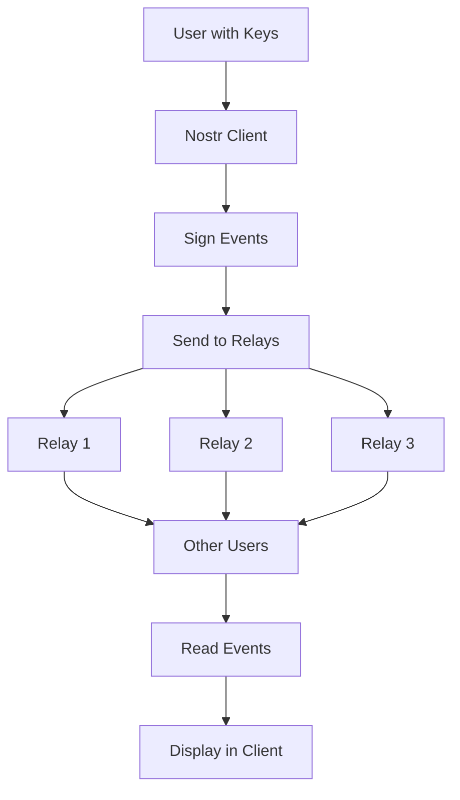

# Nostr Fundamentals: What Does Nostr Stand For?

**Nostr** stands for **"Notes and Other Stuff Transmitted by Relays"** - a simple yet powerful protocol for decentralized social networking and communication.

## Breaking Down the Acronym

### **N** - Notes
The primary content type in Nostr. Notes are short messages, similar to tweets, that users publish to share thoughts, updates, and information.

### **O** - Other Stuff  
Nostr isn't limited to just text notes. "Other stuff" includes:
- Images and media
- Long-form articles
- Direct messages
- Reactions and likes
- Lightning payments (zaps)
- Live events and streams
- Marketplace listings
- And much more...

### **T** - Transmitted
Data flows through the network via a simple, standardized protocol using WebSockets and JSON.

### **B** - By
The preposition connecting the transmission method to the infrastructure.

### **R** - Relays
The servers that store and forward messages. Unlike traditional social media, no single entity controls all relays.

## Core Philosophy

### 🔓 **Censorship Resistance**
No single point of control means no single point of failure or censorship.

### 🔑 **User Ownership**
Your identity and data belong to you, not to a platform.

### 🌐 **Interoperability**
All clients can communicate with each other through the same protocol.

### ⚡ **Simplicity**
The protocol is intentionally simple, making it easy to implement and understand.

## How Nostr Works: The Big Picture



### 1. **Identity Layer**
- Users generate cryptographic key pairs
- Public key = your identity
- Private key = your signature authority

### 2. **Content Layer**
- Everything is an "event" (note, reaction, profile update, etc.)
- Events are signed with your private key
- Events have standardized formats (defined by NIPs)

### 3. **Network Layer**
- Events are sent to multiple relays
- Relays store and forward events
- Clients connect to relays to read/write events

### 4. **Application Layer**
- Clients provide user interfaces
- Different clients can have different features
- All clients can interoperate through the protocol

## Key Concepts

### Events
Everything in Nostr is an "event" - a JSON object with specific fields:

```json
{
  "id": "unique-event-identifier",
  "pubkey": "author-public-key", 
  "created_at": 1234567890,
  "kind": 1,
  "tags": [],
  "content": "Hello Nostr!",
  "sig": "cryptographic-signature"
}
```

### Event Kinds
Different types of content have different "kind" numbers:

- **Kind 0**: User metadata (profile info)
- **Kind 1**: Text notes (like tweets)
- **Kind 3**: Contact lists (who you follow)
- **Kind 4**: Encrypted direct messages
- **Kind 7**: Reactions (likes, etc.)
- **And many more...**

### Cryptographic Identity
Your identity is your public key:

```
npub1xyz... (human-readable format)
```

Your private key is your password:
```
nsec1abc... (keep this secret!)
```

### Relays
Servers that:
- Store events temporarily or permanently
- Forward events to connected clients
- Can have their own policies and rules
- Are operated by different entities

## What Makes Nostr Different?

### Traditional Social Media
```
User → Platform → Other Users
```
- Platform controls everything
- Single point of failure
- Platform owns your data
- Platform can censor or ban

### Nostr
```
User → Multiple Relays → Other Users
```
- No central control
- Multiple paths for data
- You own your identity and data
- Censorship requires coordinated effort

## Nostr vs Other Protocols

### vs Mastodon/ActivityPub
- **Nostr**: Simple, cryptographic identity, relay-based
- **Mastodon**: Complex, server-based identity, federation

### vs Bitcoin
- **Nostr**: Communication protocol, uses similar cryptography
- **Bitcoin**: Money protocol, proof-of-work consensus

### vs Email
- **Nostr**: Real-time, public by default, cryptographic identity
- **Email**: Store-and-forward, private by default, domain-based identity

## The Nostr Ecosystem

### Clients (User Interfaces)
- **Damus** (iOS) - Native mobile experience
- **Amethyst** (Android) - Feature-rich Android client  
- **Iris** (Web) - Browser-based client
- **Nostrudel** (Web) - Advanced web client
- **Primal** (Multi-platform) - Caching and discovery

### Relays (Infrastructure)
- **Public relays** - Open to everyone
- **Private relays** - Restricted access
- **Paid relays** - Premium features
- **Specialized relays** - Specific content types

### Tools and Services
- **Lightning integration** - Bitcoin payments
- **Media hosting** - Image and video storage
- **Search engines** - Content discovery
- **Analytics** - Network insights

## Benefits of Nostr

### For Users
- **Own your identity** - No platform can take it away
- **Choose your experience** - Pick clients that suit you
- **Avoid censorship** - Multiple relays provide redundancy
- **Portable social graph** - Take your followers anywhere

### For Developers
- **Simple protocol** - Easy to implement
- **No API keys** - Direct relay access
- **Innovation freedom** - Build any features you want
- **Interoperability** - Works with all other clients

### For Society
- **Decentralization** - Reduces big tech power
- **Free speech** - Harder to censor globally
- **Innovation** - Permissionless development
- **Resilience** - No single point of failure

## Common Misconceptions

### ❌ "Nostr is just another Twitter clone"
✅ Nostr is a protocol that can support many types of applications, not just social media.

### ❌ "Nostr is completely anonymous"
✅ Nostr provides pseudonymity through public keys, but additional privacy measures may be needed.

### ❌ "Nostr is only for Bitcoin people"
✅ While Bitcoin integration is popular, Nostr is useful for anyone wanting decentralized communication.

### ❌ "Nostr is too technical for normal users"
✅ While the underlying protocol is technical, user-friendly clients make it accessible to everyone.

## Getting Started with Nostr

### 1. **Choose a Client**
Pick a user-friendly client like Damus (iOS), Amethyst (Android), or Iris (web).

### 2. **Generate Keys**
Most clients will generate keys for you automatically.

### 3. **Set Up Profile**
Add your name, bio, and profile picture.

### 4. **Find People**
Follow interesting accounts and join conversations.

### 5. **Start Posting**
Share your thoughts and engage with the community.

## The Future of Nostr

### Short Term
- Better user experience
- More client features
- Improved relay infrastructure
- Enhanced privacy options

### Long Term
- Integration with other protocols
- New application types beyond social media
- Global adoption as communication standard
- Economic layers and monetization

## Technical Deep Dive

### Protocol Simplicity
Nostr's power comes from its simplicity:

```javascript
// The entire protocol in pseudocode
function publishEvent(event, relays) {
  const signedEvent = sign(event, privateKey)
  relays.forEach(relay => relay.send(signedEvent))
}

function subscribeToEvents(filter, relays) {
  relays.forEach(relay => {
    relay.subscribe(filter, (event) => {
      if (verify(event.signature, event.pubkey)) {
        displayEvent(event)
      }
    })
  })
}
```

### Cryptographic Foundation
- **Schnorr signatures** (same as Bitcoin)
- **secp256k1** elliptic curve
- **SHA-256** hashing
- **NIP-19** encoding for human-readable keys

## Resources for Learning More

### Official Documentation
- [Nostr Protocol](https://github.com/nostr-protocol/nostr)
- [NIPs Repository](https://github.com/nostr-protocol/nips)

### Community
- [Nostr Telegram](https://t.me/nostr_protocol)
- [Reddit r/nostr](https://reddit.com/r/nostr)
- [Nostr on Nostr](https://nostr.com)

### Development
- [Awesome Nostr](https://github.com/aljazceru/awesome-nostr)
- [Nostr Tools](https://github.com/nbd-wtf/nostr-tools)
- [Developer Chat](https://t.me/nostr_dev)

!!! quote "Nostr's Vision"
    "The simplest open protocol that is able to create a censorship-resistant global 'social' network once and for all." - fiatjaf (Nostr creator)

!!! tip "Remember"
    Nostr is not just a social network - it's a communication protocol that can power many different types of applications. The social media use case is just the beginning! 