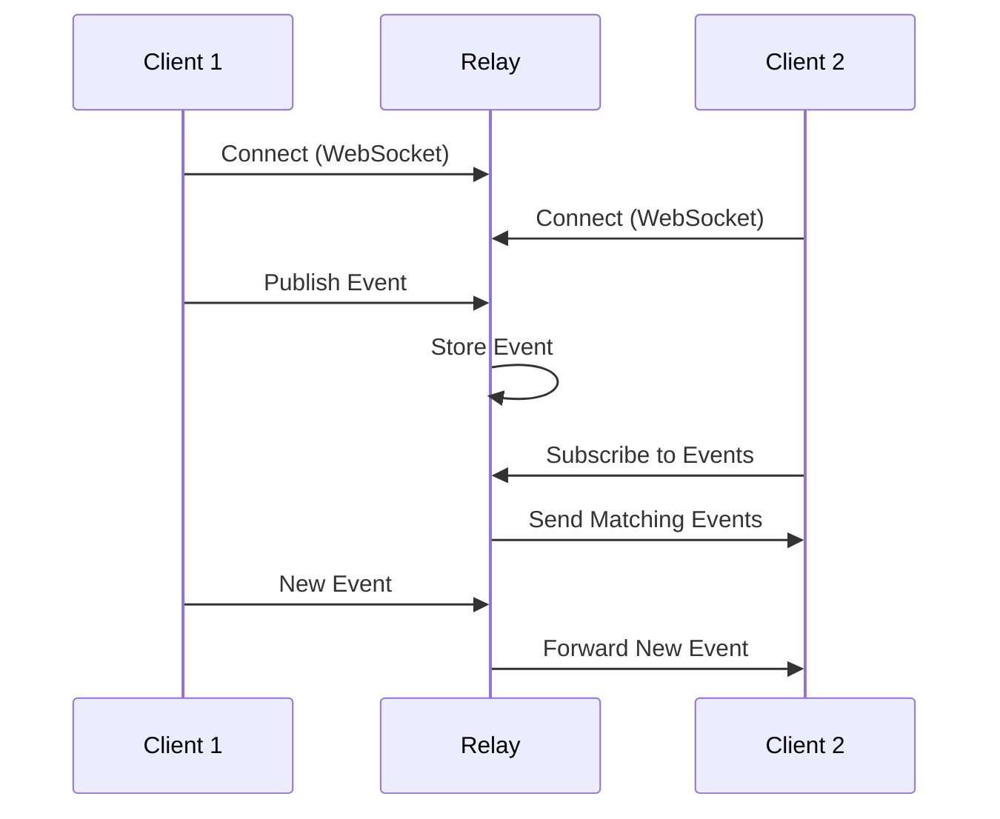

# Understanding Nostr Relays

Relays are the backbone of the Nostr network - simple servers that store and forward events between clients. Understanding how relays work is crucial for using Nostr effectively.

## What is a Relay?

A **relay** is a server that:
- Accepts events from clients
- Stores events (temporarily or permanently)
- Forwards events to other connected clients
- Implements filtering and subscription logic
- Can enforce its own policies and rules

Think of relays as **post offices** for the Nostr network - they receive, store, and deliver messages between users.

## How Relays Work

### Basic Operation Flow



### WebSocket Communication

Relays communicate with clients using WebSocket connections and JSON messages:

```javascript
// Client connects to relay
const relay = new WebSocket('wss://relay.example.com')

// Client publishes an event
relay.send(JSON.stringify(['EVENT', signedEvent]))

// Client subscribes to events
relay.send(JSON.stringify(['REQ', subscriptionId, filter]))

// Relay sends events to client
// ["EVENT", subscriptionId, event]
```

## Types of Relays

### 🌐 Public Relays
- Open to everyone
- No registration required
- Usually free to use
- May have rate limits

**Examples:**
- `wss://relay.damus.io`
- `wss://nos.lol`
- `wss://relay.nostr.band`

### 🔒 Private Relays
- Restricted access
- Invitation or whitelist only
- Better privacy and control
- Often used by communities

### 💰 Paid Relays
- Require payment for access
- Better performance and reliability
- Spam protection through economic incentives
- Professional support

### 🎯 Specialized Relays
- Focus on specific content types
- Custom filtering and policies
- Optimized for particular use cases

**Examples:**
- Media-only relays
- Long-form content relays
- Lightning payment relays
- Geographic relays

## Relay Policies

### Content Policies
Relays can implement various content policies:

```json
{
  "name": "Family Friendly Relay",
  "description": "No adult content allowed",
  "content_policy": {
    "prohibited": ["adult", "violence", "spam"],
    "required_tags": ["content-warning"],
    "max_content_length": 280
  }
}
```

### Rate Limiting
Prevent spam and abuse:

```json
{
  "rate_limits": {
    "events_per_minute": 10,
    "subscriptions_per_connection": 20,
    "max_filters_per_subscription": 10
  }
}
```

### Storage Policies
Different retention strategies:

- **Permanent storage** - Keep all events forever
- **Time-based expiration** - Delete events after X days
- **Size-based limits** - Keep only recent events
- **Kind-based policies** - Different rules for different event types

## Relay Discovery

### NIP-11 Relay Information

Relays provide metadata about their capabilities:

```bash
curl -H "Accept: application/nostr+json" https://relay.example.com
```

```json
{
  "name": "My Awesome Relay",
  "description": "A relay for the Nostr community",
  "pubkey": "relay-operator-pubkey",
  "contact": "admin@relay.example.com",
  "supported_nips": [1, 2, 9, 11, 12, 15, 16, 20, 22],
  "software": "strfry",
  "version": "0.9.6",
  "limitation": {
    "max_message_length": 65536,
    "max_subscriptions": 20,
    "max_filters": 100,
    "max_limit": 5000,
    "max_subid_length": 100,
    "min_prefix": 4,
    "max_event_tags": 100,
    "max_content_length": 8196,
    "min_pow_difficulty": 30,
    "auth_required": false,
    "payment_required": false
  },
  "payments_url": "https://relay.example.com/payments",
  "fees": {
    "admission": [{"amount": 5000000, "unit": "msats"}],
    "subscription": [{"amount": 1000000, "unit": "msats", "period": 2592000}],
    "publication": [{"amount": 100, "unit": "msats"}]
  }
}
```

### Relay Lists and Directories

- **Nostr.watch** - Real-time relay monitoring
- **Relay registries** - Curated lists of relays
- **Client recommendations** - Built-in relay suggestions

## Choosing Relays

### Factors to Consider

#### **Reliability**
- Uptime and availability
- Response time and latency
- Historical performance

#### **Policies**
- Content moderation approach
- Rate limiting rules
- Storage duration

#### **Geographic Location**
- Closer relays = lower latency
- Legal jurisdiction considerations
- Data sovereignty requirements

#### **Community**
- Who else uses this relay?
- Moderation quality
- Community standards

### Recommended Strategy

#### **Diversification**
Use multiple relays for redundancy:

```javascript
const relays = [
  'wss://relay.damus.io',      // Popular public relay
  'wss://nos.lol',             // Alternative public relay
  'wss://relay.nostr.band',    // Search-optimized relay
  'wss://private.relay.com'    // Your private relay
]
```

#### **Read vs Write Relays**
- **Write relays** - Where you publish your events
- **Read relays** - Where you discover content

Many clients allow different relay sets for reading and writing.

## Relay Performance

### Key Metrics

#### **Latency**
Time for events to propagate:
```bash
# Test relay response time
time curl -s wss://relay.example.com > /dev/null
```

#### **Throughput**
Events processed per second:
- Small relays: 10-100 events/sec
- Large relays: 1000+ events/sec

#### **Storage**
How much data the relay stores:
- Event count
- Total storage size
- Retention policies

### Monitoring Tools

#### **Nostr.watch**
Real-time relay statistics:
- Uptime monitoring
- Response time tracking
- Geographic distribution
- NIP support matrix

#### **Relay.tools**
Comprehensive relay analysis:
- Performance benchmarks
- Feature comparison
- Historical data

## Running Your Own Relay

### Benefits
- **Full control** over policies and data
- **Privacy** for your communications
- **Reliability** for your content
- **Community building** around your relay

### Popular Relay Software

#### **Strfry** (C++)
- High performance
- Easy configuration
- Active development
- Good documentation

#### **Nostream** (TypeScript)
- Feature-rich
- Easy to customize
- Good for developers
- Active community

#### **Relay Pool** (Go)
- Lightweight
- Simple deployment
- Good for beginners

### Basic Setup Example

```bash
# Install strfry
git clone https://github.com/hoytech/strfry.git
cd strfry
make setup-golpe
make -j4

# Configure
cp strfry.conf.example strfry.conf
# Edit configuration...

# Run relay
./strfry relay
```

## Relay Economics

### Cost Factors
- **Server hosting** - VPS or dedicated server
- **Bandwidth** - Data transfer costs
- **Storage** - Disk space for events
- **Maintenance** - Time and expertise

### Revenue Models
- **Free/donation-based** - Community supported
- **Subscription fees** - Monthly/yearly payments
- **Pay-per-use** - Micropayments per event
- **Premium features** - Enhanced services

### Lightning Integration
Many relays integrate Bitcoin Lightning for payments:

```json
{
  "fees": {
    "admission": [{"amount": 5000, "unit": "msats"}],
    "publication": [{"amount": 100, "unit": "msats"}]
  }
}
```

## Relay Security

### Authentication
Some relays require authentication:

```javascript
// NIP-42 Authentication
const authEvent = {
  kind: 22242,
  tags: [
    ['relay', 'wss://relay.example.com'],
    ['challenge', challengeString]
  ],
  content: ''
}
```

### Spam Protection
Common anti-spam measures:
- **Rate limiting** - Limit events per time period
- **Proof of work** - Require computational effort
- **Payment requirements** - Economic spam deterrent
- **Content filtering** - Automated moderation

### Privacy Considerations
- **IP logging** - Some relays log connection data
- **Event correlation** - Timing analysis possible
- **Metadata exposure** - Connection patterns visible

## Relay Interoperability

### NIPs for Relays

#### **NIP-01** - Basic Protocol
Core event handling and WebSocket communication.

#### **NIP-11** - Relay Information Document
Standardized relay metadata format.

#### **NIP-20** - Command Results
Standardized responses to client commands.

#### **NIP-42** - Authentication
Optional authentication for relay access.

### Cross-Relay Compatibility
All compliant relays should:
- Accept standard event formats
- Implement basic filtering
- Provide NIP-11 information
- Handle WebSocket connections properly

## Troubleshooting Relay Issues

### Common Problems

#### **Connection Issues**
```bash
# Test WebSocket connection
websocat wss://relay.example.com
```

#### **Slow Performance**
- Check relay location
- Monitor network latency
- Verify relay load

#### **Missing Events**
- Check relay policies
- Verify event signatures
- Confirm relay synchronization

### Debugging Tools

#### **Browser Developer Tools**
Monitor WebSocket connections and messages.

#### **Command Line Tools**
```bash
# Test relay with nak
nak req -k 1 --limit 10 wss://relay.example.com

# Monitor relay with websocat
echo '["REQ","test",{"kinds":[1],"limit":1}]' | websocat wss://relay.example.com
```

## Best Practices

### For Users
1. **Use multiple relays** for redundancy
2. **Choose reliable relays** with good uptime
3. **Respect relay policies** and rate limits
4. **Support relay operators** if possible

### For Relay Operators
1. **Implement proper monitoring** and alerting
2. **Have clear policies** and communicate them
3. **Keep software updated** for security
4. **Engage with the community** for feedback

### For Developers
1. **Handle relay failures** gracefully
2. **Implement proper retry logic**
3. **Respect rate limits** and policies
4. **Test with multiple relays**

## Future of Relays

### Emerging Trends
- **Specialized relays** for specific use cases
- **Economic incentives** through Lightning integration
- **Enhanced privacy** features
- **Better discovery** mechanisms

### Technical Improvements
- **Improved efficiency** and performance
- **Better spam protection**
- **Enhanced monitoring** and analytics
- **Standardized APIs** for management

## Resources

### Relay Lists
- [Nostr.watch](https://nostr.watch) - Live relay monitoring
- [Relay.tools](https://relay.tools) - Relay comparison
- [Nostr.info](https://nostr.info/relays) - Relay directory

### Documentation
- [NIP-11 Specification](https://github.com/nostr-protocol/nips/blob/master/11.md)
- [Relay Implementation Guide](https://github.com/nostr-protocol/nostr/blob/master/README.md)

### Software
- [Strfry](https://github.com/hoytech/strfry)
- [Nostream](https://github.com/Cameri/nostream)
- [Relay Pool](https://github.com/fiatjaf/relay-pool)

!!! tip "Relay Selection"
    Start with popular, reliable public relays, then gradually add specialized or private relays based on your needs. Always use multiple relays for redundancy.

!!! warning "Relay Trust"
    Remember that relay operators can see all events sent to their relay. Choose relays operated by people or organizations you trust, especially for sensitive communications. 