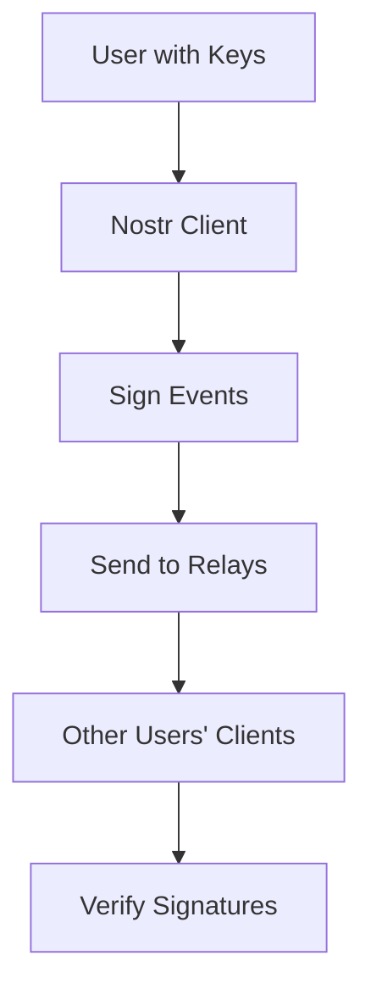
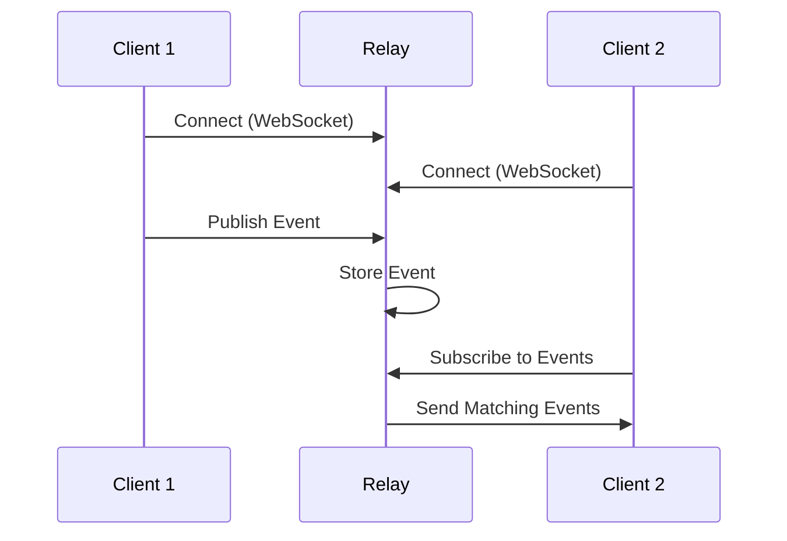
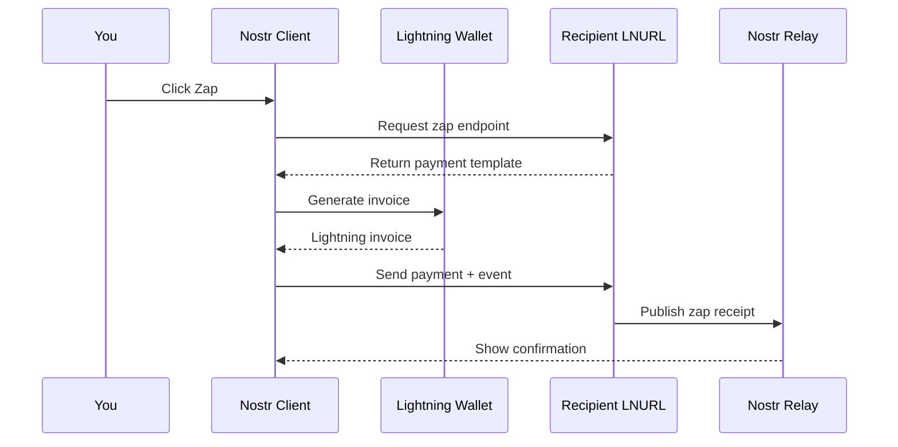

# Nostr Definitions: Complete Reference Guide

This comprehensive guide defines all essential Nostr concepts, protocols, and components in one place.

## Table of Contents

- [Protocol Fundamentals](#protocol-fundamentals)
- [Keys and Identity](#keys-and-identity)
- [Events and Messages](#events-and-messages)
- [Relays and Network](#relays-and-network)
- [Clients and Applications](#clients-and-applications)
- [NIPs (Nostr Implementation Possibilities)](#nips-nostr-implementation-possibilities)
- [Zaps and Lightning Integration](#zaps-and-lightning-integration)
- [Security and Privacy](#security-and-privacy)
- [Development and Technical](#development-and-technical)

---

## Protocol Fundamentals

### Nostr
**"Notes and Other Stuff Transmitted by Relays"** - A simple, open protocol for decentralized social networking and communication.

#### Core Principles
- **Decentralized**: No central authority or single point of failure
- **Censorship-resistant**: Content cannot be universally censored
- **Interoperable**: All clients can communicate with each other
- **User-owned**: Users control their identity and data
- **Simple**: Easy to implement and understand

### Protocol Overview


---

## Keys and Identity

### Private Key
Your secret cryptographic key that:
- Controls your entire Nostr identity
- Signs all your events and messages
- Cannot be recovered if lost
- Must be kept absolutely secure

**Format Examples:**
```
Hex: 5c0c523f52a5b6fad39ed2403092df8cebc36318b39383bca6c00808626fab3a
nsec: nsec1ts8y20636km0450n6fqrxyktmrhtcd0cvwucnw6xvqygsp6wlv62q4ew66q
```

### Public Key
Your public identity on Nostr:
- Derived mathematically from your private key
- Serves as your unique identifier
- Can be shared freely
- Used by others to verify your signatures

**Format Examples:**
```
Hex: 48d54b934bb2767a2980a4e6b2ee5ff86e3a4102b1e3f71c95e66bb06a1e7ff6
npub: npub1frw5hw6tkfm85t2qpfnty0hllrhkx5gzk83lw8y4uehmq6s70lmqqrr9nv
```

### Key Security Best Practices
- **Never share your private key**
- Use hardware wallets when possible
- Keep multiple secure backups
- Use different keys for different purposes
- Consider key rotation strategies

---

## Events and Messages

### Event Structure
All Nostr data is transmitted as events with this structure:

```json
{
  "id": "event-id-hash",
  "pubkey": "author-public-key",
  "created_at": 1234567890,
  "kind": 1,
  "tags": [],
  "content": "Event content",
  "sig": "cryptographic-signature"
}
```

### Event Kinds (Common Types)

#### Basic Events
- **Kind 0**: User Metadata (profile information)
- **Kind 1**: Text Note (like a tweet)
- **Kind 2**: Recommend Relay
- **Kind 3**: Contact List (following list)
- **Kind 4**: Encrypted Direct Message
- **Kind 5**: Event Deletion Request
- **Kind 6**: Repost
- **Kind 7**: Reaction (like/dislike)

#### Advanced Events
- **Kind 9735**: Zap Receipt
- **Kind 30023**: Long-form Article
- **Kind 40**: Channel Creation
- **Kind 41**: Channel Metadata
- **Kind 42**: Channel Message

### Tags
Metadata attached to events for:
- Mentioning users (`["p", "pubkey"]`)
- Referencing events (`["e", "event-id"]`)
- Adding hashtags (`["t", "hashtag"]`)
- Specifying relays (`["r", "relay-url"]`)

---

## Relays and Network

### Relay
A server that:
- Accepts events from clients
- Stores events (temporarily or permanently)
- Forwards events to subscribers
- Implements filtering and policies
- Communicates via WebSocket

### How Relays Work


### Relay Types
- **Public Relays**: Open to all users
- **Private Relays**: Restricted access
- **Paid Relays**: Require payment for service
- **Specialized Relays**: Focus on specific content types

### Popular Relays
- `wss://relay.damus.io`
- `wss://nos.lol`
- `wss://relay.snort.social`
- `wss://nostr.wine`

---

## Clients and Applications

### Nostr Client
An application that allows users to interact with the Nostr network by:
- Managing cryptographic keys
- Creating and signing events
- Connecting to relays
- Displaying content
- Handling user interactions

### Client Types

#### Web Clients
- **Iris**: Feature-rich web interface
- **Snort**: Fast, modern design
- **Coracle**: Privacy-focused
- **Nostrudel**: Developer-oriented

#### Mobile Clients
- **Damus** (iOS): Native iOS experience
- **Amethyst** (Android): Feature-complete Android app
- **Primal** (iOS/Android): Algorithm-driven feeds

#### Desktop Clients
- **Gossip**: Desktop client with advanced relay management
- **More!**: Cross-platform Tauri-based client

### Client Features
- Timeline management
- Direct messaging
- Profile management
- Relay configuration
- Lightning integration
- Content filtering

---

## NIPs (Nostr Implementation Possibilities)

### What are NIPs?
Technical specifications that define:
- Protocol features and extensions
- Event formats and structures
- Client and relay behaviors
- Cryptographic standards

### Essential NIPs

#### **NIP-01: Basic Protocol Flow**
The foundation - defines events, signatures, and communication.

#### **NIP-02: Contact List and Petnames**
Following lists and user labeling.

#### **NIP-04: Encrypted Direct Messages**
Private messaging between users.

#### **NIP-05: Mapping Nostr Keys to DNS**
Human-readable identifiers (name@domain.com).

#### **NIP-07: Browser Extension for Signing**
Secure key management in browsers.

#### **NIP-09: Event Deletion**
Requesting deletion of previously published events.

#### **NIP-10: Text Note References**
Proper threading and reply structures.

#### **NIP-11: Relay Information Document**
Relay capabilities and policies.

#### **NIP-57: Lightning Zaps**
Bitcoin micropayments integrated with Nostr.

### NIP Categories
- **Core**: Essential for basic functionality
- **Optional**: Additional features
- **Informational**: Best practices and guidelines
- **Experimental**: Testing new ideas

---

## Zaps and Lightning Integration

### Zap
Instant Bitcoin payments over Lightning Network cryptographically tied to Nostr events.

#### Key Features
- ⚡ Instant settlement (milliseconds)
- 🔒 Cryptographically verified
- 💰 Micro-payments (1+ satoshi)
- 🌍 Global and permissionless

### How Zaps Work (NIP-57)


### Zap Types
- **Public Zaps**: Visible to everyone
- **Private Zaps**: Only sender and recipient know
- **Anonymous Zaps**: No sender identification

### LNURL
Lightning Network URL - enables seamless Lightning payments through simple URLs.

---

## Security and Privacy

### Cryptographic Security
- **ECDSA**: Elliptic Curve Digital Signature Algorithm
- **secp256k1**: Same curve used by Bitcoin
- **SHA-256**: Hashing algorithm for event IDs

### Privacy Considerations
- **Public by Default**: Most content is publicly visible
- **Metadata Leakage**: Timing and relay data can reveal information
- **IP Privacy**: Use Tor for enhanced anonymity
- **Key Rotation**: Regular key changes for enhanced security

### Best Practices
- Use reputable clients
- Verify software integrity
- Keep keys secure
- Understand data permanence
- Use multiple relays

---

## Development and Technical

### Event ID Calculation
```javascript
function getEventId(event) {
  const serialized = JSON.stringify([
    0,
    event.pubkey,
    event.created_at,
    event.kind,
    event.tags,
    event.content
  ])
  return sha256(utf8Encoder.encode(serialized))
}
```

### Signature Verification
Events are signed using the private key and verified using the public key to ensure authenticity.

### WebSocket Communication
```javascript
// Connect to relay
const relay = new WebSocket('wss://relay.example.com')

// Subscribe to events
relay.send(JSON.stringify(['REQ', subscriptionId, filter]))

// Publish event
relay.send(JSON.stringify(['EVENT', signedEvent]))
```

### Filters
Query relays for specific events:
```json
{
  "ids": ["event-id"],
  "authors": ["pubkey"],
  "kinds": [1],
  "since": 1234567890,
  "until": 1234567890,
  "limit": 100
}
```

---

## Glossary Quick Reference

| Term | Definition |
|------|------------|
| **Nostr** | Notes and Other Stuff Transmitted by Relays |
| **NIP** | Nostr Implementation Possibility |
| **npub** | Public key in bech32 format |
| **nsec** | Private key in bech32 format |
| **Relay** | Server that stores and forwards Nostr events |
| **Event** | Basic unit of data in Nostr |
| **Kind** | Event type identifier |
| **Zap** | Lightning payment tied to a Nostr event |
| **LNURL** | Lightning Network URL protocol |
| **Tag** | Metadata attached to events |
| **Filter** | Query parameters for relay subscriptions |

---

*This definitions guide is a living document. As Nostr evolves, new concepts and refinements will be added.* 