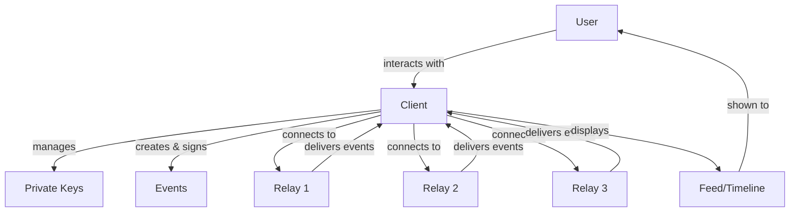

# Understanding Nostr Clients

!!! info "Learning Objectives"
    By the end of this lesson, you'll understand:
    
    - What Nostr clients are and their role in the ecosystem
    - Different types of clients and their features
    - How clients interact with relays and manage keys
    - Popular client options and how to choose one

## What is a Nostr Client?

A **Nostr client** is an application that allows users to interact with the Nostr network. Think of it as your window into the decentralized social web - it's how you create posts, read content, manage your identity, and connect with others.

Unlike traditional social media where you're locked into one app (like Twitter or Facebook), Nostr clients are **interoperable**. You can switch between different clients while keeping the same identity and data.

## Core Functions of Clients

### 1. Key Management
- **Generate** new cryptographic key pairs
- **Store** private keys securely (or integrate with external key managers)
- **Sign** events with your private key
- **Verify** signatures from other users

### 2. Event Creation
- **Compose** different types of content (text notes, reactions, reposts)
- **Format** content with proper metadata and tags
- **Sign** events cryptographically
- **Publish** to selected relays

### 3. Relay Communication
- **Connect** to multiple relays simultaneously
- **Subscribe** to event feeds and filters
- **Fetch** historical events and user profiles
- **Manage** relay lists and preferences

### 4. Content Display
- **Parse** and display events in user-friendly formats
- **Handle** different event types (notes, reactions, profiles)
- **Organize** content (timelines, threads, notifications)
- **Filter** content based on user preferences

## Types of Nostr Clients

### Web Clients
Browser-based applications that run in your web browser.

**Examples:**
- **Iris** - Feature-rich web client with social features
- **Snort** - Fast, modern web interface
- **Nostrgram** - Instagram-like photo sharing
- **Coracle** - Minimalist, privacy-focused client

**Pros:**
- ✅ No installation required
- ✅ Cross-platform compatibility
- ✅ Easy to try different clients

**Cons:**
- ❌ Limited key storage options
- ❌ Dependent on browser security
- ❌ May have performance limitations

### Mobile Apps
Native applications for smartphones and tablets.

**Examples:**
- **Damus** (iOS) - Popular, user-friendly iOS client
- **Amethyst** (Android) - Feature-rich Android client
- **Nostros** (Android) - Open-source Android client
- **Plebstr** (iOS/Android) - Simple, beginner-friendly

**Pros:**
- ✅ Native performance and UX
- ✅ Push notifications
- ✅ Better key storage options
- ✅ Offline capabilities

**Cons:**
- ❌ Platform-specific
- ❌ App store restrictions
- ❌ Installation required

### Desktop Applications
Native applications for computers.

**Examples:**
- **Gossip** - Rust-based desktop client
- **More TBD** - Desktop client ecosystem is growing

**Pros:**
- ✅ Full-featured experience
- ✅ Better key management
- ✅ Advanced power-user features
- ✅ No browser limitations

**Cons:**
- ❌ Platform-specific builds
- ❌ Larger download/install
- ❌ Less portable

### Specialized Clients
Purpose-built for specific use cases.

**Examples:**
- **Habla** - Long-form content publishing
- **Zap.stream** - Live streaming
- **Nostrudel** - Advanced power-user features
- **Satellite** - Minimalist text-only

## How Clients Work

### The Client Workflow

1. **User Action**: You want to post a note or read your timeline
2. **Event Creation**: Client creates a properly formatted event
3. **Signing**: Client signs the event with your private key
4. **Publishing**: Client sends the event to your selected relays
5. **Fetching**: Client requests events from relays for your timeline
6. **Display**: Client formats and shows the content to you

## Key Features to Look For

### Essential Features
- **Key Management**: Secure storage and handling of private keys
- **Multi-relay Support**: Connect to multiple relays simultaneously
- **Basic Event Types**: Support for text notes, reactions, reposts
- **User Profiles**: View and edit profile information
- **Timeline/Feed**: Chronological display of events

### Advanced Features
- **Thread Support**: Proper display of conversation threads
- **Media Support**: Images, videos, and file attachments
- **Lightning Integration**: Zaps (Bitcoin Lightning payments)
- **Advanced Filtering**: Content filtering and moderation tools
- **Backup/Export**: Export your data and settings

### Power User Features
- **Custom Relay Management**: Advanced relay configuration
- **Event Debugging**: Raw event inspection and debugging
- **Custom Event Types**: Support for experimental NIPs
- **API Access**: Integration with external tools
- **Plugin System**: Extensibility through plugins

## Choosing the Right Client

### For Beginners
**Recommended:** Damus (iOS), Amethyst (Android), Iris (Web)

- Simple, intuitive interface
- Good onboarding experience
- Built-in key generation
- Reasonable default settings

### For Privacy-Conscious Users
**Recommended:** Gossip (Desktop), Coracle (Web)

- Enhanced privacy features
- Local key storage
- Minimal data collection
- Tor support (some clients)

### For Power Users
**Recommended:** Nostrudel (Web), Gossip (Desktop)

- Advanced configuration options
- Raw event inspection
- Custom relay management
- Experimental feature support

### For Content Creators
**Recommended:** Habla (Long-form), Nostrgram (Photos)

- Specialized content creation tools
- Rich media support
- Publishing workflows
- Audience engagement features

## Client Interoperability

One of Nostr's key advantages is **client interoperability**:

!!! example "Real-World Example"
    
    **Morning**: Use Damus on your phone to check notifications
    
    **Afternoon**: Switch to Iris on your work computer to post updates
    
    **Evening**: Use Habla to write a long-form article
    
    **Result**: All your content appears seamlessly across all clients because they all use the same underlying protocol and relays.

## Security Considerations

### Key Storage
- **Browser Storage**: Convenient but less secure
- **Mobile Keychain**: Better security on mobile devices
- **Hardware Wallets**: Maximum security for valuable accounts
- **External Signers**: Dedicated key management apps

### Best Practices
- ✅ Use reputable, open-source clients
- ✅ Verify client authenticity before downloading
- ✅ Keep your private key backed up securely
- ✅ Use different clients to avoid vendor lock-in
- ❌ Never share your private key
- ❌ Don't use untrusted or closed-source clients

## The Future of Clients

The Nostr client ecosystem is rapidly evolving:

- **Specialized Clients**: Purpose-built for specific use cases
- **AI Integration**: Smart content curation and assistance
- **Enhanced Privacy**: Better anonymity and privacy features
- **Cross-Platform**: Seamless experience across all devices
- **Plugin Ecosystems**: Extensible, customizable clients

## Next Steps

Now that you understand clients, explore how they interact with relays and the broader Nostr ecosystem.

  <a href="../relays/" class="btn btn-primary">
    Understanding Relays →
  </a>

---

## Quick Quiz

!!! question "Test Your Understanding"
    
    1. What are the core functions of a Nostr client?
    2. Why can you switch between different Nostr clients freely?
    3. What's the difference between web clients and mobile apps?
    4. What should you consider when choosing a client for privacy?
    
    ??? success "Answers"
        1. Key management, event creation, relay communication, and content display
        2. Because all clients use the same open protocol and can access the same relays
        3. Web clients run in browsers (cross-platform, no install) while mobile apps are native (better performance, platform-specific)
        4. Local key storage, minimal data collection, open-source code, and privacy-focused features 