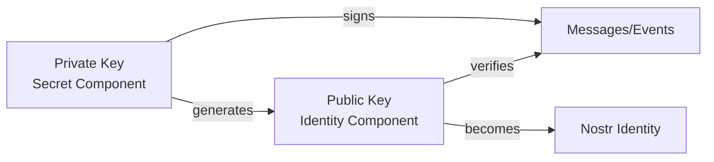
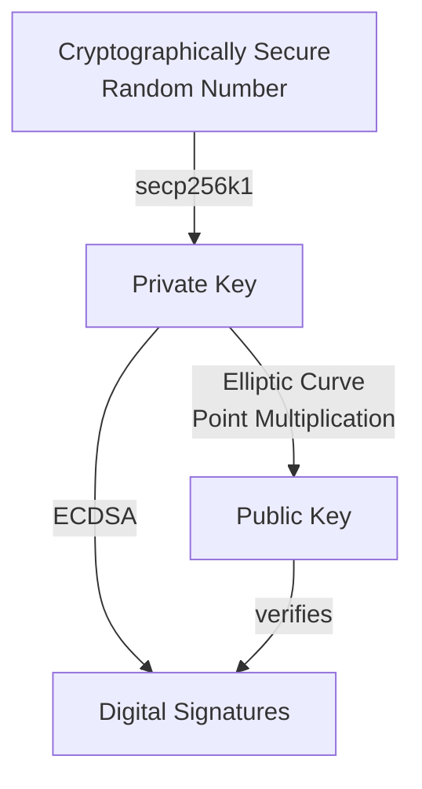

# Keys and Identity in Nostr

!!! info "Learning Objectives"
    After this lesson, you'll understand:
    
    - How digital identity works in the Nostr protocol
    - The difference between private and public keys
    - Different key formats and their purposes
    - Best practices for key security and management
    - Why Nostr uses cryptographic identity instead of usernames

## Cryptographic Identity

Nostr uses a fundamentally different approach to identity compared to traditional social media platforms. Instead of usernames and passwords managed by a central authority, Nostr employs cryptographic key pairs to establish and verify identity.

This approach provides users with complete ownership and control over their digital identity, eliminating dependence on any central platform or service provider.

## Understanding Key Pairs

### Cryptographic Fundamentals

Cryptographic keys work as mathematically related pairs that enable secure digital communication:

- **One-way mathematical relationship**: Public keys are derived from private keys, but the reverse is computationally infeasible
- **Digital signatures**: Private keys create signatures that public keys can verify
- **Identity verification**: Signatures prove ownership without revealing the private key



## Private Key Management

### Definition and Purpose

The private key serves as the master secret that controls your entire Nostr identity. It is a cryptographically secure random number that:

- **Generates your public identity**: Mathematically derives your public key
- **Creates digital signatures**: Proves authorship of your events
- **Controls all interactions**: Required for posting, following, and other actions
- **Cannot be recovered**: Loss results in permanent identity loss

### Security Requirements

Private key security is critical for maintaining control of your Nostr identity:

!!! danger "Critical Security Practices"
    
    **Never Share Your Private Key**
    - Do not transmit via email, messaging, or any digital communication
    - Avoid storing in plain text files or unencrypted formats
    - Never enter into untrusted applications or websites
    
    **Secure Storage Methods**
    - Use hardware wallets for maximum security
    - Employ encrypted password managers
    - Create offline, encrypted backups
    - Store in multiple secure locations

### Key Format Examples

=== "Hex Format"

    ```
    d63b64d9c2c4f8c7b8e9f1a2b3c4d5e6f7a8b9c0d1e2f3a4b5c6d7e8f9a0b1c2
    ```

=== "nsec Format (Bech32)"

    ```
    nsec1mclkfkwu2n7v0wuwn6d2kwx56mn0029ceuxr6ul6xjm2k6l7qxsqrxqhp8
    ```

## Public Key Distribution

### Purpose and Function

Your public key serves as your permanent Nostr address and identity. It enables:

- **Global identification**: Unique address in the Nostr network
- **Signature verification**: Others can verify your message authenticity  
- **Social connections**: Followers use this to find and follow you
- **Cross-client compatibility**: Works across all Nostr applications

### Sharing Guidelines

Unlike private keys, public keys are designed for open distribution:

✅ **Safe to share publicly**
✅ **Include in social media profiles**  
✅ **Display on websites and business cards**
✅ **Send via any communication method**
✅ **Embed in QR codes**

### Public Key Formats

=== "Hex Format"

    ```
    a1b2c3d4e5f6a7b8c9d0e1f2a3b4c5d6e7f8a9b0c1d2e3f4a5b6c7d8e9f0a1b2
    ```

=== "npub Format (Bech32)"

    ```
    npub15xkv85x2um6h3jfgxhj259x54fvv7n7k9c5wxq9ewn64fhux5xeqz8p2qv
    ```

## Mathematical Relationship

The relationship between private and public keys relies on elliptic curve cryptography:

### Key Generation Process



### Security Properties

- **One-way function**: Computing public key from private key is fast
- **Computational security**: Deriving private key from public key is infeasible
- **Signature uniqueness**: Each message produces a unique signature
- **Non-repudiation**: Signatures cannot be forged without the private key

## Your Private Key in Detail

Let's dive deeper into your most important digital possession.

### What Makes It Special

- **Completely random**: Generated using cryptographically secure randomness
- **Astronomically unique**: The chances of two people getting the same key are basically zero
- **Mathematically powerful**: Can create unlimited verified signatures
- **Irreplaceable**: There's no customer service to call if you lose it

### What It Looks Like

=== "Hex Format (Raw)"

    ```
    d63b64d9c2c4f8c7b8e9f1a2b3c4d5e6f7a8b9c0d1e2f3a4b5c6d7e8f9a0b1c2
    ```

=== "nsec Format (User-Friendly)"

    ```
    nsec1mclkfkwu2n7v0wuwn6d2kwx56mn0029ceuxr6ul6xjm2k6l7qxsqrxqhp8
    ```

### Creating Your First Key Pair

=== "JavaScript"

    ```javascript
    import { generatePrivateKey } from 'nostr-tools'
    
    // Generate your unique identity
    const privateKey = generatePrivateKey()
    console.log('Your private key (keep secret!):', privateKey)
    ```

=== "Python"

    ```python
    from nostr.key import PrivateKey
    
    // Create your digital identity
    private_key = PrivateKey()
    print(f"Your private key (guard this!): {private_key.hex()}")
    ```

=== "Rust"

    ```rust
    use nostr_sdk::prelude::*;
    
    // Generate your keys
    let keys = Keys::generate();
    println!("Private key (keep safe!): {}", keys.secret_key().display_secret());
    ```

## Your Public Key in Detail

Now let's explore your public identity - the part of you that the Nostr world gets to see.

### What Makes It Perfect for Sharing

- **Derived from private**: Mathematically created from your private key
- **Always the same**: Your private key always generates the same public key
- **Safe to broadcast**: No security risk in sharing it widely
- **Verifiable**: Others can use it to confirm your signatures are real

## Key Formats and Encoding

Nostr uses different formats for displaying keys to users:

### Hex Format
- **Raw format**: 64 character hexadecimal string
- **Use case**: Internal processing, APIs
- **Example**: `d63b64d9c2c4f8c7b8e9f1a2b3c4d5e6f7a8b9c0d1e2f3a4b5c6d7e8f9a0b1c2`

### Bech32 Format (NIP-19)
- **User-friendly**: Includes checksums and prefixes
- **Private keys**: Start with `nsec1`
- **Public keys**: Start with `npub1`
- **Benefits**: Error detection, easier to copy/paste

!!! tip "Format Conversion"
    Most Nostr libraries provide functions to convert between formats:
    
    ```javascript
    import { nip19 } from 'nostr-tools'
    
    // Hex to bech32
    const npub = nip19.npubEncode(hexPublicKey)
    const nsec = nip19.nsecEncode(hexPrivateKey)
    
    // Bech32 to hex
    const { type, data } = nip19.decode(npub)
    ```

## Digital Signatures

Your private key is used to create digital signatures that prove authenticity:

### How Signatures Work

1. **Create Event**: You compose a message or event
2. **Hash Content**: The event content is hashed
3. **Sign Hash**: Your private key signs the hash
4. **Attach Signature**: The signature is included with the event
5. **Verify**: Others use your public key to verify the signature

### Example: Signing an Event

=== "JavaScript"

    ```javascript
    import { finishEvent } from 'nostr-tools'
    
    const event = {
        kind: 1,
        created_at: Math.floor(Date.now() / 1000),
        tags: [],
        content: 'Hello Nostr!'
    }
    
    const signedEvent = finishEvent(event, privateKey)
    console.log('Signed event:', signedEvent)
    ```

=== "Python"

    ```python
    from nostr.event import Event
    from nostr.key import PrivateKey
    import time
    
    private_key = PrivateKey()
    
    event = Event(
        kind=1,
        content="Hello Nostr!",
        created_at=int(time.time())
    )
    
    private_key.sign_event(event)
    print(f"Signed event: {event.to_json()}")
    ```

## Identity Without Usernames

### Traditional vs Nostr Identity

| Traditional Social Media | Nostr |
|--------------------------|-------|
| Username + Password | Cryptographic Keys |
| Platform controls identity | You control identity |
| Can be banned/suspended | Censorship resistant |
| Tied to one platform | Portable across clients |
| Password can be reset | Keys cannot be recovered |

### Benefits of Cryptographic Identity

!!! success "Advantages"
    
    - **True Ownership**: You own your identity, not a platform
    - **Portability**: Use the same identity across all Nostr clients
    - **Censorship Resistance**: No central authority can ban you
    - **Verification**: Cryptographic proof of authenticity
    - **Privacy**: No personal information required

!!! warning "Responsibilities"
    
    - **Key Security**: You must protect your private key
    - **No Recovery**: Lost keys mean lost identity
    - **Backup Important**: Always backup your keys securely

## Key Management Best Practices

### Secure Storage

!!! danger "Never Do This"
    
    - Store private keys in plain text files
    - Share private keys via email or messaging
    - Use the same key across multiple devices without encryption
    - Store keys in browser localStorage without encryption

!!! success "Best Practices"
    
    - Use hardware wallets when possible
    - Encrypt private keys with strong passwords
    - Use secure key management software
    - Create offline backups in multiple locations
    - Consider using key derivation for multiple identities

### Key Backup Strategies

=== "Paper Backup"

    ```
    1. Write down your private key (nsec format)
    2. Store in a fireproof safe
    3. Consider multiple copies in different locations
    4. Use tamper-evident storage
    ```

=== "Digital Backup"

    ```
    1. Encrypt with strong password
    2. Store on multiple devices
    3. Use cloud storage with encryption
    4. Regular backup verification
    ```

=== "Hardware Wallet"

    ```
    1. Use dedicated hardware device
    2. Secure with PIN/passphrase
    3. Backup seed phrase securely
    4. Test recovery process
    ```

## Multiple Identities

You can have multiple Nostr identities for different purposes:

### Use Cases

- **Personal**: Your main social identity
- **Professional**: Work-related content
- **Anonymous**: Privacy-focused interactions
- **Bot**: Automated accounts
- **Testing**: Development and experimentation

### Managing Multiple Keys

=== "JavaScript"

    ```javascript
    class NostrIdentityManager {
        constructor() {
            this.identities = new Map()
        }
        
        createIdentity(name) {
            const privateKey = generatePrivateKey()
            const publicKey = getPublicKey(privateKey)
            
            this.identities.set(name, {
                privateKey,
                publicKey,
                npub: nip19.npubEncode(publicKey)
            })
            
            return this.identities.get(name)
        }
        
        getIdentity(name) {
            return this.identities.get(name)
        }
        
        listIdentities() {
            return Array.from(this.identities.keys())
        }
    }
    ```

## Interactive Exercise

Let's practice working with keys:

!!! example "Try This"
    
    1. Generate a new key pair
    2. Convert between hex and bech32 formats
    3. Create and sign a simple event
    4. Verify the signature
    
    Use the code examples above to experiment with key generation and signing.

## Common Pitfalls

!!! warning "Avoid These Mistakes"
    
    **Key Confusion**
    - Mixing up private and public keys
    - Using wrong key formats
    - Sharing private keys accidentally
    
    **Security Issues**
    - Storing keys insecurely
    - Not backing up keys
    - Using weak random number generation
    
    **Format Errors**
    - Invalid hex characters
    - Incorrect bech32 encoding
    - Wrong key length

## Next Steps

Now that you understand keys and identity, let's explore how events and messages work in Nostr.

<div class="next-lesson">
  <a href="../events/" class="btn btn-primary">
    :material-arrow-right: Events & Messages →
  </a>
</div>

---

## Quick Quiz

!!! question "Test Your Understanding"
    
    1. What's the difference between a private key and public key?
    2. Which key format starts with "npub1"?
    3. What happens if you lose your private key?
    4. Why doesn't Nostr use usernames and passwords?
    5. What is the purpose of digital signatures?
    
    ??? success "Answers"
        1. Private key is secret and used for signing; public key is shared and used for verification
        2. Public keys in bech32 format start with "npub1"
        3. You lose access to that identity forever - there's no recovery
        4. Cryptographic keys provide better security, ownership, and censorship resistance
        5. Digital signatures prove authenticity and prevent tampering 