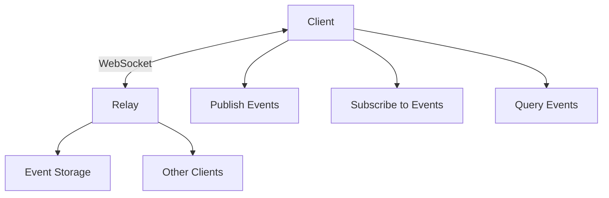

# Relays: The Infrastructure of Nostr

!!! info "Learning Objectives"
    After this lesson, you'll understand:

    - What relays are and how they work
    - The relay-client communication protocol
    - Different types of relays and their purposes
    - How to choose and manage relays
    - Relay policies and limitations

## What are Relays?

Relays are the servers that form the backbone of the Nostr network. They store, forward, and serve events to clients. Unlike traditional social media where one company controls all the servers, Nostr's relay system is decentralized - anyone can run a relay.

### Key Characteristics

- **Simple servers**: Store and forward JSON events
- **WebSocket-based**: Real-time bidirectional communication
- **No complex logic**: Focus on data storage and delivery
- **Interchangeable**: Clients can use any relay
- **Independently operated**: Different people run different relays

## How Relays Work

### Basic Functions

1. **Accept events** from clients
2. **Store events** (temporarily or permanently)
3. **Forward events** to subscribed clients
4. **Filter requests** based on client queries
5. **Enforce policies** (rate limiting, content rules, etc.)

### Relay-Client Communication

Communication happens over WebSocket connections using simple JSON messages:



## Message Types

### Client to Relay Messages

#### **EVENT** - Publishing Events
```json
["EVENT", {
  "id": "event-id",
  "pubkey": "author-pubkey",
  "created_at": 1234567890,
  "kind": 1,
  "tags": [],
  "content": "Hello Nostr!",
  "sig": "signature"
}]
```

#### **REQ** - Subscribing to Events
```json
["REQ", "subscription-id", {
  "kinds": [1],
  "authors": ["pubkey1", "pubkey2"],
  "since": 1234567890,
  "limit": 100
}]
```

#### **CLOSE** - Closing Subscriptions
```json
["CLOSE", "subscription-id"]
```

#### **AUTH** - Authentication
```json
["AUTH", {
  "id": "challenge-event-id",
  "pubkey": "client-pubkey",
  "created_at": 1234567890,
  "kind": 22242,
  "tags": [["challenge", "challenge-string"]],
  "content": "",
  "sig": "signature"
}]
```

#### **COUNT** - Requesting Event Counts
```json
["COUNT", "subscription-id", {
  "kinds": [1],
  "authors": ["pubkey"]
}]
```

### Relay to Client Messages

#### **EVENT** - Sending Events
```json
["EVENT", "subscription-id", {
  "id": "event-id",
  "pubkey": "author-pubkey",
  "created_at": 1234567890,
  "kind": 1,
  "tags": [],
  "content": "Hello Nostr!",
  "sig": "signature"
}]
```

#### **EOSE** - End of Stored Events
```json
["EOSE", "subscription-id"]
```

#### **OK** - Event Acceptance Response
```json
["OK", "event-id", true, ""]
["OK", "event-id", false, "blocked: content policy violation"]
```

#### **CLOSED** - Subscription Closed
```json
["CLOSED", "subscription-id", "rate-limited: too many subscriptions"]
```

#### **NOTICE** - Human-Readable Messages
```json
["NOTICE", "This relay requires authentication"]
```

#### **AUTH** - Authentication Challenge
```json
["AUTH", "challenge-string"]
```

#### **COUNT** - Event Count Response
```json
["COUNT", "subscription-id", {"count": 42}]
```

## Relay Information Document (NIP-11)

Relays can provide metadata about their capabilities:

```bash
curl -H "Accept: application/nostr+json" https://relay.example.com
```

```json
{
  "name": "My Nostr Relay",
  "description": "A relay for the Nostr community",
  "pubkey": "relay-admin-pubkey",
  "contact": "admin@relay.example.com",
  "supported_nips": [1, 2, 9, 11, 12, 15, 16, 20, 22],
  "software": "strfry",
  "version": "0.9.6",
  "limitation": {
    "max_message_length": 16384,
    "max_subscriptions": 300,
    "max_limit": 5000,
    "max_subid_length": 100,
    "max_event_tags": 100,
    "max_content_length": 8196,
    "min_pow_difficulty": 0,
    "auth_required": false,
    "payment_required": false,
    "restricted_writes": false
  },
  "relay_countries": ["US", "CA"],
  "language_tags": ["en", "en-419"],
  "tags": ["sfw-only", "bitcoin-only"],
  "posting_policy": "https://relay.example.com/policy"
}
```

### Key Information Fields

#### **Basic Info**
- `name`: Human-readable relay name
- `description`: Detailed information about the relay
- `pubkey`: Admin's public key for contact
- `contact`: Alternative contact method
- `software`: Relay implementation name
- `version`: Software version

#### **Capabilities**
- `supported_nips`: Which NIPs are implemented
- `limitation`: Technical limits and requirements
- `relay_countries`: Legal jurisdictions
- `language_tags`: Primary languages
- `tags`: Content policies and focus areas

## Types of Relays

### By Access Model

#### **Public Relays**
- Open to everyone
- No registration required
- May have rate limits
- Examples: `relay.damus.io`, `nos.lol`

#### **Private Relays**
- Restricted access
- Invitation or whitelist only
- Often for specific communities
- Examples: Family relays, corporate relays

#### **Paid Relays**
- Require payment for access
- Better spam protection
- Often higher reliability
- May offer premium features

### By Purpose

#### **General Purpose**
- Accept all kinds of events
- Serve broad communities
- Most common type

#### **Specialized Relays**
- Focus on specific event kinds
- Examples:
  - Media relays (images, videos)
  - Long-form content relays
  - Lightning zap relays
  - Marketplace relays

#### **Personal Relays**
- Run by individuals
- Store personal backup
- Share with friends/family
- Complete data control

### By Retention Policy

#### **Archive Relays**
- Store events permanently
- Historical data preservation
- May charge for long-term storage

#### **Ephemeral Relays**
- Short-term storage
- Focus on real-time communication
- Lower storage costs

#### **Filtered Relays**
- Selective storage
- Content moderation
- Topic-specific focus

## Running Your Own Relay

### Why Run a Relay?

#### **Personal Benefits**
- Complete data control
- Custom policies
- Data backup and preservation
- Privacy and security
- No dependence on third parties

#### **Community Benefits**
- Support network decentralization
- Provide service to community
- Enable free speech
- Reduce censorship risks

### Popular Relay Software

#### **strfry**
- High-performance C++ implementation
- Efficient storage and indexing
- Production-ready
- Active development

```bash
# Install strfry
git clone https://github.com/hoytech/strfry.git
cd strfry
make setup-golpe
make -j4
```

#### **nostream**
- TypeScript/Node.js implementation
- Easy to modify and extend
- Good for development
- PostgreSQL backend

```bash
# Install nostream
git clone https://github.com/Cameri/nostream.git
cd nostream
npm install
npm run build
```

#### **khatru**
- Go implementation
- Simple and lightweight
- Easy to deploy
- Good performance

```bash
# Install khatru
go install github.com/fiatjaf/khatru@latest
```

### Relay Configuration

#### **Basic Configuration**
```yaml
# strfry.conf
db = "./strfry-db/"
bind = "0.0.0.0:7777"
nofiles = 1000000

relay:
  name: "My Personal Relay"
  description: "A relay for my friends and family"
  pubkey: "your-pubkey-here"
  contact: "admin@myrelay.com"

rejectFilters:
  - kinds: []
    authors: []
    tags:
      "#t": ["spam", "inappropriate"]
```

#### **Access Control**
```yaml
# Authentication required
auth:
  required: true
  whitelist:
    - "pubkey1"
    - "pubkey2"

# Payment required
payment:
  required: true
  amount: 1000  # sats per month
  bolt11: "payment-address"
```

### Hosting Options

#### **Self-Hosted**
- Complete control
- Custom hardware
- Network requirements
- Maintenance responsibility

#### **VPS/Cloud**
- Professional hosting
- Managed infrastructure
- Scalable resources
- Geographic distribution

#### **Docker Deployment**
```dockerfile
FROM ubuntu:22.04

# Install dependencies
RUN apt-get update && apt-get install -y \
    build-essential \
    git \
    pkg-config

# Clone and build strfry
RUN git clone https://github.com/hoytech/strfry.git
WORKDIR /strfry
RUN make setup-golpe && make -j4

# Configure and run
COPY strfry.conf .
EXPOSE 7777
CMD ["./strfry", "relay"]
```

## Next Steps

Now that you understand relays, explore:

- [Events and Messages](../events-and-messages/) - What relays store and forward
- [Building Applications](../../tutorials/simple-client/) - How to work with relays in code
- [Advanced Topics](../advanced/) - Specialized relay features

!!! tip "Getting Started"
    Start by understanding how to use relays as a client, then experiment with running your own relay for learning. Consider the community and economic factors when deciding whether to run a public relay.
