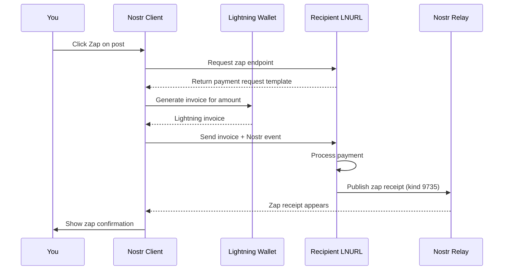

# Understanding Zaps

!!! info "Learning Objectives"
    By the end of this lesson, you'll understand:
    
    - What zaps are and why they're revolutionary
    - How zaps work technically (NIP-57)
    - Different types of zaps and their use cases
    - The economics and incentives zaps create
    - Privacy considerations with zaps

## What Are Zaps?

**Zaps** are instant Bitcoin payments sent over the Lightning Network that are cryptographically tied to Nostr events. They represent a fundamental shift from traditional social media "likes" to **value-for-value** interactions.

!!! tip "Value-for-Value"
    Instead of giving away your attention for free to advertisers, zaps let you directly support creators and signal quality content with real economic value.

### Key Characteristics

- ⚡ **Instant**: Payments settle in milliseconds
- 🔒 **Cryptographically Verified**: Tied to specific Nostr events
- 💰 **Micro-payments**: Can be as small as 1 satoshi (0.00000001 BTC)
- 🌍 **Global**: Work anywhere in the world
- 🔓 **Permissionless**: No intermediaries or gatekeepers

## How Zaps Work (NIP-57)

Zaps are defined by **NIP-57** (Nostr Implementation Possibility 57) and involve a sophisticated dance between your Nostr client, Lightning wallet, and the recipient's Lightning service.

### The Zap Flow



### Technical Components

**1. Lightning Address**
- Human-readable identifier (like email)
- Example: `alice@getalby.com`
- Resolves to LNURL-pay endpoint

**2. LNURL-pay**
- Protocol for requesting Lightning payments
- Handles the payment request generation
- Returns payment confirmation

**3. Zap Request (Kind 9734)**
- Nostr event that describes the intended zap
- Contains recipient, amount, and optional message
- Signed by the sender's private key

**4. Zap Receipt (Kind 9735)**
- Proof that payment was made
- Published by recipient's Lightning service
- Contains payment preimage as proof

## Types of Zaps

### Regular Zaps
Standard zaps that appear publicly on posts:

```json
{
  "kind": 9735,
  "content": "Great post! ⚡",
  "tags": [
    ["bolt11", "lnbc..."],
    ["description", "..."],
    ["p", "recipient_pubkey"],
    ["e", "event_id"]
  ]
}
```

### Anonymous Zaps
Zaps without revealing the sender's identity:
- Payment is made but sender info is hidden
- Useful for privacy-conscious users
- Still cryptographically verifiable

### Private Zaps
Zaps that don't appear publicly:
- Only sender and recipient know about them
- No public zap receipt published
- Maximum privacy

### Zap Goals
Crowdfunding mechanism using zaps:
- Set a target amount for a project
- Community can zap towards the goal
- Transparent progress tracking

## The Economics of Zaps

### Micro-Economics
Zaps enable **micro-transactions** that weren't possible before:

- **1 sat** = ~$0.0003 (varies with Bitcoin price)
- **21 sats** = Popular "Bitcoin number" 
- **100 sats** = Meaningful appreciation
- **1,000 sats** = Strong support
- **10,000+ sats** = Significant contribution

### Creator Incentives

**Quality Content Rises**
- Good content gets zapped more
- Creators earn directly from their audience
- No need for advertising or sponsorships

**Immediate Feedback**
- Instant economic signal of content value
- More meaningful than likes or hearts
- Encourages thoughtful posting

**Global Monetization**
- Anyone, anywhere can earn Bitcoin
- No geographic restrictions
- No minimum payout thresholds

### Network Effects

**Value Flows to Value**
- Bitcoin naturally flows to valuable content
- Creates positive feedback loops
- Rewards genuine contribution over engagement farming

**Spam Reduction**
- Small cost to interact reduces spam
- Economic incentive for quality
- Self-regulating community standards

## Zap Etiquette and Culture

### Common Zap Amounts

| Amount | Meaning | Use Case |
|--------|---------|----------|
| **1 sat** | Acknowledgment | "I saw this" |
| **21 sats** | Bitcoin appreciation | Standard like |
| **100 sats** | Good content | Quality post |
| **500 sats** | Great content | Excellent post |
| **1,000+ sats** | Exceptional | Outstanding work |
| **10,000+ sats** | Support | Major contribution |

### When to Zap

**✅ Good Times to Zap:**
- Content that taught you something
- Posts that made you laugh
- Helpful answers to questions
- Original research or insights
- Supporting creators you appreciate

**❌ Avoid Zapping:**
- Content you disagree with (unless constructive)
- Spam or low-effort posts
- Just to get attention
- Your own posts (generally frowned upon)

### Zap Messages
Many zaps include short messages:
- Keep them positive and constructive
- Emoji are popular (⚡🚀🔥💜)
- Brief explanations of why you zapped
- Encouragement for creators

## Privacy Considerations

### What's Public
- **Zap amount** (usually)
- **Recipient** (always)
- **Associated post** (if applicable)
- **Zap message** (if included)

### What Can Be Private
- **Sender identity** (with anonymous zaps)
- **Payment details** (Lightning privacy)
- **Exact timing** (some obfuscation possible)

### Privacy Tips
- Use different Lightning addresses for different purposes
- Consider anonymous zaps for sensitive topics
- Be aware that payment patterns can be analyzed
- Lightning payments are more private than on-chain Bitcoin

## Setting Up Zaps

### Requirements
1. **Lightning Wallet** (Alby, Wallet of Satoshi, etc.)
2. **Lightning Address** (yourname@getalby.com)
3. **Nostr Client** that supports zaps
4. **Some Bitcoin** to send zaps

### Configuration Steps
1. **Set up Lightning wallet** (see [Wallet Setup Guide](../getting-started/wallet-setup.md))
2. **Add Lightning address to Nostr profile**
3. **Test with small zaps** to yourself or friends
4. **Start zapping content you appreciate**

## Advanced Zap Features

### Zap Splits
Some clients support splitting zaps:
- Send to multiple recipients
- Useful for collaborations
- Automatic revenue sharing

### Recurring Zaps
Subscription-like zaps:
- Regular payments to creators
- Automated support
- Patreon-like functionality

### Conditional Zaps
Smart contract-like features:
- Zaps that unlock at certain conditions
- Goal-based releases
- Time-locked payments

## Troubleshooting Zaps

### Common Issues

**"Zap failed to send"**
- Check wallet balance
- Verify Lightning address is correct
- Try smaller amount
- Check internet connection

**"No zap button visible"**
- Recipient may not have Lightning address set
- Client may not support zaps
- Check if zaps are enabled in settings

**"Zap not appearing"**
- May take a few seconds to process
- Check if using compatible relays
- Refresh the client

### Best Practices
- Start with small amounts while learning
- Keep some Bitcoin in your Lightning wallet
- Test zaps with friends first
- Monitor your spending

## The Future of Zaps

### Emerging Trends
- **Zap-to-earn** games and applications
- **Algorithmic zapping** based on preferences
- **Cross-platform zaps** beyond Nostr
- **Integration with traditional payments**

### Potential Developments
- **Stable coin zaps** for price stability
- **Programmable zaps** with smart contracts
- **Zap analytics** for creators
- **Enterprise zap solutions**

## Impact on Social Media

Zaps represent a fundamental shift in how we think about social media:

### From Attention Economy to Value Economy
- **Traditional**: Your attention is the product sold to advertisers
- **Zaps**: Your attention has direct economic value you control

### From Engagement Farming to Quality Content
- **Traditional**: Optimize for clicks, views, time spent
- **Zaps**: Optimize for genuine value and appreciation

### From Platform Lock-in to Creator Freedom
- **Traditional**: Platform controls monetization and can ban you
- **Zaps**: Direct peer-to-peer payments, no intermediaries

---

## Quick Quiz

!!! question "Test Your Understanding"
    
    1. What makes zaps different from traditional social media "likes"?
    2. What is NIP-57 and why is it important?
    3. What are the three types of zaps in terms of privacy?
    4. How do zaps change the incentives for content creators?
    
    ??? success "Answers"
        1. Zaps involve real Bitcoin payments that provide economic value, while likes are free and provide no direct value to creators
        2. NIP-57 is the Nostr Implementation Possibility that defines how zaps work technically, ensuring interoperability between clients and wallets
        3. Regular zaps (public), anonymous zaps (payment visible but sender hidden), and private zaps (completely private)
        4. Zaps create direct economic incentives for quality content, allowing creators to earn immediately from their audience without relying on advertising or platform monetization

<div class="next-lesson">
  <a href="../tutorials/simple-client/" class="btn btn-primary">
    Start Building →
  </a>
</div> 