# What is Nostr?

!!! info "Learning Objectives"
    By the end of this lesson, you'll understand:
    
    - What Nostr stands for and its core principles
    - How Nostr differs from traditional social media platforms
    - The fundamental components of the Nostr protocol
    - The benefits of decentralized social networking

## Introduction

**Nostr** stands for "Notes and Other Stuff Transmitted by Relays." It is a simple, open protocol that enables global, decentralized, and censorship-resistant social networking.

Unlike traditional social media platforms, Nostr operates without a central authority, giving users complete control over their identity and data through cryptographic key pairs.

## Core Principles

### Decentralized Architecture
Nostr operates on a network of independent relays rather than centralized servers, eliminating single points of failure and control.

### User Sovereignty
Users maintain full ownership of their identity through cryptographic keys, ensuring no platform can ban or silence them permanently.

### Protocol Simplicity
The protocol prioritizes simplicity over complexity, making it reliable, performant, and easy to implement.

### Censorship Resistance
The distributed nature of relays ensures that content cannot be globally censored by any single entity.

## Protocol Architecture

```mermaid
graph TB
    User[👤 User] -->|publishes events| R1[🔄 Relay 1]
    User -->|publishes events| R2[🔄 Relay 2]
    User -->|publishes events| R3[🔄 Relay 3]
    
    R1 -->|distributes to| Follower[👤 Follower]
    R2 -->|distributes to| Follower
    R3 -->|distributes to| OtherUsers[👤 Other Users]
    
    Follower -->|publishes response| R1
    Follower -->|publishes response| R2
    
    R1 -->|delivers to| User
    R2 -->|delivers to| User
    
    style User fill:#e1f5fe
    style Follower fill:#e8f5e8
    style OtherUsers fill:#e8f5e8
    style R1 fill:#fff3e0
    style R2 fill:#fff3e0
    style R3 fill:#fff3e0
```



The protocol operates through the following process:

1. **Event Creation**: Users create signed events using their private keys
2. **Relay Distribution**: Events are sent to multiple relays for storage and distribution
3. **Content Discovery**: Other users query relays to retrieve relevant events
4. **Network Interaction**: Users can respond and interact, creating new events in the network

## Protocol Components

### Events
All content in Nostr is represented as events - JSON objects containing standardized fields:

```json
{
  "id": "event_identifier_hash",
  "pubkey": "author_public_key", 
  "created_at": 1234567890,
  "kind": 1,
  "tags": [],
  "content": "Message content",
  "sig": "cryptographic_signature"
}
```

**Key Properties:**
- **Immutable**: Events cannot be modified after creation
- **Verifiable**: Digital signatures ensure authenticity
- **Portable**: Events work across all Nostr clients and relays

### Relays
Independent servers that store and forward events. Relay characteristics include:

- **Autonomous Operation**: Each relay operates independently with its own policies
- **Configurable Filtering**: Relays can implement custom content moderation rules
- **Network Redundancy**: Multiple relays provide fault tolerance and censorship resistance
- **Simple Protocol**: Relays implement a straightforward WebSocket-based API

### Clients
Applications that provide user interfaces for interacting with the Nostr protocol:

- **Key Management**: Secure generation, storage, and usage of cryptographic keys
- **Multi-Relay Communication**: Connect to multiple relays simultaneously for redundancy
- **Event Processing**: Create, sign, verify, and display events according to protocol specifications
- **User Experience**: Abstract protocol complexity behind intuitive interfaces

## Technical Implementation

### Event Structure and Validation

Events must conform to specific validation rules:

=== "Required Fields"

    ```json
    {
      "id": "32-byte lowercase hex of sha256 of serialized event data",
      "pubkey": "32-byte lowercase hex of the public key",
      "created_at": "unix timestamp in seconds",
      "kind": "integer between 0 and 65535",
      "tags": "array of arrays of strings",
      "content": "arbitrary string",
      "sig": "64-byte lowercase hex of signature"
    }
    ```

=== "Validation Process"

    ```javascript
    // Pseudocode for event validation
    function validateEvent(event) {
      // 1. Verify required fields are present
      if (!hasRequiredFields(event)) return false;
      
      // 2. Verify ID matches content hash
      if (event.id !== computeEventId(event)) return false;
      
      // 3. Verify signature
      if (!verifySignature(event.sig, event.id, event.pubkey)) return false;
      
      // 4. Check timestamp validity
      if (!isValidTimestamp(event.created_at)) return false;
      
      return true;
    }
    ```

### Relay Communication Protocol

Relays implement a WebSocket-based protocol with three message types:

| Message Type | Purpose | Format |
|--------------|---------|---------|
| **EVENT** | Publish events to relay | `["EVENT", <event JSON>]` |
| **REQ** | Request events from relay | `["REQ", <subscription_id>, <filters...>]` |
| **CLOSE** | Close subscription | `["CLOSE", <subscription_id>]` |

## Architectural Comparison

| Aspect | Traditional Platforms | Nostr Protocol |
|--------|----------------------|----------------|
| **Identity Control** | Platform-owned accounts | User-controlled cryptographic keys |
| **Data Storage** | Centralized databases | Distributed relay network |
| **Content Moderation** | Platform-wide policies | Per-relay policies with user choice |
| **Algorithm Control** | Proprietary, profit-driven | Open, user-configurable |
| **Vendor Lock-in** | High switching costs | Portable identity and data |
| **Single Point of Failure** | Platform infrastructure | No global dependencies |

## Hands-On Exercise: Network Exploration

!!! example "Protocol Analysis Exercise"
    
    **Objective:** Examine real Nostr events to understand protocol structure
    
    **Steps:**
    1. Visit [nostr.band](https://nostr.band) to explore the network
    2. Search for recent events using hashtag `#nostr`
    3. Click on individual events to examine their JSON structure
    4. Identify the different event kinds and their purposes
    5. Note the variety of relays being used across the network
    
    **Analysis Questions:**
    - How many different event kinds can you identify?
    - What patterns do you notice in the tag structures?
    - How do public keys and signatures provide identity verification?

## Protocol Benefits and Trade-offs

!!! success "Protocol Advantages"
    
    **Decentralization Benefits**
    
    - ✅ Elimination of single points of failure or control
    - ✅ Resistance to censorship and platform manipulation
    - ✅ User ownership of identity and data
    - ✅ Competitive ecosystem of clients and services
    
    **Technical Advantages**
    
    - ✅ Simple, well-defined protocol specification
    - ✅ Cryptographic security and verification
    - ✅ Extensible design through NIPs (Nostr Implementation Possibilities)
    - ✅ Low barrier to entry for developers and relay operators

!!! warning "Technical Considerations"
    
    **Current Limitations**
    
    - ⚠️ Key management complexity for average users
    - ⚠️ Potential for spam without centralized filtering
    - ⚠️ Relay discovery and selection challenges
    - ⚠️ Limited built-in privacy features for metadata
    
    **Scalability Considerations**
    
    - ⚠️ Relay storage and bandwidth requirements
    - ⚠️ Event verification computational overhead
    - ⚠️ Network effects and adoption challenges

## NIPs: Protocol Extensions

Nostr Implementation Possibilities (NIPs) define protocol extensions and standards:

| NIP | Title | Purpose |
|-----|-------|---------|
| **NIP-01** | Basic protocol flow | Core event and relay specifications |
| **NIP-02** | Contact list and petnames | Following and contact management |
| **NIP-04** | Encrypted direct messages | Private communication |
| **NIP-05** | DNS-based verification | Human-readable identifiers |
| **NIP-09** | Event deletion | Content removal mechanisms |
| **NIP-11** | Relay information document | Relay metadata and policies |

## Practical Exercise: Event Analysis

!!! example "Technical Deep Dive"
    
    **Task:** Analyze the structure of different Nostr event types
    
    **Instructions:**
    1. Use a Nostr client or web interface to examine events
    2. Document the differences between event kinds (0, 1, 3, 7)
    3. Analyze tag usage patterns across different event types
    4. Verify event signatures using available tools
    
    **Expected Outcomes:**
    - Understanding of event structure variations
    - Recognition of tag-based metadata patterns
    - Appreciation for cryptographic verification mechanisms

## Next Steps

Understanding Nostr's foundational architecture prepares you for implementing practical applications. The protocol's simplicity enables rapid development while its cryptographic foundations ensure security and user sovereignty.

<div class="next-lesson">
  <a href="../wallet-setup/" class="btn btn-primary">
    Lightning Wallet Integration →
  </a>
</div>

---

## Knowledge Verification

!!! question "Technical Comprehension Check"
    
    1. What are the three fundamental components of the Nostr protocol?
    2. How does event verification work in Nostr?
    3. What distinguishes Nostr relays from traditional social media servers?
    4. Why is the protocol designed around simple JSON events?
    
    ??? success "Technical Answers"
        1. **Events** (content data structures), **Relays** (storage and distribution infrastructure), and **Clients** (user interface applications)
        2. **Digital signatures** using cryptographic key pairs verify event authenticity, while **content hashing** ensures integrity
        3. **Relays operate independently** with individual policies, creating a distributed network without central control points
        4. **JSON simplicity** ensures broad compatibility, easy parsing, and straightforward protocol implementation across different programming languages

---