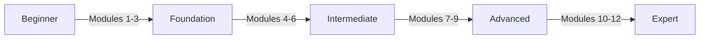

# Learn Nostr Modules

Welcome to the Learn Nostr Modules! This comprehensive curriculum is designed to take you from a complete beginner to a Nostr expert through structured, progressive learning paths.

## 🎯 Learning Path Overview

Our modules are carefully structured to build your knowledge progressively:

- **Modules 1-3**: Foundation - Understanding the basics
- **Modules 4-6**: Intermediate - Building and interacting
- **Modules 7-9**: Advanced - Architecture and optimization
- **Modules 10-12**: Expert - Innovation and contribution

## 📚 Available Modules

### Foundation Track

-   :material-numeric-1-circle:{ .lg .middle } **Module 1: Introduction to Nostr**

    ---

    Start your journey by understanding what Nostr is, why it matters, and how it revolutionizes social communication.

    [:octicons-arrow-right-24: Begin Module 1](module-01-introduction.md)

-   :material-numeric-2-circle:{ .lg .middle } **Module 2: Keys & Identity**

    ---

    Master the fundamentals of cryptographic keys, digital identity, and account management in Nostr.

    [:octicons-arrow-right-24: Begin Module 2](module-02-keys-identity.md)

-   :material-numeric-3-circle:{ .lg .middle } **Module 3: Events & Messages**

    ---

    Learn how Nostr structures data, creates events, and enables communication through the protocol.

    [:octicons-arrow-right-24: Begin Module 3](module-03-events-messages.md)

### Coming Soon

- **Module 4**: Relays & Network Architecture
- **Module 5**: Building Your First Nostr Client
- **Module 6**: Advanced Event Types & NIPs
- **Module 7**: Running Production Relays
- **Module 8**: Scaling & Performance
- **Module 9**: Security Best Practices
- **Module 10**: Protocol Development
- **Module 11**: Economic Models & Lightning
- **Module 12**: Contributing to Nostr

## 🚀 How to Use These Modules

1. **Start from Module 1** if you're new to Nostr
2. **Complete exercises** at the end of each module
3. **Join discussions** in our Discord community
4. **Build projects** to apply what you've learned
5. **Track your progress** using the checkpoints

## 📊 Skill Progression

## 🎓 Certification Track

Complete all modules and projects to earn your Nostr Developer Certification (coming soon).

---

!!! tip "Join Our Community"
    Have questions? Join our [Discord](https://discord.gg/BtkVKRkJ) to connect with other learners and get help from experienced Nostr developers!
