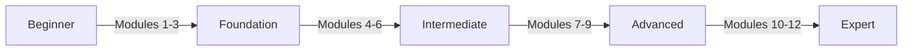

# Learn Nostr Modules

Welcome to the Learn Nostr Modules! This comprehensive curriculum is designed to take you from a complete beginner to a Nostr expert through structured, progressive learning paths.

## 🎯 Learning Path Overview

Our modules are carefully structured to build your knowledge progressively:

- **Modules 1-3**: Foundation - Understanding the basics
- **Modules 4-6**: Intermediate - Building and interacting
- **Modules 7-9**: Advanced - Architecture and optimization
- **Modules 10-12**: Expert - Innovation and contribution

## 📚 Available Modules

### Foundation Track

-   :material-numeric-1-circle:{ .lg .middle } **Module 1: Introduction to Nostr**

    ---

    Start your journey by understanding what Nostr is, why it matters, and how it revolutionizes social communication.

    [:octicons-arrow-right-24: Begin Module 1](module-01-introduction.md)

-   :material-numeric-2-circle:{ .lg .middle } **Module 2: Keys & Identity**

    ---

    Master the fundamentals of cryptographic keys, digital identity, and account management in Nostr.

    [:octicons-arrow-right-24: Begin Module 2](module-02-keys-identity.md)

-   :material-numeric-3-circle:{ .lg .middle } **Module 3: Events & Messages**

    ---

    Learn how Nostr structures data, creates events, and enables communication through the protocol.

    [:octicons-arrow-right-24: Begin Module 3](module-03-events-messages.md)

### Intermediate Track

-   :material-numeric-4-circle:{ .lg .middle } **Module 4: Relays & Architecture**

    ---

    Master relay communication, WebSocket connections, and network architecture patterns.

    [:octicons-arrow-right-24: Begin Module 4](module-04-relays-architecture.md)

-   :material-numeric-5-circle:{ .lg .middle } **Module 5: Building Your Client**

    ---

    Build a complete, production-ready Nostr client application from scratch.

    [:octicons-arrow-right-24: Begin Module 5](module-05-building-client.md)

-   :material-numeric-6-circle:{ .lg .middle } **Module 6: Advanced NIPs**

    ---

    Master advanced event types, NIPs, and protocol extensions for sophisticated applications.

    [:octicons-arrow-right-24: Begin Module 6](module-06-advanced-nips.md)

### Advanced Track

-   :material-numeric-7-circle:{ .lg .middle } **Module 7: Production Relays**

    ---

    Design, deploy, and operate production-grade Nostr relays at scale.

    [:octicons-arrow-right-24: Begin Module 7](module-07-production-relays.md)

-   :material-numeric-8-circle:{ .lg .middle } **Module 8: Scaling & Performance**

    ---

    Optimize relay performance, implement caching, and scale to millions of users.

    [:octicons-arrow-right-24: Begin Module 8](module-08-scaling-performance.md)

-   :material-numeric-9-circle:{ .lg .middle } **Module 9: Security Best Practices**

    ---

    Coming Soon - Advanced security patterns, threat modeling, and hardening strategies.

### Coming Soon

- **Module 10**: Protocol Development
- **Module 11**: Economic Models & Lightning
- **Module 12**: Contributing to Nostr

## 🚀 How to Use These Modules

1. **Start from Module 1** if you're new to Nostr
2. **Complete exercises** at the end of each module
3. **Join discussions** in our Discord community
4. **Build projects** to apply what you've learned
5. **Track your progress** using the checkpoints

## 📊 Skill Progression

## 🎓 Certification Track

Complete all modules and projects to earn your Nostr Developer Certification (coming soon).

---

!!! tip "Get Help"
    Have questions? Check out the [Support page](../support.md) for resources and ways to connect with the Nostr community!
