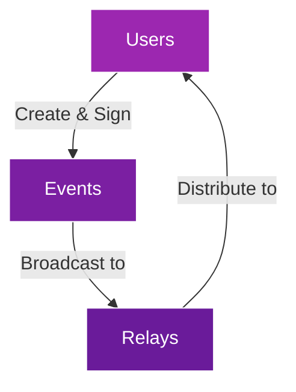

# Module 1: Introduction to Nostr

!!! info "Module Overview"
    **Duration**: 2-3 hours  
    **Level**: Beginner  
    **Prerequisites**: None  
    **Goal**: Understand what Nostr is, why it exists, and how it fundamentally works

## 📋 Learning Objectives

By the end of this module, you will:

- ✅ Understand what Nostr is and its core philosophy
- ✅ Know the problems Nostr solves
- ✅ Comprehend the basic architecture
- ✅ Set up your first Nostr account
- ✅ Send your first message on Nostr

## 1.1 What is Nostr?

### The Name

**Nostr** stands for "**N**otes and **O**ther **S**tuff **T**ransmitted by **R**elays". It's a simple, open protocol that enables a truly decentralized and censorship-resistant global social network.

### Core Concept

At its heart, Nostr is:

- **A protocol**, not a platform or company
- **Decentralized** - no single entity controls it
- **Simple** - based on straightforward concepts
- **Flexible** - can be used for many applications beyond social media

!!! quote "Key Insight"
    "Nostr is not an app, it's a protocol - like email or the web. Anyone can build on it, no one can shut it down."

## 1.2 Why Nostr Exists

### Problems with Current Social Media

Traditional social media platforms face several critical issues:

1. **Centralized Control**
   - Single companies control your data
   - Can ban or censor users arbitrarily
   - Can disappear, taking your content with them

2. **Data Ownership**
   - Platforms own your content
   - Cannot easily move between platforms
   - Your social graph is locked in

3. **Censorship**
   - Content moderation by central authorities
   - Varying standards across regions
   - No user choice in moderation policies

4. **Identity Portability**
   - Usernames tied to specific platforms
   - Must rebuild following on each platform
   - No universal digital identity

### Nostr's Solutions

| Problem | Nostr Solution |
|---------|---------------|
| Centralized servers | Multiple independent relays |
| Platform lock-in | Portable identity via cryptographic keys |
| Censorship | Choose your own relays and filters |
| Data ownership | You sign and own your content |
| Identity portability | One identity works everywhere |

## 1.3 How Nostr Works

### The Three Pillars



1. **Users (Clients)**
   - Create and consume content
   - Hold private keys for identity
   - Connect to multiple relays

2. **Events**
   - All data in Nostr is an "event"
   - Cryptographically signed messages
   - Contains content, metadata, and signature

3. **Relays**
   - Simple servers that store and forward events
   - Anyone can run a relay
   - Users choose which relays to use

### Simple Architecture Example

Imagine Alice wants to send a message:

1. Alice writes "Hello Nostr!" in her client
2. Her client creates an event and signs it with her private key
3. The client sends this event to her chosen relays
4. Bob's client queries these relays for new events
5. Bob sees Alice's message and can verify it's really from her

## 1.4 Key Innovations

### 1. Cryptographic Identity

Instead of usernames, Nostr uses cryptographic key pairs:

- **Private Key**: Your secret password (never share!)
- **Public Key**: Your identity that others see

!!! warning "Important"
    Your private key IS your identity. If you lose it, you lose your account. If someone else gets it, they can impersonate you.

### 2. Client-Relay Architecture

- **Clients** are apps you use (like Damus, Amethyst, Snort)
- **Relays** are servers that store messages
- You can use multiple clients with the same identity
- You can connect to multiple relays for redundancy

### 3. Censorship Resistance

- No single relay can censor you completely
- If one relay bans you, use others
- Users choose their own content filters
- Market-based relay selection

## 1.5 Hands-On: Your First Nostr Experience

### Step 1: Choose a Client

Popular web clients for beginners:

- [Snort.social](https://snort.social) - Feature-rich web client
- [Iris.to](https://iris.to) - Simple and clean interface
- [Coracle.social](https://coracle.social) - Advanced features

### Step 2: Create Your Account

1. Visit your chosen client
2. Click "Create Account" or "Get Started"
3. **Save your private key immediately!**

!!! danger "Critical: Save Your Keys"
    ```
    Private Key (nsec): nsec1xxxxx... (NEVER SHARE THIS)
    Public Key (npub): npub1xxxxx... (This is your public identity)
    ```
    Store your private key in a password manager or write it down securely!

### Step 3: Complete Your Profile

- Add a display name
- Write a short bio
- Add a profile picture (optional)
- Set up Lightning address for tips (optional)

### Step 4: Send Your First Note

1. Find the compose/post button
2. Write your first message: "Hello #Nostr! Just joined this decentralized network 🚀"
3. Click send/publish

### Step 5: Follow Others and Explore

Recommended accounts to follow:
- Nostr developers and builders
- Content creators in your interests
- News and update accounts

## 1.6 Practical Exercises

### Exercise 1: Multi-Client Experience
1. Log into a second client using your private key
2. Notice how your profile and posts appear immediately
3. Post from one client and see it in the other

### Exercise 2: Relay Exploration
1. Check which relays your client is using (usually in settings)
2. Add a new relay: `wss://relay.damus.io`
3. Remove a relay and see if you still see content

### Exercise 3: Verify a Message
1. Find a popular account's message
2. Look for verification checkmarks or indicators
3. Understand how the signature proves authenticity

## 1.7 Common Misconceptions

| Misconception | Reality |
|--------------|---------|
| "Nostr is just another social media app" | Nostr is a protocol; apps are just clients |
| "It's only for Bitcoin/crypto people" | Nostr is for everyone; Bitcoin integration is optional |
| "It's too technical for regular users" | Modern clients are as easy as traditional social media |
| "There's no moderation" | Users and relays can implement their own moderation |
| "It can't scale" | Nostr's architecture allows horizontal scaling |

## 1.8 Use Cases Beyond Social Media

Nostr isn't limited to social networking:

- **Messaging**: Encrypted direct messages
- **Blogging**: Long-form content platforms
- **Marketplace**: Decentralized commerce
- **Gaming**: High scores and achievements
- **Identity**: Universal login system
- **IoT**: Machine-to-machine communication

## 📝 Module 1 Quiz

Test your understanding:

1. **What does Nostr stand for?**
   <details>
   <summary>Answer</summary>
   Notes and Other Stuff Transmitted by Relays
   </details>

2. **What are the three main components of Nostr?**
   <details>
   <summary>Answer</summary>
   Users (Clients), Events, and Relays
   </details>

3. **Why is your private key important?**
   <details>
   <summary>Answer</summary>
   It's your identity and password combined - losing it means losing your account, and anyone with it can impersonate you
   </details>

4. **Can one relay completely censor you on Nostr?**
   <details>
   <summary>Answer</summary>
   No, because you can use multiple relays. If one blocks you, others can still distribute your content
   </details>

5. **What makes Nostr different from Twitter or Facebook?**
   <details>
   <summary>Answer</summary>
   Nostr is a protocol (not a company), decentralized (no single control point), gives users data ownership, and provides identity portability
   </details>

## 🎯 Module 1 Checkpoint

Before moving to Module 2, ensure you have:

- [ ] Created a Nostr account and saved your keys securely
- [ ] Successfully posted at least one note
- [ ] Logged into two different clients with the same key
- [ ] Followed at least 5 other accounts
- [ ] Added or removed at least one relay
- [ ] Understood the difference between public and private keys

## 📚 Additional Resources

- [Nostr Protocol Documentation](https://github.com/nostr-protocol/nostr)
- [Awesome Nostr](https://github.com/aljazceru/awesome-nostr) - Curated list of Nostr resources
- [Nostr.how](https://nostr.how) - Beginner guides
- Video: ["What is Nostr?" Explained Simply](https://www.youtube.com/watch?v=example)

## 💬 Community Discussion

Join our Discord to discuss Module 1:
- Share your first Nostr experience
- Ask questions about concepts
- Help other beginners
- Find people to follow

---

!!! success "Congratulations!"
    You've completed Module 1! You now understand what Nostr is, why it matters, and have hands-on experience using it. Ready for Module 2 where we'll dive deep into keys and identity!

[Continue to Module 2: Keys & Identity →](module-02-keys-identity.md)
