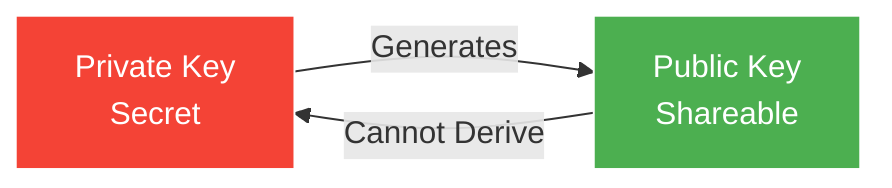
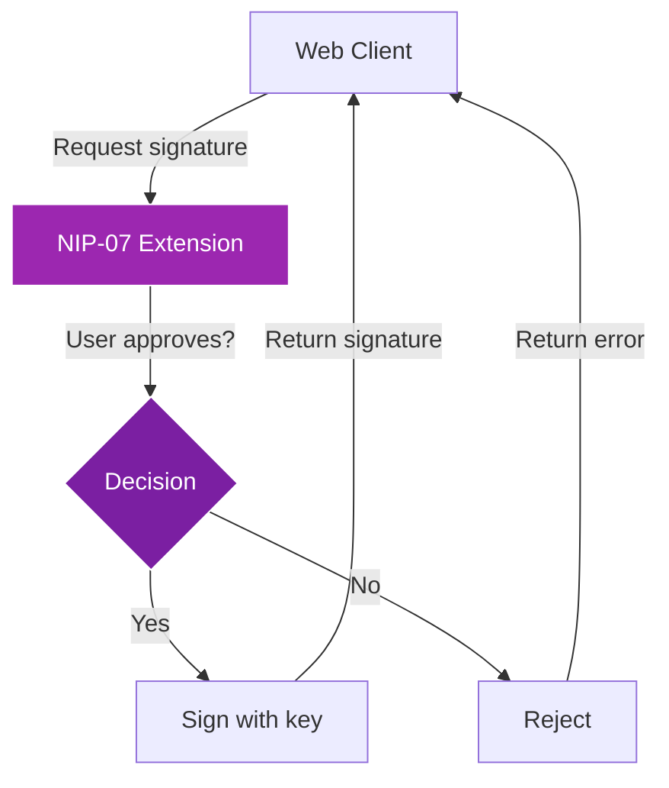

# Module 2: Keys & Identity

!!! info "Module Overview"
    **Duration**: 3-4 hours  
    **Level**: Beginner  
    **Prerequisites**: Module 1 completed  
    **Goal**: Master Nostr's cryptographic identity system and key management

## 📋 Learning Objectives

By the end of this module, you will:

- ✅ Understand public key cryptography basics
- ✅ Master Nostr key formats (hex, npub, nsec)
- ✅ Implement secure key management practices
- ✅ Use NIP-07 browser extensions
- ✅ Understand key delegation and rotation concepts
- ✅ Build your cryptographic identity

## 2.1 Cryptography Fundamentals

### What is Public Key Cryptography?

Public key cryptography uses a pair of mathematically related keys:



**Key Properties:**
- **One-way relationship**: Public key derives from private key, never reverse
- **Digital signatures**: Private key signs, public key verifies
- **Encryption**: Public key encrypts, private key decrypts

### How It Works in Nostr

1. **Identity Creation**
   ```
   Private Key → Public Key → Your Nostr Identity
   ```

2. **Message Signing**
   ```
   Your Message + Private Key → Signed Event
   ```

3. **Verification**
   ```
   Signed Event + Public Key → Verified as Authentic
   ```

!!! example "Real World Analogy"
    Think of it like a wax seal on a letter:
    - Your private key is the unique seal stamp (keep it secret!)
    - Your public key is the pattern everyone recognizes as yours
    - The wax impression proves the letter came from you

## 2.2 Nostr Key Formats

### Understanding Key Encodings

Nostr uses different formats for the same keys:

| Format | Prefix | Use Case | Example |
|--------|--------|----------|---------|
| **Hex** | None | Raw format, 64 characters | `7e7e9c42a91b...` |
| **npub** | npub1 | Public key (shareable) | `npub1xxxxx...` |
| **nsec** | nsec1 | Private key (SECRET!) | `nsec1xxxxx...` |

### Bech32 Encoding (npub/nsec)

Nostr uses Bech32 encoding for better user experience:

- **Human-readable prefix** (npub/nsec)
- **Error detection** built-in
- **Case-insensitive** (except prefix)
- **Shorter** than hex when displayed

### Key Conversion Example

```javascript
// Same key in different formats:
Hex Private:  "5426b5f89a7a5e1c8f4e9b5a8d7c3b2a1e9f8d7c6b5a4e3d2c1b0a9f8e7d6c5b"
nsec Format:  "nsec1gaafdhet7fu5uu38f8nf3lemlt5cj32kfduxsjwudxy8ehdrqmrs8ktqmz"

Hex Public:   "8e9f3d5c7b4a2e1f9d8c7b6a5e4d3c2b1a0f9e8d7c6b5a4e3d2c1b0a9f8e7d6c"
npub Format:  "npub136lsxmeac6fqslvce76n4y9swfvslf65d73hykgjvs5u5a089kwqg43ezk"
```

## 2.3 Key Generation

### Methods to Generate Keys

#### Method 1: Client Generation (Easiest)
Most Nostr clients can generate keys for you:
1. Click "Create New Account"
2. Keys are generated in your browser
3. Save them immediately!

#### Method 2: Command Line (Technical)
Using `openssl`:
```bash
# Generate private key
openssl rand -hex 32

# Or using Nostr tools
npm install -g nostr-tools
nostr-keygen
```

#### Method 3: Hardware Wallets (Most Secure)
Some hardware wallets support Nostr:
- Generate keys offline
- Never expose private key to internet
- Sign events on device

### Key Generation Best Practices

!!! danger "Security Rules"
    1. **Generate keys offline** when possible
    2. **Use cryptographically secure randomness**
    3. **Never use brain wallets** (keys from passwords)
    4. **Don't reuse keys** across different purposes
    5. **Generate backup keys** for recovery

## 2.4 Key Management

### Storage Options

#### 🔒 Password Managers (Recommended)
**Pros:**
- Encrypted storage
- Sync across devices
- Easy backup

**Setup Example (Bitwarden):**
1. Create new secure note
2. Name: "Nostr Identity"
3. Add fields:
   - nsec: `nsec1xxxxx...`
   - npub: `npub1xxxxx...`
   - Created: `2024-01-15`
   - Clients used: `Damus, Snort`

#### 📝 Physical Backup (Essential)
**Best Practices:**
- Write on paper with pen
- Store in fireproof safe
- Create multiple copies
- Consider metal backup for long-term

**Template:**
```
NOSTR IDENTITY BACKUP
Date: ___________
Private Key (nsec): _________________
Public Key (npub): __________________
Recovery Words (if applicable): ______
```

#### 🔐 Hardware Security

**Cold Storage:**
- Air-gapped computer
- Hardware wallet
- Encrypted USB drive

**Multi-signature Setup** (Advanced):
- Split key into shares
- Require M-of-N shares to reconstruct
- Distribute shares to trusted parties

### Security Threats and Mitigations

| Threat | Risk Level | Mitigation |
|--------|------------|------------|
| Phishing sites | High | Always verify URL, use bookmarks |
| Clipboard malware | Medium | Use browser extensions, verify addresses |
| Compromised client | Medium | Use trusted, open-source clients |
| Physical theft | Low-Medium | Encrypt devices, use strong passwords |
| Social engineering | High | Never share nsec, even with "support" |

## 2.5 NIP-07: Browser Extension Signing

### What is NIP-07?

NIP-07 defines a standard for browser extensions to manage keys:

- **Keys stay in extension** (never exposed to websites)
- **Permission-based signing** (you approve each action)
- **Works across all web clients**

### Popular NIP-07 Extensions

1. **Alby** (Recommended for beginners)
   - Lightning wallet integration
   - Multi-account support
   - Available for Chrome/Firefox/Edge

2. **nos2x** (Minimal and secure)
   - Simple and focused
   - Open source
   - Firefox and Chrome

3. **Flamingo**
   - Advanced features
   - Key derivation support
   - Developer-friendly

### Setting Up Alby

**Installation:**
1. Visit [getalby.com](https://getalby.com)
2. Install browser extension
3. Create new account or import existing

**Import Existing Key:**
1. Click Alby extension icon
2. Select "Import Nostr Key"
3. Paste your `nsec` key
4. Set spending password
5. Configure permissions

**Using with Clients:**
1. Visit any Nostr web client
2. Choose "Login with Extension"
3. Alby prompts for permission
4. Approve and you're logged in!

### NIP-07 Security Model



## 2.6 Advanced Identity Concepts

### Key Delegation (NIP-26)

Delegation allows temporary permission for another key to act on your behalf:

**Use Cases:**
- Social media managers
- Scheduled posting services
- Temporary device access

**How it works:**
1. Create delegation token with your main key
2. Specify delegated pubkey and conditions
3. Delegated key can post with proof of delegation

### Key Rotation Strategies

Since Nostr ties identity to keys, rotation is challenging:

**Approach 1: Social Migration**
1. Create new key pair
2. Announce migration from old account
3. Ask followers to follow new account
4. Keep old account active with redirect

**Approach 2: Multi-key Identity**
- Use multiple keys for different purposes
- Professional vs personal
- High-security vs convenience

### Identity Verification

**Methods to verify you control an identity:**

1. **Cross-platform verification**
   - Post same message on Twitter/GitHub
   - Include Nostr npub in bio

2. **Domain verification** (NIP-05)
   - Link your npub to your domain
   - Example: `bob@example.com` → `npub1xxx...`

3. **Web of Trust**
   - Get endorsed by known accounts
   - Build reputation over time

## 2.7 Practical Exercises

### Exercise 1: Key Format Conversion
1. Take your hex public key
2. Convert it to npub format manually (or use a tool)
3. Verify both represent the same identity

### Exercise 2: Secure Backup Creation
1. Create a complete backup of your Nostr identity
2. Include:
   - Both key formats
   - Associated NIP-05 identifier
   - List of primary relays
   - Recovery date
3. Store in at least two secure locations

### Exercise 3: NIP-07 Setup and Testing
1. Install a NIP-07 extension
2. Import your key
3. Log into three different web clients using only the extension
4. Configure different permission levels

### Exercise 4: Identity Verification
1. Set up NIP-05 verification (if you have a domain)
2. Cross-verify on another platform
3. Get at least one other user to verify you

## 2.8 Recovery Scenarios

### Scenario 1: Lost Password Manager
**Prevention:**
- Regular encrypted backups
- Physical paper backup
- Trusted contact with recovery share

**Recovery:**
- Check all backup locations
- Use physical backup to restore
- Create new identity if truly lost

### Scenario 2: Compromised Key
**Immediate Actions:**
1. Create new key pair immediately
2. Post warning from compromised account (if possible)
3. Notify close contacts directly
4. Update all NIP-05 verifications

### Scenario 3: Device Theft
**If device had keys:**
1. Assume keys compromised
2. Migrate to new identity
3. Revoke any delegations
4. Update security practices

## 📝 Module 2 Quiz

1. **What's the relationship between private and public keys?**
   <details>
   <summary>Answer</summary>
   Public key is derived from private key using one-way cryptographic function. You cannot derive the private key from the public key.
   </details>

2. **What does "nsec" stand for and when should you share it?**
   <details>
   <summary>Answer</summary>
   "nsec" is the Bech32-encoded format for Nostr secret (private) keys. You should NEVER share it with anyone or any service.
   </details>

3. **What is NIP-07 and why is it important?**
   <details>
   <summary>Answer</summary>
   NIP-07 is a standard for browser extensions to manage Nostr keys securely. It keeps private keys in the extension, never exposing them to websites, while allowing permission-based signing.
   </details>

4. **Name three secure ways to store your Nostr private key**
   <details>
   <summary>Answer</summary>
   1. Encrypted password manager (like Bitwarden)
   2. Physical paper backup in a safe
   3. Hardware wallet or air-gapped device
   </details>

5. **What should you do if your private key is compromised?**
   <details>
   <summary>Answer</summary>
   Create new key pair immediately, warn followers from old account if possible, notify close contacts, update all verifications, and migrate to the new identity.
   </details>

## 🎯 Module 2 Checkpoint

Before moving to Module 3, ensure you have:

- [ ] Understood the relationship between public and private keys
- [ ] Saved your keys in at least two secure locations
- [ ] Created a physical backup of your keys
- [ ] Installed and configured a NIP-07 browser extension
- [ ] Successfully used extension to log into multiple clients
- [ ] Set up at least one form of identity verification
- [ ] Practiced key format conversion
- [ ] Created a key recovery plan

## 📚 Additional Resources

- [NIP-01: Basic Protocol](https://github.com/nostr-protocol/nips/blob/master/01.md)
- [NIP-07: Browser Extensions](https://github.com/nostr-protocol/nips/blob/master/07.md)
- [NIP-26: Delegated Event Signing](https://github.com/nostr-protocol/nips/blob/master/26.md)
- [Key Management Best Practices](https://github.com/nostr-protocol/nostr)
- Tool: [Nostr Army Knife](https://nak.nostr.com) - Key conversion utilities

## 💬 Community Discussion

Join our Discord to discuss Module 2:
- Share your key management strategies
- Get help with NIP-07 setup
- Discuss identity verification methods
- Learn from others' security practices

---

!!! success "Congratulations!"
    You've mastered Nostr's identity system! You now understand cryptographic keys, can manage them securely, and use advanced features like NIP-07. Ready for Module 3 where we'll explore how Nostr structures and transmits data!

[Continue to Module 3: Events & Messages →](module-03-events-messages.md)
