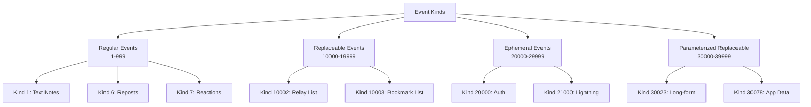
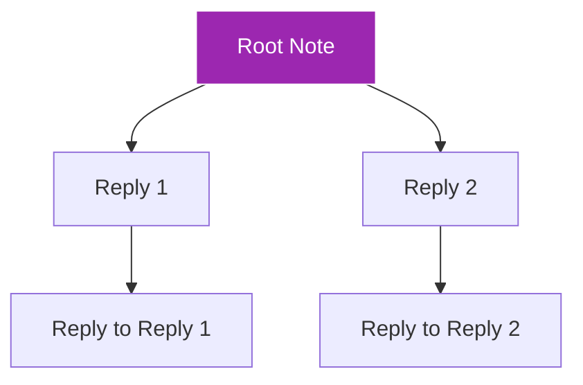

# Module 3: Events & Messages

!!! info "Module Overview"
    **Duration**: 4-5 hours  
    **Level**: Beginner-Intermediate  
    **Prerequisites**: Modules 1-2 completed  
    **Goal**: Master Nostr's event system, message types, and data structures

## 📋 Learning Objectives

By the end of this module, you will:

- ✅ Understand Nostr event structure and JSON format
- ✅ Master different event kinds and their purposes
- ✅ Create and validate events programmatically
- ✅ Implement filters and subscriptions
- ✅ Handle replies, mentions, and threads
- ✅ Work with metadata and special event types

## 3.1 Understanding Nostr Events

### What is an Event?

In Nostr, **everything is an event**. An event is a JSON object that contains:

- **Content** (the actual message or data)
- **Metadata** (who, when, what type)
- **Cryptographic signature** (proof of authenticity)

```json
{
  "id": "4376c65d2f232afbe9b882a35baa4f6fe8667c4e684749af565f981833ed6a65",
  "pubkey": "6e468422dfb74a5738702a8823b9b28168abab8655faacb6853cd0ee15e3d882",
  "created_at": 1673347337,
  "kind": 1,
  "tags": [],
  "content": "Hello Nostr! This is my first event.",
  "sig": "908a15e46fb4d8675bab026fc230a0e3542bfade63da02d542fb78b2a8513fcd..."
}
```

### Event Fields Explained

| Field | Type | Description | Required |
|-------|------|-------------|----------|
| `id` | string | SHA256 hash of serialized event | Yes |
| `pubkey` | string | Author's public key (hex) | Yes |
| `created_at` | number | Unix timestamp | Yes |
| `kind` | number | Event type (0, 1, 3, etc.) | Yes |
| `tags` | array | Metadata and references | Yes |
| `content` | string | Main event content | Yes |
| `sig` | string | Schnorr signature | Yes |

### Event ID Calculation

The event ID is a SHA256 hash of a specifically serialized format:

```javascript
// Serialization format for ID calculation
[
  0,                    // Reserved for future use
  pubkey,              // Author's public key
  created_at,          // Unix timestamp
  kind,                // Event kind
  tags,                // Tags array
  content              // Content string
]
```

## 3.2 Event Kinds

### Standard Event Kinds (NIP-01)

| Kind | Type | Description | Example Use |
|------|------|-------------|-------------|
| 0 | Metadata | User profile information | Name, about, picture |
| 1 | Text Note | Short text message | Social media posts |
| 2 | Recommend Relay | Relay recommendation | (Deprecated) |
| 3 | Contact List | Following list | Who you follow |
| 4 | Encrypted DM | Private message | Direct messages |
| 5 | Event Deletion | Request deletion | Delete your posts |
| 6 | Repost | Share someone's note | Like retweet |
| 7 | Reaction | React to content | Likes, emojis |

### Extended Event Kinds



### Event Kind Ranges

- **0-999**: Regular Events (stored and transmitted)
- **1000-9999**: Regular Events (reserved for future)
- **10000-19999**: Replaceable Events (only latest is kept)
- **20000-29999**: Ephemeral Events (not stored)
- **30000-39999**: Parameterized Replaceable Events

## 3.3 Working with Tags

### Tag Structure

Tags are arrays within arrays that add metadata to events:

```json
"tags": [
  ["e", "event_id", "relay_url", "marker"],
  ["p", "pubkey", "relay_url", "petname"],
  ["t", "hashtag"],
  ["r", "reference_url"]
]
```

### Common Tag Types

| Tag | Name | Purpose | Example |
|-----|------|---------|---------|
| `e` | Event | Reference another event | Reply, mention event |
| `p` | Pubkey | Reference a user | Mention, reply to |
| `t` | Hashtag | Topic tag | #nostr #bitcoin |
| `r` | Reference | External link | Website URL |
| `a` | Address | Reference replaceable event | Article, list |
| `d` | Identifier | Unique identifier | For replaceable events |

### Tag Examples in Practice

#### Example 1: Reply to a Note
```json
{
  "kind": 1,
  "tags": [
    ["e", "original_event_id", "", "root"],
    ["e", "reply_to_event_id", "", "reply"],
    ["p", "original_author_pubkey", ""]
  ],
  "content": "Great point! I totally agree with this."
}
```

#### Example 2: Mention Someone
```json
{
  "kind": 1,
  "tags": [
    ["p", "mentioned_user_pubkey", "", "Alice"]
  ],
  "content": "Hey @Alice, check this out!"
}
```

#### Example 3: Hashtags
```json
{
  "kind": 1,
  "tags": [
    ["t", "nostr"],
    ["t", "decentralized"],
    ["t", "freedom"]
  ],
  "content": "Learning about #nostr #decentralized #freedom"
}
```

## 3.4 Creating Events Programmatically

### Using JavaScript/TypeScript

```javascript
import { getPublicKey, getEventHash, signEvent } from 'nostr-tools';

// Your private key (keep secret!)
const privateKey = 'your_hex_private_key_here';
const publicKey = getPublicKey(privateKey);

// Create an event
function createTextNote(content) {
  const event = {
    kind: 1,
    pubkey: publicKey,
    created_at: Math.floor(Date.now() / 1000),
    tags: [],
    content: content
  };
  
  // Calculate event ID
  event.id = getEventHash(event);
  
  // Sign the event
  event.sig = signEvent(event, privateKey);
  
  return event;
}

// Create a reply
function createReply(originalEventId, replyContent) {
  const event = {
    kind: 1,
    pubkey: publicKey,
    created_at: Math.floor(Date.now() / 1000),
    tags: [
      ['e', originalEventId, '', 'reply']
    ],
    content: replyContent
  };
  
  event.id = getEventHash(event);
  event.sig = signEvent(event, privateKey);
  
  return event;
}
```

### Event Validation

```javascript
import { verifySignature } from 'nostr-tools';

function validateEvent(event) {
  // Check required fields
  if (!event.id || !event.pubkey || !event.sig) {
    return { valid: false, error: 'Missing required fields' };
  }
  
  // Verify signature
  if (!verifySignature(event)) {
    return { valid: false, error: 'Invalid signature' };
  }
  
  // Check event ID
  const calculatedId = getEventHash(event);
  if (event.id !== calculatedId) {
    return { valid: false, error: 'Invalid event ID' };
  }
  
  // Validate timestamp (not too far in future)
  const now = Math.floor(Date.now() / 1000);
  if (event.created_at > now + 900) { // 15 minutes tolerance
    return { valid: false, error: 'Event timestamp too far in future' };
  }
  
  return { valid: true };
}
```

## 3.5 Metadata Events (Kind 0)

### Profile Information Structure

Kind 0 events contain user profile information in JSON format:

```json
{
  "kind": 0,
  "content": "{\"name\":\"Alice\",\"about\":\"Nostr enthusiast\",\"picture\":\"https://example.com/alice.jpg\",\"nip05\":\"alice@example.com\",\"lud16\":\"alice@ln.tips\"}",
  "tags": []
}
```

### Standard Metadata Fields

| Field | Description | Example |
|-------|-------------|---------|
| `name` | Display name | "Alice" |
| `about` | Bio/description | "Bitcoin & Nostr developer" |
| `picture` | Avatar URL | "https://..." |
| `banner` | Cover image | "https://..." |
| `nip05` | Verification | "alice@example.com" |
| `lud16` | Lightning address | "alice@ln.tips" |
| `website` | Personal website | "https://alice.com" |

### Creating and Updating Profile

```javascript
function updateProfile(profileData) {
  const metadata = {
    name: profileData.name,
    about: profileData.about,
    picture: profileData.picture,
    nip05: profileData.nip05,
    lud16: profileData.lightning
  };
  
  const event = {
    kind: 0,
    pubkey: publicKey,
    created_at: Math.floor(Date.now() / 1000),
    tags: [],
    content: JSON.stringify(metadata)
  };
  
  event.id = getEventHash(event);
  event.sig = signEvent(event, privateKey);
  
  return event;
}
```

## 3.6 Filters and Subscriptions

### Understanding Filters

Filters tell relays what events you want to receive:

```json
{
  "ids": ["event_id1", "event_id2"],
  "authors": ["pubkey1", "pubkey2"],
  "kinds": [0, 1, 7],
  "since": 1673347337,
  "until": 1673347937,
  "limit": 100,
  "#t": ["nostr", "bitcoin"],
  "#p": ["pubkey_to_find"]
}
```

### Filter Parameters

| Parameter | Type | Description |
|-----------|------|-------------|
| `ids` | string[] | Event IDs to fetch |
| `authors` | string[] | Public keys of authors |
| `kinds` | number[] | Event kinds to fetch |
| `since` | number | Events after timestamp |
| `until` | number | Events before timestamp |
| `limit` | number | Maximum events to return |
| `#e` | string[] | Events with these e tags |
| `#p` | string[] | Events with these p tags |
| `#t` | string[] | Events with these hashtags |

### Subscription Examples

#### Get User's Recent Notes
```javascript
const filter = {
  authors: ["user_pubkey"],
  kinds: [1],
  limit: 20
};
```

#### Get Replies to an Event
```javascript
const filter = {
  kinds: [1],
  "#e": ["original_event_id"]
};
```

#### Get User Profile and Notes
```javascript
const filters = [
  {
    authors: ["user_pubkey"],
    kinds: [0],  // Profile
    limit: 1
  },
  {
    authors: ["user_pubkey"],
    kinds: [1],  // Notes
    limit: 50
  }
];
```

## 3.7 Working with Threads

### Thread Structure

Nostr uses `e` tags with markers to create threaded conversations:



### Thread Tag Markers

- **`root`**: The original note that started the thread
- **`reply`**: The note being directly replied to
- **`mention`**: Just mentioning an event

### Creating a Thread Reply

```javascript
function createThreadedReply(rootId, replyToId, content) {
  const event = {
    kind: 1,
    pubkey: publicKey,
    created_at: Math.floor(Date.now() / 1000),
    tags: [
      ['e', rootId, '', 'root'],
      ['e', replyToId, '', 'reply'],
      ['p', authorPubkey]  // Original author
    ],
    content: content
  };
  
  event.id = getEventHash(event);
  event.sig = signEvent(event, privateKey);
  
  return event;
}
```

## 3.8 Special Event Types

### Encrypted Direct Messages (Kind 4)

```javascript
import { nip04 } from 'nostr-tools';

async function sendEncryptedMessage(recipientPubkey, message) {
  // Encrypt the message
  const ciphertext = await nip04.encrypt(
    privateKey,
    recipientPubkey,
    message
  );
  
  const event = {
    kind: 4,
    pubkey: publicKey,
    created_at: Math.floor(Date.now() / 1000),
    tags: [['p', recipientPubkey]],
    content: ciphertext
  };
  
  event.id = getEventHash(event);
  event.sig = signEvent(event, privateKey);
  
  return event;
}
```

### Reactions (Kind 7)

```javascript
function createReaction(eventId, reaction = '+') {
  const event = {
    kind: 7,
    pubkey: publicKey,
    created_at: Math.floor(Date.now() / 1000),
    tags: [
      ['e', eventId],
      ['p', authorPubkey]
    ],
    content: reaction  // '+', '-', '❤️', '🔥', etc.
  };
  
  event.id = getEventHash(event);
  event.sig = signEvent(event, privateKey);
  
  return event;
}
```

### Deletion Requests (Kind 5)

```javascript
function deleteEvents(eventIds, reason = '') {
  const event = {
    kind: 5,
    pubkey: publicKey,
    created_at: Math.floor(Date.now() / 1000),
    tags: eventIds.map(id => ['e', id]),
    content: reason
  };
  
  event.id = getEventHash(event);
  event.sig = signEvent(event, privateKey);
  
  return event;
}
```

## 3.9 Practical Exercises

### Exercise 1: Create Your First Events
1. Create a text note (kind 1) with content
2. Create a profile metadata event (kind 0)
3. Verify both events have valid signatures
4. Calculate and verify event IDs manually

### Exercise 2: Build a Reply Chain
1. Create an original note
2. Create a reply to that note
3. Create a reply to the reply
4. Properly use root and reply markers

### Exercise 3: Implement Mentions
1. Create a note that mentions 3 users
2. Use proper `p` tags for mentions
3. Include mention markers in content
4. Test with actual npub addresses

### Exercise 4: Work with Filters
1. Create a filter for your last 10 notes
2. Create a filter for all replies to a specific event
3. Create a filter for notes with specific hashtags
4. Combine multiple filters in one subscription

### Exercise 5: Event Validation
1. Write a complete event validator
2. Test with valid events
3. Test with invalid signatures
4. Test with tampered event IDs

## 3.10 Common Patterns

### Pagination Pattern
```javascript
// Load more events as user scrolls
let lastTimestamp = Math.floor(Date.now() / 1000);

function loadMoreEvents() {
  const filter = {
    kinds: [1],
    until: lastTimestamp,
    limit: 20
  };
  
  // Update lastTimestamp with oldest event received
  // for next pagination request
}
```

### Real-time + History Pattern
```javascript
// Subscribe to new events and load history
const now = Math.floor(Date.now() / 1000);

// Historical events
const historyFilter = {
  kinds: [1],
  until: now,
  limit: 100
};

// Real-time events
const realtimeFilter = {
  kinds: [1],
  since: now
};
```

### Profile Caching Pattern
```javascript
const profileCache = new Map();

async function getProfile(pubkey) {
  // Check cache first
  if (profileCache.has(pubkey)) {
    return profileCache.get(pubkey);
  }
  
  // Fetch from relay
  const filter = {
    authors: [pubkey],
    kinds: [0],
    limit: 1
  };
  
  // Cache result
  profileCache.set(pubkey, profile);
  return profile;
}
```

## 📝 Module 3 Quiz

1. **What are the required fields in every Nostr event?**
   <details>
   <summary>Answer</summary>
   id, pubkey, created_at, kind, tags, content, and sig (signature)
   </details>

2. **How is an event ID calculated?**
   <details>
   <summary>Answer</summary>
   It's a SHA256 hash of a serialized array containing: [0, pubkey, created_at, kind, tags, content]
   </details>

3. **What's the difference between kind 1 and kind 0 events?**
   <details>
   <summary>Answer</summary>
   Kind 0 is for user metadata/profile information (replaceable), while Kind 1 is for text notes/posts (regular events)
   </details>

4. **What tags would you use to create a reply?**
   <details>
   <summary>Answer</summary>
   Use 'e' tags with markers: one for the root note (marked as "root") and one for the direct reply (marked as "reply"), plus a 'p' tag for the author being replied to
   </details>

5. **What's the difference between replaceable and ephemeral events?**
   <details>
   <summary>Answer</summary>
   Replaceable events (10000-19999) only keep the latest version, while ephemeral events (20000-29999) are not stored by relays at all
   </details>

## 🎯 Module 3 Checkpoint

Before continuing, ensure you have:

- [ ] Created and signed events programmatically
- [ ] Implemented event validation
- [ ] Used different event kinds (0, 1, 7)
- [ ] Created replies with proper threading
- [ ] Implemented mentions using tags
- [ ] Built and tested various filters
- [ ] Worked with metadata events
- [ ] Understood replaceable vs regular events

## 📚 Additional Resources

- [NIP-01: Basic Protocol Flow](https://github.com/nostr-protocol/nips/blob/master/01.md)
- [Nostr Tools Library](https://github.com/nbd-wtf/nostr-tools)
- [Event Kind Registry](https://github.com/nostr-protocol/nips)
- [Nostr Event Inspector](https://nostr.com/events)
- Video: [Understanding Nostr Events Deep Dive](https://youtube.com/example)

## 💬 Community Discussion

Join our Discord to discuss Module 3:
- Share your event creation code
- Debug event validation issues
- Discuss threading strategies
- Learn about advanced event types

---

!!! success "Congratulations!"
    You've mastered Nostr events and messages! You can now create, validate, and work with all types of Nostr events. You understand tags, filters, and the complete event lifecycle. You're ready to start building real Nostr applications!

**Next Steps:**
- Module 4: Relays & Network Architecture (Coming Soon)
- Module 5: Building Your First Nostr Client (Coming Soon)
- Practice creating different event types
- Explore more NIPs for specialized events

[← Back to Modules](index.md)
