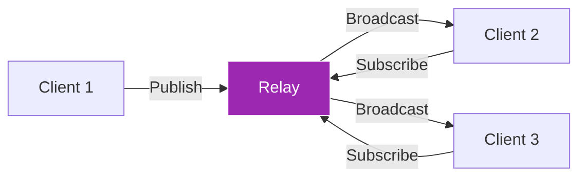
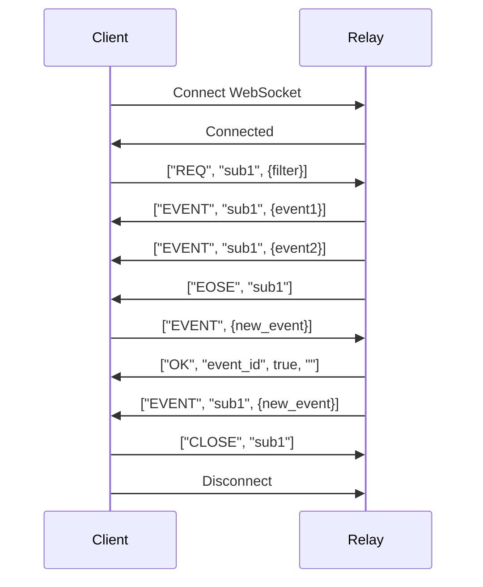

# Module 4: Relays & Network Architecture

!!! info "Module Overview"
    **Duration**: 5-6 hours  
    **Level**: Intermediate  
    **Prerequisites**: Modules 1-3 completed  
    **Goal**: Master Nostr's relay architecture, network topology, and relay selection strategies

## 📋 Learning Objectives

By the end of this module, you will:

- ✅ Understand relay architecture and protocols
- ✅ Master WebSocket connections and message flow
- ✅ Implement relay pool management
- ✅ Configure relay selection strategies
- ✅ Set up and run your own relay
- ✅ Optimize network performance and reliability

## 4.1 Understanding Relays

### What is a Relay?

A relay is a simple server that:
- **Accepts** events from clients
- **Stores** events (based on its policy)
- **Forwards** events to interested clients
- **Filters** events based on subscriptions



### Relay Responsibilities

| Function | Description | Implementation |
|----------|-------------|----------------|
| **Accept Events** | Validate and store incoming events | Check signatures, apply policies |
| **Store Events** | Persist events to database | PostgreSQL, MongoDB, SQLite |
| **Query Events** | Retrieve based on filters | Index by id, pubkey, kind, tags |
| **Broadcast** | Send events to subscribers | WebSocket connections |
| **Apply Policies** | Enforce rules and limits | Rate limiting, content filtering |

### Relay Types

1. **Public Relays**
   - Open to everyone
   - Free or paid
   - May have content policies
   - Examples: relay.damus.io, nos.lol

2. **Private Relays**
   - Restricted access
   - Whitelist/invite only
   - Custom for communities
   - Enhanced privacy

3. **Specialized Relays**
   - Long-form content
   - Media storage
   - Geographic specific
   - Topic focused

4. **Personal Relays**
   - Run by individuals
   - Complete control
   - Backup storage
   - Privacy focused

## 4.2 WebSocket Protocol

### Connection Lifecycle

```javascript
// Connecting to a relay
const relay = new WebSocket('wss://relay.example.com');

// Connection states
relay.onopen = () => {
  console.log('Connected to relay');
};

relay.onmessage = (event) => {
  const message = JSON.parse(event.data);
  handleRelayMessage(message);
};

relay.onerror = (error) => {
  console.error('Relay error:', error);
};

relay.onclose = () => {
  console.log('Disconnected from relay');
  // Implement reconnection logic
};
```

### Message Types

Nostr uses three main message types between clients and relays:

#### 1. CLIENT → RELAY Messages

**EVENT** - Publish an event:
```json
["EVENT", {event_object}]
```

**REQ** - Request/subscribe to events:
```json
["REQ", "subscription_id", {filter1}, {filter2}, ...]
```

**CLOSE** - Cancel subscription:
```json
["CLOSE", "subscription_id"]
```

#### 2. RELAY → CLIENT Messages

**EVENT** - Send requested event:
```json
["EVENT", "subscription_id", {event_object}]
```

**OK** - Acknowledge event status:
```json
["OK", "event_id", true, "message"]
```

**EOSE** - End of stored events:
```json
["EOSE", "subscription_id"]
```

**NOTICE** - Relay message:
```json
["NOTICE", "message"]
```

**AUTH** - Authentication required:
```json
["AUTH", "challenge"]
```

### Communication Flow



## 4.3 Relay Pool Management

### Why Use Multiple Relays?

1. **Redundancy** - If one relay is down
2. **Censorship Resistance** - No single point of failure
3. **Geographic Distribution** - Better latency
4. **Content Availability** - Different relays have different events
5. **Load Balancing** - Distribute traffic

### Implementing a Relay Pool

```javascript
class RelayPool {
  constructor() {
    this.relays = new Map();
    this.subscriptions = new Map();
  }
  
  addRelay(url, options = {}) {
    if (this.relays.has(url)) return;
    
    const relay = {
      url,
      ws: null,
      status: 'disconnected',
      stats: {
        eventsReceived: 0,
        eventsSent: 0,
        latency: null
      },
      options
    };
    
    this.connect(relay);
    this.relays.set(url, relay);
  }
  
  connect(relay) {
    relay.ws = new WebSocket(relay.url);
    
    relay.ws.onopen = () => {
      relay.status = 'connected';
      console.log(`Connected to ${relay.url}`);
      this.syncSubscriptions(relay);
    };
    
    relay.ws.onmessage = (event) => {
      relay.stats.eventsReceived++;
      this.handleMessage(relay, JSON.parse(event.data));
    };
    
    relay.ws.onerror = (error) => {
      console.error(`Error with ${relay.url}:`, error);
      this.reconnect(relay);
    };
    
    relay.ws.onclose = () => {
      relay.status = 'disconnected';
      this.reconnect(relay);
    };
  }
  
  publish(event) {
    const results = [];
    
    this.relays.forEach((relay) => {
      if (relay.status === 'connected') {
        relay.ws.send(JSON.stringify(['EVENT', event]));
        relay.stats.eventsSent++;
        results.push({ relay: relay.url, status: 'sent' });
      }
    });
    
    return results;
  }
  
  subscribe(filters, callback, id = null) {
    const subId = id || Math.random().toString(36).substring(7);
    
    this.subscriptions.set(subId, {
      filters,
      callback,
      events: new Set() // Deduplication
    });
    
    this.relays.forEach((relay) => {
      if (relay.status === 'connected') {
        relay.ws.send(JSON.stringify(['REQ', subId, ...filters]));
      }
    });
    
    return subId;
  }
  
  handleMessage(relay, message) {
    const [type, ...args] = message;
    
    switch (type) {
      case 'EVENT':
        const [subId, event] = args;
        const sub = this.subscriptions.get(subId);
        
        if (sub && !sub.events.has(event.id)) {
          sub.events.add(event.id);
          sub.callback(event, relay.url);
        }
        break;
        
      case 'EOSE':
        console.log(`End of stored events from ${relay.url}`);
        break;
        
      case 'OK':
        const [eventId, success, message] = args;
        console.log(`Event ${eventId}: ${success ? 'accepted' : 'rejected'} - ${message}`);
        break;
        
      case 'NOTICE':
        console.log(`Notice from ${relay.url}: ${args[0]}`);
        break;
    }
  }
  
  reconnect(relay, delay = 5000) {
    setTimeout(() => {
      console.log(`Reconnecting to ${relay.url}...`);
      this.connect(relay);
    }, delay);
  }
}
```

### Relay Selection Strategies

#### 1. Geographic Strategy
```javascript
function selectRelaysByLocation(userLocation) {
  const relayLocations = {
    'wss://relay.damus.io': { lat: 37.7749, lon: -122.4194 }, // SF
    'wss://relay.nostr.band': { lat: 52.5200, lon: 13.4050 }, // Berlin
    'wss://relay.snort.social': { lat: 40.7128, lon: -74.0060 }, // NYC
  };
  
  return Object.entries(relayLocations)
    .map(([url, location]) => ({
      url,
      distance: calculateDistance(userLocation, location)
    }))
    .sort((a, b) => a.distance - b.distance)
    .slice(0, 3)
    .map(r => r.url);
}
```

#### 2. Performance Strategy
```javascript
class PerformanceRelaySelector {
  constructor() {
    this.metrics = new Map();
  }
  
  updateMetrics(relayUrl, latency, uptime, eventsPerSecond) {
    this.metrics.set(relayUrl, {
      latency,
      uptime,
      eventsPerSecond,
      score: this.calculateScore(latency, uptime, eventsPerSecond)
    });
  }
  
  calculateScore(latency, uptime, eventsPerSecond) {
    return (uptime * 100) + (eventsPerSecond * 10) - (latency * 0.1);
  }
  
  selectBestRelays(count = 5) {
    return Array.from(this.metrics.entries())
      .sort((a, b) => b[1].score - a[1].score)
      .slice(0, count)
      .map(([url]) => url);
  }
}
```

#### 3. Content Strategy
```javascript
function selectRelaysByContent(desiredEventKinds) {
  const relaySpecialties = {
    'wss://relay.damus.io': [0, 1, 3, 7], // General purpose
    'wss://relay.nostr.band': [1, 6, 7], // Social content
    'wss://nostr.wine': [0, 1, 30023], // Long-form
    'wss://purplepag.es': [0, 3], // Profiles
  };
  
  return Object.entries(relaySpecialties)
    .filter(([url, kinds]) => 
      desiredEventKinds.some(k => kinds.includes(k))
    )
    .map(([url]) => url);
}
```

## 4.4 Running Your Own Relay

### Popular Relay Implementations

| Implementation | Language | Features | Best For |
|----------------|----------|----------|----------|
| **nostr-rs-relay** | Rust | Fast, efficient | Production use |
| **strfry** | C++ | High performance | Large scale |
| **nostream** | TypeScript | Feature-rich | Customization |
| **nostr-relay-nestjs** | TypeScript | Modular | Development |
| **knostr** | Kotlin | JVM ecosystem | Java developers |

### Setting Up nostr-rs-relay

#### Step 1: Installation
```bash
# Using Docker
docker pull scsibug/nostr-rs-relay
docker run -p 7000:8080 scsibug/nostr-rs-relay

# From source
git clone https://github.com/scsibug/nostr-rs-relay.git
cd nostr-rs-relay
cargo build --release
```

#### Step 2: Configuration
```toml
# config.toml
[info]
relay_url = "wss://your-relay.com/"
name = "Your Relay Name"
description = "A Nostr relay"
pubkey = "your-hex-pubkey"
contact = "admin@your-relay.com"

[database]
engine = "sqlite"
data_directory = "./data"

[network]
port = 8080
address = "0.0.0.0"

[limits]
messages_per_sec = 10
max_event_bytes = 65536
max_ws_message_bytes = 131072
max_subscriptions = 20
max_filters = 100

[authorization]
pubkey_whitelist = []
pubkey_blacklist = []

[retention]
# Days to keep events
default = 30
```

#### Step 3: Nginx Reverse Proxy
```nginx
server {
    listen 443 ssl http2;
    server_name relay.yoursite.com;
    
    ssl_certificate /path/to/cert.pem;
    ssl_certificate_key /path/to/key.pem;
    
    location / {
        proxy_pass http://localhost:8080;
        proxy_http_version 1.1;
        proxy_set_header Upgrade $http_upgrade;
        proxy_set_header Connection "upgrade";
        proxy_set_header Host $host;
        proxy_set_header X-Real-IP $remote_addr;
        proxy_set_header X-Forwarded-For $proxy_add_x_forwarded_for;
        proxy_set_header X-Forwarded-Proto $scheme;
        proxy_read_timeout 86400;
    }
}
```

### Relay Policies

#### Content Filtering
```javascript
// Example relay policy implementation
class RelayPolicy {
  constructor() {
    this.rules = [];
  }
  
  addRule(rule) {
    this.rules.push(rule);
  }
  
  async validateEvent(event) {
    for (const rule of this.rules) {
      const result = await rule.validate(event);
      if (!result.valid) {
        return {
          accepted: false,
          reason: result.reason
        };
      }
    }
    return { accepted: true };
  }
}

// Spam filter rule
class SpamFilterRule {
  constructor() {
    this.recentEvents = new Map();
  }
  
  async validate(event) {
    const key = event.pubkey;
    const now = Date.now();
    
    if (!this.recentEvents.has(key)) {
      this.recentEvents.set(key, []);
    }
    
    const recent = this.recentEvents.get(key)
      .filter(time => now - time < 60000); // Last minute
    
    if (recent.length > 10) {
      return {
        valid: false,
        reason: 'Rate limit exceeded'
      };
    }
    
    recent.push(now);
    this.recentEvents.set(key, recent);
    
    return { valid: true };
  }
}
```

## 4.5 Network Topology

### Relay Discovery

#### NIP-65: Relay List Metadata
```javascript
// Users publish their relay preferences
const relayListEvent = {
  kind: 10002,
  tags: [
    ["r", "wss://relay.damus.io", "read"],
    ["r", "wss://nos.lol", "write"],
    ["r", "wss://relay.nostr.band", "read"],
  ],
  content: ""
};
```

#### Gossip Model
```javascript
class GossipRelayDiscovery {
  constructor(pool) {
    this.pool = pool;
    this.discoveredRelays = new Set();
    this.userRelayMap = new Map();
  }
  
  async discoverRelaysForUser(pubkey) {
    // Get user's relay list
    const filter = {
      authors: [pubkey],
      kinds: [10002],
      limit: 1
    };
    
    const relayList = await this.pool.queryOne(filter);
    
    if (relayList) {
      const relays = relayList.tags
        .filter(tag => tag[0] === 'r')
        .map(tag => ({
          url: tag[1],
          type: tag[2] || 'both'
        }));
      
      this.userRelayMap.set(pubkey, relays);
      relays.forEach(r => this.discoveredRelays.add(r.url));
      
      return relays;
    }
    
    return [];
  }
  
  async findUserAcrossRelays(pubkey) {
    // Query known relays for user
    const relays = this.userRelayMap.get(pubkey) || [];
    
    if (relays.length === 0) {
      // Try popular relays
      return this.tryPopularRelays(pubkey);
    }
    
    return relays.map(r => r.url);
  }
}
```

### Relay Synchronization

```javascript
class RelaySyncManager {
  constructor(primaryRelay, backupRelays) {
    this.primary = primaryRelay;
    this.backups = backupRelays;
    this.syncedEvents = new Set();
  }
  
  async syncUserData(pubkey) {
    // Get all user events from primary
    const events = await this.primary.query({
      authors: [pubkey]
    });
    
    // Sync to backups
    for (const backup of this.backups) {
      for (const event of events) {
        if (!this.syncedEvents.has(event.id)) {
          await backup.publish(event);
          this.syncedEvents.add(event.id);
        }
      }
    }
    
    return {
      eventsCount: events.length,
      syncedTo: this.backups.length
    };
  }
  
  async setupBidirectionalSync() {
    // Subscribe to new events on primary
    this.primary.subscribe(
      [{ since: Math.floor(Date.now() / 1000) }],
      (event) => {
        // Forward to backups
        this.backups.forEach(backup => {
          backup.publish(event);
        });
      }
    );
    
    // Subscribe to backups
    this.backups.forEach(backup => {
      backup.subscribe(
        [{ since: Math.floor(Date.now() / 1000) }],
        (event) => {
          // Forward to primary and other backups
          this.primary.publish(event);
          this.backups
            .filter(b => b !== backup)
            .forEach(b => b.publish(event));
        }
      );
    });
  }
}
```

## 4.6 Performance Optimization

### Connection Management

```javascript
class OptimizedRelayConnection {
  constructor(url) {
    this.url = url;
    this.ws = null;
    this.messageQueue = [];
    this.reconnectDelay = 1000;
    this.maxReconnectDelay = 30000;
    this.pingInterval = null;
  }
  
  connect() {
    this.ws = new WebSocket(this.url);
    
    this.ws.onopen = () => {
      this.reconnectDelay = 1000;
      this.flushQueue();
      this.startPing();
    };
    
    this.ws.onclose = () => {
      this.stopPing();
      this.reconnect();
    };
  }
  
  startPing() {
    this.pingInterval = setInterval(() => {
      if (this.ws.readyState === WebSocket.OPEN) {
        this.ws.send('ping');
      }
    }, 30000);
  }
  
  stopPing() {
    if (this.pingInterval) {
      clearInterval(this.pingInterval);
      this.pingInterval = null;
    }
  }
  
  send(message) {
    if (this.ws.readyState === WebSocket.OPEN) {
      this.ws.send(JSON.stringify(message));
    } else {
      this.messageQueue.push(message);
    }
  }
  
  flushQueue() {
    while (this.messageQueue.length > 0) {
      const message = this.messageQueue.shift();
      this.ws.send(JSON.stringify(message));
    }
  }
  
  reconnect() {
    setTimeout(() => {
      this.connect();
      this.reconnectDelay = Math.min(
        this.reconnectDelay * 2,
        this.maxReconnectDelay
      );
    }, this.reconnectDelay);
  }
}
```

### Batch Processing

```javascript
class BatchedRelayClient {
  constructor(relay) {
    this.relay = relay;
    this.eventBatch = [];
    this.batchSize = 10;
    this.batchTimeout = 100; // ms
    this.batchTimer = null;
  }
  
  publishEvent(event) {
    this.eventBatch.push(event);
    
    if (this.eventBatch.length >= this.batchSize) {
      this.flush();
    } else if (!this.batchTimer) {
      this.batchTimer = setTimeout(() => this.flush(), this.batchTimeout);
    }
  }
  
  flush() {
    if (this.batchTimer) {
      clearTimeout(this.batchTimer);
      this.batchTimer = null;
    }
    
    if (this.eventBatch.length === 0) return;
    
    const batch = this.eventBatch.splice(0);
    
    // Send all events efficiently
    batch.forEach(event => {
      this.relay.send(['EVENT', event]);
    });
  }
}
```

### Caching Strategy

```javascript
class CachedRelayClient {
  constructor() {
    this.eventCache = new Map();
    this.profileCache = new Map();
    this.cacheExpiry = 5 * 60 * 1000; // 5 minutes
  }
  
  async getEvent(eventId, relay) {
    // Check cache first
    const cached = this.eventCache.get(eventId);
    if (cached && Date.now() - cached.timestamp < this.cacheExpiry) {
      return cached.event;
    }
    
    // Fetch from relay
    const event = await relay.queryOne({ ids: [eventId] });
    
    if (event) {
      this.eventCache.set(eventId, {
        event,
        timestamp: Date.now()
      });
    }
    
    return event;
  }
  
  async getProfile(pubkey, relay) {
    const cached = this.profileCache.get(pubkey);
    if (cached && Date.now() - cached.timestamp < this.cacheExpiry) {
      return cached.profile;
    }
    
    const profileEvent = await relay.queryOne({
      authors: [pubkey],
      kinds: [0],
      limit: 1
    });
    
    if (profileEvent) {
      const profile = JSON.parse(profileEvent.content);
      this.profileCache.set(pubkey, {
        profile,
        timestamp: Date.now()
      });
      return profile;
    }
    
    return null;
  }
  
  pruneCache() {
    const now = Date.now();
    
    for (const [key, value] of this.eventCache.entries()) {
      if (now - value.timestamp > this.cacheExpiry) {
        this.eventCache.delete(key);
      }
    }
    
    for (const [key, value] of this.profileCache.entries()) {
      if (now - value.timestamp > this.cacheExpiry) {
        this.profileCache.delete(key);
      }
    }
  }
}
```

## 4.7 Practical Exercises

### Exercise 1: Build a Relay Client
1. Create a WebSocket connection to a relay
2. Implement all message types (EVENT, REQ, CLOSE)
3. Handle reconnection on disconnect
4. Add proper error handling

### Exercise 2: Implement Relay Pool
1. Connect to 3 different relays
2. Implement event deduplication
3. Add relay health monitoring
4. Test failover when a relay disconnects

### Exercise 3: Set Up Your Own Relay
1. Install nostr-rs-relay or strfry
2. Configure with custom policies
3. Set up SSL with Let's Encrypt
4. Test with multiple clients

### Exercise 4: Relay Discovery
1. Implement NIP-65 relay list fetching
2. Discover relays from user's contacts
3. Build a relay recommendation system
4. Test with real Nostr data

### Exercise 5: Performance Testing
1. Measure latency to different relays
2. Test throughput with batch publishing
3. Implement and measure caching effectiveness
4. Create a relay benchmark tool

## 4.8 Troubleshooting Common Issues

### Connection Problems

| Issue | Cause | Solution |
|-------|-------|----------|
| Connection drops | Network instability | Implement exponential backoff |
| Can't connect | Firewall/SSL issues | Check WebSocket support, certificates |
| Slow responses | High latency | Use geographic relay selection |
| Missing events | Relay didn't store | Query multiple relays |

### Performance Issues

```javascript
// Diagnostic tool for relay performance
class RelayDiagnostics {
  async runDiagnostics(relayUrl) {
    const results = {
      connectivity: false,
      latency: null,
      throughput: null,
      eventSupport: {},
      errors: []
    };
    
    try {
      // Test connection
      const ws = new WebSocket(relayUrl);
      await new Promise((resolve, reject) => {
        ws.onopen = resolve;
        ws.onerror = reject;
        setTimeout(reject, 5000);
      });
      results.connectivity = true;
      
      // Test latency
      const start = Date.now();
      ws.send(JSON.stringify(['REQ', 'test', { limit: 1 }]));
      await new Promise(resolve => {
        ws.onmessage = resolve;
        setTimeout(resolve, 5000);
      });
      results.latency = Date.now() - start;
      
      ws.close();
    } catch (error) {
      results.errors.push(error.message);
    }
    
    return results;
  }
}
```

## 📝 Module 4 Quiz

1. **What are the three main message types clients send to relays?**
   <details>
   <summary>Answer</summary>
   EVENT (publish), REQ (subscribe/request), and CLOSE (end subscription)
   </details>

2. **Why should you use multiple relays?**
   <details>
   <summary>Answer</summary>
   For redundancy, censorship resistance, geographic distribution, content availability, and load balancing
   </details>

3. **What does EOSE mean and when is it sent?**
   <details>
   <summary>Answer</summary>
   "End Of Stored Events" - sent by relay after all stored events matching a subscription have been sent
   </details>

4. **What is NIP-65 used for?**
   <details>
   <summary>Answer</summary>
   Relay List Metadata - allows users to publish their preferred relays for reading and writing
   </details>

5. **What strategies can optimize relay performance?**
   <details>
   <summary>Answer</summary>
   Connection pooling, batch processing, caching, geographic selection, and implementing reconnection with exponential backoff
   </details>

## 🎯 Module 4 Checkpoint

Before moving to Module 5, ensure you have:

- [ ] Connected to multiple relays via WebSocket
- [ ] Implemented a basic relay pool manager
- [ ] Set up and configured your own relay
- [ ] Handled all relay message types
- [ ] Implemented relay discovery using NIP-65
- [ ] Created performance monitoring for relays
- [ ] Tested failover and redundancy
- [ ] Optimized with caching and batching

## 📚 Additional Resources

- [NIP-01: Basic Protocol](https://github.com/nostr-protocol/nips/blob/master/01.md)
- [NIP-65: Relay List Metadata](https://github.com/nostr-protocol/nips/blob/master/65.md)
- [Relay Implementations List](https://github.com/aljazceru/awesome-nostr#relay-implementations)
- [WebSocket API Documentation](https://developer.mozilla.org/en-US/docs/Web/API/WebSocket)
- Tool: [Relay Info Inspector](https://nostr.watch)

## 💬 Community Discussion

Join our Discord to discuss Module 4:
- Share your relay setup experiences
- Get help with relay configuration
- Discuss relay selection strategies
- Compare relay performance metrics

---

!!! success "Congratulations!"
    You've mastered Nostr's relay architecture! You understand WebSocket communication, can manage relay pools, run your own relay, and optimize network performance. You're ready to build robust Nostr applications!

[Continue to Module 5: Building Your First Nostr Client →](module-05-building-client.md)
