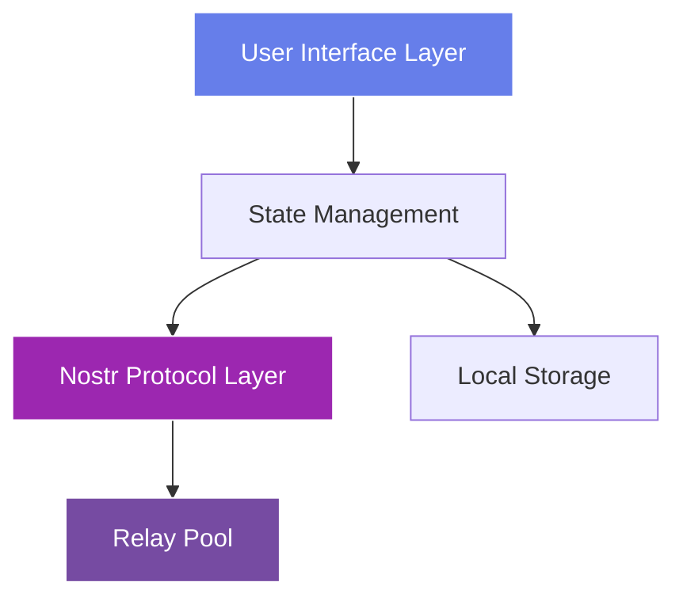

# Module 5: Building Your First Nostr Client

!!! info "Module Overview"
    **Duration**: 6-8 hours  
    **Level**: Intermediate  
    **Prerequisites**: Modules 1-4 completed  
    **Goal**: Build a complete, production-ready Nostr client application from scratch

## 📋 Learning Objectives

By the end of this module, you will:

- ✅ Design and architect a complete Nostr client application
- ✅ Implement all core client features (posting, reading, profiles)
- ✅ Create an intuitive and responsive user interface
- ✅ Handle real-time updates and WebSocket connections
- ✅ Implement proper error handling and edge cases
- ✅ Deploy your client to production

## 5.1 Planning Your Client

### Defining Features

Before writing code, let's define what features our client will have:

**Core Features (Must-Have)**
- ✅ User authentication (key generation/import)
- ✅ Create and publish notes
- ✅ View global feed
- ✅ View user profiles
- ✅ Follow/unfollow users
- ✅ React to posts (likes)
- ✅ Reply to posts

**Advanced Features (Nice-to-Have)**
- 🔄 Thread visualization
- 🔄 Media uploads
- 🔄 Search functionality
- 🔄 Relay management
- 🔄 Notifications

### Architecture Overview



## 5.2 Project Setup

### Technology Stack

We'll use modern web technologies:

- **Frontend**: HTML5, CSS3, JavaScript (ES6+)
- **Build Tool**: Vite
- **Library**: nostr-tools
- **Styling**: Custom CSS with CSS Variables
- **State**: Vanilla JS with Proxy for reactivity

### Initialize Project

```bash
# Create project directory
mkdir nostr-client-pro
cd nostr-client-pro

# Initialize npm
npm init -y

# Install dependencies
npm install nostr-tools
npm install --save-dev vite

# Create project structure
mkdir -p src/{components,utils,services,styles}
touch src/main.js src/index.html
```

### Project Structure

```
nostr-client-pro/
├── src/
│   ├── components/
│   │   ├── Auth.js          # Authentication component
│   │   ├── Feed.js          # Feed display component
│   │   ├── Composer.js      # Note composer
│   │   ├── Profile.js       # User profile
│   │   └── Header.js        # App header
│   ├── services/
│   │   ├── NostrService.js  # Nostr protocol layer
│   │   ├── RelayPool.js     # Relay connection manager
│   │   └── Storage.js       # LocalStorage wrapper
│   ├── utils/
│   │   ├── helpers.js       # Utility functions
│   │   └── constants.js     # App constants
│   ├── styles/
│   │   ├── main.css         # Main styles
│   │   ├── components.css   # Component styles
│   │   └── theme.css        # Theme variables
│   ├── main.js              # App entry point
│   └── index.html           # HTML template
├── package.json
└── vite.config.js
```

## 5.3 Building the Core Services

### NostrService - Protocol Layer

Create `src/services/NostrService.js`:

```javascript
import { generatePrivateKey, getPublicKey, finishEvent, nip19 } from 'nostr-tools'

class NostrService {
  constructor() {
    this.privateKey = null
    this.publicKey = null
  }

  // Generate new keys
  generateKeys() {
    this.privateKey = generatePrivateKey()
    this.publicKey = getPublicKey(this.privateKey)
    return {
      privateKey: this.privateKey,
      publicKey: this.publicKey,
      npub: nip19.npubEncode(this.publicKey),
      nsec: nip19.nsecEncode(this.privateKey)
    }
  }

  // Import keys
  importKeys(privateKey) {
    // Handle both hex and nsec formats
    if (privateKey.startsWith('nsec')) {
      const decoded = nip19.decode(privateKey)
      this.privateKey = decoded.data
    } else {
      this.privateKey = privateKey
    }
    this.publicKey = getPublicKey(this.privateKey)
    return this.getKeys()
  }

  // Get current keys
  getKeys() {
    if (!this.publicKey) return null
    return {
      publicKey: this.publicKey,
      npub: nip19.npubEncode(this.publicKey)
    }
  }

  // Create a text note
  createTextNote(content, tags = []) {
    if (!this.privateKey) throw new Error('No keys loaded')
    
    return finishEvent({
      kind: 1,
      created_at: Math.floor(Date.now() / 1000),
      tags: tags,
      content: content,
    }, this.privateKey)
  }

  // Create a reply
  createReply(content, originalEvent) {
    const tags = [
      ['e', originalEvent.id, '', 'reply'],
      ['p', originalEvent.pubkey]
    ]
    
    // Add root tag if this is a nested reply
    const rootTag = originalEvent.tags.find(t => t[0] === 'e' && t[3] === 'root')
    if (rootTag) {
      tags.unshift(['e', rootTag[1], '', 'root'])
    } else {
      tags[0][3] = 'root'
    }

    return this.createTextNote(content, tags)
  }

  // Create a reaction
  createReaction(eventId, pubkey, emoji = '+') {
    if (!this.privateKey) throw new Error('No keys loaded')
    
    return finishEvent({
      kind: 7,
      created_at: Math.floor(Date.now() / 1000),
      tags: [
        ['e', eventId],
        ['p', pubkey]
      ],
      content: emoji,
    }, this.privateKey)
  }

  // Create/update profile
  createProfile(metadata) {
    if (!this.privateKey) throw new Error('No keys loaded')
    
    return finishEvent({
      kind: 0,
      created_at: Math.floor(Date.now() / 1000),
      tags: [],
      content: JSON.stringify(metadata),
    }, this.privateKey)
  }

  // Create follow list
  createFollowList(pubkeys) {
    if (!this.privateKey) throw new Error('No keys loaded')
    
    const tags = pubkeys.map(pk => ['p', pk])
    
    return finishEvent({
      kind: 3,
      created_at: Math.floor(Date.now() / 1000),
      tags: tags,
      content: '',
    }, this.privateKey)
  }
}

export default new NostrService()
```

### RelayPool - Connection Manager

Create `src/services/RelayPool.js`:

```javascript
import { relayInit } from 'nostr-tools'

class RelayPool {
  constructor() {
    this.relays = new Map()
    this.subscriptions = new Map()
    this.eventHandlers = new Map()
  }

  // Add and connect to a relay
  async addRelay(url) {
    if (this.relays.has(url)) {
      return this.relays.get(url)
    }

    const relay = relayInit(url)
    
    relay.on('connect', () => {
      console.log(`✅ Connected to ${url}`)
      this.emit('relay:connect', { url })
    })

    relay.on('disconnect', () => {
      console.log(`❌ Disconnected from ${url}`)
      this.emit('relay:disconnect', { url })
    })

    relay.on('error', () => {
      console.log(`⚠️ Error with ${url}`)
      this.emit('relay:error', { url })
    })

    try {
      await relay.connect()
      this.relays.set(url, relay)
      return relay
    } catch (error) {
      console.error(`Failed to connect to ${url}:`, error)
      throw error
    }
  }

  // Remove a relay
  removeRelay(url) {
    const relay = this.relays.get(url)
    if (relay) {
      relay.close()
      this.relays.delete(url)
    }
  }

  // Subscribe to events
  subscribe(filters, onEvent, subId = null) {
    const id = subId || `sub_${Date.now()}`
    const subs = []

    for (const [url, relay] of this.relays) {
      if (relay.status !== 1) continue // Only connected relays
      
      try {
        const sub = relay.sub(filters)
        
        sub.on('event', (event) => {
          onEvent(event, url)
        })

        sub.on('eose', () => {
          this.emit('subscription:eose', { id, url })
        })

        subs.push({ relay: url, sub })
      } catch (error) {
        console.error(`Subscription error on ${url}:`, error)
      }
    }

    this.subscriptions.set(id, subs)
    return id
  }

  // Unsubscribe
  unsubscribe(subId) {
    const subs = this.subscriptions.get(subId)
    if (subs) {
      subs.forEach(({ sub }) => sub.unsub())
      this.subscriptions.delete(subId)
    }
  }

  // Publish event to all relays
  async publish(event) {
    const results = []

    for (const [url, relay] of this.relays) {
      if (relay.status !== 1) continue

      try {
        const pub = await relay.publish(event)
        results.push({ url, success: true, pub })
      } catch (error) {
        results.push({ url, success: false, error })
      }
    }

    return results
  }

  // Get connected relays
  getConnectedRelays() {
    return Array.from(this.relays.entries())
      .filter(([_, relay]) => relay.status === 1)
      .map(([url]) => url)
  }

  // Event emitter
  on(event, handler) {
    if (!this.eventHandlers.has(event)) {
      this.eventHandlers.set(event, [])
    }
    this.eventHandlers.get(event).push(handler)
  }

  emit(event, data) {
    const handlers = this.eventHandlers.get(event)
    if (handlers) {
      handlers.forEach(handler => handler(data))
    }
  }

  // Cleanup
  close() {
    this.subscriptions.forEach((_, id) => this.unsubscribe(id))
    this.relays.forEach(relay => relay.close())
    this.relays.clear()
  }
}

export default new RelayPool()
```

### Storage Service

Create `src/services/Storage.js`:

```javascript
class StorageService {
  constructor() {
    this.prefix = 'nostr_client_'
  }

  // Save data
  set(key, value) {
    try {
      const serialized = JSON.stringify(value)
      localStorage.setItem(this.prefix + key, serialized)
      return true
    } catch (error) {
      console.error('Storage error:', error)
      return false
    }
  }

  // Get data
  get(key) {
    try {
      const item = localStorage.getItem(this.prefix + key)
      return item ? JSON.parse(item) : null
    } catch (error) {
      console.error('Storage error:', error)
      return null
    }
  }

  // Remove data
  remove(key) {
    localStorage.removeItem(this.prefix + key)
  }

  // Clear all app data
  clear() {
    const keys = Object.keys(localStorage)
    keys.forEach(key => {
      if (key.startsWith(this.prefix)) {
        localStorage.removeItem(key)
      }
    })
  }

  // Specific storage methods
  saveKeys(keys) {
    return this.set('keys', keys)
  }

  getKeys() {
    return this.get('keys')
  }

  saveRelays(relays) {
    return this.set('relays', relays)
  }

  getRelays() {
    return this.get('relays') || [
      'wss://relay.damus.io',
      'wss://nos.lol',
      'wss://relay.snort.social',
      'wss://relay.nostr.band'
    ]
  }

  saveProfile(pubkey, profile) {
    const profiles = this.get('profiles') || {}
    profiles[pubkey] = profile
    return this.set('profiles', profiles)
  }

  getProfile(pubkey) {
    const profiles = this.get('profiles') || {}
    return profiles[pubkey]
  }

  saveFollowing(following) {
    return this.set('following', following)
  }

  getFollowing() {
    return this.get('following') || []
  }
}

export default new StorageService()
```

## 5.4 State Management & Reactivity

### Creating a Reactive State System

Before building UI components, implement a simple reactive state management system:

```javascript
// src/utils/state.js
class ReactiveState {
  constructor(initialState = {}) {
    this.listeners = new Map();
    this.state = new Proxy(initialState, {
      set: (target, property, value) => {
        const oldValue = target[property];
        target[property] = value;
        
        // Notify listeners
        if (oldValue !== value) {
          this.notify(property, value, oldValue);
        }
        
        return true;
      }
    });
  }
  
  // Subscribe to state changes
  subscribe(property, callback) {
    if (!this.listeners.has(property)) {
      this.listeners.set(property, new Set());
    }
    this.listeners.get(property).add(callback);
    
    // Return unsubscribe function
    return () => {
      const listeners = this.listeners.get(property);
      if (listeners) {
        listeners.delete(callback);
      }
    };
  }
  
  // Notify all listeners of a property
  notify(property, newValue, oldValue) {
    const listeners = this.listeners.get(property);
    if (listeners) {
      listeners.forEach(callback => callback(newValue, oldValue));
    }
    
    // Also notify global listeners
    const globalListeners = this.listeners.get('*');
    if (globalListeners) {
      globalListeners.forEach(callback => 
        callback(property, newValue, oldValue)
      );
    }
  }
  
  // Get current state value
  get(property) {
    return this.state[property];
  }
  
  // Set state value
  set(property, value) {
    this.state[property] = value;
  }
  
  // Batch updates
  update(updates) {
    Object.entries(updates).forEach(([key, value]) => {
      this.state[key] = value;
    });
  }
}

// Create global app state
const appState = new ReactiveState({
  user: null,
  authenticated: false,
  loading: false,
  events: [],
  profiles: new Map(),
  following: new Set(),
  relays: [],
  currentView: 'feed',
  error: null
});

export default appState;
```

### Event Cache & Deduplication

```javascript
// src/utils/eventCache.js
class EventCache {
  constructor() {
    this.events = new Map();
    this.eventsByKind = new Map();
    this.eventsByAuthor = new Map();
    this.maxSize = 10000; // Prevent memory issues
  }
  
  add(event) {
    // Check if event already exists
    if (this.events.has(event.id)) {
      return false; // Duplicate
    }
    
    // Add to main cache
    this.events.set(event.id, event);
    
    // Index by kind
    if (!this.eventsByKind.has(event.kind)) {
      this.eventsByKind.set(event.kind, new Set());
    }
    this.eventsByKind.get(event.kind).add(event.id);
    
    // Index by author
    if (!this.eventsByAuthor.has(event.pubkey)) {
      this.eventsByAuthor.set(event.pubkey, new Set());
    }
    this.eventsByAuthor.get(event.pubkey).add(event.id);
    
    // Enforce max size
    if (this.events.size > this.maxSize) {
      this.evictOldest();
    }
    
    return true; // New event added
  }
  
  get(eventId) {
    return this.events.get(eventId);
  }
  
  getByKind(kind) {
    const eventIds = this.eventsByKind.get(kind) || new Set();
    return Array.from(eventIds).map(id => this.events.get(id));
  }
  
  getByAuthor(pubkey) {
    const eventIds = this.eventsByAuthor.get(pubkey) || new Set();
    return Array.from(eventIds).map(id => this.events.get(id));
  }
  
  evictOldest() {
    // Find oldest event
    let oldest = null;
    for (const event of this.events.values()) {
      if (!oldest || event.created_at < oldest.created_at) {
        oldest = event;
      }
    }
    
    if (oldest) {
      this.remove(oldest.id);
    }
  }
  
  remove(eventId) {
    const event = this.events.get(eventId);
    if (!event) return;
    
    this.events.delete(eventId);
    
    // Remove from indices
    const kindSet = this.eventsByKind.get(event.kind);
    if (kindSet) kindSet.delete(eventId);
    
    const authorSet = this.eventsByAuthor.get(event.pubkey);
    if (authorSet) authorSet.delete(eventId);
  }
  
  clear() {
    this.events.clear();
    this.eventsByKind.clear();
    this.eventsByAuthor.clear();
  }
  
  // Get sorted feed
  getFeed(limit = 50) {
    return Array.from(this.events.values())
      .filter(e => e.kind === 1) // Only text notes
      .sort((a, b) => b.created_at - a.created_at)
      .slice(0, limit);
  }
}

export default new EventCache();
```

### Profile Cache

```javascript
// src/utils/profileCache.js
class ProfileCache {
  constructor() {
    this.profiles = new Map();
    this.pending = new Map(); // Prevent duplicate fetches
  }
  
  async get(pubkey, pool) {
    // Return cached if available
    if (this.profiles.has(pubkey)) {
      return this.profiles.get(pubkey);
    }
    
    // Check if already fetching
    if (this.pending.has(pubkey)) {
      return this.pending.get(pubkey);
    }
    
    // Fetch profile
    const promise = this.fetch(pubkey, pool);
    this.pending.set(pubkey, promise);
    
    try {
      const profile = await promise;
      this.profiles.set(pubkey, profile);
      return profile;
    } finally {
      this.pending.delete(pubkey);
    }
  }
  
  async fetch(pubkey, pool) {
    const events = await pool.query({
      kinds: [0],
      authors: [pubkey],
      limit: 1
    });
    
    if (events.length > 0) {
      try {
        return JSON.parse(events[0].content);
      } catch {
        return this.getDefaultProfile(pubkey);
      }
    }
    
    return this.getDefaultProfile(pubkey);
  }
  
  getDefaultProfile(pubkey) {
    return {
      name: pubkey.substring(0, 8) + '...',
      display_name: pubkey.substring(0, 8),
      about: '',
      picture: '',
      pubkey
    };
  }
  
  set(pubkey, profile) {
    this.profiles.set(pubkey, profile);
  }
  
  clear() {
    this.profiles.clear();
    this.pending.clear();
  }
}

export default new ProfileCache();
```

## 5.6 Error Handling & Resilience

### Comprehensive Error Handler

```javascript
// src/utils/errorHandler.js
class ErrorHandler {
  constructor() {
    this.errors = [];
    this.maxErrors = 100;
    this.listeners = new Set();
  }
  
  handle(error, context = {}) {
    const errorObj = {
      message: error.message || String(error),
      stack: error.stack,
      timestamp: Date.now(),
      context,
      type: this.categorizeError(error)
    };
    
    this.errors.push(errorObj);
    if (this.errors.length > this.maxErrors) {
      this.errors.shift();
    }
    
    // Notify listeners
    this.notify(errorObj);
    
    return errorObj;
  }
  
  categorizeError(error) {
    if (error.message?.includes('relay')) return 'RELAY_ERROR';
    if (error.message?.includes('signature')) return 'CRYPTO_ERROR';
    if (error.message?.includes('network')) return 'NETWORK_ERROR';
    if (error.message?.includes('timeout')) return 'TIMEOUT_ERROR';
    return 'UNKNOWN_ERROR';
  }
  
  subscribe(listener) {
    this.listeners.add(listener);
    return () => this.listeners.delete(listener);
  }
  
  notify(error) {
    this.listeners.forEach(listener => listener(error));
  }
}

export default new ErrorHandler();
```

### Retry Logic

```javascript
// src/utils/retryHandler.js
class RetryHandler {
  async retry(fn, options = {}) {
    const { maxRetries = 3, baseDelay = 1000 } = options;
    let lastError;
    
    for (let i = 0; i <= maxRetries; i++) {
      try {
        return await fn();
      } catch (error) {
        lastError = error;
        if (i < maxRetries) {
          await new Promise(r => setTimeout(r, baseDelay * Math.pow(2, i)));
        }
      }
    }
    throw lastError;
  }
}

export default new RetryHandler();
```

## 5.7 Building the UI Components

### Main Application

Create `src/main.js`:

```javascript
import NostrService from './services/NostrService.js'
import RelayPool from './services/RelayPool.js'
import Storage from './services/Storage.js'
import './styles/main.css'

class NostrClient {
  constructor() {
    this.state = {
      authenticated: false,
      loading: false,
      currentView: 'feed',
      events: new Map(),
      profiles: new Map(),
      following: new Set()
    }

    this.init()
  }

  async init() {
    // Check for saved keys
    const savedKeys = Storage.getKeys()
    if (savedKeys) {
      NostrService.importKeys(savedKeys.privateKey)
      this.state.authenticated = true
    }

    // Connect to relays
    const relays = Storage.getRelays()
    for (const relay of relays) {
      try {
        await RelayPool.addRelay(relay)
      } catch (error) {
        console.error(`Failed to add relay ${relay}`)
      }
    }

    // Load following list
    const following = Storage.getFollowing()
    this.state.following = new Set(following)

    // Setup UI
    this.setupUI()

    if (this.state.authenticated) {
      this.showFeed()
      this.subscribeToFeed()
    } else {
      this.showAuth()
    }
  }

  setupUI() {
    // We'll implement the actual UI in the next section
    console.log('Setting up UI...')
  }

  showAuth() {
    document.getElementById('app').innerHTML = `
      <div class="auth-container">
        <h1>🔐 Welcome to Nostr</h1>
        <button id="generate-keys">Generate New Keys</button>
        <button id="import-keys">Import Existing Keys</button>
      </div>
    `

    document.getElementById('generate-keys').onclick = () => this.generateKeys()
    document.getElementById('import-keys').onclick = () => this.importKeys()
  }

  generateKeys() {
    const keys = NostrService.generateKeys()
    Storage.saveKeys(keys)
    this.state.authenticated = true
    
    alert(`Your keys have been generated!\n\nNPUB: ${keys.npub}\n\n⚠️ Save your NSEC key securely: ${keys.nsec}`)
    
    this.showFeed()
    this.subscribeToFeed()
  }

  importKeys() {
    const nsec = prompt('Enter your NSEC key:')
    if (nsec) {
      try {
        const keys = NostrService.importKeys(nsec)
        Storage.saveKeys({ privateKey: NostrService.privateKey })
        this.state.authenticated = true
        this.showFeed()
        this.subscribeToFeed()
      } catch (error) {
        alert('Invalid key format')
      }
    }
  }

  showFeed() {
    // We'll implement the full feed UI next
    console.log('Showing feed...')
  }

  subscribeToFeed() {
    const filters = [
      { kinds: [1], limit: 50 },
      { kinds: [0], limit: 100 },
      { kinds: [3], authors: [NostrService.publicKey], limit: 1 }
    ]

    RelayPool.subscribe(filters, (event) => {
      this.handleEvent(event)
    })
  }

  handleEvent(event) {
    switch (event.kind) {
      case 0: // Profile
        this.state.profiles.set(event.pubkey, JSON.parse(event.content))
        break
      case 1: // Text note
        this.state.events.set(event.id, event)
        break
      case 3: // Contacts
        if (event.pubkey === NostrService.publicKey) {
          const following = event.tags.filter(t => t[0] === 'p').map(t => t[1])
          this.state.following = new Set(following)
          Storage.saveFollowing(following)
        }
        break
    }
  }
}

// Initialize app
new NostrClient()
```

## 5.5 Practical Exercises

### Exercise 1: Complete the Feed UI
Build a fully functional feed display:
1. Render events in chronological order
2. Show author profiles with avatars
3. Display timestamps relative to now
4. Add infinite scroll/pagination

### Exercise 2: Implement Posting
Create a note composer:
1. Text input with character counter
2. Image attachment support
3. Tag suggestions (@mentions)
4. Draft saving to localStorage

### Exercise 3: Add Interactions
Implement social features:
1. Like/reaction buttons
2. Reply threading
3. Repost functionality
4. Share options

### Exercise 4: Profile Management
Build profile functionality:
1. View user profiles
2. Edit your own profile
3. Follow/unfollow users
4. Display follower counts

### Exercise 5: Error Handling & UX
Polish the experience:
1. Loading states for all async operations
2. Error messages with retry options
3. Offline detection and handling
4. Success notifications

## 📝 Module 5 Quiz

1. **What are the three main responsibilities of a Nostr client?**
   <details>
   <summary>Answer</summary>
   1) Manage cryptographic keys securely, 2) Connect to and communicate with relays, 3) Create, sign, and display events with a user-friendly interface
   </details>

2. **Why should you connect to multiple relays in a client?**
   <details>
   <summary>Answer</summary>
   For redundancy (if one goes down), better content discovery (different relays have different events), censorship resistance, and improved performance
   </details>

3. **What's the recommended way to store private keys in a client?**
   <details>
   <summary>Answer</summary>
   Never store them in your app - use NIP-07 browser extensions that keep keys secure and only provide signing capabilities to the app
   </details>

4. **How do you ensure you don't miss events when subscribing?**
   <details>
   <summary>Answer</summary>
   Use appropriate filters with `since` timestamps, handle the EOSE message to know when historical events are complete, and maintain subscriptions for real-time updates
   </details>

5. **What state management considerations are important for Nostr clients?**
   <details>
   <summary>Answer</summary>
   Event deduplication across relays, caching for performance, maintaining connection state, handling subscription lifecycle, and persisting user preferences
   </details>

## 🎯 Module 5 Checkpoint

Before moving to Module 6, ensure you have:

- [ ] Built a working relay connection manager
- [ ] Implemented event subscription and querying
- [ ] Created a basic UI to display events
- [ ] Integrated NIP-07 for key management
- [ ] Published at least one event from your client
- [ ] Handled real-time event updates
- [ ] Implemented proper error handling
- [ ] Tested your client with multiple relays

## 📚 Additional Resources

- [nostr-tools Documentation](https://github.com/nbd-wtf/nostr-tools)
- [Nostr Client Development Guide](https://github.com/nostr-protocol/nostr)
- [React Nostr Hooks](https://github.com/jesterui/react-nostr-hooks)
- [Vue Nostr Composables](https://github.com/supertestnet/vue-nostr)
- Example Clients: [Damus](https://github.com/damus-io/damus), [Snort](https://github.com/v0l/snort), [Nostrudel](https://github.com/hzrd149/nostrudel)

## 💬 Community Discussion

Join our Discord to discuss Module 5:
- Share your client projects
- Get help debugging relay connections
- Discuss UI/UX best practices
- Show off your implementations

---

!!! success "Congratulations!"
    You've built your first Nostr client! You understand how to connect to relays, manage events, and create user interfaces for the Nostr protocol. You're ready to explore advanced NIPs and features!

[Continue to Module 6: Advanced Event Types & NIPs →](module-06-advanced-nips.md)
