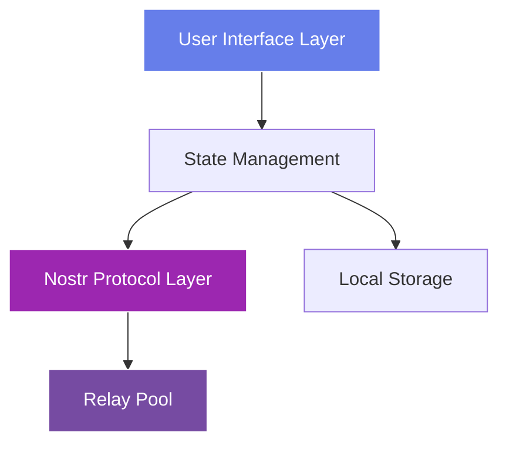

# Module 5: Building Your First Nostr Client

!!! info "Module Overview"
    **Duration**: 6-8 hours  
    **Level**: Intermediate  
    **Prerequisites**: Modules 1-4 completed  
    **Goal**: Build a complete, production-ready Nostr client application from scratch

## 📋 Learning Objectives

By the end of this module, you will:

- ✅ Design and architect a complete Nostr client application
- ✅ Implement all core client features (posting, reading, profiles)
- ✅ Create an intuitive and responsive user interface
- ✅ Handle real-time updates and WebSocket connections
- ✅ Implement proper error handling and edge cases
- ✅ Deploy your client to production

## 5.1 Planning Your Client

### Defining Features

Before writing code, let's define what features our client will have:

**Core Features (Must-Have)**
- ✅ User authentication (key generation/import)
- ✅ Create and publish notes
- ✅ View global feed
- ✅ View user profiles
- ✅ Follow/unfollow users
- ✅ React to posts (likes)
- ✅ Reply to posts

**Advanced Features (Nice-to-Have)**
- 🔄 Thread visualization
- 🔄 Media uploads
- 🔄 Search functionality
- 🔄 Relay management
- 🔄 Notifications

### Architecture Overview



## 5.2 Project Setup

### Technology Stack

We'll use modern web technologies:

- **Frontend**: HTML5, CSS3, JavaScript (ES6+)
- **Build Tool**: Vite
- **Library**: nostr-tools
- **Styling**: Custom CSS with CSS Variables
- **State**: Vanilla JS with Proxy for reactivity

### Initialize Project

```bash
# Create project directory
mkdir nostr-client-pro
cd nostr-client-pro

# Initialize npm
npm init -y

# Install dependencies
npm install nostr-tools
npm install --save-dev vite

# Create project structure
mkdir -p src/{components,utils,services,styles}
touch src/main.js src/index.html
```

### Project Structure

```
nostr-client-pro/
├── src/
│   ├── components/
│   │   ├── Auth.js          # Authentication component
│   │   ├── Feed.js          # Feed display component
│   │   ├── Composer.js      # Note composer
│   │   ├── Profile.js       # User profile
│   │   └── Header.js        # App header
│   ├── services/
│   │   ├── NostrService.js  # Nostr protocol layer
│   │   ├── RelayPool.js     # Relay connection manager
│   │   └── Storage.js       # LocalStorage wrapper
│   ├── utils/
│   │   ├── helpers.js       # Utility functions
│   │   └── constants.js     # App constants
│   ├── styles/
│   │   ├── main.css         # Main styles
│   │   ├── components.css   # Component styles
│   │   └── theme.css        # Theme variables
│   ├── main.js              # App entry point
│   └── index.html           # HTML template
├── package.json
└── vite.config.js
```

## 5.3 Building the Core Services

### NostrService - Protocol Layer

Create `src/services/NostrService.js`:

```javascript
import { generatePrivateKey, getPublicKey, finishEvent, nip19 } from 'nostr-tools'

class NostrService {
  constructor() {
    this.privateKey = null
    this.publicKey = null
  }

  // Generate new keys
  generateKeys() {
    this.privateKey = generatePrivateKey()
    this.publicKey = getPublicKey(this.privateKey)
    return {
      privateKey: this.privateKey,
      publicKey: this.publicKey,
      npub: nip19.npubEncode(this.publicKey),
      nsec: nip19.nsecEncode(this.privateKey)
    }
  }

  // Import keys
  importKeys(privateKey) {
    // Handle both hex and nsec formats
    if (privateKey.startsWith('nsec')) {
      const decoded = nip19.decode(privateKey)
      this.privateKey = decoded.data
    } else {
      this.privateKey = privateKey
    }
    this.publicKey = getPublicKey(this.privateKey)
    return this.getKeys()
  }

  // Get current keys
  getKeys() {
    if (!this.publicKey) return null
    return {
      publicKey: this.publicKey,
      npub: nip19.npubEncode(this.publicKey)
    }
  }

  // Create a text note
  createTextNote(content, tags = []) {
    if (!this.privateKey) throw new Error('No keys loaded')
    
    return finishEvent({
      kind: 1,
      created_at: Math.floor(Date.now() / 1000),
      tags: tags,
      content: content,
    }, this.privateKey)
  }

  // Create a reply
  createReply(content, originalEvent) {
    const tags = [
      ['e', originalEvent.id, '', 'reply'],
      ['p', originalEvent.pubkey]
    ]
    
    // Add root tag if this is a nested reply
    const rootTag = originalEvent.tags.find(t => t[0] === 'e' && t[3] === 'root')
    if (rootTag) {
      tags.unshift(['e', rootTag[1], '', 'root'])
    } else {
      tags[0][3] = 'root'
    }

    return this.createTextNote(content, tags)
  }

  // Create a reaction
  createReaction(eventId, pubkey, emoji = '+') {
    if (!this.privateKey) throw new Error('No keys loaded')
    
    return finishEvent({
      kind: 7,
      created_at: Math.floor(Date.now() / 1000),
      tags: [
        ['e', eventId],
        ['p', pubkey]
      ],
      content: emoji,
    }, this.privateKey)
  }

  // Create/update profile
  createProfile(metadata) {
    if (!this.privateKey) throw new Error('No keys loaded')
    
    return finishEvent({
      kind: 0,
      created_at: Math.floor(Date.now() / 1000),
      tags: [],
      content: JSON.stringify(metadata),
    }, this.privateKey)
  }

  // Create follow list
  createFollowList(pubkeys) {
    if (!this.privateKey) throw new Error('No keys loaded')
    
    const tags = pubkeys.map(pk => ['p', pk])
    
    return finishEvent({
      kind: 3,
      created_at: Math.floor(Date.now() / 1000),
      tags: tags,
      content: '',
    }, this.privateKey)
  }
}

export default new NostrService()
```

### RelayPool - Connection Manager

Create `src/services/RelayPool.js`:

```javascript
import { relayInit } from 'nostr-tools'

class RelayPool {
  constructor() {
    this.relays = new Map()
    this.subscriptions = new Map()
    this.eventHandlers = new Map()
  }

  // Add and connect to a relay
  async addRelay(url) {
    if (this.relays.has(url)) {
      return this.relays.get(url)
    }

    const relay = relayInit(url)
    
    relay.on('connect', () => {
      console.log(`✅ Connected to ${url}`)
      this.emit('relay:connect', { url })
    })

    relay.on('disconnect', () => {
      console.log(`❌ Disconnected from ${url}`)
      this.emit('relay:disconnect', { url })
    })

    relay.on('error', () => {
      console.log(`⚠️ Error with ${url}`)
      this.emit('relay:error', { url })
    })

    try {
      await relay.connect()
      this.relays.set(url, relay)
      return relay
    } catch (error) {
      console.error(`Failed to connect to ${url}:`, error)
      throw error
    }
  }

  // Remove a relay
  removeRelay(url) {
    const relay = this.relays.get(url)
    if (relay) {
      relay.close()
      this.relays.delete(url)
    }
  }

  // Subscribe to events
  subscribe(filters, onEvent, subId = null) {
    const id = subId || `sub_${Date.now()}`
    const subs = []

    for (const [url, relay] of this.relays) {
      if (relay.status !== 1) continue // Only connected relays
      
      try {
        const sub = relay.sub(filters)
        
        sub.on('event', (event) => {
          onEvent(event, url)
        })

        sub.on('eose', () => {
          this.emit('subscription:eose', { id, url })
        })

        subs.push({ relay: url, sub })
      } catch (error) {
        console.error(`Subscription error on ${url}:`, error)
      }
    }

    this.subscriptions.set(id, subs)
    return id
  }

  // Unsubscribe
  unsubscribe(subId) {
    const subs = this.subscriptions.get(subId)
    if (subs) {
      subs.forEach(({ sub }) => sub.unsub())
      this.subscriptions.delete(subId)
    }
  }

  // Publish event to all relays
  async publish(event) {
    const results = []

    for (const [url, relay] of this.relays) {
      if (relay.status !== 1) continue

      try {
        const pub = await relay.publish(event)
        results.push({ url, success: true, pub })
      } catch (error) {
        results.push({ url, success: false, error })
      }
    }

    return results
  }

  // Get connected relays
  getConnectedRelays() {
    return Array.from(this.relays.entries())
      .filter(([_, relay]) => relay.status === 1)
      .map(([url]) => url)
  }

  // Event emitter
  on(event, handler) {
    if (!this.eventHandlers.has(event)) {
      this.eventHandlers.set(event, [])
    }
    this.eventHandlers.get(event).push(handler)
  }

  emit(event, data) {
    const handlers = this.eventHandlers.get(event)
    if (handlers) {
      handlers.forEach(handler => handler(data))
    }
  }

  // Cleanup
  close() {
    this.subscriptions.forEach((_, id) => this.unsubscribe(id))
    this.relays.forEach(relay => relay.close())
    this.relays.clear()
  }
}

export default new RelayPool()
```

### Storage Service

Create `src/services/Storage.js`:

```javascript
class StorageService {
  constructor() {
    this.prefix = 'nostr_client_'
  }

  // Save data
  set(key, value) {
    try {
      const serialized = JSON.stringify(value)
      localStorage.setItem(this.prefix + key, serialized)
      return true
    } catch (error) {
      console.error('Storage error:', error)
      return false
    }
  }

  // Get data
  get(key) {
    try {
      const item = localStorage.getItem(this.prefix + key)
      return item ? JSON.parse(item) : null
    } catch (error) {
      console.error('Storage error:', error)
      return null
    }
  }

  // Remove data
  remove(key) {
    localStorage.removeItem(this.prefix + key)
  }

  // Clear all app data
  clear() {
    const keys = Object.keys(localStorage)
    keys.forEach(key => {
      if (key.startsWith(this.prefix)) {
        localStorage.removeItem(key)
      }
    })
  }

  // Specific storage methods
  saveKeys(keys) {
    return this.set('keys', keys)
  }

  getKeys() {
    return this.get('keys')
  }

  saveRelays(relays) {
    return this.set('relays', relays)
  }

  getRelays() {
    return this.get('relays') || [
      'wss://relay.damus.io',
      'wss://nos.lol',
      'wss://relay.snort.social',
      'wss://relay.nostr.band'
    ]
  }

  saveProfile(pubkey, profile) {
    const profiles = this.get('profiles') || {}
    profiles[pubkey] = profile
    return this.set('profiles', profiles)
  }

  getProfile(pubkey) {
    const profiles = this.get('profiles') || {}
    return profiles[pubkey]
  }

  saveFollowing(following) {
    return this.set('following', following)
  }

  getFollowing() {
    return this.get('following') || []
  }
}

export default new StorageService()
```

## 5.4 Building the UI Components

### Main Application

Create `src/main.js`:

```javascript
import NostrService from './services/NostrService.js'
import RelayPool from './services/RelayPool.js'
import Storage from './services/Storage.js'
import './styles/main.css'

class NostrClient {
  constructor() {
    this.state = {
      authenticated: false,
      loading: false,
      currentView: 'feed',
      events: new Map(),
      profiles: new Map(),
      following: new Set()
    }

    this.init()
  }

  async init() {
    // Check for saved keys
    const savedKeys = Storage.getKeys()
    if (savedKeys) {
      NostrService.importKeys(savedKeys.privateKey)
      this.state.authenticated = true
    }

    // Connect to relays
    const relays = Storage.getRelays()
    for (const relay of relays) {
      try {
        await RelayPool.addRelay(relay)
      } catch (error) {
        console.error(`Failed to add relay ${relay}`)
      }
    }

    // Load following list
    const following = Storage.getFollowing()
    this.state.following = new Set(following)

    // Setup UI
    this.setupUI()

    if (this.state.authenticated) {
      this.showFeed()
      this.subscribeToFeed()
    } else {
      this.showAuth()
    }
  }

  setupUI() {
    // We'll implement the actual UI in the next section
    console.log('Setting up UI...')
  }

  showAuth() {
    document.getElementById('app').innerHTML = `
      <div class="auth-container">
        <h1>🔐 Welcome to Nostr</h1>
        <button id="generate-keys">Generate New Keys</button>
        <button id="import-keys">Import Existing Keys</button>
      </div>
    `

    document.getElementById('generate-keys').onclick = () => this.generateKeys()
    document.getElementById('import-keys').onclick = () => this.importKeys()
  }

  generateKeys() {
    const keys = NostrService.generateKeys()
    Storage.saveKeys(keys)
    this.state.authenticated = true
    
    alert(`Your keys have been generated!\n\nNPUB: ${keys.npub}\n\n⚠️ Save your NSEC key securely: ${keys.nsec}`)
    
    this.showFeed()
    this.subscribeToFeed()
  }

  importKeys() {
    const nsec = prompt('Enter your NSEC key:')
    if (nsec) {
      try {
        const keys = NostrService.importKeys(nsec)
        Storage.saveKeys({ privateKey: NostrService.privateKey })
        this.state.authenticated = true
        this.showFeed()
        this.subscribeToFeed()
      } catch (error) {
        alert('Invalid key format')
      }
    }
  }

  showFeed() {
    // We'll implement the full feed UI next
    console.log('Showing feed...')
  }

  subscribeToFeed() {
    const filters = [
      { kinds: [1], limit: 50 },
      { kinds: [0], limit: 100 },
      { kinds: [3], authors: [NostrService.publicKey], limit: 1 }
    ]

    RelayPool.subscribe(filters, (event) => {
      this.handleEvent(event)
    })
  }

  handleEvent(event) {
    switch (event.kind) {
      case 0: // Profile
        this.state.profiles.set(event.pubkey, JSON.parse(event.content))
        break
      case 1: // Text note
        this.state.events.set(event.id, event)
        break
      case 3: // Contacts
        if (event.pubkey === NostrService.publicKey) {
          const following = event.tags.filter(t => t[0] === 'p').map(t => t[1])
          this.state.following = new Set(following)
          Storage.saveFollowing(following)
        }
        break
    }
  }
}

// Initialize app
new NostrClient()
```

## 5.5 Exercises

!!! example "Practice Tasks"
    
    1. **Add Error Handling**: Implement comprehensive error handling in RelayPool
    2. **Optimize Performance**: Add event deduplication logic
    3. **Add Features**: Implement the Composer component for creating notes
    4. **Test Edge Cases**: Handle offline scenarios and reconnection

## 5.6 Checkpoint

Before moving on, ensure you can:

- [ ] Generate and import Nostr keys
- [ ] Connect to multiple relays
- [ ] Subscribe to and receive events
- [ ] Publish events to relays
- [ ] Store data in localStorage

## 5.7 What's Next

In the next sections, we'll:
- Build the complete UI layer
- Add real-time feed updates
- Implement profile viewing
- Add threading and replies
- Style the application beautifully

---

[← Previous: Module 4 - Relays & Architecture](module-04-relays-architecture.md) | [Next: Module 6 - Advanced NIPs →](module-06-advanced-nips.md)
