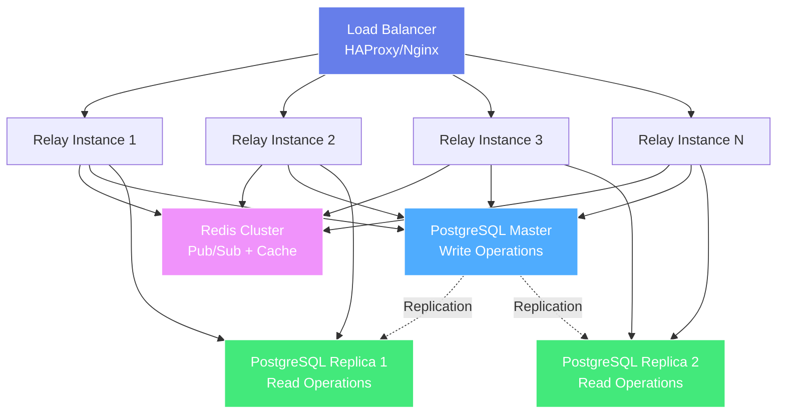

# Module 8: Scaling & Performance Optimization

!!! info "Module Overview"
    **Duration**: 8-10 hours  
    **Level**: Advanced  
    **Prerequisites**: Module 7 completed  
    **Goal**: Scale Nostr relays to handle millions of users with optimal performance

## 📋 Learning Objectives

By the end of this module, you will:

- ✅ Implement horizontal scaling strategies
- ✅ Design and deploy caching layers
- ✅ Optimize database queries and indexing
- ✅ Implement load balancing and failover
- ✅ Build CDN-style event distribution
- ✅ Monitor and optimize performance bottlenecks
- ✅ Implement connection pooling and resource management
- ✅ Design for geographic distribution

## 8.1 Horizontal Scaling Architecture

### Multi-Instance Relay Deployment



### Stateless Relay Design

```javascript
class StatelessRelay {
  constructor(config) {
    this.config = config;
    
    // Shared state via Redis
    this.redis = new Redis.Cluster(config.redisNodes);
    
    // Database connection pool
    this.dbPool = this.createDatabasePool(config.database);
    
    // Pub/Sub for event broadcasting across instances
    this.pubsub = new RedisPubSub(config.redisNodes);
  }
  
  createDatabasePool(dbConfig) {
    const { Pool } = require('pg');
    
    return new Pool({
      // Connection to master (for writes)
      master: {
        host: dbConfig.master.host,
        port: dbConfig.master.port,
        database: dbConfig.database,
        user: dbConfig.user,
        password: dbConfig.password,
        max: 20,
        idleTimeoutMillis: 30000,
        connectionTimeoutMillis: 2000,
      },
      
      // Connections to replicas (for reads)
      replicas: dbConfig.replicas.map(replica => ({
        host: replica.host,
        port: replica.port,
        database: dbConfig.database,
        user: dbConfig.user,
        password: dbConfig.password,
        max: 50,
        idleTimeoutMillis: 30000,
        connectionTimeoutMillis: 2000,
      }))
    });
  }
  
  async publishEvent(event) {
    // Write to master database
    await this.dbPool.master.query(
      'INSERT INTO events (id, pubkey, created_at, kind, tags, content, sig) VALUES ($1, $2, $3, $4, $5, $6, $7)',
      [event.id, event.pubkey, event.created_at, event.kind, JSON.stringify(event.tags), event.content, event.sig]
    );
    
    // Broadcast to all relay instances via Redis Pub/Sub
    await this.pubsub.publish('new_event', JSON.stringify(event));
    
    // Cache event for quick retrieval
    await this.redis.setex(`event:${event.id}`, 3600, JSON.stringify(event));
  }
  
  async queryEvents(filter) {
    // Use read replica for queries
    const replica = this.dbPool.getRandomReplica();
    const events = await replica.query(this.buildQuery(filter));
    
    return events.rows;
  }
  
  subscribeToNewEvents(callback) {
    // Subscribe to new events from all instances
    this.pubsub.subscribe('new_event', (message) => {
      const event = JSON.parse(message);
      callback(event);
    });
  }
}
```

### Session Affinity vs Sticky Sessions

```javascript
// HAProxy configuration for WebSocket load balancing
class LoadBalancerConfig {
  static generateHAProxyConfig(instances) {
    return `
global
    maxconn 100000
    log stdout format raw local0

defaults
    log global
    mode http
    timeout connect 5s
    timeout client 7d
    timeout server 7d
    option httplog

frontend nostr_relay
    bind *:443 ssl crt /etc/ssl/cert.pem
    
    # Rate limiting
    stick-table type ip size 1m expire 10s store http_req_rate(10s)
    http-request track-sc0 src
    http-request deny if { sc_http_req_rate(0) gt 100 }
    
    # WebSocket detection
    acl is_websocket hdr(Upgrade) -i WebSocket
    acl is_websocket hdr_beg(Host) -i ws
    
    # Use consistent hashing for WebSocket connections
    # This ensures the same client connects to the same backend
    use_backend nostr_backends if is_websocket
    
backend nostr_backends
    balance source  # IP-based sticky sessions
    hash-type consistent
    
    # Health checks
    option httpchk GET /health
    
    ${instances.map((instance, i) => 
      `server relay${i + 1} ${instance.host}:${instance.port} check inter 5s fall 3 rise 2`
    ).join('\n    ')}
    `;
  }
}
```

## 8.2 Caching Strategies

### Multi-Layer Cache Architecture

```javascript
class MultiLayerCache {
  constructor(config) {
    // L1: In-memory cache (fastest, smallest)
    this.l1Cache = new LRUCache({
      max: 10000,
      ttl: 60000, // 1 minute
      updateAgeOnGet: true
    });
    
    // L2: Redis cache (fast, shared across instances)
    this.l2Cache = new Redis.Cluster(config.redisNodes);
    
    // L3: Database (slower, persistent)
    this.l3Storage = config.database;
  }
  
  async get(key, fetcher) {
    // Try L1 cache
    let value = this.l1Cache.get(key);
    if (value !== undefined) {
      return { value, source: 'L1' };
    }
    
    // Try L2 cache
    value = await this.l2Cache.get(key);
    if (value !== null) {
      // Store in L1 for next time
      this.l1Cache.set(key, value);
      return { value: JSON.parse(value), source: 'L2' };
    }
    
    // Fetch from L3 (database)
    value = await fetcher();
    if (value !== null) {
      // Store in both caches
      this.l1Cache.set(key, value);
      await this.l2Cache.setex(key, 3600, JSON.stringify(value));
      return { value, source: 'L3' };
    }
    
    return { value: null, source: 'MISS' };
  }
  
  async set(key, value, ttl = 3600) {
    // Write through all cache layers
    this.l1Cache.set(key, value);
    await this.l2Cache.setex(key, ttl, JSON.stringify(value));
  }
  
  async invalidate(key) {
    // Invalidate all cache layers
    this.l1Cache.delete(key);
    await this.l2Cache.del(key);
  }
  
  async invalidatePattern(pattern) {
    // Invalidate by pattern (e.g., "user:123:*")
    const keys = await this.l2Cache.keys(pattern);
    if (keys.length > 0) {
      await this.l2Cache.del(...keys);
    }
    
    // L1 cache doesn't support pattern matching, so clear it
    this.l1Cache.clear();
  }
}
```

### Smart Event Caching

```javascript
class EventCacheManager {
  constructor(cache) {
    this.cache = cache;
  }
  
  async cacheEvent(event) {
    // Cache individual event
    await this.cache.set(`event:${event.id}`, event, 3600);
    
    // Cache by kind for quick filtering
    await this.cacheEventByKind(event);
    
    // Cache by author
    await this.cacheEventByAuthor(event);
    
    // Cache referenced events
    await this.cacheReferencedEvents(event);
  }
  
  async cacheEventByKind(event) {
    const key = `events:kind:${event.kind}`;
    
    // Add to sorted set (sorted by created_at)
    await this.cache.l2Cache.zadd(
      key,
      event.created_at,
      event.id
    );
    
    // Keep only recent events (last 1000)
    await this.cache.l2Cache.zremrangebyrank(key, 0, -1001);
    await this.cache.l2Cache.expire(key, 3600);
  }
  
  async cacheEventByAuthor(event) {
    const key = `events:author:${event.pubkey}`;
    
    await this.cache.l2Cache.zadd(
      key,
      event.created_at,
      event.id
    );
    
    // Keep only recent 500 per author
    await this.cache.l2Cache.zremrangebyrank(key, 0, -501);
    await this.cache.l2Cache.expire(key, 7200);
  }
  
  async cacheReferencedEvents(event) {
    // Cache thread relationships
    const eTags = event.tags.filter(t => t[0] === 'e');
    
    for (const [, eventId] of eTags) {
      const key = `event:${eventId}:replies`;
      await this.cache.l2Cache.sadd(key, event.id);
      await this.cache.l2Cache.expire(key, 3600);
    }
  }
  
  async getEventsByFilter(filter) {
    const cacheKey = this.generateCacheKey(filter);
    
    // Try to get cached result
    const cached = await this.cache.get(
      cacheKey,
      () => null // Don't fetch if not cached
    );
    
    if (cached.value !== null) {
      return cached;
    }
    
    // If specific filter patterns, try to use cached indexes
    if (filter.kinds && filter.kinds.length === 1) {
      return await this.getEventsByKindFromCache(filter);
    }
    
    if (filter.authors && filter.authors.length === 1) {
      return await this.getEventsByAuthorFromCache(filter);
    }
    
    return { value: null, source: 'MISS' };
  }
  
  async getEventsByKindFromCache(filter) {
    const kind = filter.kinds[0];
    const key = `events:kind:${kind}`;
    
    // Get event IDs from sorted set
    const eventIds = await this.cache.l2Cache.zrevrange(
      key,
      0,
      (filter.limit || 100) - 1
    );
    
    if (eventIds.length === 0) {
      return { value: null, source: 'MISS' };
    }
    
    // Fetch events from cache
    const events = await Promise.all(
      eventIds.map(id => this.cache.get(`event:${id}`, () => null))
    );
    
    const validEvents = events
      .filter(e => e.value !== null)
      .map(e => e.value);
    
    if (validEvents.length > 0) {
      return { value: validEvents, source: 'L2_INDEX' };
    }
    
    return { value: null, source: 'MISS' };
  }
  
  generateCacheKey(filter) {
    return `filter:${JSON.stringify(filter)}`;
  }
}
```

### Profile & Metadata Caching

```javascript
class ProfileCache {
  constructor(cache) {
    this.cache = cache;
    this.profileTTL = 3600; // 1 hour
  }
  
  async getProfile(pubkey) {
    return await this.cache.get(
      `profile:${pubkey}`,
      async () => {
        // Fetch from database
        const result = await db.query(
          `SELECT * FROM events 
           WHERE pubkey = $1 AND kind = 0 
           ORDER BY created_at DESC 
           LIMIT 1`,
          [pubkey]
        );
        
        if (result.rows.length > 0) {
          return JSON.parse(result.rows[0].content);
        }
        
        return null;
      }
    );
  }
  
  async updateProfile(pubkey, profile) {
    await this.cache.set(`profile:${pubkey}`, profile, this.profileTTL);
  }
  
  async batchGetProfiles(pubkeys) {
    // Use Redis MGET for batch retrieval
    const keys = pubkeys.map(pk => `profile:${pk}`);
    const cached = await this.cache.l2Cache.mget(...keys);
    
    const results = new Map();
    const missing = [];
    
    cached.forEach((value, index) => {
      const pubkey = pubkeys[index];
      if (value !== null) {
        results.set(pubkey, JSON.parse(value));
      } else {
        missing.push(pubkey);
      }
    });
    
    // Fetch missing profiles from database
    if (missing.length > 0) {
      const dbResults = await db.query(
        `SELECT DISTINCT ON (pubkey) pubkey, content
         FROM events 
         WHERE pubkey = ANY($1) AND kind = 0 
         ORDER BY pubkey, created_at DESC`,
        [missing]
      );
      
      for (const row of dbResults.rows) {
        const profile = JSON.parse(row.content);
        results.set(row.pubkey, profile);
        
        // Cache for next time
        await this.cache.set(
          `profile:${row.pubkey}`,
          profile,
          this.profileTTL
        );
      }
    }
    
    return results;
  }
}
```

## 8.3 Database Optimization

### Query Performance Tuning

```sql
-- Analyze query performance
EXPLAIN ANALYZE
SELECT * FROM events
WHERE kind = 1
  AND created_at > extract(epoch from now() - interval '24 hours')
ORDER BY created_at DESC
LIMIT 100;

-- Create covering index for common queries
CREATE INDEX CONCURRENTLY idx_events_kind_created_covering
ON events (kind, created_at DESC)
INCLUDE (id, pubkey, tags, content, sig);

-- Partition large tables by time
CREATE TABLE events_2024_01 PARTITION OF events
FOR VALUES FROM ('2024-01-01') TO ('2024-02-01');

CREATE TABLE events_2024_02 PARTITION OF events
FOR VALUES FROM ('2024-02-01') TO ('2024-03-01');

-- Auto-vacuum tuning for high-write tables
ALTER TABLE events SET (
  autovacuum_vacuum_scale_factor = 0.01,
  autovacuum_analyze_scale_factor = 0.01,
  autovacuum_vacuum_cost_delay = 10
);
```

### Connection Pooling

```javascript
class OptimizedConnectionPool {
  constructor(config) {
    const { Pool } = require('pg');
    
    // Master pool for writes
    this.masterPool = new Pool({
      host: config.master.host,
      port: config.master.port,
      database: config.database,
      user: config.user,
      password: config.password,
      
      // Optimized pool settings
      max: 20,                      // Max connections
      min: 5,                       // Min idle connections
      idleTimeoutMillis: 30000,     // Close idle after 30s
      connectionTimeoutMillis: 2000, // Fail fast
      maxUses: 7500,                // Recycle after 7500 uses
      
      // Statement timeout
      statement_timeout: 10000,     // 10s max query time
      
      // Application name for monitoring
      application_name: 'nostr_relay_master'
    });
    
    // Replica pools for reads (round-robin)
    this.replicaPools = config.replicas.map((replica, i) => new Pool({
      host: replica.host,
      port: replica.port,
      database: config.database,
      user: config.user,
      password: config.password,
      
      max: 50,                      // More connections for reads
      min: 10,
      idleTimeoutMillis: 30000,
      connectionTimeoutMillis: 2000,
      maxUses: 7500,
      statement_timeout: 10000,
      application_name: `nostr_relay_replica_${i + 1}`
    }));
    
    this.replicaIndex = 0;
  }
  
  async write(query, params) {
    const client = await this.masterPool.connect();
    try {
      return await client.query(query, params);
    } finally {
      client.release();
    }
  }
  
  async read(query, params) {
    // Round-robin load balancing across replicas
    const pool = this.replicaPools[this.replicaIndex];
    this.replicaIndex = (this.replicaIndex + 1) % this.replicaPools.length;
    
    const client = await pool.connect();
    try {
      return await client.query(query, params);
    } finally {
      client.release();
    }
  }
  
  async transaction(callback) {
    const client = await this.masterPool.connect();
    try {
      await client.query('BEGIN');
      const result = await callback(client);
      await client.query('COMMIT');
      return result;
    } catch (error) {
      await client.query('ROLLBACK');
      throw error;
    } finally {
      client.release();
    }
  }
  
  async close() {
    await this.masterPool.end();
    await Promise.all(this.replicaPools.map(pool => pool.end()));
  }
}
```

### Materialized Views for Analytics

```sql
-- Materialized view for popular events (refreshed periodically)
CREATE MATERIALIZED VIEW popular_events AS
SELECT 
  e.id,
  e.pubkey,
  e.content,
  e.created_at,
  COUNT(r.id) as reaction_count
FROM events e
LEFT JOIN events r ON r.kind = 7 AND r.tags @> jsonb_build_array(jsonb_build_array('e', e.id))
WHERE e.kind = 1
  AND e.created_at > extract(epoch from now() - interval '7 days')
GROUP BY e.id, e.pubkey, e.content, e.created_at
HAVING COUNT(r.id) > 10
ORDER BY reaction_count DESC
LIMIT 1000;

CREATE INDEX idx_popular_events_reactions ON popular_events(reaction_count DESC);

-- Refresh strategy (can be done in background)
REFRESH MATERIALIZED VIEW CONCURRENTLY popular_events;
```

## 8.4 CDN-Style Event Distribution

### Geographic Distribution

```javascript
class GeographicRelayCluster {
  constructor(config) {
    this.regions = new Map();
    
    // Define regional relay clusters
    config.regions.forEach(region => {
      this.regions.set(region.name, {
        name: region.name,
        location: region.location,
        relays: region.relays,
        latency: region.latency
      });
    });
  }
  
  async routeRequest(clientIP) {
    // Use GeoIP to determine client location
    const clientLocation = await this.getGeoLocation(clientIP);
    
    // Find nearest region
    const nearestRegion = this.findNearestRegion(clientLocation);
    
    // Return relay URLs for that region
    return this.regions.get(nearestRegion).relays;
  }
  
  findNearestRegion(clientLocation) {
    let nearest = null;
    let minDistance = Infinity;
    
    for (const [name, region] of this.regions) {
      const distance = this.calculateDistance(
        clientLocation,
        region.location
      );
      
      if (distance < minDistance) {
        minDistance = distance;
        nearest = name;
      }
    }
    
    return nearest;
  }
  
  calculateDistance(loc1, loc2) {
    // Haversine formula for geographic distance
    const R = 6371; // Earth's radius in km
    const dLat = this.toRad(loc2.lat - loc1.lat);
    const dLon = this.toRad(loc2.lon - loc1.lon);
    
    const a = Math.sin(dLat / 2) * Math.sin(dLat / 2) +
              Math.cos(this.toRad(loc1.lat)) * Math.cos(this.toRad(loc2.lat)) *
              Math.sin(dLon / 2) * Math.sin(dLon / 2);
    
    const c = 2 * Math.atan2(Math.sqrt(a), Math.sqrt(1 - a));
    return R * c;
  }
  
  toRad(degrees) {
    return degrees * (Math.PI / 180);
  }
}
```

### Event Replication Strategy

```javascript
class EventReplicationManager {
  constructor(config) {
    this.localRegion = config.localRegion;
    this.remoteRegions = config.remoteRegions;
    this.replicationQueue = new Queue('event_replication');
  }
  
  async replicateEvent(event) {
    // Store locally first (fastest)
    await this.storeLocally(event);
    
    // Queue replication to other regions
    await this.queueReplication(event);
  }
  
  async storeLocally(event) {
    // Store in local database
    await db.query(
      'INSERT INTO events (...) VALUES (...)',
      [event.id, event.pubkey, /* ... */]
    );
    
    // Cache locally
    await cache.set(`event:${event.id}`, event);
  }
  
  async queueReplication(event) {
    // Add to replication queue for each remote region
    for (const region of this.remoteRegions) {
      await this.replicationQueue.add({
        event,
        targetRegion: region,
        priority: this.getReplicationPriority(event)
      });
    }
  }
  
  getReplicationPriority(event) {
    // Higher priority for important event types
    const priorityByKind = {
      0: 10,   // Metadata - high priority
      1: 5,    // Notes - medium priority
      3: 10,   // Contacts - high priority
      7: 2,    // Reactions - lower priority
    };
    
    return priorityByKind[event.kind] || 5;
  }
  
  async processReplicationQueue() {
    this.replicationQueue.process(async (job) => {
      const { event, targetRegion } = job.data;
      
      try {
        // Send event to target region
        await this.sendToRegion(event, targetRegion);
      } catch (error) {
        // Retry with exponential backoff
        if (job.attemptsMade < 5) {
          throw error; // Will retry
        }
        
        console.error(`Failed to replicate to ${targetRegion}:`, error);
      }
    });
  }
  
  async sendToRegion(event, region) {
    const response = await fetch(`${region.apiEndpoint}/replicate`, {
      method: 'POST',
      headers: {
        'Content-Type': 'application/json',
        'X-Replication-Token': region.token
      },
      body: JSON.stringify(event)
    });
    
    if (!response.ok) {
      throw new Error(`Replication failed: ${response.statusText}`);
    }
  }
}
```

## 8.5 Performance Monitoring

### Real-Time Metrics Dashboard

```javascript
class PerformanceMonitor {
  constructor(prometheus) {
    this.metrics = {
      // Latency metrics
      queryLatency: new prometheus.Histogram({
        name: 'nostr_query_latency_seconds',
        help: 'Query execution latency',
        labelNames: ['operation', 'cache_hit'],
        buckets: [0.001, 0.005, 0.01, 0.025, 0.05, 0.1, 0.25, 0.5, 1, 2.5]
      }),
      
      // Throughput metrics
      eventsPerSecond: new prometheus.Gauge({
        name: 'nostr_events_per_second',
        help: 'Events processed per second'
      }),
      
      queriesPerSecond: new prometheus.Gauge({
        name: 'nostr_queries_per_second',
        help: 'Queries executed per second'
      }),
      
      // Cache metrics
      cacheHitRate: new prometheus.Gauge({
        name: 'nostr_cache_hit_rate',
        help: 'Cache hit rate percentage',
        labelNames: ['layer']
      }),
      
      // Database metrics
      dbConnectionPool: new prometheus.Gauge({
        name: 'nostr_db_connections',
        help: 'Database connection pool status',
        labelNames: ['pool', 'state']
      }),
      
      // Resource utilization
      cpuUtilization: new prometheus.Gauge({
        name: 'nostr_cpu_utilization_percent',
        help: 'CPU utilization percentage'
      }),
      
      memoryUtilization: new prometheus.Gauge({
        name: 'nostr_memory_utilization_bytes',
        help: 'Memory utilization in bytes',
        labelNames: ['type']
      }),
      
      // WebSocket metrics
      activeWebSockets: new prometheus.Gauge({
        name: 'nostr_active_websockets',
        help: 'Number of active WebSocket connections'
      }),
      
      websocketMessageRate: new prometheus.Counter({
        name: 'nostr_websocket_messages_total',
        help: 'Total WebSocket messages',
        labelNames: ['direction', 'type']
      })
    };
    
    this.startCollection();
  }
  
  startCollection() {
    // Collect metrics every second
    setInterval(() => {
      this.collectSystemMetrics();
      this.collectCacheMetrics();
      this.collectDatabaseMetrics();
    }, 1000);
  }
  
  collectSystemMetrics() {
    const usage = process.cpuUsage();
    const mem = process.memoryUsage();
    
    this.metrics.cpuUtilization.set(
      (usage.user + usage.system) / 1000000
    );
    
    this.metrics.memoryUtilization.set(
      { type: 'heap_used' },
      mem.heapUsed
    );
    
    this.metrics.memoryUtilization.set(
      { type: 'rss' },
      mem.rss
    );
  }
  
  async collectCacheMetrics() {
    // L1 cache stats
    const l1Stats = cache.l1Cache.size / cache.l1Cache.max;
    this.metrics.cacheHitRate.set({ layer: 'L1' }, l1Stats * 100);
    
    // L2 cache stats (Redis)
    const info = await cache.l2Cache.info('stats');
    const hitRate = this.parseRedisHitRate(info);
    this.metrics.cacheHitRate.set({ layer: 'L2' }, hitRate);
  }
  
  collectDatabaseMetrics() {
    // Connection pool stats
    this.metrics.dbConnectionPool.set(
      { pool: 'master', state: 'total' },
      dbPool.masterPool.totalCount
    );
    
    this.metrics.dbConnectionPool.set(
      { pool: 'master', state: 'idle' },
      dbPool.masterPool.idleCount
    );
    
    this.metrics.dbConnectionPool.set(
      { pool: 'master', state: 'waiting' },
      dbPool.masterPool.waitingCount
    );
  }
  
  recordQuery(operation, duration, cacheHit) {
    this.metrics.queryLatency.observe(
      { operation, cache_hit: cacheHit ? 'true' : 'false' },
      duration
    );
  }
  
  parseRedisHitRate(info) {
    const match = info.match(/keyspace_hits:(\d+).*keyspace_misses:(\d+)/s);
    if (match) {
      const hits = parseInt(match[1]);
      const misses = parseInt(match[2]);
      return (hits / (hits + misses)) * 100;
    }
    return 0;
  }
}
```

### Alerting Rules

```yaml
# prometheus-alerts.yml
groups:
  - name: nostr_relay_alerts
    interval: 30s
    rules:
      # High query latency
      - alert: HighQueryLatency
        expr: histogram_quantile(0.95, nostr_query_latency_seconds) > 1
        for: 5m
        labels:
          severity: warning
        annotations:
          summary: "High query latency detected"
          description: "95th percentile query latency is above 1s"
      
      # Low cache hit rate
      - alert: LowCacheHitRate
        expr: nostr_cache_hit_rate{layer="L2"} < 70
        for: 10m
        labels:
          severity: warning
        annotations:
          summary: "Low cache hit rate"
          description: "L2 cache hit rate is below 70%"
      
      # Database connection pool exhaustion
      - alert: DatabasePoolExhaustion
        expr: nostr_db_connections{pool="master",state="waiting"} > 5
        for: 2m
        labels:
          severity: critical
        annotations:
          summary: "Database connection pool exhausted"
          description: "More than 5 connections waiting"
      
      # High CPU utilization
      - alert: HighCPUUtilization
        expr: nostr_cpu_utilization_percent > 80
        for: 5m
        labels:
          severity: warning
        annotations:
          summary: "High CPU utilization"
          description: "CPU utilization is above 80%"
      
      # Memory pressure
      - alert: HighMemoryUsage
        expr: nostr_memory_utilization_bytes{type="rss"} > 8e9
        for: 5m
        labels:
          severity: warning
        annotations:
          summary: "High memory usage"
          description: "Memory usage is above 8GB"
      
      # Event processing rate drop
      - alert: LowEventProcessingRate
        expr: rate(nostr_events_received_total[5m]) < 10
        for: 10m
        labels:
          severity: info
        annotations:
          summary: "Low event processing rate"
          description: "Events per second dropped below 10"
```

## 8.6 Load Testing & Benchmarking

### Performance Testing Suite

```javascript
const WebSocket = require('ws');
const { performance } = require('perf_hooks');

class RelayLoadTester {
  constructor(config) {
    this.relayUrl = config.relayUrl;
    this.concurrentConnections = config.concurrentConnections || 1000;
    this.testDuration = config.testDuration || 60000; // 1 minute
    this.eventRate = config.eventRate || 100; // events per second
  }
  
  async runLoadTest() {
    console.log(`Starting load test:`);
    console.log(`- Relay: ${this.relayUrl}`);
    console.log(`- Connections: ${this.concurrentConnections}`);
    console.log(`- Duration: ${this.testDuration}ms`);
    console.log(`- Event rate: ${this.eventRate}/s`);
    
    const results = {
      connections: {
        attempted: 0,
        successful: 0,
        failed: 0
      },
      events: {
        sent: 0,
        accepted: 0,
        rejected: 0
      },
      queries: {
        sent: 0,
        responses: 0,
        avgLatency: 0
      },
      errors: []
    };
    
    // Create connections
    const connections = await this.createConnections(results);
    
    // Run test
    await this.runTest(connections, results);
    
    // Cleanup
    connections.forEach(ws => ws.close());
    
    return this.generateReport(results);
  }
  
  async createConnections(results) {
    const connections = [];
    
    for (let i = 0; i < this.concurrentConnections; i++) {
      try {
        const ws = new WebSocket(this.relayUrl);
        
        await new Promise((resolve, reject) => {
          ws.on('open', () => {
            results.connections.successful++;
            resolve();
          });
          
          ws.on('error', (error) => {
            results.connections.failed++;
            results.errors.push(error.message);
            reject(error);
          });
          
          setTimeout(() => reject(new Error('Connection timeout')), 5000);
        });
        
        connections.push(ws);
        results.connections.attempted++;
      } catch (error) {
        // Continue with available connections
      }
    }
    
    return connections;
  }
  
  async runTest(connections, results) {
    const startTime = performance.now();
    const endTime = startTime + this.testDuration;
    
    // Event publishing workers
    const publishInterval = 1000 / this.eventRate;
    const publishTimer = setInterval(() => {
      if (performance.now() > endTime) {
        clearInterval(publishTimer);
        return;
      }
      
      const ws = connections[Math.floor(Math.random() * connections.length)];
      this.publishTestEvent(ws, results);
    }, publishInterval);
    
    // Query workers
    const queryInterval = setInterval(() => {
      if (performance.now() > endTime) {
        clearInterval(queryInterval);
        return;
      }
      
      const ws = connections[Math.floor(Math.random() * connections.length)];
      this.sendTestQuery(ws, results);
    }, 100);
    
    // Wait for test duration
    await new Promise(resolve => setTimeout(resolve, this.testDuration));
    
    clearInterval(publishTimer);
    clearInterval(queryInterval);
  }
  
  publishTestEvent(ws, results) {
    const event = this.generateTestEvent();
    const startTime = performance.now();
    
    ws.send(JSON.stringify(['EVENT', event]));
    results.events.sent++;
    
    // Listen for OK response
    const onMessage = (data) => {
      const msg = JSON.parse(data);
      if (msg[0] === 'OK' && msg[1] === event.id) {
        const latency = performance.now() - startTime;
        
        if (msg[2] === true) {
          results.events.accepted++;
        } else {
          results.events.rejected++;
        }
        
        ws.off('message', onMessage);
      }
    };
    
    ws.on('message', onMessage);
  }
  
  sendTestQuery(ws, results) {
    const subId = `test_${Date.now()}_${Math.random()}`;
    const startTime = performance.now();
    let eventCount = 0;
    
    ws.send(JSON.stringify(['REQ', subId, { kinds: [1], limit: 10 }]));
    results.queries.sent++;
    
    const onMessage = (data) => {
      const msg = JSON.parse(data);
      
      if (msg[0] === 'EVENT' && msg[1] === subId) {
        eventCount++;
      }
      
      if (msg[0] === 'EOSE' && msg[1] === subId) {
        const latency = performance.now() - startTime;
        results.queries.responses++;
        results.queries.avgLatency = 
          (results.queries.avgLatency * (results.queries.responses - 1) + latency) /
          results.queries.responses;
        
        // Close subscription
        ws.send(JSON.stringify(['CLOSE', subId]));
        ws.off('message', onMessage);
      }
    };
    
    ws.on('message', onMessage);
  }
  
  generateTestEvent() {
    const { generatePrivateKey, getPublicKey, finishEvent } = require('nostr-tools');
    
    const privateKey = generatePrivateKey();
    const publicKey = getPublicKey(privateKey);
    
    return finishEvent({
      kind: 1,
      created_at: Math.floor(Date.now() / 1000),
      tags: [],
      content: `Load test event ${Date.now()}`
    }, privateKey);
  }
  
  generateReport(results) {
    const connectionSuccessRate = 
      (results.connections.successful / results.connections.attempted) * 100;
    
    const eventAcceptRate = 
      (results.events.accepted / results.events.sent) * 100;
    
    return {
      summary: {
        connectionSuccessRate: connectionSuccessRate.toFixed(2) + '%',
        totalEventsSent: results.events.sent,
        eventAcceptRate: eventAcceptRate.toFixed(2) + '%',
        averageQueryLatency: results.queries.avgLatency.toFixed(2) + 'ms',
        queriesPerSecond: (results.queries.sent / (this.testDuration / 1000)).toFixed(2)
      },
      details: results,
      recommendations: this.generateRecommendations(results)
    };
  }
  
  generateRecommendations(results) {
    const recommendations = [];
    
    if (results.connections.successful / results.connections.attempted < 0.95) {
      recommendations.push('Consider increasing max connections or connection timeout');
    }
    
    if (results.events.accepted / results.events.sent < 0.95) {
      recommendations.push('High event rejection rate - check validation rules');
    }
    
    if (results.queries.avgLatency > 100) {
      recommendations.push('High query latency - optimize database indexes or add caching');
    }
    
    return recommendations;
  }
}

// Usage
const tester = new RelayLoadTester({
  relayUrl: 'ws://localhost:8080',
  concurrentConnections: 1000,
  testDuration: 60000,
  eventRate: 100
});

tester.runLoadTest().then(report => {
  console.log('\nLoad Test Report:');
  console.log(JSON.stringify(report, null, 2));
});
```

## 8.7 Practical Exercises

### Exercise 1: Implement Horizontal Scaling
Set up a multi-instance relay deployment:
1. Deploy 3 relay instances
2. Configure Redis Pub/Sub for event broadcasting
3. Set up HAProxy load balancer
4. Test failover scenarios

### Exercise 2: Build Multi-Layer Cache
Implement comprehensive caching:
1. Set up LRU in-memory cache (L1)
2. Configure Redis cluster (L2)
3. Implement cache-aside pattern
4. Measure cache hit rates

### Exercise 3: Optimize Database Performance
Improve database efficiency:
1. Analyze slow queries with EXPLAIN
2. Add covering indexes
3. Implement read replicas
4. Set up connection pooling

### Exercise 4: Load Testing
Conduct performance testing:
1. Run load test with 1000 concurrent connections
2. Measure latency at different load levels
3. Identify bottlenecks
4. Optimize based on results

### Exercise 5: Geographic Distribution
Set up multi-region deployment:
1. Deploy relays in 3 geographic regions
2. Implement geo-routing
3. Configure event replication
4. Measure cross-region latency

## 📝 Module 8 Quiz

1. **What is the primary benefit of stateless relay design?**
   <details>
   <summary>Answer</summary>
   Stateless design allows horizontal scaling by removing dependency on local state. Any instance can handle any request, enabling load balancing and easy addition/removal of instances without session migration.
   </details>

2. **Why use multiple cache layers (L1, L2, L3)?**
   <details>
   <summary>Answer</summary>
   Each layer trades off speed vs capacity: L1 (in-memory) is fastest but smallest, L2 (Redis) is fast and shared across instances, L3 (database) is slower but persistent. Multi-layer caching maximizes hit rate while minimizing latency.
   </details>

3. **What's the advantage of read replicas over just scaling the master database?**
   <details>
   <summary>Answer</summary>
   Read replicas offload read queries from the master, allowing the master to focus on writes. This provides better write performance, horizontal scaling for reads, and geographic distribution for low-latency reads.
   </details>

4. **How does event replication across regions improve performance?**
   <details>
   <summary>Answer</summary>
   Regional replication reduces latency by serving events from geographically closer servers. It also provides redundancy and allows users to query their local region without waiting for cross-region data transfer.
   </details>

5. **What metrics are most important for identifying performance bottlenecks?**
   <details>
   <summary>Answer</summary>
   Query latency (p95, p99), cache hit rates, database connection pool utilization, CPU/memory usage, and events/queries per second. These reveal whether bottlenecks are in database, cache, compute, or network.
   </details>

## 🎯 Module 8 Checkpoint

Before moving to Module 9, ensure you have:

- [ ] Deployed a horizontally scaled relay cluster
- [ ] Implemented multi-layer caching with measurable hit rates
- [ ] Set up database read replicas and connection pooling
- [ ] Configured load balancing with failover
- [ ] Implemented comprehensive performance monitoring
- [ ] Conducted load testing and optimized bottlenecks
- [ ] Documented scaling architecture and runbooks
- [ ] Achieved target performance metrics (p95 latency < 100ms)

## 📚 Additional Resources

- [PostgreSQL Replication](https://www.postgresql.org/docs/current/high-availability.html)
- [Redis Cluster Tutorial](https://redis.io/docs/manual/scaling/)
- [HAProxy Configuration Guide](http://www.haproxy.org/download/2.8/doc/configuration.txt)
- [Prometheus Best Practices](https://prometheus.io/docs/practices/)
- [Database Connection Pooling](https://www.postgresql.org/docs/current/runtime-config-connection.html)
- [Load Testing Tools](https://k6.io/docs/)
- [CDN Architecture Patterns](https://www.cloudflare.com/learning/cdn/what-is-a-cdn/)

## 💬 Community Discussion

Join our Discord to discuss Module 8:
- Share your scaling strategies and results
- Get help with performance optimization
- Discuss load testing methodologies
- Collaborate on benchmarking

---

!!! success "Congratulations!"
    You've mastered scaling and performance optimization for Nostr relays! You can now handle millions of users with optimal performance. Ready for Module 9: Security Best Practices!

[Continue to Module 9: Security Best Practices →](module-09-security.md)
