# Lesson 1: Cryptographic Fundamentals

!!! info "Lesson Overview"
    **Module 2, Lesson 1 of 4** • **Estimated Time:** 45 minutes  
    **Learning Style:** Understanding + Interactive Examples

## Learning Objectives

After this lesson, you'll understand:

- [ ] What public-key cryptography is and how it works
- [ ] The mathematical relationship between public and private keys
- [ ] How digital signatures prove identity without revealing secrets
- [ ] Why this system is revolutionary for digital ownership

---

## The Magic of Mathematical Trust

Imagine you could prove you wrote a letter without anyone being able to forge your signature, even if they had unlimited time and computing power. That's essentially what public-key cryptography accomplishes in the digital world.

### The Traditional Problem

Before public-key cryptography, secure communication required sharing secrets:

- **Passwords** that both parties knew
- **Encryption keys** that had to be exchanged securely
- **Trust relationships** managed by central authorities

This created the "key distribution problem" - how do you securely share secrets with someone you've never met?

### The Revolutionary Solution

In 1976, cryptographers Whitfield Diffie and Martin Hellman invented a system where:

- **No secrets need to be shared** for secure communication
- **Identity can be verified** without revealing private information
- **Trust is mathematical** rather than institutional

This breakthrough made modern secure internet communication possible.

## How Public-Key Cryptography Works

### The Key Pair Concept

Think of it like a magical lock and key system:

```mermaid
graph LR
    A[Private Key<br/>🔑 Secret] -->|mathematically generates| B[Public Key<br/>🔒 Shareable]
    A -->|signs| C[Messages]
    B -->|verifies| C
    B -->|encrypts to| A
```



#### **Private Key** (Your Secret)
- A large random number (256 bits for Nostr)
- Must be kept absolutely secret
- Used to create digital signatures
- Can decrypt messages sent to your public key

#### **Public Key** (Your Identity)
- Mathematically derived from your private key
- Safe to share with everyone
- Used to verify your signatures
- Used by others to encrypt messages to you

### The Mathematical Magic

The security relies on **mathematical one-way functions**:

#### Easy Direction: Private → Public
```
Private Key + Elliptic Curve Math = Public Key
```
This calculation takes milliseconds on any computer.

#### Hard Direction: Public → Private
```
Public Key + All Computing Power on Earth = ???
```
This would take longer than the age of the universe.

### Real Example

Let's see this in action with actual Nostr keys:

#### Private Key (Keep Secret!)
```
d63b64d9c2c4f8c7b8e9f1a2b3c4d5e6f7a8b9c0d1e2f3a4b5c6d7e8f9a0b1c2
```

#### Derived Public Key (Share Freely!)
```
a1b2c3d4e5f6a7b8c9d0e1f2a3b4c5d6e7f8a9b0c1d2e3f4a5b6c7d8e9f0a1b2
```

**Key Insight:** Anyone can verify these keys are related, but no one can derive the private key from the public key.

## Digital Signatures: Proving You're You

### The Problem Signatures Solve

In the physical world, you sign documents with a pen. But digital documents can be copied perfectly. How do you prove a digital document came from you?

### How Digital Signatures Work


#### Step 1: Create a Hash
Your message is processed through a hash function, creating a unique "fingerprint."

#### Step 2: Sign the Hash
Your private key is used with the hash to create a digital signature.

#### Step 3: Verification
Anyone can use your public key to verify the signature matches the message.

### Why This Is Unbreakable

- **Signatures are unique** - Each message creates a different signature
- **Cannot be forged** - Only your private key can create valid signatures
- **Cannot be transferred** - Signatures don't work for different messages
- **Mathematically provable** - Verification is 100% certain, not probabilistic

## Interactive Exercise: See It In Action

Let's demonstrate these concepts with real code:

### Generate a Key Pair

=== "JavaScript (Browser)"

    ```javascript
    import { generatePrivateKey, getPublicKey } from 'nostr-tools'
    
    // Generate a random private key
    const privateKey = generatePrivateKey()
    console.log('Private Key (KEEP SECRET):', privateKey)
    
    // Derive the public key
    const publicKey = getPublicKey(privateKey)
    console.log('Public Key (SHARE FREELY):', publicKey)
    
    // Notice: Same private key always generates same public key
    const publicKey2 = getPublicKey(privateKey)
    console.log('Public keys match:', publicKey === publicKey2)
    ```

=== "Python"

    ```python
    from nostr.key import PrivateKey
    
    # Generate a private key
    private_key = PrivateKey()
    print(f"Private Key (KEEP SECRET): {private_key.hex()}")
    
    # Get the public key
    public_key = private_key.public_key
    print(f"Public Key (SHARE FREELY): {public_key.hex()}")
    
    # Demonstrate deterministic relationship
    public_key2 = private_key.public_key
    print(f"Public keys match: {public_key.hex() == public_key2.hex()}")
    ```

### Create and Verify a Signature

=== "JavaScript"

    ```javascript
    import { finishEvent } from 'nostr-tools'
    
    // Create a simple event (Nostr message)
    const event = {
        kind: 1,
        created_at: Math.floor(Date.now() / 1000),
        tags: [],
        content: 'Hello, cryptographic world!'
    }
    
    // Sign the event with your private key
    const signedEvent = finishEvent(event, privateKey)
    
    console.log('Signed Event:', signedEvent)
    console.log('Signature:', signedEvent.sig)
    
    // The signature proves this message came from the private key
    // without revealing the private key itself!
    ```

=== "Python"

    ```python
    from nostr.event import Event
    import time
    
    # Create an event
    event = Event(
        kind=1,
        content="Hello, cryptographic world!",
        created_at=int(time.time())
    )
    
    # Sign with private key
    private_key.sign_event(event)
    
    print(f"Signed Event: {event.to_json()}")
    print(f"Signature: {event.signature}")
    
    # Verify the signature
    is_valid = event.verify()
    print(f"Signature valid: {is_valid}")
    ```

## Why This Matters for Nostr

### Traditional Identity vs. Cryptographic Identity

| Traditional | Cryptographic |
|------------|---------------|
| Username + Password | Public/Private Key Pair |
| Platform owns your account | You own your identity |
| Can be reset/recovered | Cannot be recovered if lost |
| Controlled by company | Controlled by mathematics |
| Vulnerable to hacking | Mathematically secure |

### Nostr's Innovation

Nostr uses cryptographic identity for:

1. **Proof of Authorship** - Every post is cryptographically signed
2. **Identity Portability** - Same identity works across all clients
3. **Censorship Resistance** - No central authority can revoke your identity
4. **Direct Communication** - Send encrypted messages without intermediaries

### Real-World Benefits

- **No Account Creation** - Your keys are your account
- **No Password Resets** - You either have the key or you don't
- **No Identity Theft** - Only you can sign with your private key
- **Global Compatibility** - Works everywhere without registration

## Understanding the Math (Optional Deep Dive)

### Elliptic Curve Cryptography

Nostr uses the same cryptographic curve as Bitcoin: **secp256k1**

#### The Curve Equation
```
y² = x³ + 7
```

This simple equation defines a curve where:
- Points on the curve can be added together
- Multiplication is easy, division is nearly impossible
- This creates the one-way mathematical function

#### Point Multiplication
```
Private Key × Generator Point = Public Key
```

- **Generator Point**: A known point on the curve everyone uses
- **Private Key**: Your secret number
- **Public Key**: The resulting point after multiplication

### The Numbers Behind Security

#### Private Key Space
- **256 bits** = 2²⁵⁶ possible keys
- **That's approximately**: 10⁷⁷ possible keys
- **For comparison**: There are only about 10⁸⁰ atoms in the observable universe

#### Collision Probability
The chance of two people generating the same private key is so small it's effectively impossible.

### Why This Math Matters

Understanding the mathematics helps you appreciate:
- **Why keys are truly random** - Any pattern would be exploitable
- **Why backup is critical** - The chance of recreating the same key is zero
- **Why 256 bits is enough** - Even quantum computers can't break this in practice
- **Why this system is trustworthy** - Security is mathematical, not institutional

## 🎯 Hands-on Activity: Key Generation Practice

### Exercise 1: Generate Multiple Key Pairs

**Objective:** Understand key generation and relationships

**Steps:**
1. Generate 3 different private keys
2. Derive their public keys
3. Verify each private key always generates the same public key
4. Notice that all keys are completely different

**What You'll Learn:** Keys are truly random and deterministic

### Exercise 2: Signature Creation

**Objective:** See digital signatures in action

**Steps:**
1. Create a simple message
2. Sign it with your private key
3. Verify the signature with your public key
4. Try to verify with a different public key (it will fail)

**What You'll Learn:** Signatures prove identity mathematically

### Exercise 3: Key Format Conversion

**Objective:** Understand different key representations

**Steps:**
1. Generate keys in hex format
2. Convert to bech32 format (nsec/npub)
3. Convert back to hex
4. Verify they're the same keys

**What You'll Learn:** Different formats represent the same underlying numbers

## 🤔 Critical Thinking Questions

1. **Trust Models:** How does mathematical trust differ from institutional trust? What are the trade-offs?

2. **Quantum Computing:** How might quantum computers affect cryptographic security? What preparations are being made?

3. **Key Management:** If keys can't be recovered, how should people manage this responsibility? What tools could help?

4. **Social Recovery:** Could there be ways to recover identity through social consensus while maintaining cryptographic security?

## 📝 Knowledge Check

!!! question "Test Your Understanding"
    
    **1. What makes public-key cryptography "one-way"?**
    
    ??? success "Answer"
        The mathematical relationship between private and public keys relies on problems that are easy to compute in one direction (multiplication) but computationally infeasible to reverse (discrete logarithm problem).
    
    **2. Why can't digital signatures be forged?**
    
    ??? success "Answer"
        Digital signatures are created using the private key and a hash of the message. Without the private key, it's mathematically impossible to create a valid signature that will verify with the corresponding public key.
    
    **3. How does cryptographic identity enable censorship resistance?**
    
    ??? success "Answer"
        Since your identity is based on mathematical keys rather than accounts controlled by platforms, no central authority can revoke or modify your identity. You have sovereign control over your digital presence.

---

## ✅ Lesson Complete

You now understand the mathematical foundation that makes digital sovereignty possible. Public-key cryptography isn't just a technical tool - it's the basis for a new model of digital ownership and identity.

**Key Insights:**
- Mathematics can create trust without institutions
- Digital signatures prove identity without revealing secrets
- Cryptographic keys enable true ownership of digital identity
- This technology makes decentralized protocols like Nostr possible

<div class="lesson-nav">
  <a href="index.md">← Module Overview</a>
  <a href="key-management.md">Next: Key Management →</a>
</div>

---

!!! success "Portfolio Addition"
    **Document your understanding**: Write a brief explanation of how public-key cryptography works in your own words. Include why this enables digital sovereignty and censorship resistance.

!!! tip "Practice Safely"
    As you experiment with key generation, remember to use test keys only. In the next lesson, we'll cover secure key management practices for your real identity.

!!! info "Deep Dive Available"
    For comprehensive technical details about keys in Nostr, see [Keys and Identity](../../../concepts/keys.md) in our reference section.
