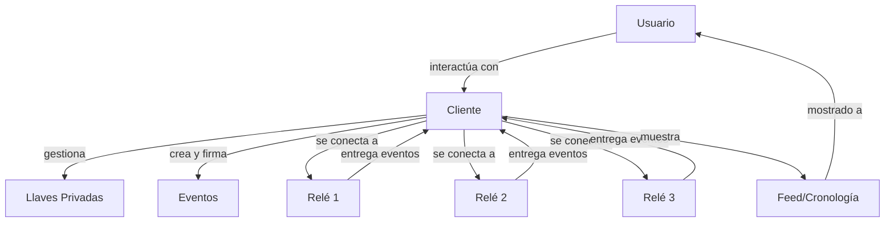

# Entendiendo los Clientes Nostr

!!! info "Objetivos de Aprendizaje"
    Al final de esta lección, entenderás:
    
    - Qué son los clientes Nostr y su papel en el ecosistema
    - Diferentes tipos de clientes y sus características
    - Cómo los clientes interactúan con relés y gestionan llaves
    - Opciones populares de clientes y cómo elegir uno

## ¿Qué es un Cliente Nostr?

Un **cliente Nostr** es una aplicación que permite a los usuarios interactuar con la red Nostr. Piénsalo como tu ventana hacia la web social descentralizada - es cómo creas publicaciones, lees contenido, gestionas tu identidad y te conectas con otros.

A diferencia de las redes sociales tradicionales donde estás bloqueado en una app (como Twitter o Facebook), los clientes Nostr son **interoperables**. Puedes cambiar entre diferentes clientes mientras mantienes la misma identidad y datos.

## Funciones Centrales de los Clientes

### 1. Gestión de Llaves
- **Generar** nuevos pares de llaves criptográficas
- **Almacenar** llaves privadas de forma segura (o integrarse con gestores de llaves externos)
- **Firmar** eventos con tu llave privada
- **Verificar** firmas de otros usuarios

### 2. Creación de Eventos
- **Componer** diferentes tipos de contenido (notas de texto, reacciones, reposts)
- **Formatear** contenido con metadatos y etiquetas apropiadas
- **Firmar** eventos criptográficamente
- **Publicar** a relés seleccionados

### 3. Comunicación con Relés
- **Conectar** a múltiples relés simultáneamente
- **Suscribirse** a feeds de eventos y filtros
- **Obtener** eventos históricos y perfiles de usuario
- **Gestionar** listas de relés y preferencias

### 4. Visualización de Contenido
- **Analizar** y mostrar eventos en formatos amigables para el usuario
- **Manejar** diferentes tipos de eventos (notas, reacciones, perfiles)
- **Organizar** contenido (cronologías, hilos, notificaciones)
- **Filtrar** contenido basado en preferencias del usuario

## Tipos de Clientes Nostr

### Clientes Web
Aplicaciones basadas en navegador que se ejecutan en tu navegador web.

**Ejemplos:**
- **Iris** - Cliente web rico en características con funciones sociales
- **Snort** - Interfaz web rápida y moderna
- **Nostrgram** - Compartir fotos estilo Instagram
- **Coracle** - Cliente minimalista enfocado en privacidad

**Ventajas:**
- ✅ No requiere instalación
- ✅ Compatibilidad multiplataforma
- ✅ Fácil probar diferentes clientes

**Desventajas:**
- ❌ Opciones limitadas de almacenamiento de llaves
- ❌ Dependiente de la seguridad del navegador
- ❌ Puede tener limitaciones de rendimiento

### Aplicaciones Móviles
Aplicaciones nativas para smartphones y tablets.

**Ejemplos:**
- **Damus** (iOS) - Cliente iOS popular y fácil de usar
- **Amethyst** (Android) - Cliente Android rico en características
- **Nostros** (Android) - Cliente Android de código abierto
- **Plebstr** (iOS/Android) - Simple, amigable para principiantes

**Ventajas:**
- ✅ Rendimiento y UX nativo
- ✅ Notificaciones push
- ✅ Mejores opciones de almacenamiento de llaves
- ✅ Capacidades offline

**Desventajas:**
- ❌ Específico de plataforma
- ❌ Restricciones de tiendas de apps
- ❌ Requiere instalación

### Aplicaciones de Escritorio
Aplicaciones nativas para computadoras.

**Ejemplos:**
- **Gossip** - Cliente de escritorio basado en Rust
- **More TBD** - El ecosistema de clientes de escritorio está creciendo

**Ventajas:**
- ✅ Experiencia completa de características
- ✅ Mejor gestión de llaves
- ✅ Características avanzadas para power users
- ✅ Sin limitaciones del navegador

**Desventajas:**
- ❌ Builds específicos de plataforma
- ❌ Descarga/instalación más grande
- ❌ Menos portable

### Clientes Especializados
Construidos específicamente para casos de uso particulares.

**Ejemplos:**
- **Habla** - Publicación de contenido de formato largo
- **Zap.stream** - Transmisión en vivo
- **Nostrudel** - Características avanzadas para power users
- **Satellite** - Minimalista, solo texto

## Cómo Funcionan los Clientes



### El Flujo de Trabajo del Cliente

1. **Acción del Usuario**: Quieres publicar una nota o leer tu cronología
2. **Creación de Evento**: El cliente crea un evento correctamente formateado
3. **Firma**: El cliente firma el evento con tu llave privada
4. **Publicación**: El cliente envía el evento a tus relés seleccionados
5. **Obtención**: El cliente solicita eventos de relés para tu cronología
6. **Visualización**: El cliente formatea y te muestra el contenido

## Características Clave a Buscar

### Características Esenciales
- **Gestión de Llaves**: Almacenamiento y manejo seguro de llaves privadas
- **Soporte Multi-relé**: Conectar a múltiples relés simultáneamente
- **Tipos de Eventos Básicos**: Soporte para notas de texto, reacciones, reposts
- **Perfiles de Usuario**: Ver y editar información de perfil
- **Cronología/Feed**: Visualización cronológica de eventos

### Características Avanzadas
- **Soporte de Hilos**: Visualización apropiada de hilos de conversación
- **Soporte de Multimedia**: Imágenes, videos y archivos adjuntos
- **Integración Lightning**: Zaps (pagos Bitcoin Lightning)
- **Filtrado Avanzado**: Herramientas de filtrado y moderación de contenido
- **Respaldo/Exportación**: Exportar tus datos y configuraciones

### Características para Power Users
- **Gestión Personalizada de Relés**: Configuración avanzada de relés
- **Depuración de Eventos**: Inspección y depuración de eventos en crudo
- **Tipos de Eventos Personalizados**: Soporte para NIPs experimentales
- **Acceso a API**: Integración con herramientas externas
- **Sistema de Plugins**: Extensibilidad a través de plugins

## Eligiendo el Cliente Correcto

### Para Principiantes
**Recomendado:** Damus (iOS), Amethyst (Android), Iris (Web)

- Interfaz simple e intuitiva
- Buena experiencia de onboarding
- Generación de llaves integrada
- Configuraciones por defecto razonables

### Para Usuarios Conscientes de la Privacidad
**Recomendado:** Gossip (Escritorio), Coracle (Web)

- Características mejoradas de privacidad
- Almacenamiento local de llaves
- Recolección mínima de datos
- Soporte Tor (algunos clientes)

### Para Power Users
**Recomendado:** Nostrudel (Web), Gossip (Escritorio)

- Opciones de configuración avanzadas
- Inspección de eventos en crudo
- Gestión personalizada de relés
- Soporte de características experimentales

### Para Creadores de Contenido
**Recomendado:** Habla (Formato largo), Nostrgram (Fotos)

- Herramientas especializadas de creación de contenido
- Soporte de multimedia rica
- Flujos de trabajo de publicación
- Características de engagement de audiencia

## Interoperabilidad de Clientes

Una de las ventajas clave de Nostr es la **interoperabilidad de clientes**:

!!! example "Ejemplo del Mundo Real"
    
    **Mañana**: Usa Damus en tu teléfono para revisar notificaciones
    
    **Tarde**: Cambia a Iris en tu computadora de trabajo para publicar actualizaciones
    
    **Noche**: Usa Habla para escribir un artículo de formato largo
    
    **Resultado**: Todo tu contenido aparece sin problemas en todos los clientes porque todos usan el mismo protocolo subyacente y relés.

## Consideraciones de Seguridad

### Almacenamiento de Llaves
- **Almacenamiento del Navegador**: Conveniente pero menos seguro
- **Keychain Móvil**: Mejor seguridad en dispositivos móviles
- **Billeteras Hardware**: Máxima seguridad para cuentas valiosas
- **Firmadores Externos**: Apps dedicadas de gestión de llaves

### Mejores Prácticas
- ✅ Usa clientes respetables y de código abierto
- ✅ Verifica la autenticidad del cliente antes de descargar
- ✅ Mantén tu llave privada respaldada de forma segura
- ✅ Usa diferentes clientes para evitar vendor lock-in
- ❌ Nunca compartas tu llave privada
- ❌ No uses clientes no confiables o de código cerrado

## Comparación de Clientes Populares

### Clientes Móviles

| Cliente | Plataforma | Características Principales | Nivel |
|---------|------------|----------------------------|-------|
| **Damus** | iOS | Interfaz elegante, fácil de usar, buena experiencia UX | Principiante |
| **Amethyst** | Android | Rico en características, personalizable, actualizaciones frecuentes | Intermedio |
| **Plebstr** | iOS/Android | Simple, enfocado en principiantes, onboarding guiado | Principiante |
| **Nostros** | Android | Código abierto, ligero, características básicas | Principiante |

### Clientes Web

| Cliente | Características Principales | Mejor Para |
|---------|----------------------------|------------|
| **Iris** | Interfaz familiar tipo Twitter, características sociales | Principiantes, uso general |
| **Snort** | Rápido, moderno, características avanzadas | Usuarios intermedios |
| **Coracle** | Enfocado en privacidad, minimalista | Usuarios conscientes de la privacidad |
| **Nostrudel** | Herramientas avanzadas, depuración de eventos | Power users, desarrolladores |

### Clientes Especializados

| Cliente | Propósito | Características Únicas |
|---------|-----------|----------------------|
| **Habla** | Contenido de formato largo | Editor markdown, artículos, blogs |
| **Nostrgram** | Compartir fotos | Interfaz tipo Instagram, enfoque visual |
| **Zap.stream** | Streaming en vivo | Transmisiones, chat en vivo, zaps |
| **Satellite** | Minimalista | Solo texto, sin imágenes, ultra ligero |

## Configuración de Cliente

### Primera Configuración

```javascript
// Ejemplo de configuración típica de cliente
const configuracionCliente = {
  // Gestión de llaves
  gestorLlaves: {
    tipo: 'local', // 'local', 'hardware', 'externo'
    respaldo: true,
    encriptacion: 'AES-256'
  },
  
  // Configuración de relés
  reles: [
    'wss://relay.damus.io',
    'wss://nos.lol',
    'wss://relay.snort.social'
  ],
  
  // Preferencias de contenido
  filtros: {
    idiomas: ['es', 'en'],
    tiposEventos: [0, 1, 3, 7], // perfiles, notas, contactos, reacciones
    limitePorFeed: 50
  },
  
  // Configuraciones de privacidad
  privacidad: {
    mostrarLecturas: false,
    compartirUbicacion: false,
    modoPrivado: false
  }
}
```

### Migración Entre Clientes

```javascript
// Exportar datos de cliente actual
function exportarDatos() {
  return {
    llavePrivada: obtenerLlavePrivada(), // ¡MANTENER SEGURO!
    configuracionReles: obtenerReles(),
    configuraciones: obtenerConfiguraciones(),
    contactos: obtenerContactos(),
    eventos: obtenerEventosLocales()
  }
}

// Importar a nuevo cliente
function importarDatos(datosExportados) {
  configurarLlavePrivada(datosExportados.llavePrivada)
  configurarReles(datosExportados.configuracionReles)
  aplicarConfiguraciones(datosExportados.configuraciones)
  sincronizarContactos(datosExportados.contactos)
}
```

## Desarrollo de Clientes

### Arquitectura Básica de Cliente

```javascript
class ClienteNostr {
  constructor(configuracion) {
    this.llaves = new GestorLlaves(configuracion.llaves)
    this.reles = new GestorReles(configuracion.reles)
    this.eventos = new GestorEventos()
    this.ui = new InterfazUsuario()
  }
  
  async inicializar() {
    await this.llaves.cargar()
    await this.reles.conectar()
    this.configurarSuscripciones()
  }
  
  async publicarNota(contenido) {
    const evento = this.eventos.crear({
      kind: 1,
      content: contenido,
      created_at: Math.floor(Date.now() / 1000)
    })
    
    const eventoFirmado = await this.llaves.firmar(evento)
    return this.reles.publicar(eventoFirmado)
  }
  
  configurarSuscripciones() {
    // Suscribirse a feed personal
    this.reles.suscribirse([
      { kinds: [1], authors: this.obtenerSeguidos() }
    ], this.manejarEvento.bind(this))
    
    // Suscribirse a menciones
    this.reles.suscribirse([
      { kinds: [1], '#p': [this.llaves.pubkey] }
    ], this.manejarMencion.bind(this))
  }
  
  manejarEvento(evento) {
    this.eventos.almacenar(evento)
    this.ui.actualizarFeed(evento)
  }
  
  manejarMencion(evento) {
    this.ui.mostrarNotificacion(evento)
  }
}
```

## El Futuro de los Clientes

El ecosistema de clientes Nostr está evolucionando rápidamente:

### Tendencias Emergentes
- **Clientes Especializados**: Construidos específicamente para casos de uso particulares
- **Integración de IA**: Curación inteligente de contenido y asistencia
- **Privacidad Mejorada**: Mejores características de anonimato y privacidad
- **Multiplataforma**: Experiencia sin interrupciones en todos los dispositivos
- **Ecosistemas de Plugins**: Clientes extensibles y personalizables

### Innovaciones Técnicas
- **Sincronización de Estado**: Sincronizar estado entre múltiples clientes
- **Protocolos de Respaldo**: Respaldo automático y recuperación de datos
- **Optimizaciones de Rendimiento**: Clientes más rápidos y eficientes
- **Accesibilidad**: Mejor soporte para usuarios con discapacidades

### Nuevos Paradigmas
- **Clientes como Servicios**: Clientes que se ejecutan en la nube
- **Interfaces Conversacionales**: Clientes operados por voz/chat
- **Realidad Aumentada**: Experiencias Nostr en AR/VR
- **IoT Integration**: Clientes en dispositivos del Internet de las Cosas

## Guía de Troubleshooting

### Problemas Comunes

#### No se Conecta a Relés
```javascript
// Diagnóstico de conectividad
async function diagnosticarConexion(urlRele) {
  try {
    const ws = new WebSocket(urlRele)
    ws.onopen = () => console.log(`✅ Conectado a ${urlRele}`)
    ws.onerror = (error) => console.error(`❌ Error: ${error}`)
    ws.onclose = (event) => console.log(`🔌 Cerrado: ${event.code}`)
  } catch (error) {
    console.error(`❌ No se puede conectar a ${urlRele}:`, error)
  }
}
```

#### Eventos No Aparecen
```javascript
// Verificar filtros de suscripción
function verificarFiltros(filtros) {
  console.log('Filtros activos:', filtros)
  
  // Verificar si los filtros son demasiado restrictivos
  if (filtros.authors && filtros.authors.length === 0) {
    console.warn('⚠️ No hay autores en filtro')
  }
  
  if (filtros.since && filtros.since > Date.now() / 1000) {
    console.warn('⚠️ Filtro "since" está en el futuro')
  }
}
```

#### Problemas de Llaves
```javascript
// Validar llave privada
function validarLlavePrivada(llavePrivada) {
  if (!llavePrivada || llavePrivada.length !== 64) {
    throw new Error('Llave privada inválida: debe ser hex de 64 caracteres')
  }
  
  if (!/^[0-9a-f]{64}$/i.test(llavePrivada)) {
    throw new Error('Llave privada inválida: debe ser hexadecimal')
  }
  
  return true
}
```

## Próximos Pasos

Ahora que entiendes los clientes, explora cómo interactúan con relés y el ecosistema más amplio de Nostr.

<div class="next-lesson">
  <a href="../relays/" class="btn btn-primary">
    Entendiendo Relés →
  </a>
</div>

---

## Quiz Rápido

!!! question "Prueba Tu Comprensión"
    
    1. ¿Cuáles son las funciones centrales de un cliente Nostr?
    2. ¿Por qué puedes cambiar entre diferentes clientes Nostr libremente?
    3. ¿Cuál es la diferencia entre clientes web y apps móviles?
    4. ¿Qué deberías considerar al elegir un cliente para privacidad?
    
    ??? success "Respuestas"
        1. Gestión de llaves, creación de eventos, comunicación con relés, y visualización de contenido
        2. Porque todos los clientes usan el mismo protocolo abierto y pueden acceder a los mismos relés
        3. Los clientes web se ejecutan en navegadores (multiplataforma, sin instalación) mientras las apps móviles son nativas (mejor rendimiento, específicas de plataforma)
        4. Almacenamiento local de llaves, recolección mínima de datos, código abierto, y características enfocadas en privacidad