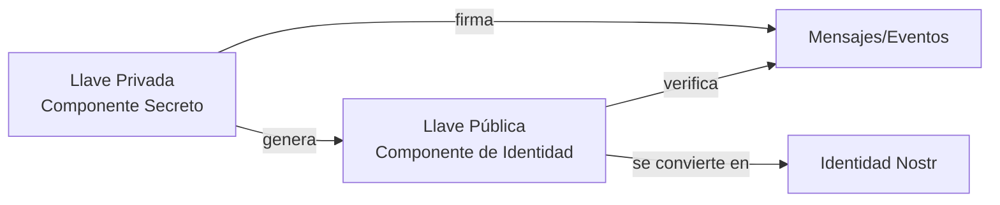

# Llaves e Identidad en Nostr

!!! info "Objetivos de Aprendizaje"
    Después de esta lección, entenderás:
    
    - Cómo funciona la identidad digital en el protocolo Nostr
    - La diferencia entre llaves privadas y públicas
    - Diferentes formatos de llaves y sus propósitos
    - Mejores prácticas para seguridad y gestión de llaves
    - Por qué Nostr usa identidad criptográfica en lugar de nombres de usuario

## Identidad Criptográfica

Nostr usa un enfoque fundamentalmente diferente para la identidad comparado con las plataformas de redes sociales tradicionales. En lugar de nombres de usuario y contraseñas gestionadas por una autoridad central, Nostr emplea pares de llaves criptográficas para establecer y verificar identidad.

Este enfoque proporciona a los usuarios propiedad completa y control sobre su identidad digital, eliminando la dependencia de cualquier plataforma central o proveedor de servicios.

## Entendiendo los Pares de Llaves

### Fundamentos Criptográficos

Las llaves criptográficas funcionan como pares matemáticamente relacionados que habilitan comunicación digital segura:

- **Relación matemática unidireccional**: Las llaves públicas se derivan de las llaves privadas, pero el reverso es computacionalmente inviable
- **Firmas digitales**: Las llaves privadas crean firmas que las llaves públicas pueden verificar
- **Verificación de identidad**: Las firmas prueban propiedad sin revelar la llave privada



## Gestión de Llave Privada

### Definición y Propósito

La llave privada sirve como el secreto maestro que controla toda tu identidad Nostr. Es un número aleatorio criptográficamente seguro que:

- **Genera tu identidad pública**: Deriva matemáticamente tu llave pública
- **Crea firmas digitales**: Prueba autoría de tus eventos
- **Controla todas las interacciones**: Requerida para publicar, seguir y otras acciones
- **No puede recuperarse**: La pérdida resulta en pérdida permanente de identidad

### Requisitos de Seguridad

La seguridad de la llave privada es crítica para mantener control de tu identidad Nostr:

!!! danger "Prácticas de Seguridad Críticas"
    
    **Nunca Compartas Tu Llave Privada**
    - No transmitas vía email, mensajería, o cualquier comunicación digital
    - Evita almacenar en archivos de texto plano o formatos no encriptados
    - Nunca ingreses en aplicaciones o sitios web no confiables
    
    **Métodos de Almacenamiento Seguro**
    - Usa billeteras hardware para máxima seguridad
    - Emplea gestores de contraseñas encriptados
    - Crea respaldos fuera de línea, encriptados
    - Almacena en múltiples ubicaciones seguras

### Ejemplos de Formato de Llaves

=== "Formato Hex"

    ```
    d63b64d9c2c4f8c7b8e9f1a2b3c4d5e6f7a8b9c0d1e2f3a4b5c6d7e8f9a0b1c2
    ```

=== "Formato nsec (Bech32)"

    ```
    nsec1mclkfkwu2n7v0wuwn6d2kwx56mn0029ceuxr6ul6xjm2k6l7qxsqrxqhp8
    ```

## Distribución de Llave Pública

### Propósito y Función

Tu llave pública sirve como tu dirección permanente e identidad Nostr. Habilita:

- **Identificación global**: Dirección única en la red Nostr
- **Verificación de firma**: Otros pueden verificar la autenticidad de tus mensajes
- **Conexiones sociales**: Los seguidores usan esto para encontrarte y seguirte
- **Compatibilidad entre clientes**: Funciona en todas las aplicaciones Nostr

### Pautas para Compartir

A diferencia de las llaves privadas, las llaves públicas están diseñadas para distribución abierta:

✅ **Seguro compartir públicamente**
✅ **Incluir en perfiles de redes sociales**  
✅ **Mostrar en sitios web y tarjetas de presentación**
✅ **Enviar vía cualquier método de comunicación**
✅ **Incrustar en códigos QR**

### Formatos de Llave Pública

=== "Formato Hex"

    ```
    a1b2c3d4e5f6a7b8c9d0e1f2a3b4c5d6e7f8a9b0c1d2e3f4a5b6c7d8e9f0a1b2
    ```

=== "Formato npub (Bech32)"

    ```
    npub15xdv832ue0s3h2wr6hetw6x2m5xl3wnsdqwr6ul3c73j4wmnqxsqrc47xx
    ```

## Gestión de Identidad

### Migración de Identidad

Una vez que tienes un par de llaves Nostr, tu identidad es portable entre todas las aplicaciones:

**Ventajas de Portabilidad:**
- Cambiar entre clientes sin perder seguidores
- Mantener historial de mensajes
- Conservar reputación social
- Evitar dependencia de vendedor

**Proceso de Migración:**
1. Exportar llave privada de la aplicación actual
2. Importar llave privada en nueva aplicación
3. Configurar lista de relés preferidos
4. Verificar que el perfil se muestre correctamente

### Recuperación de Cuenta

A diferencia de las cuentas tradicionales, la recuperación de Nostr depende únicamente de tu llave privada:

!!! warning "Sin Recuperación Centralizada"
    
    **No existe "recuperación de contraseña"**
    - Ningún servicio puede restablecer tu acceso
    - Las preguntas de seguridad no existen
    - La verificación por email no es posible
    - Solo tu llave privada puede restaurar el acceso

**Estrategias de Recuperación:**
- Múltiples respaldos en ubicaciones seguras
- Sistemas de recuperación con múltiples firmas
- Esquemas de respaldo familiar/amigos de confianza
- Servicios de custodia para usuarios no técnicos

## Mejores Prácticas de Seguridad

### Generación de Llaves

Generar llaves seguras requiere aleatoriedad criptográficamente fuerte:

**Fuentes Recomendadas:**
- Aplicaciones Nostr establecidas con buena reputación
- Librerías criptográficas estándar de la industria
- Generadores de hardware dedicados
- Software de código abierto auditado

**Fuentes a Evitar:**
- Sitios web de confianza dudosa
- Software no auditado
- Aplicaciones móviles sospechosas
- Generadores caseros

### Almacenamiento Operacional

Para uso diario, equilibra seguridad con usabilidad:

**Dispositivos Primarios:**
- Usa gestores de contraseñas para almacenamiento encriptado
- Habilita bloqueo automático de aplicaciones
- Mantén software actualizado
- Usa autenticación de dos factores cuando esté disponible

**Almacenamiento en Frío:**
- Respaldos offline para almacenamiento a largo plazo
- Múltiples ubicaciones físicas
- Encriptación adicional de archivos de respaldo
- Testing regular de procedimientos de recuperación

### Compartimentación

Considera múltiples identidades para diferentes propósitos:

**Identidad Personal:**
- Para conexiones sociales y comunicación personal
- Configuraciones de privacidad más altas
- Interacción limitada con servicios desconocidos

**Identidad Pública/Profesional:**
- Para marca personal y comunicación de negocios
- Mayor visibilidad y descubribilidad
- Integración con otros perfiles públicos

**Identidades de Desarrollo/Testing:**
- Para experimentación y desarrollo
- Sin valor real o conexiones importantes
- Fácil de descartar si se compromete

## Implementación Técnica

### Ejemplos de Código

Generar y gestionar llaves usando librerías populares:

=== "JavaScript"

    ```javascript
    import { generatePrivateKey, getPublicKey } from 'nostr-tools'
    
    // Generar nuevo par de llaves
    const privateKey = generatePrivateKey()
    const publicKey = getPublicKey(privateKey)
    
    console.log('Llave privada:', privateKey)
    console.log('Llave pública:', publicKey)
    
    // Almacenar de forma segura (solo para desarrollo)
    // En producción, usar almacenamiento seguro
    localStorage.setItem('nostr-private-key', privateKey)
    ```

=== "Python"

    ```python
    from nostr.key import PrivateKey
    
    # Generar llaves
    private_key = PrivateKey()
    public_key = private_key.public_key
    
    print(f"Llave privada: {private_key.hex()}")
    print(f"Llave pública: {public_key.hex()}")
    
    # Formato bech32
    print(f"nsec: {private_key.bech32()}")
    print(f"npub: {public_key.bech32()}")
    ```

=== "Rust"

    ```rust
    use nostr_sdk::prelude::*;
    
    // Generar llaves
    let keys = Keys::generate();
    
    println!("Llave privada: {}", keys.secret_key().to_secret_hex());
    println!("Llave pública: {}", keys.public_key().to_hex());
    
    // Formato bech32
    println!("nsec: {}", keys.secret_key().to_bech32().unwrap());
    println!("npub: {}", keys.public_key().to_bech32().unwrap());
    ```

### Validación de Llaves

Siempre valida llaves antes de usarlas:

```javascript
import { validateEvent, verifySignature } from 'nostr-tools'

function isValidPrivateKey(key) {
  try {
    // Verificar que es hex válido de 64 caracteres
    return /^[0-9a-f]{64}$/.test(key)
  } catch {
    return false
  }
}

function isValidPublicKey(key) {
  try {
    // Verificar formato y longitud
    return /^[0-9a-f]{64}$/.test(key)
  } catch {
    return false
  }
}
```

## Escenarios de Uso Avanzado

### Derivación Determinística

Para usuarios avanzados, considera derivación de llaves determinística:

```javascript
import { HDKey } from '@scure/bip32'
import { mnemonicToSeed } from '@scure/bip39'

// Generar desde mnemónico
const mnemonic = "palabra1 palabra2 ... palabra12"
const seed = await mnemonicToSeed(mnemonic)
const hdkey = HDKey.fromMasterSeed(seed)

// Derivar llave Nostr
const nostrKey = hdkey.derive("m/44'/1237'/0'/0/0")
const privateKey = nostrKey.privateKey.toString('hex')
```

### Delegación de Llaves

Para aplicaciones que requieren acceso limitado:

```javascript
// Crear evento de delegación
const delegationEvent = {
  kind: 26,
  content: "",
  tags: [
    ["delegation", delegatedPubkey, conditions, token]
  ]
}

// Firmar con llave principal
const signedDelegation = finishEvent(delegationEvent, mainPrivateKey)
```

## Ejercicio Práctico

!!! example "Laboratorio de Gestión de Llaves"
    
    **Objetivo:** Practicar generación, almacenamiento y uso seguro de llaves
    
    **Parte 1: Generación**
    1. Generar un nuevo par de llaves usando tu librería preferida
    2. Convertir entre formatos hex y bech32
    3. Crear un código QR para la llave pública
    4. Verificar que la llave pública se derive correctamente de la privada
    
    **Parte 2: Almacenamiento**
    1. Crear un respaldo encriptado de la llave privada
    2. Almacenar el respaldo en una ubicación segura
    3. Documentar el procedimiento de recuperación
    4. Probar la recuperación usando el respaldo
    
    **Parte 3: Uso**
    1. Usar las llaves para firmar un evento de prueba
    2. Verificar la firma usando la llave pública
    3. Publicar el evento a un relé de prueba
    4. Verificar que el evento aparezca correctamente

## Comparación con Sistemas Tradicionales

### Ventajas de Llaves Criptográficas

| Aspecto | Sistemas Tradicionales | Nostr |
|---------|----------------------|-------|
| **Control de Identidad** | Plataforma controla | Usuario controla |
| **Portabilidad** | Dependiente de plataforma | Universal |
| **Verificación** | Confianza en servidor | Verificación criptográfica |
| **Censura** | Fácil de censurar | Resistente a censura |
| **Recuperación** | Proceso centralizado | Solo usuario puede recuperar |

### Desafíos y Soluciones

**Desafío: Complejidad para Usuarios**
- **Solución**: Interfaces simplificadas que abstraen detalles técnicos
- **Ejemplo**: Aplicaciones que manejan llaves automáticamente

**Desafío: Pérdida de Llaves**
- **Solución**: Múltiples opciones de respaldo y recuperación
- **Ejemplo**: Servicios de custodia para usuarios no técnicos

**Desafío: Gestión de Múltiples Identidades**
- **Solución**: Herramientas de gestión de identidad integradas
- **Ejemplo**: Gestores de llaves especializados para Nostr

## Futuro de la Gestión de Identidad

### Tendencias Emergentes

**Hardware Dedicado:**
- Dispositivos especializados para gestión de llaves Nostr
- Integración con billeteras de hardware existentes
- Autenticación biométrica para seguridad adicional

**Integración con Web3:**
- Compatibilidad con ENS y otros sistemas de nombres descentralizados
- Puentes con identidades blockchain existentes
- Estándares interoperables entre protocolos

**Mejoras de Usabilidad:**
- Recuperación social de llaves
- Interfaces más intuitivas para usuarios no técnicos
- Automatización de mejores prácticas de seguridad

## Siguientes Pasos

Dominar la gestión de llaves es fundamental para usar Nostr de forma segura y efectiva. Con una comprensión sólida de estos conceptos, estarás preparado para explorar aplicaciones más avanzadas del protocolo.

<div class="next-lesson">
  <a href="../events-and-messages/" class="btn btn-primary">
    Eventos y Estructura de Mensajes →
  </a>
</div>

---

## Verificación de Conocimiento

!!! question "Evaluación de Competencia en Llaves"
    
    1. ¿Qué hace que las llaves criptográficas sean más seguras que las contraseñas tradicionales?
    2. ¿Por qué es imposible recuperar una llave privada perdida en Nostr?
    3. ¿Cuáles son las mejores prácticas para almacenar llaves privadas de forma segura?
    4. ¿Cómo permite la portabilidad de llaves la libertad del usuario en Nostr?
    
    ??? success "Análisis de Seguridad"
        1. **Las llaves criptográficas** proporcionan verificación matemática sin revelar secretos, eliminando vectores de ataque como phishing y brechas de bases de datos
        2. **Sin autoridad central** significa que no hay "administrador" que pueda restablecer acceso - la llave privada es la única prueba de propiedad
        3. **Almacenamiento seguro** requiere encriptación, múltiples respaldos, ubicaciones offline, y procedimientos de recuperación probados
        4. **Portabilidad de llaves** permite a los usuarios cambiar entre clientes, relés y servicios sin perder identidad, eliminando vendor lock-in

---