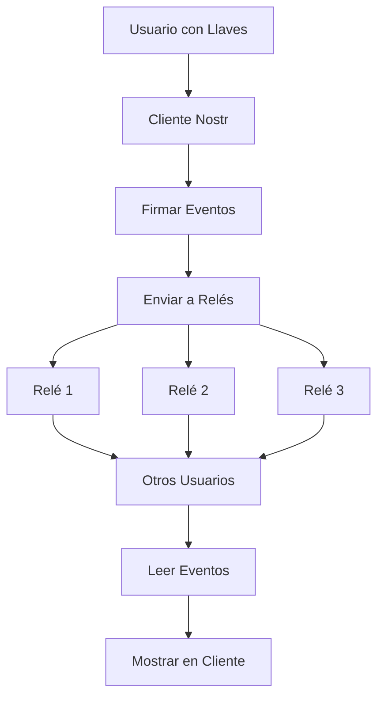

# Fundamentos de Nostr: ¿Qué Significa Nostr?

**Nostr** significa **"Notes and Other Stuff Transmitted by Relays"** (Notas y Otras Cosas Transmitidas por Relés) - un protocolo simple pero poderoso para redes sociales descentralizadas y comunicación.

## Desglosando el Acrónimo

### **N** - Notes (Notas)
El tipo de contenido principal en Nostr. Las notas son mensajes cortos, similares a tweets, que los usuarios publican para compartir pensamientos, actualizaciones e información.

### **O** - Other Stuff (Otras Cosas)
Nostr no se limita solo a notas de texto. "Otras cosas" incluye:
- Imágenes y multimedia
- Artículos de formato largo
- Mensajes directos
- Reacciones y likes
- Pagos Lightning (zaps)
- Eventos en vivo y streams
- Listados de mercado
- Y mucho más...

### **T** - Transmitted (Transmitidas)
Los datos fluyen a través de la red mediante un protocolo simple y estandarizado usando WebSockets y JSON.

### **B** - By (Por)
La preposición que conecta el método de transmisión con la infraestructura.

### **R** - Relays (Relés)
Los servidores que almacenan y reenvían mensajes. A diferencia de las redes sociales tradicionales, ninguna entidad única controla todos los relés.

## Filosofía Central

### 🔓 **Resistencia a la Censura**
No hay un punto único de control, lo que significa que no hay un punto único de falla o censura.

### 🔑 **Propiedad del Usuario**
Tu identidad y datos te pertenecen a ti, no a una plataforma.

### 🌐 **Interoperabilidad**
Todos los clientes pueden comunicarse entre sí a través del mismo protocolo.

### ⚡ **Simplicidad**
El protocolo es intencionalmente simple, haciéndolo fácil de implementar y entender.

## Cómo Funciona Nostr: El Panorama General



### 1. **Capa de Identidad**
- Los usuarios generan pares de llaves criptográficas
- Llave pública = tu identidad
- Llave privada = tu autoridad de firma

### 2. **Capa de Contenido**
- Todo es un "evento" (nota, reacción, actualización de perfil, etc.)
- Los eventos son firmados con tu llave privada
- Los eventos tienen formatos estandarizados (definidos por NIPs)

### 3. **Capa de Red**
- Los eventos se envían a múltiples relés
- Los relés almacenan y reenvían eventos
- Los clientes se conectan a relés para leer/escribir eventos

### 4. **Capa de Aplicación**
- Los clientes proporcionan interfaces de usuario
- Diferentes clientes pueden tener diferentes características
- Todos los clientes pueden interoperar a través del protocolo

## Conceptos Clave

### Eventos
Todo en Nostr es un "evento" - un objeto JSON con campos específicos:

```json
{
  "id": "identificador-unico-evento",
  "pubkey": "llave-publica-autor", 
  "created_at": 1234567890,
  "kind": 1,
  "tags": [],
  "content": "¡Hola Nostr!",
  "sig": "firma-criptografica"
}
```

### Tipos de Eventos (Kinds)
Diferentes tipos de contenido tienen diferentes números de "kind":

- **Kind 0**: Metadatos de usuario (información de perfil)
- **Kind 1**: Notas de texto (como tweets)
- **Kind 3**: Listas de contactos (a quién sigues)
- **Kind 4**: Mensajes directos encriptados
- **Kind 7**: Reacciones (likes, etc.)
- **Y muchos más...**

### Identidad Criptográfica
Tu identidad es tu llave pública:

```
npub1xyz... (formato legible para humanos)
```

Tu llave privada es tu contraseña:
```
nsec1abc... (¡mantén esto secreto!)
```

### Relés
Servidores que:
- Almacenan eventos temporal o permanentemente
- Reenvían eventos a clientes conectados
- Pueden tener sus propias políticas y reglas
- Son operados por diferentes entidades

## ¿Qué Hace a Nostr Diferente?

### Redes Sociales Tradicionales
```
Usuario → Plataforma → Otros Usuarios
```
- La plataforma controla todo
- Punto único de falla
- La plataforma posee tus datos
- La plataforma puede censurar o banear

### Nostr
```
Usuario → Múltiples Relés → Otros Usuarios
```
- Sin control central
- Múltiples rutas para los datos
- Tú posees tu identidad y datos
- La censura requiere un esfuerzo coordinado

## Nostr vs Otros Protocolos

### vs Mastodon/ActivityPub
- **Nostr**: Simple, identidad criptográfica, basado en relés
- **Mastodon**: Complejo, identidad basada en servidor, federación

### vs Bitcoin
- **Nostr**: Protocolo de comunicación, usa criptografía similar
- **Bitcoin**: Protocolo de dinero, consenso de prueba de trabajo

### vs Email
- **Nostr**: Tiempo real, público por defecto, identidad criptográfica
- **Email**: Almacenar y reenviar, privado por defecto, identidad basada en dominio

## El Ecosistema Nostr

### Clientes (Interfaces de Usuario)
- **Damus** (iOS) - Experiencia móvil nativa
- **Amethyst** (Android) - Cliente Android rico en características
- **Iris** (Web) - Cliente basado en navegador
- **Nostrudel** (Web) - Cliente web avanzado
- **Primal** (Multiplataforma) - Caché y descubrimiento

### Relés (Infraestructura)
- **Relés públicos** - Abiertos para todos
- **Relés privados** - Acceso restringido
- **Relés pagos** - Características premium
- **Relés especializados** - Tipos de contenido específicos

### Herramientas y Servicios
- **Integración Lightning** - Pagos Bitcoin
- **Hosting de multimedia** - Almacenamiento de imágenes y videos
- **Motores de búsqueda** - Descubrimiento de contenido
- **Analíticas** - Insights de la red

## Beneficios de Nostr

### Para Usuarios
- **Posee tu identidad** - Ninguna plataforma puede quitártela
- **Elige tu experiencia** - Selecciona clientes que te convengan
- **Evita la censura** - Múltiples relés proporcionan redundancia
- **Gráfico social portable** - Lleva tus seguidores a cualquier lugar

### Para Desarrolladores
- **Protocolo simple** - Fácil de implementar
- **Sin llaves API** - Acceso directo a relés
- **Libertad de innovación** - Construye cualquier característica que quieras
- **Interoperabilidad** - Funciona con todos los otros clientes

### Para la Sociedad
- **Descentralización** - Reduce el poder de las grandes tecnológicas
- **Libertad de expresión** - Más difícil de censurar globalmente
- **Innovación** - Desarrollo sin permisos
- **Resistencia** - Sin punto único de falla

## Conceptos Erróneos Comunes

### ❌ "Nostr es solo otro clon de Twitter"
✅ Nostr es un protocolo que puede soportar muchos tipos de aplicaciones, no solo redes sociales.

### ❌ "Nostr es completamente anónimo"
✅ Nostr proporciona pseudonimato a través de llaves públicas, pero pueden necesitarse medidas adicionales de privacidad.

### ❌ "Nostr es solo para gente de Bitcoin"
✅ Aunque la integración con Bitcoin es popular, Nostr es útil para cualquiera que quiera comunicación descentralizada.

### ❌ "Nostr es demasiado técnico para usuarios normales"
✅ Aunque el protocolo subyacente es técnico, los clientes amigables lo hacen accesible para todos.

## Comenzando con Nostr

### 1. **Elige un Cliente**
Selecciona un cliente amigable como Damus (iOS), Amethyst (Android), o Iris (web).

### 2. **Genera Llaves**
La mayoría de clientes generarán llaves automáticamente.

### 3. **Configura tu Perfil**
Agrega tu nombre, biografía e imagen de perfil.

### 4. **Encuentra Gente**
Sigue cuentas interesantes y únete a conversaciones.

### 5. **Comienza a Publicar**
Comparte tus pensamientos y participa en la comunidad.

## El Futuro de Nostr

### Corto Plazo
- Mejor experiencia de usuario
- Más características en clientes
- Infraestructura de relés mejorada
- Opciones de privacidad mejoradas

### Largo Plazo
- Integración con otros protocolos
- Nuevos tipos de aplicaciones más allá de redes sociales
- Adopción global como estándar de comunicación
- Capas económicas y monetización

## Inmersión Técnica Profunda

### Simplicidad del Protocolo
El poder de Nostr viene de su simplicidad:

```javascript
// Todo el protocolo en pseudocódigo
function publishEvent(event, relays) {
  const signedEvent = sign(event, privateKey)
  relays.forEach(relay => relay.send(signedEvent))
}

function subscribeToEvents(filter, relays) {
  relays.forEach(relay => {
    relay.subscribe(filter, (event) => {
      if (verify(event.signature, event.pubkey)) {
        displayEvent(event)
      }
    })
  })
}
```

### Fundamento Criptográfico
- **Firmas Schnorr** (igual que Bitcoin)
- Curva elíptica **secp256k1**
- Hashing **SHA-256**
- Codificación **NIP-19** para llaves legibles por humanos

## Recursos para Aprender Más

### Documentación Oficial
- [Protocolo Nostr](https://github.com/nostr-protocol/nostr)
- [Repositorio NIPs](https://github.com/nostr-protocol/nips)

### Comunidad
- [Telegram Nostr](https://t.me/nostr_protocol)
- [Reddit r/nostr](https://reddit.com/r/nostr)
- [Nostr en Nostr](https://nostr.com)

### Desarrollo
- [Awesome Nostr](https://github.com/aljazceru/awesome-nostr)
- [Herramientas Nostr](https://github.com/nbd-wtf/nostr-tools)
- [Chat de Desarrolladores](https://t.me/nostr_dev)

!!! quote "Visión de Nostr"
    "El protocolo abierto más simple que es capaz de crear una red 'social' global resistente a la censura de una vez por todas." - fiatjaf (creador de Nostr)

!!! tip "Recuerda"
    Nostr no es solo una red social - es un protocolo de comunicación que puede alimentar muchos tipos diferentes de aplicaciones. ¡El caso de uso de redes sociales es solo el comienzo!