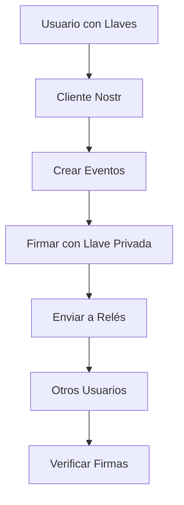

# Fundamentos de Nostr

Esta página está siendo traducida al español.

**Página original en inglés:** [Nostr Fundamentals](/en/concepts/nostr-fundamentals/)

---

## Conceptos Centrales de Nostr

Nostr se basa en principios simples pero poderosos que crean una red social verdaderamente descentralizada.

### Arquitectura Fundamental

#### Sin Servidores Centrales
- No hay "Twitter" o "Facebook" central
- Red distribuida de relés independientes
- Ninguna entidad controla toda la red

#### Identidad Criptográfica
- Tu identidad = par de llaves criptográficas
- No necesitas "registrarte" en ningún lugar
- Tu identidad es tuya para siempre

#### Eventos como Datos
- Todo es un "evento" (posts, perfiles, follows)
- Eventos son firmados criptográficamente
- Inmutables una vez creados

### Componentes Clave

#### 1. Llaves Criptográficas
- **Llave Privada**: Tu secreto, controla tu identidad
- **Llave Pública**: Tu dirección, compartible públicamente

#### 2. Eventos
- Estructura de datos estándar
- Contiene timestamp, contenido, firma
- Diferentes "kinds" para diferentes tipos

#### 3. Relés
- Servidores simples que almacenan/retransmiten eventos
- Implementan protocolo WebSocket básico
- Políticas independientes de moderación

#### 4. Clientes
- Aplicaciones que interactúan con relés
- Manejan llaves y crean eventos
- Proporcionan interfaz de usuario

### Ventajas del Diseño

#### Resistencia a la Censura
- Múltiples relés = múltiples copias
- Si un relé censura, usa otros
- Imposible censura global

#### Portabilidad de Identidad
- Mismas llaves funcionan en todos los clientes
- Puedes cambiar apps sin perder seguidores
- Tu identidad no depende de ninguna empresa

#### Interoperabilidad
- Todos los clientes hablan el mismo protocolo
- Puedes seguir a alguien desde cualquier app
- Ecosistema competitivo de aplicaciones

#### Simplicidad
- Protocolo fácil de implementar
- Pocos componentes centrales
- Fácil de entender y auditar

### Diferencias con Redes Tradicionales

| Aspecto | Redes Tradicionales | Nostr |
|---------|-------------------|-------|
| **Identidad** | Username + Password | Llaves Criptográficas |
| **Datos** | Base de datos central | Eventos distribuidos |
| **Control** | Empresa propietaria | Usuario individual |
| **Censura** | Fácil y efectiva | Muy difícil |
| **Portabilidad** | Imposible | Total |

---

*Esta traducción está en progreso. Visita la versión en inglés para el contenido completo.*
