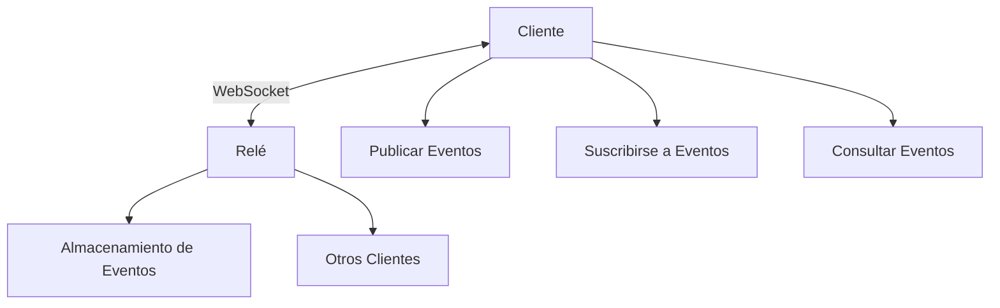

# Relés: La Infraestructura de Nostr

!!! info "Objetivos de Aprendizaje"
    Después de esta lección, entenderás:
    
    - Qué son los relés y cómo funcionan
    - El protocolo de comunicación relé-cliente
    - Diferentes tipos de relés y sus propósitos
    - Cómo elegir y gestionar relés
    - Políticas y limitaciones de relés

## ¿Qué son los Relés?

Los relés son los servidores que forman la columna vertebral de la red Nostr. Almacenan, reenvían y sirven eventos a los clientes. A diferencia de las redes sociales tradicionales donde una empresa controla todos los servidores, el sistema de relés de Nostr es descentralizado - cualquiera puede ejecutar un relé.

### Características Clave

- **Servidores simples**: Almacenan y reenvían eventos JSON
- **Basados en WebSocket**: Comunicación bidireccional en tiempo real
- **Sin lógica compleja**: Se enfocan en almacenamiento y entrega de datos
- **Intercambiables**: Los clientes pueden usar cualquier relé
- **Operados independientemente**: Diferentes personas ejecutan diferentes relés

## Cómo Funcionan los Relés

### Funciones Básicas

1. **Aceptar eventos** de clientes
2. **Almacenar eventos** (temporal o permanentemente)
3. **Reenviar eventos** a clientes suscritos
4. **Filtrar solicitudes** basándose en consultas de clientes
5. **Aplicar políticas** (limitación de velocidad, reglas de contenido, etc.)

### Comunicación Relé-Cliente

La comunicación ocurre sobre conexiones WebSocket usando mensajes JSON simples:



## Tipos de Mensajes

### Mensajes de Cliente a Relé

#### **EVENT** - Publicando Eventos
```json
["EVENT", {
  "id": "id-evento",
  "pubkey": "pubkey-autor",
  "created_at": 1234567890,
  "kind": 1,
  "tags": [],
  "content": "¡Hola Nostr!",
  "sig": "firma"
}]
```

#### **REQ** - Suscribiéndose a Eventos
```json
["REQ", "id-suscripcion", {
  "kinds": [1],
  "authors": ["pubkey1", "pubkey2"],
  "since": 1234567890,
  "limit": 100
}]
```

#### **CLOSE** - Cerrando Suscripciones
```json
["CLOSE", "id-suscripcion"]
```

#### **AUTH** - Autenticación
```json
["AUTH", {
  "id": "id-evento-desafio",
  "pubkey": "pubkey-cliente",
  "created_at": 1234567890,
  "kind": 22242,
  "tags": [["challenge", "string-desafio"]],
  "content": "",
  "sig": "firma"
}]
```

#### **COUNT** - Solicitando Conteos de Eventos
```json
["COUNT", "id-suscripcion", {
  "kinds": [1],
  "authors": ["pubkey"]
}]
```

### Mensajes de Relé a Cliente

#### **EVENT** - Enviando Eventos
```json
["EVENT", "id-suscripcion", {
  "id": "id-evento",
  "pubkey": "pubkey-autor",
  "created_at": 1234567890,
  "kind": 1,
  "tags": [],
  "content": "¡Hola Nostr!",
  "sig": "firma"
}]
```

#### **EOSE** - Fin de Eventos Almacenados
```json
["EOSE", "id-suscripcion"]
```

#### **OK** - Respuesta de Aceptación de Evento
```json
["OK", "id-evento", true, ""]
["OK", "id-evento", false, "bloqueado: violación de política de contenido"]
```

#### **CLOSED** - Suscripción Cerrada
```json
["CLOSED", "id-suscripcion", "límite de velocidad: demasiadas suscripciones"]
```

#### **NOTICE** - Mensajes Legibles para Humanos
```json
["NOTICE", "Este relé requiere autenticación"]
```

#### **AUTH** - Desafío de Autenticación
```json
["AUTH", "string-desafio"]
```

#### **COUNT** - Respuesta de Conteo de Eventos
```json
["COUNT", "id-suscripcion", {"count": 42}]
```

## Documento de Información del Relé (NIP-11)

Los relés pueden proporcionar metadatos sobre sus capacidades:

```bash
curl -H "Accept: application/nostr+json" https://relay.example.com
```

```json
{
  "name": "Mi Relé Nostr",
  "description": "Un relé para la comunidad Nostr",
  "pubkey": "pubkey-admin-relé",
  "contact": "admin@relay.example.com",
  "supported_nips": [1, 2, 9, 11, 12, 15, 16, 20, 22],
  "software": "strfry",
  "version": "0.9.6",
  "limitation": {
    "max_message_length": 16384,
    "max_subscriptions": 300,
    "max_limit": 5000,
    "max_subid_length": 100,
    "max_event_tags": 100,
    "max_content_length": 8196,
    "min_pow_difficulty": 0,
    "auth_required": false,
    "payment_required": false,
    "restricted_writes": false
  },
  "relay_countries": ["MX", "US"],
  "language_tags": ["es", "en"],
  "tags": ["sfw-only", "bitcoin-only"],
  "posting_policy": "https://relay.example.com/policy"
}
```

### Campos de Información Clave

#### **Información Básica**
- `name`: Nombre legible del relé
- `description`: Información detallada sobre el relé
- `pubkey`: Llave pública del administrador para contacto
- `contact`: Método de contacto alternativo
- `software`: Nombre de la implementación del relé
- `version`: Versión del software

#### **Capacidades**
- `supported_nips`: Qué NIPs están implementados
- `limitation`: Límites técnicos y requisitos
- `relay_countries`: Jurisdicciones legales
- `language_tags`: Idiomas principales
- `tags`: Políticas de contenido y áreas de enfoque

## Tipos de Relés

### Por Modelo de Acceso

#### **Relés Públicos**
- Abiertos para todos
- No requieren registro
- Pueden tener límites de velocidad
- Ejemplos: `relay.damus.io`, `nos.lol`

#### **Relés Privados**
- Acceso restringido
- Solo por invitación o lista blanca
- A menudo para comunidades específicas
- Ejemplos: Relés familiares, corporativos

#### **Relés de Pago**
- Requieren pago para acceso
- Mejor protección contra spam
- A menudo mayor confiabilidad
- Pueden ofrecer características premium

### Por Propósito

#### **Propósito General**
- Aceptan todos los tipos de eventos
- Sirven a comunidades amplias
- Tipo más común

#### **Relés Especializados**
- Se enfocan en tipos específicos de eventos
- Ejemplos:
  - Relés de multimedia (imágenes, videos)
  - Relés de contenido de formato largo
  - Relés de zaps Lightning
  - Relés de mercado

#### **Relés Personales**
- Ejecutados por individuos
- Almacenan respaldo personal
- Comparten con amigos/familia
- Control completo de datos

### Por Política de Retención

#### **Relés de Archivo**
- Almacenan eventos permanentemente
- Preservación de datos históricos
- Pueden cobrar por almacenamiento a largo plazo

#### **Relés Efímeros**
- Almacenamiento a corto plazo
- Se enfocan en comunicación en tiempo real
- Menores costos de almacenamiento

#### **Relés Filtrados**
- Almacenamiento selectivo
- Moderación de contenido
- Enfoque específico en temas

## Ejecutar Tu Propio Relé

### ¿Por Qué Ejecutar un Relé?

#### **Beneficios Personales**
- Control completo de datos
- Políticas personalizadas
- Respaldo y preservación de datos
- Privacidad y seguridad
- Sin dependencia de terceros

#### **Beneficios Comunitarios**
- Apoyar la descentralización de la red
- Proporcionar servicio a la comunidad
- Habilitar libertad de expresión
- Reducir riesgos de censura

### Software Popular de Relés

#### **strfry**
- Implementación de alto rendimiento en C++
- Almacenamiento e indexación eficiente
- Listo para producción
- Desarrollo activo

```bash
# Instalar strfry
git clone https://github.com/hoytech/strfry.git
cd strfry
make setup-golpe
make -j4
```

#### **nostream**
- Implementación TypeScript/Node.js
- Fácil de modificar y extender
- Bueno para desarrollo
- Backend PostgreSQL

```bash
# Instalar nostream
git clone https://github.com/Cameri/nostream.git
cd nostream
npm install
npm run build
```

#### **khatru**
- Implementación en Go
- Simple y ligero
- Fácil de desplegar
- Buen rendimiento

```bash
# Instalar khatru
go install github.com/fiatjaf/khatru@latest
```

### Configuración de Relé

#### **Configuración Básica**
```yaml
# strfry.conf
db = "./strfry-db/"
bind = "0.0.0.0:7777"
nofiles = 1000000

relay:
  name: "Mi Relé Personal"
  description: "Un relé para mis amigos y familia"
  pubkey: "tu-pubkey-aquí"
  contact: "admin@mirelé.com"
  
rejectFilters:
  - kinds: []
    authors: []
    tags:
      "#t": ["spam", "inapropiado"]
```

#### **Control de Acceso**
```yaml
# Autenticación requerida
auth:
  required: true
  whitelist:
    - "pubkey1"
    - "pubkey2"

# Pago requerido
payment:
  required: true
  amount: 1000  # sats por mes
  bolt11: "dirección-pago"
```

### Opciones de Hosting

#### **Auto-hospedado**
- Control completo
- Hardware personalizado
- Requisitos de red
- Responsabilidad de mantenimiento

#### **VPS/Nube**
- Hosting profesional
- Infraestructura gestionada
- Recursos escalables
- Distribución geográfica

#### **Despliegue Docker**
```dockerfile
FROM ubuntu:22.04

# Instalar dependencias
RUN apt-get update && apt-get install -y \
    build-essential \
    git \
    pkg-config

# Clonar y compilar strfry
RUN git clone https://github.com/hoytech/strfry.git
WORKDIR /strfry
RUN make setup-golpe && make -j4

# Configurar y ejecutar
COPY strfry.conf .
EXPOSE 7777
CMD ["./strfry", "relay"]
```

## Selección y Gestión de Relés

### Criterios de Selección

#### **Confiabilidad**
- Tiempo de actividad histórico
- Velocidad de respuesta
- Estabilidad de conexión
- Respaldo de infraestructura

#### **Políticas**
- Moderación de contenido
- Términos de servicio
- Política de privacidad
- Retención de datos

#### **Rendimiento**
- Latencia de red
- Ancho de banda
- Límites de velocidad
- Capacidades de filtrado

#### **Diversidad**
- Ubicación geográfica
- Operadores diferentes
- Jurisdicciones legales
- Políticas variadas

### Estrategias de Gestión

#### **Configuración Múltiple**
```javascript
const configuraciónRelés = {
  lectura: [
    'wss://relay.damus.io',
    'wss://nos.lol',
    'wss://relay.snort.social'
  ],
  escritura: [
    'wss://relay.damus.io',
    'wss://nostr.wine',
    'wss://relay.current.fyi'
  ],
  búsqueda: [
    'wss://relay.nostr.band',
    'wss://search.nos.today'
  ]
}
```

#### **Monitoreo de Salud**
```javascript
class MonitorRelés {
  constructor(relés) {
    this.relés = relés
    this.estadísticas = new Map()
  }
  
  async verificarSalud(url) {
    const inicio = Date.now()
    try {
      const ws = new WebSocket(url)
      await new Promise((resolve, reject) => {
        ws.onopen = resolve
        ws.onerror = reject
        setTimeout(reject, 5000) // timeout 5s
      })
      
      const latencia = Date.now() - inicio
      this.actualizarEstadísticas(url, { latencia, estado: 'conectado' })
      ws.close()
      
    } catch (error) {
      this.actualizarEstadísticas(url, { error: error.message, estado: 'desconectado' })
    }
  }
  
  actualizarEstadísticas(url, datos) {
    const stats = this.estadísticas.get(url) || { 
      éxitos: 0, 
      fallos: 0, 
      últimaVerificación: null 
    }
    
    if (datos.estado === 'conectado') {
      stats.éxitos++
    } else {
      stats.fallos++
    }
    
    stats.últimaVerificación = Date.now()
    stats.latenciaPromedio = datos.latencia || stats.latenciaPromedio
    
    this.estadísticas.set(url, stats)
  }
  
  obtenerMejoresRelés(cantidad = 3) {
    return Array.from(this.estadísticas.entries())
      .filter(([url, stats]) => stats.éxitos > stats.fallos)
      .sort(([,a], [,b]) => (a.latenciaPromedio || 999) - (b.latenciaPromedio || 999))
      .slice(0, cantidad)
      .map(([url]) => url)
  }
}

// Uso
const monitor = new MonitorRelés(urlsRelés)
setInterval(() => {
  urlsRelés.forEach(url => monitor.verificarSalud(url))
}, 60000) // verificar cada minuto
```

### Balanceamiento de Carga

```javascript
class BalanceadorRelés {
  constructor(relés) {
    this.relés = relés
    this.índiceActual = 0
  }
  
  obtenerReléParaLectura() {
    // Round robin simple
    const relé = this.relés.lectura[this.índiceActual]
    this.índiceActual = (this.índiceActual + 1) % this.relés.lectura.length
    return relé
  }
  
  async publicarATodos(evento) {
    const promesas = this.relés.escritura.map(async (url) => {
      try {
        const resultado = await this.publicarARelé(url, evento)
        return { url, éxito: true, resultado }
      } catch (error) {
        return { url, éxito: false, error: error.message }
      }
    })
    
    const resultados = await Promise.allSettled(promesas)
    return resultados.map(r => r.value)
  }
  
  async publicarARelé(url, evento) {
    const ws = new WebSocket(url)
    
    return new Promise((resolve, reject) => {
      ws.onopen = () => {
        ws.send(JSON.stringify(['EVENT', evento]))
      }
      
      ws.onmessage = (msg) => {
        const [tipo, eventoId, aceptado, mensaje] = JSON.parse(msg.data)
        if (tipo === 'OK') {
          if (aceptado) {
            resolve({ eventoId, mensaje })
          } else {
            reject(new Error(mensaje))
          }
        }
      }
      
      ws.onerror = reject
      setTimeout(() => reject(new Error('Timeout')), 10000)
    })
  }
}
```

## Consideraciones de Privacidad y Seguridad

### Filtración de Metadatos

Los relés pueden ver:
- **Direcciones IP** de clientes
- **Patrones de conexión** y actividad
- **Consultas y filtros** utilizados
- **Timing de publicaciones**

### Mitigaciones

#### **Uso de Tor**
```javascript
// Conectar a través de proxy Tor
const relay = new WebSocket('wss://relay.example.com', {
  agent: new SocksProxyAgent('socks5://127.0.0.1:9050')
})
```

#### **Rotación de Relés**
```javascript
class RotadorRelés {
  constructor(relés) {
    this.relés = relés
    this.índice = 0
  }
  
  obtenerSiguienteRelé() {
    const relé = this.relés[this.índice]
    this.índice = (this.índice + 1) % this.relés.length
    return relé
  }
  
  async consultar(filtro) {
    const reléActual = this.obtenerSiguienteRelé()
    // Usar relé diferente para cada consulta
    return this.consultarRelé(reléActual, filtro)
  }
}
```

#### **Consultas Distribuidas**
```javascript
async function consultarDistribuido(filtro, relés) {
  // Dividir consulta entre múltiples relés
  const resultados = await Promise.all(
    relés.map(relé => consultarRelé(relé, filtro))
  )
  
  // Combinar y deduplicar resultados
  const todosEventos = resultados.flat()
  const eventosÚnicos = new Map()
  
  todosEventos.forEach(evento => {
    eventosÚnicos.set(evento.id, evento)
  })
  
  return Array.from(eventosÚnicos.values())
}
```

## Economía de Relés

### Modelos de Monetización

#### **Suscripciones de Pago**
- Tarifa mensual/anual
- Acceso premium
- Características adicionales
- Mejor soporte

#### **Pagos por Uso**
- Pago por evento publicado
- Pago por consulta
- Pago por almacenamiento
- Micro-transacciones Lightning

#### **Patrocinio**
- Financiamiento comunitario
- Donaciones
- Patrocinio corporativo
- Grants y subvenciones

### Costos Operacionales

#### **Infraestructura**
- Servidor/hosting
- Ancho de banda
- Almacenamiento
- Respaldo y redundancia

#### **Operación**
- Mantenimiento técnico
- Moderación de contenido
- Soporte al usuario
- Actualizaciones de seguridad

#### **Legal**
- Cumplimiento regulatorio
- Costos legales
- Seguros
- Licencias

## Futuro de los Relés

### Tendencias Emergentes

#### **Relés Especializados**
- Enfoque en nichos específicos
- Optimización para casos de uso
- Características únicas
- Comunidades dedicadas

#### **Mejoras de Rendimiento**
- Algoritmos de caché avanzados
- Optimización de base de datos
- Redes de distribución de contenido
- Compresión de datos

#### **Integración de IA**
- Moderación automática
- Recomendaciones de contenido
- Detección de spam
- Análisis de sentimiento

#### **Protocolos Avanzados**
- Sincronización eficiente
- Protocolos de consenso
- Replicación automática
- Recuperación de fallos

## Próximos Pasos

Ahora que entiendes los relés, explora:

- [Eventos y Mensajes](../events-and-messages/) - Qué almacenan y reenvían los relés
- [Construyendo Aplicaciones](../../tutorials/) - Cómo trabajar con relés en código
- [Temas Avanzados](../advanced/) - Características especializadas de relés

!!! tip "Comenzando"
    Comienza entendiendo cómo usar relés como cliente, luego experimenta ejecutando tu propio relé para aprender. Considera los factores comunitarios y económicos al decidir si ejecutar un relé público.

---

<div class="next-lesson">
  <a href="../events-and-messages/" class="btn btn-primary">
    Eventos y Mensajes →
  </a>
</div>

## Quiz de Comprensión

!!! question "Prueba Tu Entendimiento"
    
    1. ¿Cuáles son las funciones principales de un relé Nostr?
    2. ¿Qué información puede revelar el documento NIP-11 de un relé?
    3. ¿Cuál es la diferencia entre relés públicos, privados y de pago?
    4. ¿Por qué es importante usar múltiples relés en lugar de uno solo?
    
    ??? success "Respuestas"
        1. Aceptar, almacenar, reenviar y filtrar eventos; aplicar políticas de uso
        2. Capacidades técnicas, limitaciones, NIPs soportados, políticas de contenido, información de contacto
        3. Públicos (abiertos a todos), privados (acceso restringido), de pago (requieren suscripción)
        4. Para redundancia, resistencia a censura, mejor rendimiento y evitar dependencia de un solo operador