# Entendiendo Zaps

!!! info "Objetivos de Aprendizaje"
    Al final de esta lección, entenderás:
    
    - Qué son los zaps y por qué son revolucionarios
    - Cómo funcionan los zaps técnicamente (NIP-57)
    - Diferentes tipos de zaps y sus casos de uso
    - La economía e incentivos que crean los zaps
    - Consideraciones de privacidad con zaps

## ¿Qué Son los Zaps?

Los **Zaps** son pagos instantáneos de Bitcoin enviados a través de Lightning Network que están criptográficamente vinculados a eventos Nostr. Representan un cambio fundamental de los "likes" tradicionales de redes sociales hacia interacciones de **valor-por-valor**.

!!! tip "Valor-por-Valor"
    En lugar de regalar tu atención gratis a anunciantes, los zaps te permiten apoyar directamente a creadores y señalar contenido de calidad con valor económico real.

### Características Clave

- ⚡ **Instantáneos**: Los pagos se liquidan en milisegundos
- 🔒 **Criptográficamente Verificados**: Vinculados a eventos Nostr específicos
- 💰 **Micropagos**: Pueden ser tan pequeños como 1 satoshi (0.00000001 BTC)
- 🌍 **Globales**: Funcionan en cualquier parte del mundo
- 🔓 **Sin Permisos**: Sin intermediarios o porteros

## Cómo Funcionan los Zaps (NIP-57)

Los zaps están definidos por **NIP-57** (Posibilidad de Implementación Nostr 57) e involucran una danza sofisticada entre tu cliente Nostr, billetera Lightning, y el servicio Lightning del destinatario.

### El Flujo del Zap

```mermaid
sequenceDiagram
    participant User as Tú
    participant Client as Cliente Nostr
    participant Wallet as Billetera Lightning
    participant LNURL as LNURL Destinatario
    participant Relay as Relé Nostr
    
    User->>Client: Hacer clic en Zap en post
    Client->>LNURL: Solicitar endpoint de zap
    LNURL-->>Client: Devolver plantilla de solicitud de pago
    Client->>Wallet: Generar factura por cantidad
    Wallet-->>Client: Factura Lightning
    Client->>LNURL: Enviar factura + evento Nostr
    LNURL->>LNURL: Procesar pago
    LNURL->>Relay: Publicar recibo de zap (kind 9735)
    Relay-->>Client: Aparece recibo de zap
    Client->>User: Mostrar confirmación de zap
```



### Componentes Técnicos

**1. Lightning Address**
- Identificador legible para humanos (como email)
- Ejemplo: `alice@getalby.com`
- Se resuelve a endpoint LNURL-pay

**2. LNURL-pay**
- Protocolo para solicitar pagos Lightning
- Maneja la generación de solicitudes de pago
- Devuelve confirmación de pago

**3. Solicitud de Zap (Kind 9734)**
- Evento Nostr que describe el zap intencionado
- Contiene destinatario, cantidad y mensaje opcional
- Firmado por la llave privada del remitente

**4. Recibo de Zap (Kind 9735)**
- Prueba de que el pago fue realizado
- Publicado por el servicio Lightning del destinatario
- Contiene preimage de pago como prueba

## Tipos de Zaps

### Zaps Regulares
Zaps estándar que aparecen públicamente en posts:

```json
{
  "kind": 9735,
  "content": "¡Gran post! ⚡",
  "tags": [
    ["bolt11", "lnbc..."],
    ["description", "..."],
    ["p", "pubkey_destinatario"],
    ["e", "id_evento"]
  ]
}
```

### Zaps Anónimos
Zaps sin revelar la identidad del remitente:
- El pago se realiza pero la información del remitente está oculta
- Útil para usuarios conscientes de la privacidad
- Aún criptográficamente verificable

### Zaps Privados
Zaps que no aparecen públicamente:
- Solo el remitente y destinatario saben sobre ellos
- No se publica recibo público de zap
- Máxima privacidad

### Objetivos de Zap
Mecanismo de crowdfunding usando zaps:
- Establecer una cantidad objetivo para un proyecto
- La comunidad puede zapear hacia la meta
- Seguimiento transparente del progreso

## La Economía de los Zaps

### Micro-Economía
Los zaps permiten **micro-transacciones** que no eran posibles antes:

- **1 sat** = ~$0.0003 (varía con el precio de Bitcoin)
- **21 sats** = Número popular de "Bitcoin"
- **100 sats** = Apreciación significativa
- **1,000 sats** = Apoyo fuerte
- **10,000+ sats** = Contribución significativa

### Incentivos para Creadores

**El Contenido de Calidad Sube**
- El buen contenido recibe más zaps
- Los creadores ganan directamente de su audiencia
- No necesidad de publicidad o patrocinios

**Retroalimentación Inmediata**
- Señal económica instantánea del valor del contenido
- Más significativo que likes o corazones
- Fomenta publicaciones reflexivas

**Monetización Global**
- Cualquiera, en cualquier lugar puede ganar Bitcoin
- Sin restricciones geográficas
- Sin umbrales mínimos de pago

### Efectos de Red

**El Valor Fluye hacia el Valor**
- Bitcoin fluye naturalmente hacia contenido valioso
- Crea bucles de retroalimentación positiva
- Recompensa contribución genuina sobre farming de engagement

**Reducción de Spam**
- Pequeño costo para interactuar reduce spam
- Incentivo económico para calidad
- Estándares comunitarios autorregulados

## Etiqueta y Cultura de Zaps

### Cantidades Comunes de Zap

| Cantidad | Significado | Caso de Uso |
|----------|-------------|-------------|
| **1 sat** | Reconocimiento | "Vi esto" |
| **21 sats** | Apreciación Bitcoin | Like estándar |
| **100 sats** | Buen contenido | Post de calidad |
| **500 sats** | Gran contenido | Post excelente |
| **1,000+ sats** | Excepcional | Trabajo sobresaliente |
| **10,000+ sats** | Apoyo | Contribución mayor |

### Cuándo Zapear

**✅ Buenos Momentos para Zapear:**
- Contenido que te enseñó algo
- Posts que te hicieron reír
- Respuestas útiles a preguntas
- Investigación original o insights
- Apoyar creadores que aprecias

**❌ Evita Zapear:**
- Contenido con el que no estás de acuerdo (a menos que sea constructivo)
- Spam o posts de poco esfuerzo
- Solo para obtener atención
- Tus propios posts (generalmente mal visto)

### Mensajes de Zap
Muchos zaps incluyen mensajes cortos:
- Manténlos positivos y constructivos
- Los emoji son populares (⚡🚀🔥💜)
- Explicaciones breves de por qué zapeaste
- Aliento para creadores

## Consideraciones de Privacidad

### Qué es Público
- **Cantidad del zap** (usualmente)
- **Destinatario** (siempre)
- **Post asociado** (si aplica)
- **Mensaje del zap** (si se incluye)

### Qué Puede Ser Privado
- **Identidad del remitente** (con zaps anónimos)
- **Detalles de pago** (privacidad Lightning)
- **Timing exacto** (algo de ofuscación posible)

### Consejos de Privacidad
- Usa diferentes direcciones Lightning para diferentes propósitos
- Considera zaps anónimos para temas sensibles
- Ten en cuenta que los patrones de pago pueden analizarse
- Los pagos Lightning son más privados que Bitcoin on-chain

## Configurar Zaps

### Requisitos
1. **Billetera Lightning** (Alby, Wallet of Satoshi, etc.)
2. **Dirección Lightning** (tunombre@getalby.com)
3. **Cliente Nostr** que soporte zaps
4. **Algo de Bitcoin** para enviar zaps

### Pasos de Configuración
1. **Configurar billetera Lightning** (ver [Guía de Configuración de Billetera](../getting-started/wallet-setup.md))
2. **Agregar dirección Lightning al perfil Nostr**
3. **Probar con zaps pequeños** a ti mismo o amigos
4. **Empezar a zapear contenido que aprecias**

## Características Avanzadas de Zaps

### Divisiones de Zap
Algunos clientes soportan dividir zaps:
- Enviar a múltiples destinatarios
- Útil para colaboraciones
- Distribución automática de ingresos

### Zaps Recurrentes
Zaps tipo suscripción:
- Pagos regulares a creadores
- Apoyo automatizado
- Funcionalidad tipo Patreon

### Zaps Condicionales
Características tipo contrato inteligente:
- Zaps que se desbloquean bajo ciertas condiciones
- Liberaciones basadas en objetivos
- Pagos con tiempo bloqueado

## Solución de Problemas de Zaps

### Problemas Comunes

**"Falló el envío del zap"**
- Verificar saldo de billetera
- Verificar que la dirección Lightning sea correcta
- Intentar con cantidad menor
- Verificar conexión a internet

**"No se ve botón de zap"**
- El destinatario puede no tener dirección Lightning configurada
- El cliente puede no soportar zaps
- Verificar si los zaps están habilitados en configuraciones

**"Zap no aparece"**
- Puede tomar unos segundos procesarse
- Verificar si se usan relés compatibles
- Refrescar el cliente

### Mejores Prácticas
- Empezar con cantidades pequeñas mientras aprendes
- Mantener algo de Bitcoin en tu billetera Lightning
- Probar zaps con amigos primero
- Monitorear tu gasto

## El Futuro de los Zaps

### Tendencias Emergentes
- Juegos y aplicaciones **zap-to-earn**
- **Zapping algorítmico** basado en preferencias
- **Zaps multiplataforma** más allá de Nostr
- **Integración con pagos tradicionales**

### Desarrollos Potenciales
- **Zaps de moneda estable** para estabilidad de precio
- **Zaps programables** con contratos inteligentes
- **Analíticas de zap** para creadores
- **Soluciones empresariales de zap**

## Impacto en Redes Sociales

Los zaps representan un cambio fundamental en cómo pensamos sobre las redes sociales:

### De Economía de Atención a Economía de Valor
- **Tradicional**: Tu atención es el producto vendido a anunciantes
- **Zaps**: Tu atención tiene valor económico directo que controlas

### De Farming de Engagement a Contenido de Calidad
- **Tradicional**: Optimizar para clics, vistas, tiempo gastado
- **Zaps**: Optimizar para valor genuino y apreciación

### De Lock-in de Plataforma a Libertad de Creador
- **Tradicional**: La plataforma controla monetización y puede banearte
- **Zaps**: Pagos directos peer-to-peer, sin intermediarios

## Implementación Técnica de Zaps

### Configurando Lightning Address

```javascript
// Ejemplo de configuración de perfil con Lightning Address
const perfilConZaps = {
  kind: 0,
  content: JSON.stringify({
    name: "Alicia",
    about: "Creadora de contenido Bitcoin",
    picture: "https://example.com/alice.jpg",
    lud16: "alice@getalby.com", // Lightning Address
    lud06: "https://getalby.com/.well-known/lnurlp/alice" // LNURL-pay
  }),
  created_at: Math.floor(Date.now() / 1000),
  tags: []
}
```

### Procesando Zaps en Cliente

```javascript
class ManejadorZaps {
  constructor(cliente) {
    this.cliente = cliente
    this.billetera = new BilleteraLightning()
  }
  
  async enviarZap(eventoDestino, cantidad, mensaje = '') {
    try {
      // 1. Obtener Lightning Address del destinatario
      const perfil = await this.obtenerPerfil(eventoDestino.pubkey)
      const lightningAddress = perfil.lud16 || perfil.lud06
      
      if (!lightningAddress) {
        throw new Error('Destinatario no tiene Lightning Address configurada')
      }
      
      // 2. Crear solicitud de zap
      const solicitudZap = {
        kind: 9734,
        content: mensaje,
        created_at: Math.floor(Date.now() / 1000),
        tags: [
          ['p', eventoDestino.pubkey],
          ['e', eventoDestino.id],
          ['amount', (cantidad * 1000).toString()], // msat
          ['relays', ...this.cliente.relés]
        ]
      }
      
      const solicitudFirmada = await this.cliente.firmarEvento(solicitudZap)
      
      // 3. Solicitar factura Lightning
      const factura = await this.solicitarFactura(
        lightningAddress, 
        cantidad, 
        solicitudFirmada
      )
      
      // 4. Pagar factura
      const resultadoPago = await this.billetera.pagarFactura(factura.bolt11)
      
      if (resultadoPago.success) {
        console.log('💜 Zap enviado exitosamente!')
        return {
          éxito: true,
          factura: factura.bolt11,
          preimage: resultadoPago.preimage
        }
      }
      
    } catch (error) {
      console.error('Error enviando zap:', error)
      throw error
    }
  }
  
  async solicitarFactura(lightningAddress, cantidad, solicitudZap) {
    // Resolver Lightning Address a LNURL
    const [usuario, dominio] = lightningAddress.split('@')
    const lnurlEndpoint = `https://${dominio}/.well-known/lnurlp/${usuario}`
    
    // Obtener información del endpoint
    const respuesta = await fetch(lnurlEndpoint)
    const info = await respuesta.json()
    
    // Verificar límites
    if (cantidad * 1000 < info.minSendable || cantidad * 1000 > info.maxSendable) {
      throw new Error(`Cantidad fuera del rango permitido`)
    }
    
    // Solicitar factura
    const facturaResponse = await fetch(info.callback, {
      method: 'GET',
      headers: {
        'Content-Type': 'application/json'
      },
      body: JSON.stringify({
        amount: cantidad * 1000, // msat
        nostr: JSON.stringify(solicitudZap),
        comment: solicitudZap.content
      })
    })
    
    return facturaResponse.json()
  }
  
  async obtenerPerfil(pubkey) {
    const eventos = await this.cliente.obtenerEventos([{
      kinds: [0],
      authors: [pubkey],
      limit: 1
    }])
    
    if (eventos.length === 0) {
      throw new Error('Perfil no encontrado')
    }
    
    return JSON.parse(eventos[0].content)
  }
  
  // Escuchar recibos de zap
  suscribirseAZaps(callback) {
    return this.cliente.suscribirse([{
      kinds: [9735], // Recibos de zap
      '#p': [this.cliente.publicKey] // Zaps para mí
    }], (evento) => {
      const zapInfo = this.procesarReciboZap(evento)
      callback(zapInfo)
    })
  }
  
  procesarReciboZap(evento) {
    const bolt11Tag = evento.tags.find(tag => tag[0] === 'bolt11')
    const descripcionTag = evento.tags.find(tag => tag[0] === 'description')
    const pTag = evento.tags.find(tag => tag[0] === 'p')
    const eTag = evento.tags.find(tag => tag[0] === 'e')
    
    if (!bolt11Tag || !descripcionTag) {
      throw new Error('Recibo de zap inválido')
    }
    
    // Decodificar factura Lightning para obtener cantidad
    const factura = this.decodificarFactura(bolt11Tag[1])
    
    // Parsear solicitud original de zap
    const solicitudOriginal = JSON.parse(descripcionTag[1])
    
    return {
      cantidad: factura.amount_msat / 1000, // convertir a sats
      remitente: solicitudOriginal.pubkey,
      destinatario: pTag ? pTag[1] : null,
      eventoReferenciado: eTag ? eTag[1] : null,
      mensaje: solicitudOriginal.content,
      timestamp: evento.created_at,
      factura: bolt11Tag[1]
    }
  }
  
  decodificarFactura(bolt11) {
    // Implementación simplificada - usar librería real en producción
    // Como bolt11-decoder o similar
    return {
      amount_msat: 21000, // ejemplo
      description: "Zap payment"
    }
  }
}

// Uso
const manejadorZaps = new ManejadorZaps(miCliente)

// Enviar zap
await manejadorZaps.enviarZap(evento, 100, "¡Gran post! 🚀")

// Escuchar zaps recibidos
manejadorZaps.suscribirseAZaps((zapInfo) => {
  console.log(`💜 Recibido ${zapInfo.cantidad} sats de ${zapInfo.remitente}`)
  if (zapInfo.mensaje) {
    console.log(`Mensaje: ${zapInfo.mensaje}`)
  }
})
```

### Widget de Zap para Web

```html
<!DOCTYPE html>
<html>
<head>
    <title>Widget de Zap</title>
    <style>
        .zap-widget {
            border: 1px solid #e1e5e9;
            border-radius: 8px;
            padding: 16px;
            max-width: 300px;
            font-family: Arial, sans-serif;
        }
        
        .zap-amounts {
            display: flex;
            gap: 8px;
            margin: 12px 0;
        }
        
        .zap-amount {
            padding: 8px 12px;
            border: 1px solid #f7931a;
            border-radius: 4px;
            background: white;
            color: #f7931a;
            cursor: pointer;
            transition: all 0.2s;
        }
        
        .zap-amount:hover,
        .zap-amount.selected {
            background: #f7931a;
            color: white;
        }
        
        .zap-button {
            width: 100%;
            padding: 12px;
            background: linear-gradient(45deg, #f7931a, #ffb347);
            border: none;
            border-radius: 6px;
            color: white;
            font-weight: bold;
            cursor: pointer;
            font-size: 16px;
        }
        
        .zap-button:hover {
            transform: translateY(-1px);
            box-shadow: 0 4px 8px rgba(247, 147, 26, 0.3);
        }
        
        .zap-message {
            width: 100%;
            padding: 8px;
            border: 1px solid #ddd;
            border-radius: 4px;
            margin: 8px 0;
            resize: vertical;
        }
    </style>
</head>
<body>
    <div class="zap-widget">
        <h3>⚡ Enviar Zap</h3>
        
        <div class="zap-amounts">
            <div class="zap-amount" data-amount="21">21</div>
            <div class="zap-amount" data-amount="100">100</div>
            <div class="zap-amount selected" data-amount="500">500</div>
            <div class="zap-amount" data-amount="1000">1K</div>
        </div>
        
        <input type="number" id="custom-amount" placeholder="Cantidad personalizada" min="1">
        
        <textarea class="zap-message" placeholder="Mensaje opcional..." rows="2"></textarea>
        
        <button class="zap-button" onclick="enviarZap()">
            ⚡ Zapear 500 sats
        </button>
    </div>

    <script>
        let cantidadSeleccionada = 500

        // Manejar selección de cantidad
        document.querySelectorAll('.zap-amount').forEach(btn => {
            btn.addEventListener('click', () => {
                document.querySelectorAll('.zap-amount').forEach(b => b.classList.remove('selected'))
                btn.classList.add('selected')
                cantidadSeleccionada = parseInt(btn.dataset.amount)
                document.querySelector('.zap-button').textContent = `⚡ Zapear ${cantidadSeleccionada} sats`
                document.getElementById('custom-amount').value = ''
            })
        })

        // Manejar cantidad personalizada
        document.getElementById('custom-amount').addEventListener('input', (e) => {
            if (e.target.value) {
                document.querySelectorAll('.zap-amount').forEach(b => b.classList.remove('selected'))
                cantidadSeleccionada = parseInt(e.target.value) || 1
                document.querySelector('.zap-button').textContent = `⚡ Zapear ${cantidadSeleccionada} sats`
            }
        })

        async function enviarZap() {
            const mensaje = document.querySelector('.zap-message').value
            const botón = document.querySelector('.zap-button')
            
            botón.textContent = 'Enviando...'
            botón.disabled = true
            
            try {
                // Aquí iría la lógica real de zap
                await simularEnvioZap(cantidadSeleccionada, mensaje)
                
                botón.textContent = '✅ Zap Enviado!'
                setTimeout(() => {
                    botón.textContent = `⚡ Zapear ${cantidadSeleccionada} sats`
                    botón.disabled = false
                    document.querySelector('.zap-message').value = ''
                }, 2000)
                
            } catch (error) {
                console.error('Error enviando zap:', error)
                botón.textContent = '❌ Error'
                setTimeout(() => {
                    botón.textContent = `⚡ Zapear ${cantidadSeleccionada} sats`
                    botón.disabled = false
                }, 2000)
            }
        }

        async function simularEnvioZap(cantidad, mensaje) {
            // Simulación - reemplazar con lógica real
            return new Promise(resolve => {
                setTimeout(() => {
                    console.log(`Zap simulado: ${cantidad} sats, mensaje: "${mensaje}"`)
                    resolve()
                }, 1500)
            })
        }
    </script>
</body>
</html>
```

## Analíticas de Zaps

### Métricas para Creadores

```javascript
class AnalíticasZaps {
  constructor(pubkey, cliente) {
    this.pubkey = pubkey
    this.cliente = cliente
  }
  
  async obtenerEstadísticasZaps(días = 30) {
    const desde = Math.floor(Date.now() / 1000) - (días * 24 * 60 * 60)
    
    // Obtener todos los recibos de zap para mis eventos
    const recibosZap = await this.cliente.obtenerEventos([{
      kinds: [9735],
      '#p': [this.pubkey],
      since: desde
    }])
    
    return this.procesarEstadísticas(recibosZap)
  }
  
  procesarEstadísticas(recibos) {
    const stats = {
      totalZaps: recibos.length,
      totalSats: 0,
      promedioSats: 0,
      zapsPorDía: {},
      topRemitentes: {},
      eventosMásZapeados: {},
      mensajesPopulares: []
    }
    
    recibos.forEach(recibo => {
      // Extraer información del zap
      const zapInfo = this.procesarReciboZap(recibo)
      
      // Acumular totales
      stats.totalSats += zapInfo.cantidad
      
      // Zaps por día
      const fecha = new Date(recibo.created_at * 1000).toDateString()
      stats.zapsPorDía[fecha] = (stats.zapsPorDía[fecha] || 0) + zapInfo.cantidad
      
      // Top remitentes
      if (zapInfo.remitente) {
        stats.topRemitentes[zapInfo.remitente] = 
          (stats.topRemitentes[zapInfo.remitente] || 0) + zapInfo.cantidad
      }
      
      // Eventos más zapeados
      if (zapInfo.eventoReferenciado) {
        stats.eventosMásZapeados[zapInfo.eventoReferenciado] = 
          (stats.eventosMásZapeados[zapInfo.eventoReferenciado] || 0) + zapInfo.cantidad
      }
      
      // Mensajes populares
      if (zapInfo.mensaje && zapInfo.mensaje.trim()) {
        stats.mensajesPopulares.push({
          mensaje: zapInfo.mensaje,
          cantidad: zapInfo.cantidad,
          fecha: recibo.created_at
        })
      }
    })
    
    // Calcular promedio
    stats.promedioSats = stats.totalZaps > 0 ? 
      Math.round(stats.totalSats / stats.totalZaps) : 0
    
    // Ordenar tops
    stats.topRemitentes = Object.entries(stats.topRemitentes)
      .sort(([,a], [,b]) => b - a)
      .slice(0, 10)
    
    stats.eventosMásZapeados = Object.entries(stats.eventosMásZapeados)
      .sort(([,a], [,b]) => b - a)
      .slice(0, 10)
    
    stats.mensajesPopulares = stats.mensajesPopulares
      .sort((a, b) => b.cantidad - a.cantidad)
      .slice(0, 20)
    
    return stats
  }
  
  generarReporte(stats) {
    console.log('📊 REPORTE DE ZAPS')
    console.log('==================')
    console.log(`💰 Total recibido: ${stats.totalSats.toLocaleString()} sats`)
    console.log(`⚡ Total zaps: ${stats.totalZaps}`)
    console.log(`📈 Promedio por zap: ${stats.promedioSats} sats`)
    console.log()
    
    console.log('🏆 TOP SUPPORTERS:')
    stats.topRemitentes.slice(0, 5).forEach(([pubkey, sats], i) => {
      console.log(`${i + 1}. ${pubkey.slice(0, 8)}... - ${sats} sats`)
    })
    
    console.log()
    console.log('🔥 EVENTOS MÁS ZAPEADOS:')
    stats.eventosMásZapeados.slice(0, 3).forEach(([eventId, sats], i) => {
      console.log(`${i + 1}. ${eventId.slice(0, 8)}... - ${sats} sats`)
    })
  }
}

// Uso
const analytics = new AnalíticasZaps(miPubkey, miCliente)
const stats = await analytics.obtenerEstadísticasZaps(30)
analytics.generarReporte(stats)
```

---

## Quiz Rápido

!!! question "Prueba Tu Comprensión"
    
    1. ¿Qué hace que los zaps sean diferentes de los "likes" tradicionales de redes sociales?
    2. ¿Qué es NIP-57 y por qué es importante?
    3. ¿Cuáles son los tres tipos de zaps en términos de privacidad?
    4. ¿Cómo cambian los zaps los incentivos para creadores de contenido?
    
    ??? success "Respuestas"
        1. Los zaps involucran pagos reales de Bitcoin que proporcionan valor económico, mientras los likes son gratis y no proporcionan valor directo a creadores
        2. NIP-57 es la Posibilidad de Implementación Nostr que define cómo funcionan los zaps técnicamente, asegurando interoperabilidad entre clientes y billeteras
        3. Zaps regulares (públicos), zaps anónimos (pago visible pero remitente oculto), y zaps privados (completamente privados)
        4. Los zaps crean incentivos económicos directos para contenido de calidad, permitiendo a creadores ganar inmediatamente de su audiencia sin depender de publicidad o monetización de plataforma

<div class="next-lesson">
  <a href="../tutorials/simple-client/" class="btn btn-primary">
    Empezar a Construir →
  </a>
</div>