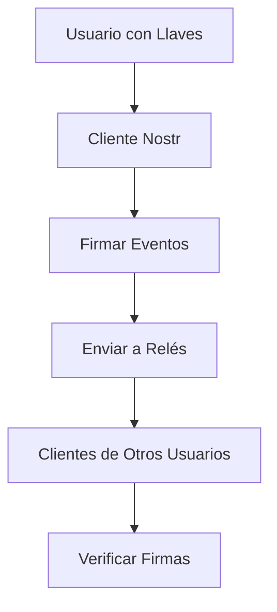

# Definiciones de Nostr: Guía de Referencia Completa

Esta guía comprensiva define todos los conceptos, protocolos y componentes esenciales de Nostr en un solo lugar.

## Tabla de Contenidos

- [Fundamentos del Protocolo](#fundamentos-del-protocolo)
- [Llaves e Identidad](#llaves-e-identidad)
- [Eventos y Mensajes](#eventos-y-mensajes)
- [Relés y Red](#reles-y-red)
- [Clientes y Aplicaciones](#clientes-y-aplicaciones)
- [NIPs (Posibilidades de Implementación de Nostr)](#nips-posibilidades-de-implementacion-de-nostr)
- [Zaps e Integración Lightning](#zaps-e-integracion-lightning)
- [Seguridad y Privacidad](#seguridad-y-privacidad)
- [Desarrollo y Aspectos Técnicos](#desarrollo-y-aspectos-tecnicos)

---

## Fundamentos del Protocolo

### Nostr
**"Notes and Other Stuff Transmitted by Relays" (Notas y Otras Cosas Transmitidas por Relés)** - Un protocolo simple y abierto para redes sociales descentralizadas y comunicación.

#### Principios Centrales
- **Descentralizado**: Sin autoridad central o punto único de falla
- **Resistente a la censura**: El contenido no puede ser censurado universalmente
- **Interoperable**: Todos los clientes pueden comunicarse entre sí
- **Propiedad del usuario**: Los usuarios controlan su identidad y datos
- **Simple**: Fácil de implementar y entender

### Descripción General del Protocolo


---

## Llaves e Identidad

### Llave Privada
Tu llave criptográfica secreta que:
- Controla toda tu identidad Nostr
- Firma todos tus eventos y mensajes
- No puede recuperarse si se pierde
- Debe mantenerse absolutamente segura

**Ejemplos de Formato:**
```
Hex: 5c0c523f52a5b6fad39ed2403092df8cebc36318b39383bca6c00808626fab3a
nsec: nsec1ts8y20636km0450n6fqrxyktmrhtcd0cvwucnw6xvqygsp6wlv62q4ew66q
```

### Llave Pública
Tu identidad pública en Nostr:
- Derivada matemáticamente de tu llave privada
- Sirve como tu identificador único
- Puede compartirse libremente
- Usada por otros para verificar tus firmas

**Ejemplos de Formato:**
```
Hex: 48d54b934bb2767a2980a4e6b2ee5ff86e3a4102b1e3f71c95e66bb06a1e7ff6
npub: npub1frw5hw6tkfm85t2qpfnty0hllrhkx5gzk83lw8y4uehmq6s70lmqqrr9nv
```

### Mejores Prácticas de Seguridad de Llaves
- **Nunca compartas tu llave privada**
- Usa billeteras hardware cuando sea posible
- Mantén múltiples respaldos seguros
- Usa diferentes llaves para diferentes propósitos
- Considera estrategias de rotación de llaves

---

## Eventos y Mensajes

### Evento
La unidad básica de datos en Nostr. Todos los contenidos (notas, perfiles, reacciones) son eventos.

**Estructura Básica:**
```json
{
  "id": "hash_del_evento",
  "pubkey": "llave_publica_del_autor",
  "created_at": 1234567890,
  "kind": 1,
  "tags": [],
  "content": "Contenido del mensaje",
  "sig": "firma_digital"
}
```

### Tipos de Eventos (Kinds)

#### Eventos Básicos
- **Kind 0**: Metadatos del perfil (nombre, imagen, bio)
- **Kind 1**: Nota de texto (post normal)
- **Kind 2**: Servidor de relé recomendado
- **Kind 3**: Lista de contactos (seguimiento)
- **Kind 4**: Mensajes directos encriptados
- **Kind 5**: Eliminación de eventos
- **Kind 6**: Repost/boost
- **Kind 7**: Reacción (like, emoji)

#### Eventos Especializados
- **Kind 0-3**: Eventos regulares de aplicación
- **Kind 10000-19999**: Eventos reemplazables
- **Kind 20000-29999**: Eventos efímeros
- **Kind 30000-39999**: Eventos reemplazables parametrizados

### Etiquetas (Tags)
Arrays de strings que proporcionan metadatos adicionales para eventos:

```json
"tags": [
  ["e", "id_evento_referenciado", "wss://relay.example.com"],
  ["p", "llave_publica_mencionada"],
  ["t", "hashtag"],
  ["r", "https://ejemplo.com"]
]
```

**Tipos Comunes de Etiquetas:**
- **e**: Referencia a otro evento
- **p**: Referencia a una llave pública (mención)
- **t**: Hashtag/tema
- **r**: URL o referencia web
- **d**: Identificador para eventos reemplazables

---

## Relés y Red

### Relé
Servidor que almacena y reenvía eventos Nostr. Características:
- Opera independientemente con sus propias políticas
- Implementa protocolo WebSocket simple
- Puede filtrar o moderar contenido
- No se requiere registro de usuario

### Tipos de Relés

#### Por Acceso
- **Públicos**: Abiertos para todos
- **Privados**: Acceso restringido
- **De pago**: Requieren pago por uso
- **Comunitarios**: Para grupos específicos

#### Por Función
- **Generales**: Almacenan todo tipo de contenido
- **Especializados**: Optimizados para tipos específicos de eventos
- **Caché**: Para mejorar rendimiento
- **Archivo**: Para almacenamiento a largo plazo

### Protocolo de Relé
Comunicación basada en WebSocket con tres tipos de mensajes:

```json
// Publicar evento
["EVENT", {...evento...}]

// Solicitar eventos
["REQ", "id_suscripcion", {...filtros...}]

// Cerrar suscripción
["CLOSE", "id_suscripcion"]
```

### Filtros de Relé
Especifican qué eventos solicitar:

```json
{
  "ids": ["id1", "id2"],
  "authors": ["pubkey1", "pubkey2"],
  "kinds": [1, 6, 7],
  "since": 1234567890,
  "until": 1234567890,
  "limit": 100,
  "#e": ["event_id"],
  "#p": ["pubkey"]
}
```

---

## Clientes y Aplicaciones

### Cliente Nostr
Aplicación que permite a los usuarios interactuar con la red Nostr:
- Gestiona llaves criptográficas
- Se conecta a múltiples relés
- Crea, firma y publica eventos
- Muestra contenido de otros usuarios

### Tipos de Clientes

#### Por Plataforma
- **Web**: Ejecutan en navegadores
- **Móvil**: Apps nativas iOS/Android
- **Escritorio**: Aplicaciones de computadora
- **Terminal**: Herramientas de línea de comandos

#### Por Propósito
- **Redes sociales**: Similar a Twitter/Facebook
- **Mensajería**: Enfocado en comunicación privada
- **Multimedia**: Para compartir imágenes/videos
- **Especializado**: Para casos de uso específicos

### Funcionalidades Típicas
- Gestión de identidad y llaves
- Composición y publicación de contenido
- Timeline y descubrimiento de contenido
- Interacciones sociales (likes, reposts, comentarios)
- Mensajería directa
- Gestión de relés
- Configuraciones de privacidad

---

## NIPs (Posibilidades de Implementación de Nostr)

### ¿Qué son los NIPs?
Documentos que especifican extensiones y características opcionales del protocolo Nostr.

### NIPs Fundamentales

#### NIP-01: Protocolo Básico
- Define la estructura básica de eventos
- Especifica comunicación con relés
- Establece validación de eventos

#### NIP-02: Lista de Contactos
- Gestión de usuarios seguidos
- Nombres de mascotas (petnames)
- Lista de relés recomendados

#### NIP-04: Mensajes Directos
- Encriptación de mensajes privados
- Intercambio seguro de mensajes

#### NIP-05: Verificación de Identidad
- Verificación basada en DNS
- Identificadores legibles para humanos
- Formato: nombre@dominio.com

#### NIP-07: Extensión de Navegador
- API estándar para extensiones de navegador
- Firma segura de eventos
- Gestión de permisos

#### NIP-09: Eliminación de Eventos
- Solicitud de eliminación de contenido
- Indicaciones de contenido eliminado

#### NIP-11: Información del Relé
- Metadatos sobre políticas del relé
- Información de contacto
- Capacidades y limitaciones

#### NIP-19: Entidades Codificadas en bech32
- Formato estándar para llaves y referencias
- Códigos QR amigables
- Prefijos: npub, nsec, note, nprofile, nevent

### NIPs de Lightning/Zaps

#### NIP-57: Zaps
- Pagos Lightning integrados
- Micropagos por contenido
- Reacciones monetizadas

#### NIP-47: Cartera Nostr Connect
- Comunicación segura con billeteras
- Autorización de pagos
- Integración Lightning simplificada

---

## Zaps e Integración Lightning

### Zap
Pago Lightning vinculado a un evento Nostr específico:
- Monetiza contenido directamente
- Proporciona feedback inmediato de valor
- Crea incentivos económicos para calidad

### Tipos de Zaps

#### Zap Público
- Visible para todos
- Incluye mensaje opcional
- Fomenta interacción social

#### Zap Privado
- Solo visible para el receptor
- Mantiene privacidad del remitente
- Útil para donaciones anónimas

#### Zap Anónimo
- Sin información del remitente
- Máxima privacidad
- Previene correlación

### Flujo de Zap
1. Usuario solicita enviar zap
2. Cliente obtiene factura Lightning
3. Usuario autoriza pago
4. Pago se procesa vía Lightning
5. Evento de zap se publica en Nostr

### Direcciones Lightning
Identificadores legibles para pagos:
```
usuario@dominio.com
```
- Simplifican proceso de pago
- Compatible con LNURL-pay
- Facilitan integración

---

## Seguridad y Privacidad

### Modelo de Seguridad
- **Firmas digitales**: Verifican autenticidad
- **Sin contraseñas**: Eliminan vectores de ataque comunes
- **Descentralización**: Reduce puntos únicos de falla

### Consideraciones de Privacidad

#### Metadatos Públicos
- Timestamps de eventos son visibles
- Patrones de actividad pueden rastrearse
- Conexiones de relés son observables

#### Contenido Encriptado
- NIP-04 para mensajes directos
- Encriptación extremo a extremo
- Llaves de sesión para forward secrecy

#### Técnicas de Privacidad
- Uso de múltiples identidades
- Rotación de relés
- Timing aleatorio de publicaciones
- Redes proxy/Tor

### Amenazas Comunes

#### Ataques de Llave
- Reutilización de nonce
- Generadores débiles de aleatoriedad
- Almacenamiento inseguro

#### Ataques de Red
- Análisis de tráfico
- Correlación de metadatos
- Ataques de tiempo

#### Ataques Sociales
- Ingeniería social para obtener llaves
- Suplantación de identidad
- Manipulación de confianza

---

## Desarrollo y Aspectos Técnicos

### Librerías de Desarrollo

#### JavaScript/TypeScript
- **nostr-tools**: Librería fundamental
- **NDK**: Framework de alto nivel
- **nostr-relaypool**: Gestión de relés

#### Python
- **python-nostr**: Implementación completa
- **nostr-sdk-python**: Bindings de Rust

#### Rust
- **nostr-sdk**: Implementación nativa
- **nostr-protocol**: Tipos básicos del protocolo

#### Go
- **go-nostr**: Implementación en Go
- **relaykind**: Herramientas de relé

### Herramientas de Desarrollo

#### Línea de Comandos
- **nostril**: Creación rápida de eventos
- **nak**: Análisis y debugging de red
- **nostr-cli**: Utilidades generales

#### Testing y Debugging
- **nostr-dev-kit**: Herramientas de desarrollo
- **relay-tester**: Testing de compatibilidad
- **event-inspector**: Análisis de eventos

### Conceptos de Implementación

#### Validación de Eventos
```javascript
function validateEvent(event) {
  // Verificar campos requeridos
  if (!event.id || !event.pubkey || !event.sig) return false
  
  // Verificar firma
  return verifySignature(event.sig, event.id, event.pubkey)
}
```

#### Gestión de Conexiones
```javascript
class RelayManager {
  constructor(relayUrls) {
    this.relays = relayUrls.map(url => new Relay(url))
  }
  
  async publish(event) {
    // Publicar a todos los relés conectados
    return Promise.allSettled(
      this.relays.map(relay => relay.publish(event))
    )
  }
}
```

#### Filtrado y Suscripciones
```javascript
const filter = {
  authors: [myPubkey],
  kinds: [1], // Solo notas de texto
  limit: 50,
  since: Math.floor(Date.now() / 1000) - 3600 // Última hora
}

relay.subscribe([filter], (event) => {
  console.log('Nuevo evento:', event)
})
```

---

## Glosario de Términos

### Términos Básicos

**Bech32**
: Formato de codificación para llaves y identificadores legibles por humanos

**Event ID**
: Hash SHA-256 del contenido serializado del evento

**Kind**
: Número que especifica el tipo de evento (0=perfil, 1=nota, etc.)

**Nonce**
: Número usado una vez en operaciones criptográficas

**Npub/Nsec**
: Formatos bech32 para llaves públicas/privadas

**Pubkey**
: Abreviación de "public key" (llave pública)

**Relay Pool**
: Conjunto de relés para redundancia y performance

**Signature**
: Prueba criptográfica de autenticidad usando Schnorr

**Tag**
: Metadatos estructurados asociados a eventos

**WebSocket**
: Protocolo de comunicación usado por relés

### Términos Avanzados

**Delegated Event**
: Evento firmado en nombre de otro usuario

**Ephemeral Event**
: Evento no almacenado permanentemente

**Event Deletion**
: Solicitud de eliminación de contenido (NIP-09)

**Parameterized Replaceable**
: Evento que puede actualizarse con parámetros específicos

**Replaceable Event**
: Evento que puede actualizarse (último prevalece)

---

## Recursos y Referencias

### Documentación Oficial
- [NIPs Repository](https://github.com/nostr-protocol/nips)
- [Nostr Protocol Specification](https://github.com/nostr-protocol/nostr)

### Herramientas Online
- [Nostr.band](https://nostr.band) - Explorador de red
- [Relay.exchange](https://relay.exchange) - Información de relés
- [NostrGuru](https://nostrguru.com) - Estadísticas y análisis

### Librerías y SDKs
- [nostr-tools](https://github.com/nbd-wtf/nostr-tools) - JavaScript
- [python-nostr](https://github.com/jeffthibault/python-nostr) - Python
- [nostr-sdk](https://github.com/rust-nostr/nostr) - Rust

### Clientes Populares
- **Web**: Iris, Coracle, Snort
- **Móvil**: Damus (iOS), Amethyst (Android)
- **Escritorio**: Gossip, Nostrgram

---

**Esta guía se actualiza continuamente conforme evoluciona el protocolo Nostr. Para las especificaciones más recientes, consulta siempre la documentación oficial de NIPs.**

---

**¿Falta algo en esta guía?** [Contribuye en GitHub](https://github.com/cristyalmonte/learnnostr) o envíanos tus sugerencias.
