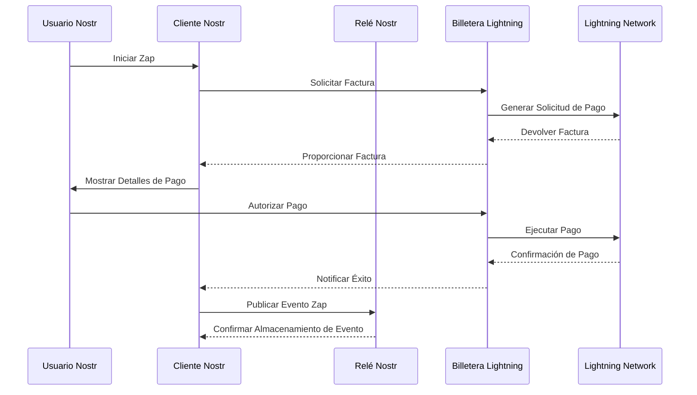

# Integración de Billetera Lightning

!!! info "Objetivos de Aprendizaje"
    Al final de esta lección, entenderás:
    
    - El papel de Lightning Network en el ecosistema Nostr
    - Diferentes arquitecturas de billeteras y sus implicaciones de seguridad
    - Cómo configurar la integración Lightning con clientes Nostr
    - Mejores prácticas para gestión de llaves y seguridad operacional

## Integración de Lightning Network

Lightning Network proporciona pagos Bitcoin instantáneos y de bajo costo que habilitan nuevos modelos económicos dentro del protocolo Nostr. **Zaps** - micropagos impulsados por Lightning - crean transferencia de valor directa entre usuarios, facilitando monetización de contenido e incentivos de red.

Esta integración transforma la interacción social de métricas basadas en engagement a transacciones basadas en valor, permitiendo a los creadores recibir compensación inmediata por sus contribuciones.

## Tipos de Arquitectura de Billeteras

### Billeteras Custodiales

**Características Técnicas:**
- Llaves privadas gestionadas por proveedor de servicios
- Experiencia de usuario simplificada con complejidad técnica reducida
- Disponibilidad inmediata sin requisitos de gestión de canales
- Riesgo de contraparte centralizada

**Consideraciones de Implementación:**
- Menor barrera de entrada para usuarios nuevos
- Requisitos de cumplimiento regulatorio para proveedores de servicios
- Potencial para restricciones de cuenta o terminación de servicio
- Procesos simplificados de respaldo y recuperación

### Billeteras No Custodiales

**Características Técnicas:**
- Gestión de llaves privadas controlada por el usuario
- Operación directa de nodo Lightning Network o conexión a nodo confiable
- Requisitos de gestión de liquidez de canales
- Privacidad y soberanía mejoradas

**Consideraciones de Implementación:**
- Mayor complejidad técnica y responsabilidad del usuario
- Procedimientos de respaldo y recuperación críticos para seguridad de fondos
- Consideraciones de gestión de canales y liquidez
- Mayor resistencia a control externo o censura

## Matriz de Selección de Billeteras

| Criterio | Soluciones Custodiales | Soluciones No Custodiales |
|----------|-------------------|------------------------|
| **Modelo de Seguridad** | Basado en confianza | Auto-soberano |
| **Gestión de Llaves** | Proveedor de servicios | Responsabilidad del usuario |
| **Complejidad Técnica** | Baja | Media a Alta |
| **Nivel de Privacidad** | Limitado | Mejorado |
| **Disponibilidad** | Alta | Variable |
| **Riesgo Regulatorio** | Mayor | Menor |

## Implementaciones Recomendadas

### Integración Basada en Web: Alby

**Especificaciones Técnicas:**
- Extensión de navegador con soporte de protocolo WebLN
- Cumplimiento NIP-07 para firma de eventos Nostr
- Conectividad incorporada de nodo Lightning
- Autorización estilo OAuth para aplicaciones web

**Proceso de Integración:**
1. Instalar extensión de navegador desde canales de distribución oficiales
2. Completar creación de cuenta y documentación de frase de respaldo
3. Configurar conectividad de nodo Lightning (custodial o auto-hospedado)
4. Habilitar permisos NIP-07 para aplicaciones Nostr

### Soluciones Móviles

#### Wallet of Satoshi (Custodial)
**Características Técnicas:**
- Abstracción simplificada de Lightning Network
- Procesamiento instantáneo de pagos
- Soporte de dirección Lightning (LNURL-pay)
- Requisitos mínimos de configuración

#### Phoenix (No Custodial)
**Características Técnicas:**
- Gestión automática de canales
- Infraestructura de nodo ACINQ
- Mecanismos de respaldo en cadena
- Opciones avanzadas de gestión de tarifas

#### Breez (No Custodial)
**Características Técnicas:**
- Proveedor de Servicios Lightning (LSP) incorporado
- Opción de nodo auto-hospedado
- Integración de podcast con pagos de streaming
- Funcionalidad de punto de venta

## Configuración e Integración

### Configuración de Dirección Lightning

Las direcciones Lightning proporcionan identificadores de pago legibles por humanos siguiendo el formato `usuario@dominio.com`. Esta abstracción simplifica el proceso de pago mientras mantiene compatibilidad con Lightning Network.

**Pasos de Implementación:**
1. Obtener dirección Lightning del proveedor de billetera
2. Configurar dirección en metadatos del perfil del cliente Nostr
3. Verificar funcionalidad de pago a través de transacciones de prueba
4. Monitorear notificaciones y confirmaciones de pago

### Configuración del Cliente Nostr

**Configuración de Metadatos del Perfil:**
```json
{
  "kind": 0,
  "content": {
    "name": "Nombre de Usuario",
    "about": "Descripción del usuario",
    "picture": "https://example.com/avatar.jpg",
    "lud16": "usuario@dominio.com"
  }
}
```

El campo `lud16` contiene la dirección Lightning, habilitando funcionalidad de zap automática en clientes Nostr compatibles.

## Ejercicio Práctico: Configuración y Prueba de Billetera

!!! example "Laboratorio de Integración Lightning"
    
    **Objetivo:** Configurar y probar integración de billetera Lightning con protocolo Nostr
    
    **Fase 1: Selección y Configuración de Billetera**
    1. Evaluar opciones de billetera basadas en requisitos técnicos y tolerancia al riesgo
    2. Completar instalación de billetera y configuración inicial
    3. Documentar procedimientos de respaldo y medidas de seguridad
    4. Financiar billetera con cantidad mínima para propósitos de prueba
    
    **Fase 2: Integración Nostr**
    1. Configurar dirección Lightning en perfil del cliente Nostr
    2. Verificar propagación del perfil a través de la red de relés
    3. Probar funcionalidad de zap con cantidades pequeñas
    4. Monitorear confirmaciones de transacciones y notificaciones
    
    **Fase 3: Validación Operacional**
    1. Enviar zaps de prueba a otros usuarios o a ti mismo
    2. Recibir zaps y verificar sistemas de notificación
    3. Analizar tarifas de transacción y tiempos de procesamiento
    4. Documentar cualquier problema de conectividad o confiabilidad

## Implementación de Seguridad

### Mejores Prácticas de Gestión de Llaves

**Procedimientos de Respaldo:**
- Documentar frases semilla usando almacenamiento físico, fuera de línea
- Verificar integridad del respaldo a través de pruebas de recuperación
- Implementar almacenamiento multi-ubicación con seguridad apropiada
- Establecer planificación clara de sucesión para recuperación de fondos

**Seguridad Operacional:**
- Usar dispositivos dedicados para gestión de fondos significativos
- Implementar mecanismos de autenticación fuertes
- Auditorías regulares de seguridad de aplicaciones conectadas
- Monitorear acceso no autorizado o actividad inusual

### Estrategias de Gestión de Fondos

**Mitigación de Riesgos:**
- Mantener balances mínimos en billeteras calientes para operaciones diarias
- Usar almacenamiento frío para seguridad de fondos a largo plazo
- Implementar límites de gasto y procesos de aprobación
- Movimiento regular de fondos para reducir ventanas de exposición

## Arquitectura de Flujo de Pagos



## Análisis de Modelo Económico

### Mecanismos de Transferencia de Valor

**Economía de Micropagos:**
- Costos de transacción aproximándose a cero habilitan transferencia de micro-valor
- Compensación directa al creador sin intermediarios de plataforma
- Valoración de contenido impulsada por el mercado a través de cantidades de pago
- Efectos de red de métricas de engagement basadas en valor

**Incentivos de Red:**
- Contenido de calidad recibe compensación proporcional
- Reducción de spam a través de requisitos de pago
- Compensación de operadores de relés a través de tarifas de uso
- Incentivos de desarrolladores a través de monetización de aplicaciones

## Solución de Problemas y Diagnósticos

### Problemas Comunes de Integración

**Problemas de Conexión:**
- Verificar permisos y autorizaciones de aplicación de billetera
- Revisar conectividad de Lightning Network y estado de canales
- Confirmar configuración y propagación de dirección Lightning
- Probar con diferentes clientes Nostr para verificación de compatibilidad

**Fallas de Pago:**
- Analizar restricciones de enrutamiento y liquidez de Lightning Network
- Verificar validez y funcionalidad de dirección Lightning del destinatario
- Revisar límites de cantidad de pago y suficiencia de balance de billetera
- Monitorear congestión temporal de red o problemas de conectividad

**Optimización de Rendimiento:**
- Configurar selecciones óptimas de relés para notificaciones de pago
- Implementar agrupación de conexiones para mejor capacidad de respuesta
- Cachear facturas Lightning para reducir latencia de generación
- Monitorear tasas de éxito de pagos y patrones de falla

## Configuración Avanzada

### Infraestructura Lightning Personalizada

**Soluciones Auto-Hospedadas:**
- Despliegue y gestión de nodo Lightning
- Estrategias de gestión de liquidez de canales
- Implementación de sistemas de respaldo y monitoreo
- Integración con infraestructura y sistemas de seguridad existentes

**Consideraciones Empresariales:**
- Configuraciones de billeteras multi-firma
- Procesamiento y reconciliación automatizada de pagos
- Requisitos de cumplimiento y pista de auditoría
- Planificación de escalabilidad para operaciones de alto volumen

## Siguientes Pasos

La integración de billetera Lightning habilita participación en la economía basada en valor de Nostr. Entender la arquitectura técnica y consideraciones de seguridad te prepara para desarrollo e implementación avanzada de protocolos.

<div class="next-lesson">
  <a href="../nostr-tools/" class="btn btn-primary">
    Herramientas de Desarrollo e Infraestructura →
  </a>
</div>

---

## Validación Técnica

!!! question "Evaluación de Comprensión de Integración"
    
    1. ¿Cuáles son las principales compensaciones entre arquitecturas de billeteras custodiales y no custodiales?
    2. ¿Cómo simplifica el sistema de direcciones Lightning los procesos de pago?
    3. ¿Qué consideraciones de seguridad son críticas para operaciones de billeteras Lightning?
    4. ¿Cómo cambian los zaps los incentivos económicos en las redes sociales?
    
    ??? success "Análisis Técnico"
        1. **Las billeteras custodiales** intercambian seguridad y soberanía por simplicidad, mientras que **las billeteras no custodiales** proporcionan control completo al costo de mayor complejidad y responsabilidad
        2. **Las direcciones Lightning** abstraen solicitudes de pago complejas en identificadores legibles por humanos, habilitando integración sin fricciones con protocolos de comunicación existentes
        3. **Gestión de llaves, procedimientos de respaldo y seguridad operacional** son fundamentales para prevenir pérdida de fondos y mantener integridad del sistema
        4. **La transferencia de valor directa** crea bucles de retroalimentación inmediatos entre calidad de contenido y compensación del creador, alterando fundamentalmente los incentivos de engagement

---