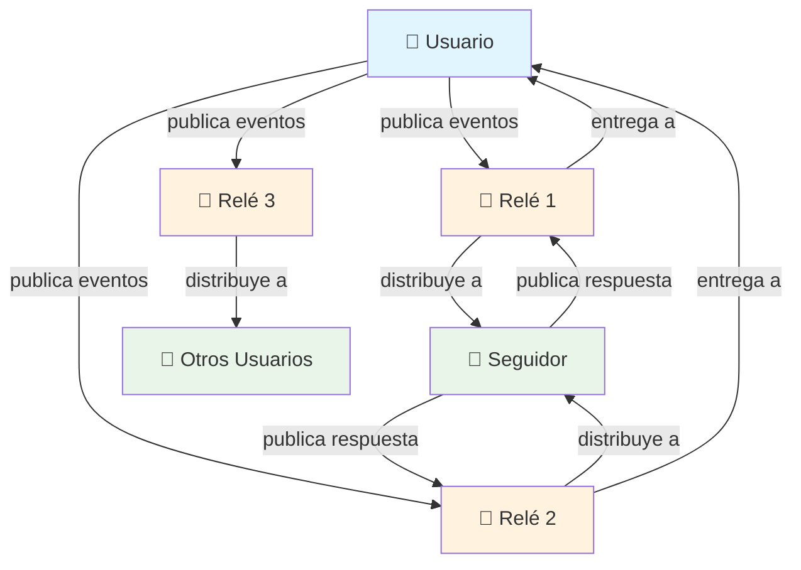

# ¿Qué es Nostr?

!!! info "Objetivos de Aprendizaje"
    Al final de esta lección, entenderás:
    
    - Qué significa Nostr y sus principios centrales
    - Cómo Nostr difiere de las plataformas de redes sociales tradicionales
    - Los componentes fundamentales del protocolo Nostr
    - Los beneficios de las redes sociales descentralizadas

## Introducción

**Nostr** significa "Notes and Other Stuff Transmitted by Relays" (Notas y Otras Cosas Transmitidas por Relés). Es un protocolo simple y abierto que permite redes sociales globales, descentralizadas y resistentes a la censura.

A diferencia de las plataformas de redes sociales tradicionales, Nostr opera sin una autoridad central, dando a los usuarios control completo sobre su identidad y datos a través de pares de llaves criptográficas.

## Principios Centrales

### Arquitectura Descentralizada
Nostr opera en una red de relés independientes en lugar de servidores centralizados, eliminando puntos únicos de falla y control.

### Soberanía del Usuario
Los usuarios mantienen propiedad completa de su identidad a través de llaves criptográficas, asegurando que ninguna plataforma pueda prohibirlos o silenciarlos permanentemente.

### Simplicidad del Protocolo
El protocolo prioriza la simplicidad sobre la complejidad, haciéndolo confiable, eficiente y fácil de implementar.

### Resistencia a la Censura
La naturaleza distribuida de los relés asegura que el contenido no pueda ser censurado globalmente por ninguna entidad singular.

## Arquitectura del Protocolo



El protocolo opera a través del siguiente proceso:

1. **Creación de Eventos**: Los usuarios crean eventos firmados usando sus llaves privadas
2. **Distribución por Relés**: Los eventos se envían a múltiples relés para almacenamiento y distribución
3. **Descubrimiento de Contenido**: Otros usuarios consultan relés para recuperar eventos relevantes
4. **Interacción de Red**: Los usuarios pueden responder e interactuar, creando nuevos eventos en la red

## Componentes del Protocolo

### Eventos
Todo el contenido en Nostr se representa como eventos - objetos JSON que contienen campos estandarizados:

```json
{
  "id": "hash_identificador_evento",
  "pubkey": "llave_publica_autor", 
  "created_at": 1234567890,
  "kind": 1,
  "tags": [],
  "content": "Contenido del mensaje",
  "sig": "firma_criptografica"
}
```

**Propiedades Clave:**
- **Inmutable**: Los eventos no pueden modificarse después de crearse
- **Verificable**: Las firmas digitales aseguran autenticidad
- **Portable**: Los eventos funcionan en todos los clientes y relés de Nostr

### Relés
Servidores independientes que almacenan y reenvían eventos. Las características de los relés incluyen:

- **Operación Autónoma**: Cada relé opera independientemente con sus propias políticas
- **Filtrado Configurable**: Los relés pueden implementar reglas personalizadas de moderación de contenido
- **Redundancia de Red**: Múltiples relés proporcionan tolerancia a fallos y resistencia a la censura
- **Protocolo Simple**: Los relés implementan una API directa basada en WebSocket

### Clientes
Aplicaciones que proporcionan interfaces de usuario para interactuar con el protocolo Nostr:

- **Gestión de Llaves**: Generación, almacenamiento y uso seguro de llaves criptográficas
- **Comunicación Multi-Relé**: Conectar a múltiples relés simultáneamente para redundancia
- **Procesamiento de Eventos**: Crear, firmar, verificar y mostrar eventos según especificaciones del protocolo
- **Experiencia de Usuario**: Abstraer la complejidad del protocolo detrás de interfaces intuitivas

## Implementación Técnica

### Estructura y Validación de Eventos

Los eventos deben cumplir reglas específicas de validación:

=== "Campos Requeridos"

    ```json
    {
      "id": "32 bytes en hex minúscula del sha256 de datos serializados del evento",
      "pubkey": "32 bytes en hex minúscula de la llave pública",
      "created_at": "timestamp unix en segundos",
      "kind": "entero entre 0 y 65535",
      "tags": "arreglo de arreglos de strings",
      "content": "string arbitrario",
      "sig": "64 bytes en hex minúscula de la firma"
    }
    ```

=== "Proceso de Validación"

    ```javascript
    // Pseudocódigo para validación de eventos
    function validateEvent(event) {
      // 1. Verificar que los campos requeridos estén presentes
      if (!hasRequiredFields(event)) return false;
      
      // 2. Verificar que el ID coincida con el hash del contenido
      if (event.id !== computeEventId(event)) return false;
      
      // 3. Verificar firma
      if (!verifySignature(event.sig, event.id, event.pubkey)) return false;
      
      // 4. Verificar validez del timestamp
      if (!isValidTimestamp(event.created_at)) return false;
      
      return true;
    }
    ```

### Protocolo de Comunicación de Relés

Los relés implementan un protocolo basado en WebSocket con tres tipos de mensajes:

| Tipo de Mensaje | Propósito | Formato |
|--------------|---------|---------|
| **EVENT** | Publicar eventos al relé | `["EVENT", <JSON del evento>]` |
| **REQ** | Solicitar eventos del relé | `["REQ", <id_suscripcion>, <filtros...>]` |
| **CLOSE** | Cerrar suscripción | `["CLOSE", <id_suscripcion>]` |

## Comparación Arquitectónica

| Aspecto | Plataformas Tradicionales | Protocolo Nostr |
|--------|----------------------|----------------|
| **Control de Identidad** | Cuentas propiedad de la plataforma | Llaves criptográficas controladas por el usuario |
| **Almacenamiento de Datos** | Bases de datos centralizadas | Red distribuida de relés |
| **Moderación de Contenido** | Políticas de toda la plataforma | Políticas por relé con elección del usuario |
| **Control de Algoritmo** | Propietario, impulsado por ganancias | Abierto, configurable por el usuario |
| **Dependencia del Proveedor** | Altos costos de cambio | Identidad y datos portables |
| **Punto Único de Falla** | Infraestructura de la plataforma | Sin dependencias globales |

## Ejercicio Práctico: Exploración de la Red

!!! example "Ejercicio de Análisis del Protocolo"
    
    **Objetivo:** Examinar eventos reales de Nostr para entender la estructura del protocolo
    
    **Pasos:**
    1. Visita [nostr.band](https://nostr.band) para explorar la red
    2. Busca eventos recientes usando el hashtag `#nostr`
    3. Haz clic en eventos individuales para examinar su estructura JSON
    4. Identifica los diferentes tipos de eventos y sus propósitos
    5. Nota la variedad de relés siendo usados en toda la red
    
    **Preguntas de Análisis:**
    - ¿Cuántos tipos diferentes de eventos puedes identificar?
    - ¿Qué patrones notas en las estructuras de etiquetas?
    - ¿Cómo proporcionan las llaves públicas y firmas verificación de identidad?

## Beneficios y Compensaciones del Protocolo

!!! success "Ventajas del Protocolo"
    
    **Beneficios de Descentralización**
    
    - ✅ Eliminación de puntos únicos de falla o control
    - ✅ Resistencia a la censura y manipulación de plataformas
    - ✅ Propiedad del usuario sobre identidad y datos
    - ✅ Ecosistema competitivo de clientes y servicios
    
    **Ventajas Técnicas**
    
    - ✅ Especificación de protocolo simple y bien definida
    - ✅ Seguridad y verificación criptográfica
    - ✅ Diseño extensible a través de NIPs (Posibilidades de Implementación de Nostr)
    - ✅ Baja barrera de entrada para desarrolladores y operadores de relés

!!! warning "Consideraciones Técnicas"
    
    **Limitaciones Actuales**
    
    - ⚠️ Complejidad de gestión de llaves para usuarios promedio
    - ⚠️ Potencial para spam sin filtrado centralizado
    - ⚠️ Desafíos de descubrimiento y selección de relés
    - ⚠️ Funciones limitadas de privacidad incorporadas para metadatos
    
    **Consideraciones de Escalabilidad**
    
    - ⚠️ Requisitos de almacenamiento y ancho de banda de relés
    - ⚠️ Sobrecarga computacional de verificación de eventos
    - ⚠️ Efectos de red y desafíos de adopción

## NIPs: Extensiones del Protocolo

Las Posibilidades de Implementación de Nostr (NIPs) definen extensiones y estándares del protocolo:

| NIP | Título | Propósito |
|-----|-------|---------|
| **NIP-01** | Flujo básico del protocolo | Especificaciones centrales de eventos y relés |
| **NIP-02** | Lista de contactos y nombres de mascotas | Gestión de seguimiento y contactos |
| **NIP-04** | Mensajes directos encriptados | Comunicación privada |
| **NIP-05** | Verificación basada en DNS | Identificadores legibles por humanos |
| **NIP-09** | Eliminación de eventos | Mecanismos de eliminación de contenido |
| **NIP-11** | Documento de información del relé | Metadatos y políticas del relé |

## Ejercicio Práctico: Análisis de Eventos

!!! example "Inmersión Técnica Profunda"
    
    **Tarea:** Analizar la estructura de diferentes tipos de eventos de Nostr
    
    **Instrucciones:**
    1. Usa un cliente de Nostr o interfaz web para examinar eventos
    2. Documenta las diferencias entre tipos de eventos (0, 1, 3, 7)
    3. Analiza patrones de uso de etiquetas en diferentes tipos de eventos
    4. Verifica firmas de eventos usando herramientas disponibles
    
    **Resultados Esperados:**
    - Comprensión de variaciones en estructura de eventos
    - Reconocimiento de patrones de metadatos basados en etiquetas
    - Apreciación por mecanismos de verificación criptográfica

## Siguientes Pasos

Entender la arquitectura fundamental de Nostr te prepara para implementar aplicaciones prácticas. La simplicidad del protocolo permite desarrollo rápido mientras que sus fundamentos criptográficos aseguran seguridad y soberanía del usuario.

<div class="next-lesson">
  <a href="../wallet-setup/" class="btn btn-primary">
    Integración de Billetera Lightning →
  </a>
</div>

---

## Verificación de Conocimiento

!!! question "Verificación de Comprensión Técnica"
    
    1. ¿Cuáles son los tres componentes fundamentales del protocolo Nostr?
    2. ¿Cómo funciona la verificación de eventos en Nostr?
    3. ¿Qué distingue a los relés de Nostr de los servidores tradicionales de redes sociales?
    4. ¿Por qué está diseñado el protocolo alrededor de eventos JSON simples?
    
    ??? success "Respuestas Técnicas"
        1. **Eventos** (estructuras de datos de contenido), **Relés** (infraestructura de almacenamiento y distribución), y **Clientes** (aplicaciones de interfaz de usuario)
        2. **Firmas digitales** usando pares de llaves criptográficas verifican la autenticidad del evento, mientras que **hashing de contenido** asegura integridad
        3. **Los relés operan independientemente** con políticas individuales, creando una red distribuida sin puntos de control centrales
        4. **La simplicidad de JSON** asegura compatibilidad amplia, análisis fácil, e implementación directa del protocolo en diferentes lenguajes de programación

---