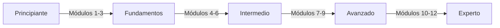

# Módulos de Learn Nostr

¡Bienvenido a los Módulos de Learn Nostr! Este plan de estudios integral está diseñado para llevarte de principiante completo a experto en Nostr a través de rutas de aprendizaje estructuradas y progresivas.

## 🎯 Descripción General del Camino de Aprendizaje

Nuestros módulos están cuidadosamente estructurados para construir tu conocimiento progresivamente:

- **Módulos 1-3**: Fundamentos - Comprensión de los conceptos básicos
- **Módulos 4-6**: Intermedio - Construcción e interacción
- **Módulos 7-9**: Avanzado - Arquitectura y optimización
- **Módulos 10-12**: Experto - Innovación y contribución

## 📚 Módulos Disponibles

### Pista de Fundamentos

-   :material-numeric-1-circle:{ .lg .middle } **Módulo 1: Introducción a Nostr**

    ---

    Comienza tu viaje comprendiendo qué es Nostr, por qué es importante y cómo revoluciona la comunicación social.

    [:octicons-arrow-right-24: Comenzar Módulo 1](module-01-introduction.md)

-   :material-numeric-2-circle:{ .lg .middle } **Módulo 2: Claves e Identidad**

    ---

    Domina los fundamentos de las claves criptográficas, la identidad digital y la gestión de cuentas en Nostr.

    [:octicons-arrow-right-24: Comenzar Módulo 2](module-02-keys-identity.md)

-   :material-numeric-3-circle:{ .lg .middle } **Módulo 3: Eventos y Mensajes**

    ---

    Aprende cómo Nostr estructura los datos, crea eventos y habilita la comunicación a través del protocolo.

    [:octicons-arrow-right-24: Comenzar Módulo 3](module-03-events-messages.md)

### Pista Intermedia

-   :material-numeric-4-circle:{ .lg .middle } **Módulo 4: Relés y Arquitectura**

    ---

    Domina la comunicación con relés, conexiones WebSocket y patrones de arquitectura de red.

    [:octicons-arrow-right-24: Comenzar Módulo 4](module-04-relays-architecture.md)

-   :material-numeric-5-circle:{ .lg .middle } **Módulo 5: Construyendo Tu Cliente**

    ---

    Construye una aplicación cliente Nostr completa y lista para producción desde cero.

    [:octicons-arrow-right-24: Comenzar Módulo 5](module-05-building-client.md)

-   :material-numeric-6-circle:{ .lg .middle } **Módulo 6: NIPs Avanzados**

    ---

    Domina tipos de eventos avanzados, NIPs y extensiones de protocolo para aplicaciones sofisticadas.

    [:octicons-arrow-right-24: Comenzar Módulo 6](module-06-advanced-nips.md)

### Pista Avanzada

-   :material-numeric-7-circle:{ .lg .middle } **Módulo 7: Relés en Producción**

    ---

    Diseña, despliega y opera relés Nostr de grado de producción a escala.

    [:octicons-arrow-right-24: Comenzar Módulo 7](module-07-production-relays.md)

-   :material-numeric-8-circle:{ .lg .middle } **Módulo 8: Escalado y Rendimiento**

    ---

    Optimiza el rendimiento del relé, implementa caché y escala a millones de usuarios.

    [:octicons-arrow-right-24: Comenzar Módulo 8](module-08-scaling-performance.md)

-   :material-numeric-9-circle:{ .lg .middle } **Módulo 9: Mejores Prácticas de Seguridad**

    ---

    Próximamente - Patrones de seguridad avanzados, modelado de amenazas y estrategias de endurecimiento.

### Próximamente

- **Módulo 10**: Desarrollo de Protocolo
- **Módulo 11**: Modelos Económicos y Lightning
- **Módulo 12**: Contribuyendo a Nostr

## 🚀 Cómo Usar Estos Módulos

1. **Comienza desde el Módulo 1** si eres nuevo en Nostr
2. **Completa los ejercicios** al final de cada módulo
3. **Únete a las discusiones** en nuestra comunidad de Discord
4. **Construye proyectos** para aplicar lo que has aprendido
5. **Rastrea tu progreso** usando los puntos de control

## 📊 Progresión de Habilidades

## 🎓 Pista de Certificación

Completa todos los módulos y proyectos para obtener tu Certificación de Desarrollador Nostr (próximamente).

---

!!! tip "Únete a Nuestra Comunidad"
    ¿Tienes preguntas? Únete a nuestro [Discord](https://discord.gg/BtkVKRkJ) para conectarte con otros estudiantes y obtener ayuda de desarrolladores experimentados de Nostr!
