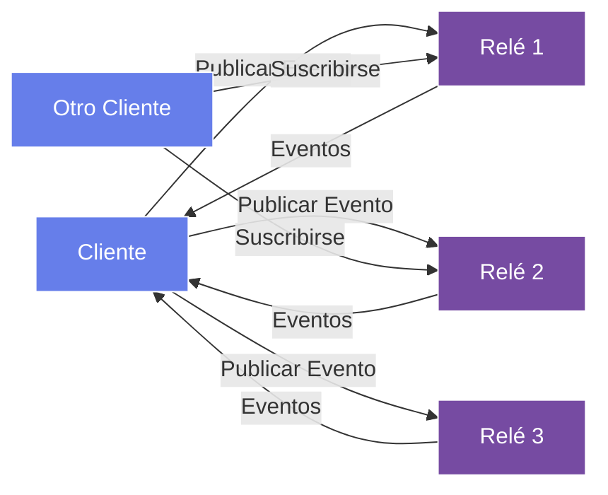

# Módulo 1: Introducción a Nostr

!!! info "Visión General del Módulo"
    **Duración**: 2-3 horas  
    **Nivel**: Principiante  
    **Prerrequisitos**: Ninguno  
    **Objetivo**: Comprender los fundamentos del protocolo Nostr y su arquitectura

## 📋 Objetivos de Aprendizaje

Al final de este módulo, podrás:

- ✅ Explicar qué es Nostr y cómo funciona
- ✅ Comprender la arquitectura descentralizada
- ✅ Identificar casos de uso y aplicaciones
- ✅ Comparar Nostr con plataformas tradicionales
- ✅ Configurar tu primer cliente Nostr

## 🌟 ¿Qué es Nostr?

**Nostr** significa **"Notes and Other Stuff Transmitted by Relays"** (Notas y Otras Cosas Transmitidas por Relés).

Es un protocolo simple y abierto para redes sociales descentralizadas, resistente a la censura y verdaderamente distribuido.

### Características Principales

- 🔓 **Sin Permisos**: No se requiere autorización para publicar
- 🔐 **Criptografía de Clave Pública**: Tu identidad está controlada por tus claves
- 🌐 **Descentralizado**: Sin servidor central, sin punto único de fallo
- 🚫 **Resistente a Censura**: Nadie puede silenciarte
- 🆓 **Sin Tokens**: No hay token nativo o criptomoneda requerida

## 🏗️ Arquitectura de Nostr



### Componentes Clave

1. **Clientes**: Aplicaciones que usan los usuarios (navegador web, móvil, escritorio)
2. **Relés**: Servidores que almacenan y transmiten eventos
3. **Eventos**: Mensajes firmados que contienen contenido
4. **Claves**: Pares de claves públicas/privadas para identidad

## 💡 ¿Por Qué Nostr?

### Problemas con las Redes Sociales Tradicionales

- ❌ Censura y deplatforming
- ❌ Control centralizado de datos
- ❌ Algoritmos opacos
- ❌ Lock-in de plataforma
- ❌ Sin portabilidad de identidad

### Soluciones de Nostr

- ✅ Imposible censurar (múltiples relés)
- ✅ Tú controlas tus datos
- ✅ Protocolo abierto y transparente
- ✅ Cambia de cliente cuando quieras
- ✅ Una identidad en todas las aplicaciones

## 🚀 Primeros Pasos

### 1. Elige un Cliente

Algunos clientes populares:

- **[Damus](https://damus.io/)** - iOS
- **[Amethyst](https://github.com/vitorpamplona/amethyst)** - Android
- **[Snort](https://snort.social/)** - Web
- **[Iris](https://iris.to/)** - Web
- **[Nostrudel](https://nostrudel.ninja/)** - Web

### 2. Crea Tu Identidad

Tu identidad es un par de claves:

- **Clave Privada (nsec)**: MANTÉN ESTO EN SECRETO - como una contraseña
- **Clave Pública (npub)**: Comparte esto - como un nombre de usuario

!!! warning "Seguridad Importante"
    Tu clave privada ES tu identidad. Si la pierdes, pierdes tu cuenta.
    Si alguien la obtiene, puede hacerse pasar por ti.

### 3. Conéctate a Relés

Los clientes se conectan a múltiples relés para:
- Publicar tus eventos
- Recibir eventos de otros
- Aumentar la redundancia

Relés populares:
- `wss://relay.damus.io`
- `wss://nos.lol`
- `wss://relay.snort.social`

## 📝 Conceptos Fundamentales

### Eventos

Todo en Nostr es un **evento**:

```json
{
  "id": "4376c65d2f232afbe9b882a35baa4f6fe8667c4e684749af565f981833ed6a65",
  "pubkey": "6e468422dfb74a5738702a8823b9b28168abab8655faacb6853cd0ee15deee93",
  "created_at": 1673347337,
  "kind": 1,
  "tags": [],
  "content": "¡Hola Nostr!",
  "sig": "908a15e46fb4d8675bab026fc230a0e3542bfade63da02d542fb78b2a8513fcd0092619a2c8c1221e581946e0191f2af505dfdf8657a414dbca329186f009262"
}
```

### Tipos de Eventos (Kinds)

- `kind: 0` - Metadatos de perfil
- `kind: 1` - Notas de texto
- `kind: 3` - Lista de contactos
- `kind: 4` - Mensajes cifrados
- `kind: 7` - Reacciones

## 🎯 Ejercicio Práctico

1. **Descarga un Cliente**: Instala Damus (iOS) o Amethyst (Android)
2. **Crea Claves**: Genera un nuevo par de claves
3. **Haz una Copia de Seguridad**: Guarda tu clave privada de forma segura
4. **Tu Primera Nota**: Publica "¡Hola Nostr!"
5. **Sigue a Alguien**: Encuentra y sigue otro usuario
6. **Explora**: Navega el feed global

## 📚 Recursos Adicionales

- [Sitio Web Oficial de Nostr](https://nostr.com/)
- [NIPs (Propuestas de Implementación de Nostr)](https://github.com/nostr-protocol/nips)
- [Awesome Nostr](https://github.com/aljazceru/awesome-nostr)
- [Repositorio GitHub de LearnNostr](https://github.com/cristyalmonte/learnnostr)

## 🎯 Evaluación del Módulo 1

Antes de pasar al Módulo 2, asegúrate de que puedes:

- [ ] Explicar qué es Nostr en tus propias palabras
- [ ] Describir la diferencia entre clientes y relés
- [ ] Entender por qué las claves privadas son importantes
- [ ] Haber creado tu primer par de claves
- [ ] Haber publicado tu primera nota

## 💬 Discusión Comunitaria

Únete a nuestro Discord para discutir el Módulo 1:
- Comparte tu primera experiencia con Nostr
- Haz preguntas sobre el protocolo
- Conecta con otros aprendices

---

!!! success "¡Felicitaciones!"
    ¡Has completado el Módulo 1! Ahora entiendes los fundamentos de Nostr.
    
[Continuar al Módulo 2: Claves e Identidad →](module-02-keys-identity.md)
