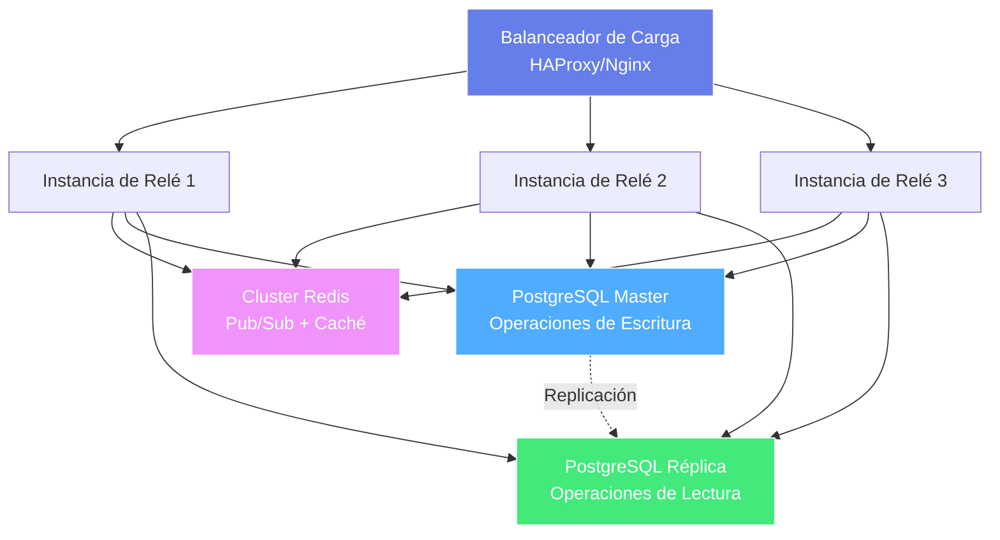

# Módulo 8: Escalado y Rendimiento

!!! info "Visión General del Módulo"
    **Duración**: 8-10 horas  
    **Nivel**: Avanzado  
    **Prerrequisitos**: Módulo 7 completado  
    **Objetivo**: Escalar relés Nostr para manejar millones de usuarios

## 📋 Objetivos de Aprendizaje

- ✅ Implementar estrategias de escalado horizontal
- ✅ Diseñar y desplegar capas de caché
- ✅ Optimizar consultas de base de datos
- ✅ Implementar balanceo de carga
- ✅ Construir distribución de eventos estilo CDN
- ✅ Monitorear y optimizar cuellos de botella

## 🏗️ Arquitectura de Escalado Horizontal



## 💾 Caché Multi-Capa

```javascript
class MultiLayerCache {
  constructor() {
    // L1: Caché en memoria (más rápida, más pequeña)
    this.l1Cache = new LRU({ max: 10000, ttl: 60000 })
    
    // L2: Caché Redis (rápida, compartida)
    this.l2Cache = new Redis.Cluster(config.redisNodes)
  }

  async get(key) {
    // Intentar L1
    let value = this.l1Cache.get(key)
    if (value) return { value, source: 'L1' }
    
    // Intentar L2
    value = await this.l2Cache.get(key)
    if (value) {
      this.l1Cache.set(key, value)
      return { value: JSON.parse(value), source: 'L2' }
    }
    
    return { value: null, source: 'MISS' }
  }
}
```

## 🗄️ Optimización de Base de Datos

```sql
-- Crear índices de cobertura para consultas comunes
CREATE INDEX CONCURRENTLY idx_events_kind_created
ON events (kind, created_at DESC)
INCLUDE (id, pubkey, tags, content, sig);

-- Particionar tablas grandes por tiempo
CREATE TABLE events_2024_01 PARTITION OF events
FOR VALUES FROM ('2024-01-01') TO ('2024-02-01');

-- Ajuste de auto-vacuum para tablas de alta escritura
ALTER TABLE events SET (
  autovacuum_vacuum_scale_factor = 0.01,
  autovacuum_analyze_scale_factor = 0.01
);
```

## ⚡ Pool de Conexiones

```javascript
class OptimizedConnectionPool {
  constructor(config) {
    // Pool maestro para escrituras
    this.masterPool = new Pool({
      host: config.master.host,
      max: 20,
      min: 5,
      idleTimeoutMillis: 30000,
      connectionTimeoutMillis: 2000
    })
    
    // Pools de réplica para lecturas
    this.replicaPools = config.replicas.map(replica => 
      new Pool({
        host: replica.host,
        max: 50,
        min: 10
      })
    )
  }

  async write(query, params) {
    const client = await this.masterPool.connect()
    try {
      return await client.query(query, params)
    } finally {
      client.release()
    }
  }

  async read(query, params) {
    // Balanceo round-robin entre réplicas
    const pool = this.replicaPools[this.replicaIndex]
    this.replicaIndex = (this.replicaIndex + 1) % this.replicaPools.length
    
    const client = await pool.connect()
    try {
      return await client.query(query, params)
    } finally {
      client.release()
    }
  }
}
```

## 📊 Monitoreo de Rendimiento

```javascript
class PerformanceMonitor {
  constructor() {
    this.metrics = {
      // Métricas de latencia
      queryLatency: new Histogram({
        name: 'nostr_query_latency_seconds',
        help: 'Latencia de ejecución de consultas',
        buckets: [0.001, 0.005, 0.01, 0.05, 0.1, 0.5, 1]
      }),
      
      // Métricas de throughput
      eventsPerSecond: new Gauge({
        name: 'nostr_events_per_second',
        help: 'Eventos procesados por segundo'
      }),
      
      // Métricas de caché
      cacheHitRate: new Gauge({
        name: 'nostr_cache_hit_rate',
        help: 'Tasa de aciertos de caché',
        labelNames: ['layer']
      })
    }
  }

  recordQuery(operation, duration) {
    this.metrics.queryLatency.observe(
      { operation },
      duration
    )
  }
}
```

## 🧪 Pruebas de Carga

```javascript
class RelayLoadTester {
  constructor(config) {
    this.relayUrl = config.relayUrl
    this.concurrentConnections = config.concurrentConnections || 1000
    this.testDuration = config.testDuration || 60000
    this.eventRate = config.eventRate || 100
  }

  async runLoadTest() {
    console.log(`Iniciando prueba de carga:`)
    console.log(`- Relé: ${this.relayUrl}`)
    console.log(`- Conexiones: ${this.concurrentConnections}`)
    console.log(`- Duración: ${this.testDuration}ms`)
    console.log(`- Tasa de eventos: ${this.eventRate}/s`)
    
    const results = await this.executeTest()
    return this.generateReport(results)
  }
}
```

## 🎯 Ejercicios Prácticos

### Ejercicio 1: Implementar Escalado Horizontal
1. Desplegar 3 instancias de relé
2. Configurar Redis Pub/Sub
3. Configurar balanceador HAProxy
4. Probar escenarios de failover

### Ejercicio 2: Construir Caché Multi-Capa
1. Configurar caché LRU en memoria (L1)
2. Configurar cluster Redis (L2)
3. Implementar patrón cache-aside
4. Medir tasas de acierto de caché

### Ejercicio 3: Optimizar Rendimiento de Base de Datos
1. Analizar consultas lentas con EXPLAIN
2. Agregar índices de cobertura
3. Implementar réplicas de lectura
4. Configurar pool de conexiones

### Ejercicio 4: Pruebas de Carga
1. Ejecutar prueba con 1000 conexiones concurrentes
2. Medir latencia en diferentes niveles de carga
3. Identificar cuellos de botella
4. Optimizar basado en resultados

## 📝 Cuestionario del Módulo 8

1. **¿Cuál es el beneficio principal del diseño de relé sin estado?**
   <details>
   <summary>Respuesta</summary>
   Permite escalado horizontal al eliminar dependencia de estado local. Cualquier instancia puede manejar cualquier solicitud, habilitando balanceo de carga y fácil adición/eliminación de instancias.
   </details>

2. **¿Por qué usar múltiples capas de caché (L1, L2)?**
   <details>
   <summary>Respuesta</summary>
   Cada capa equilibra velocidad vs capacidad: L1 (en memoria) es más rápida pero más pequeña, L2 (Redis) es rápida y compartida entre instancias. El caché multi-capa maximiza la tasa de acierto minimizando latencia.
   </details>

3. **¿Cuál es la ventaja de réplicas de lectura sobre escalar solo el maestro?**
   <details>
   <summary>Respuesta</summary>
   Las réplicas de lectura descargan consultas del maestro, permitiendo que el maestro se enfoque en escrituras. Esto proporciona mejor rendimiento de escritura, escalado horizontal para lecturas y distribución geográfica.
   </details>

## 🎯 Evaluación del Módulo 8

Antes de continuar, asegúrate de haber:

- [ ] Desplegado un cluster de relés escalado horizontalmente
- [ ] Implementado caché multi-capa con tasas de acierto medibles
- [ ] Configurado réplicas de lectura de base de datos y pool de conexiones
- [ ] Configurado balanceo de carga con failover
- [ ] Implementado monitoreo completo de rendimiento
- [ ] Conducido pruebas de carga y optimizado cuellos de botella
- [ ] Documentado arquitectura de escalado y runbooks
- [ ] Alcanzado métricas de rendimiento objetivo (latencia p95 < 100ms)

## 📚 Recursos Adicionales

- [Replicación PostgreSQL](https://www.postgresql.org/docs/current/high-availability.html)
- [Tutorial Redis Cluster](https://redis.io/docs/manual/scaling/)
- [Guía de Configuración HAProxy](http://www.haproxy.org/download/2.8/doc/configuration.txt)
- [Mejores Prácticas Prometheus](https://prometheus.io/docs/practices/)
- [Pool de Conexiones de Base de Datos](https://www.postgresql.org/docs/current/runtime-config-connection.html)

## 💬 Discusión Comunitaria

Únete a nuestro Discord para discutir el Módulo 8:
- Comparte tus estrategias de escalado y resultados
- Obtén ayuda con optimización de rendimiento
- Discute metodologías de pruebas de carga
- Colabora en benchmarking

---

!!! success "¡Felicitaciones!"
    ¡Has dominado el escalado y optimización de rendimiento para relés Nostr! Ahora puedes manejar millones de usuarios con rendimiento óptimo.

[← Volver a la Descripción General de Módulos](index.md)
