# Entendiendo Eventos Nostr

!!! info "Lo Que Aprenderás"
    En este tutorial, entenderás:
    
    - Qué son los eventos Nostr y cómo funcionan
    - Estructura de eventos y campos requeridos
    - Diferentes tipos de eventos (kinds)
    - Cómo crear, firmar y verificar eventos
    - Etiquetas de eventos y sus propósitos

!!! tip "Prerrequisitos"
    - Comprensión básica de [fundamentos de Nostr](../getting-started/what-is-nostr.md)
    - Conocimiento básico de JavaScript
    - Comprensión de firmas criptográficas

## ¿Qué es un Evento Nostr?

Un evento Nostr es la unidad fundamental de datos en el protocolo Nostr. Todo lo que sucede en Nostr - desde publicar una nota hasta seguir a alguien - se representa como un evento. Piensa en los eventos como mensajes inmutables, firmados criptográficamente, que pueden compartirse a través de la red.

## Estructura de Eventos

Cada evento Nostr sigue una estructura JSON estandarizada con campos requeridos específicos:

```json
{
  "id": "4376c65d2f232afbe9b882a35baa4f6fe8667c4e684749af565f981833ed6a65",
  "pubkey": "6e468422dfb74a5738702a8823b9b28168abab8655faacb6853cd0ee15deee93",
  "created_at": 1673347337,
  "kind": 1,
  "tags": [
    ["e", "5c83da77af1dec6d7289834998ad7aafbd9e2191396d75ec3cc27f5a77226f36"],
    ["p", "f7234bd4c1394dda46d09f35bd384dd30cc552ad5541990f98844fb06676e9ca"]
  ],
  "content": "¡Hola Nostr! Esta es mi primera nota.",
  "sig": "908a15e46fb4d8675bab026fc230a0e3542bfade63da02d542fb78b2a8513fcd0092619a2c8c1221e581946e0191f2af505250431fcc808d5210a7d8e858c3e"
}
```

### Campos Requeridos

Desglosemos cada campo:

| Campo | Tipo | Descripción |
|-------|------|-------------|
| `id` | string | Hash SHA256 de 32 bytes codificado en hex del evento serializado |
| `pubkey` | string | Llave pública de 32 bytes codificada en hex del creador del evento |
| `created_at` | number | Timestamp Unix en segundos |
| `kind` | number | Identificador del tipo de evento (0-65535) |
| `tags` | array | Array de arrays de etiquetas para metadatos y referencias |
| `content` | string | String de contenido arbitrario |
| `sig` | string | Firma de 64 bytes en hex del hash del evento |

## Creando Tu Primer Evento

Creemos un evento de nota de texto simple paso a paso:

=== "JavaScript"

    ```javascript
    import { 
        generatePrivateKey, 
        getPublicKey, 
        finishEvent,
        getEventHash,
        signEvent 
    } from 'nostr-tools'

    // Generar llaves (en práctica, cargarías llaves existentes)
    const privateKey = generatePrivateKey()
    const publicKey = getPublicKey(privateKey)

    // Crear el evento sin firmar
    const unsignedEvent = {
        kind: 1,
        created_at: Math.floor(Date.now() / 1000),
        tags: [],
        content: "¡Hola Nostr! Este es mi primer evento.",
        pubkey: publicKey
    }

    // Calcular el ID del evento y firmarlo
    const eventId = getEventHash(unsignedEvent)
    const signature = signEvent(unsignedEvent, privateKey)

    // Evento completo
    const signedEvent = {
        ...unsignedEvent,
        id: eventId,
        sig: signature
    }

    console.log('Evento creado:', signedEvent)
    ```

=== "Alternativa (usando finishEvent)"

    ```javascript
    import { generatePrivateKey, getPublicKey, finishEvent } from 'nostr-tools'

    const privateKey = generatePrivateKey()
    const publicKey = getPublicKey(privateKey)

    // finishEvent maneja automáticamente el cálculo de ID y la firma
    const event = finishEvent({
        kind: 1,
        created_at: Math.floor(Date.now() / 1000),
        tags: [],
        content: "¡Hola Nostr! Este es mi primer evento."
    }, privateKey)

    console.log('Evento creado:', event)
    ```

## Serialización de Eventos

El ID del evento se calcula hasheando una representación serializada específica del evento. Esto asegura que cualquier modificación al evento resultará en un ID diferente.

```javascript
// El formato de serialización es un array JSON:
const serializedEvent = JSON.stringify([
    0,                    // Reservado (siempre 0)
    publicKey,           // Llave pública como string hex
    createdAt,           // Timestamp Unix como número
    kind,                // Kind del evento como número
    tags,                // Etiquetas como array de arrays
    content              // Contenido como string
])

// El ID es el hash SHA256 de estos datos serializados
const eventId = sha256(serializedEvent)
```

!!! warning "Reglas de Serialización"
    Al serializar eventos para cálculo de ID:
    
    - Usar codificación UTF-8
    - Sin espacios en blanco o formato
    - Escapar estos caracteres en contenido: `\n`, `\"`, `\\`, `\r`, `\t`, `\b`, `\f`

## Tipos de Eventos (Kinds)

Los tipos de eventos determinan cómo los clientes deben interpretar y mostrar eventos. Aquí están los más comunes:

### Eventos Regulares (Almacenados por Relés)

| Kind | Nombre | Descripción | NIP |
|------|--------|-------------|-----|
| 0 | Metadatos de Usuario | Información de perfil | NIP-01 |
| 1 | Nota de Texto Corta | Posts tipo Twitter | NIP-01 |
| 3 | Lista de Seguidos | A quién sigue un usuario | NIP-02 |
| 4 | Mensaje Directo Encriptado | Mensajes privados | NIP-04 |
| 5 | Solicitud de Eliminación de Evento | Solicitud para eliminar eventos | NIP-09 |
| 6 | Repost | Compartir otro evento | NIP-18 |
| 7 | Reacción | Me gusta/no me gusta eventos | NIP-25 |

### Eventos Reemplazables (El Último Sobrescribe el Anterior)

| Kind | Nombre | Descripción | NIP |
|------|--------|-------------|-----|
| 10000 | Lista de Silenciados | Usuarios bloqueados | NIP-51 |
| 10001 | Lista de Fijados | Eventos fijados | NIP-51 |
| 10002 | Lista de Relés | Relés del usuario | NIP-65 |

### Eventos Direccionables (Reemplazables con Identificador)

| Kind | Nombre | Descripción | NIP |
|------|--------|-------------|-----|
| 30000 | Conjuntos de Seguidos | Listas de seguidos con nombre | NIP-51 |
| 30001 | Listas Genéricas | Listas categorizadas | NIP-51 |
| 30023 | Contenido de Formato Largo | Posts de blog/artículos | NIP-23 |

## Trabajando con Etiquetas

Las etiquetas proporcionan metadatos y crean relaciones entre eventos. Son arrays donde el primer elemento es el nombre de la etiqueta:

### Tipos de Etiquetas Comunes

```javascript
// Referenciar otro evento
["e", "event_id", "relay_url", "marker"]

// Referenciar un usuario
["p", "pubkey", "relay_url", "petname"]

// Hashtag
["t", "bitcoin"]

// Identificador de contenido
["d", "mi-slug-articulo"]

// Asunto/título
["subject", "Título de Mi Artículo"]
```

### Ejemplo: Creando una Respuesta

```javascript
const replyEvent = finishEvent({
    kind: 1,
    created_at: Math.floor(Date.now() / 1000),
    tags: [
        ["e", originalEventId, "", "reply"],     // Responder a este evento
        ["p", originalAuthorPubkey]              // Notificar al autor
    ],
    content: "¡Gracias por compartir esto!"
}, privateKey)
```

### Ejemplo: Metadatos de Perfil

```javascript
const profileEvent = finishEvent({
    kind: 0,
    created_at: Math.floor(Date.now() / 1000),
    tags: [],
    content: JSON.stringify({
        name: "Alicia",
        about: "Desarrolladora Bitcoin y defensora de la privacidad",
        picture: "https://example.com/alice.jpg",
        nip05: "alice@example.com"
    })
}, privateKey)
```

## Validación de Eventos

Al recibir eventos, siempre valídalos:

=== "Validación Básica"

    ```javascript
    import { verifySignature, getEventHash } from 'nostr-tools'

    function validateEvent(event) {
        // Verificar campos requeridos
        const requiredFields = ['id', 'pubkey', 'created_at', 'kind', 'tags', 'content', 'sig']
        for (const field of requiredFields) {
            if (!(field in event)) {
                return false
            }
        }

        // Verificar que el ID coincida con el contenido
        const calculatedId = getEventHash(event)
        if (calculatedId !== event.id) {
            return false
        }

        // Verificar la firma
        if (!verifySignature(event)) {
            return false
        }

        return true
    }

    // Uso
    if (validateEvent(receivedEvent)) {
        console.log('¡Evento es válido!')
    } else {
        console.log('Evento inválido recibido')
    }
    ```

=== "Validación Avanzada"

    ```javascript
    function validateEventAdvanced(event) {
        // Validación básica
        if (!validateEvent(event)) {
            return { valid: false, error: 'Falló validación básica' }
        }

        // Verificar timestamp (no muy lejos en futuro/pasado)
        const now = Math.floor(Date.now() / 1000)
        const oneDay = 24 * 60 * 60
        
        if (event.created_at > now + oneDay) {
            return { valid: false, error: 'Evento muy lejos en el futuro' }
        }
        
        if (event.created_at < now - (365 * oneDay)) {
            return { valid: false, error: 'Evento muy antiguo' }
        }

        // Verificar que kind es válido
        if (event.kind < 0 || event.kind > 65535) {
            return { valid: false, error: 'Kind inválido' }
        }

        // Verificar formato de pubkey
        if (!/^[0-9a-f]{64}$/.test(event.pubkey)) {
            return { valid: false, error: 'Formato de pubkey inválido' }
        }

        return { valid: true }
    }
    ```

## Transmitir Eventos

Una vez que tienes un evento válido, puedes transmitirlo a relés:

```javascript
import { relayInit } from 'nostr-tools'

async function broadcastEvent(event, relayUrls) {
    const results = []
    
    for (const url of relayUrls) {
        try {
            const relay = relayInit(url)
            await relay.connect()
            
            const pub = relay.publish(event)
            
            pub.on('ok', () => {
                console.log(`Publicado en ${url}`)
                results.push({ url, success: true })
            })
            
            pub.on('failed', (reason) => {
                console.log(`Falló publicación en ${url}: ${reason}`)
                results.push({ url, success: false, reason })
            })
            
        } catch (error) {
            console.error(`Error con ${url}:`, error)
            results.push({ url, success: false, error: error.message })
        }
    }
    
    return results
}

// Uso
const relays = [
    'wss://relay.damus.io',
    'wss://nos.lol',
    'wss://relay.snort.social'
]

await broadcastEvent(myEvent, relays)
```

## Ejercicio Práctico

Construyamos un creador y validador de eventos simple:

=== "Creador de Eventos"

    ```javascript
    class CreadorEventos {
        constructor(privateKey) {
            this.privateKey = privateKey
            this.publicKey = getPublicKey(privateKey)
        }

        crearNotaTexto(content, replyTo = null) {
            const tags = []
            
            if (replyTo) {
                tags.push(['e', replyTo.id, '', 'reply'])
                tags.push(['p', replyTo.pubkey])
            }

            return finishEvent({
                kind: 1,
                created_at: Math.floor(Date.now() / 1000),
                tags,
                content
            }, this.privateKey)
        }

        crearPerfil(profile) {
            return finishEvent({
                kind: 0,
                created_at: Math.floor(Date.now() / 1000),
                tags: [],
                content: JSON.stringify(profile)
            }, this.privateKey)
        }

        crearReaccion(targetEvent, reaction = '+') {
            return finishEvent({
                kind: 7,
                created_at: Math.floor(Date.now() / 1000),
                tags: [
                    ['e', targetEvent.id],
                    ['p', targetEvent.pubkey]
                ],
                content: reaction
            }, this.privateKey)
        }

        crearSeguimiento(pubkeysASeguir) {
            const tags = pubkeysASeguir.map(pubkey => ['p', pubkey])
            
            return finishEvent({
                kind: 3,
                created_at: Math.floor(Date.now() / 1000),
                tags,
                content: JSON.stringify({}) // Información de relés opcional
            }, this.privateKey)
        }

        crearArticulo(titulo, contenido, resumen = '') {
            const slug = titulo.toLowerCase()
                .replace(/[^a-z0-9]+/g, '-')
                .replace(/^-|-$/g, '')
            
            return finishEvent({
                kind: 30023,
                created_at: Math.floor(Date.now() / 1000),
                tags: [
                    ['d', slug],
                    ['title', titulo],
                    ['summary', resumen],
                    ['published_at', Math.floor(Date.now() / 1000).toString()]
                ],
                content: contenido
            }, this.privateKey)
        }

        crearHashtag(contenido, hashtags = []) {
            const tags = hashtags.map(tag => ['t', tag.toLowerCase()])
            
            // Auto-detectar hashtags en contenido
            const hashtagsEnTexto = contenido.match(/#\w+/g) || []
            hashtagsEnTexto.forEach(hashtag => {
                const tag = hashtag.slice(1).toLowerCase()
                if (!tags.some(t => t[1] === tag)) {
                    tags.push(['t', tag])
                }
            })
            
            return finishEvent({
                kind: 1,
                created_at: Math.floor(Date.now() / 1000),
                tags,
                content: contenido
            }, this.privateKey)
        }
    }

    // Uso
    const creador = new CreadorEventos(miPrivateKey)

    const nota = creador.crearNotaTexto("¡Hola Nostr!")
    const perfil = creador.crearPerfil({
        name: "Alicia",
        about: "Desarrolladora Nostr",
        picture: "https://example.com/alice.jpg"
    })
    const reaccion = creador.crearReaccion(algunEvento, '+')
    const articulo = creador.crearArticulo(
        "Mi Primer Artículo Nostr",
        "# Introducción\n\nEste es mi primer artículo...",
        "Una introducción a escribir en Nostr"
    )
    ```

=== "Validador de Eventos"

    ```javascript
    class ValidadorEventos {
        constructor() {
            this.eventosCache = new Map()
        }

        validarCompleto(event) {
            const resultado = {
                valido: true,
                errores: [],
                advertencias: []
            }

            // Validación de estructura
            const validacionEstructura = this.validarEstructura(event)
            if (!validacionEstructura.valido) {
                resultado.valido = false
                resultado.errores.push(...validacionEstructura.errores)
            }

            // Validación de contenido
            const validacionContenido = this.validarContenido(event)
            if (!validacionContenido.valido) {
                resultado.valido = false
                resultado.errores.push(...validacionContenido.errores)
            }
            resultado.advertencias.push(...validacionContenido.advertencias)

            // Validación de firmas
            if (resultado.valido) {
                const validacionFirma = this.validarFirma(event)
                if (!validacionFirma.valido) {
                    resultado.valido = false
                    resultado.errores.push(...validacionFirma.errores)
                }
            }

            return resultado
        }

        validarEstructura(event) {
            const errores = []
            const camposRequeridos = ['id', 'pubkey', 'created_at', 'kind', 'tags', 'content', 'sig']
            
            // Verificar campos requeridos
            for (const campo of camposRequeridos) {
                if (!(campo in event)) {
                    errores.push(`Campo faltante: ${campo}`)
                }
            }

            // Verificar tipos de datos
            if (typeof event.id !== 'string' || !/^[0-9a-f]{64}$/.test(event.id)) {
                errores.push('ID debe ser string hex de 64 caracteres')
            }

            if (typeof event.pubkey !== 'string' || !/^[0-9a-f]{64}$/.test(event.pubkey)) {
                errores.push('pubkey debe ser string hex de 64 caracteres')
            }

            if (typeof event.created_at !== 'number' || event.created_at <= 0) {
                errores.push('created_at debe ser timestamp Unix positivo')
            }

            if (typeof event.kind !== 'number' || event.kind < 0 || event.kind > 65535) {
                errores.push('kind debe ser número entre 0 y 65535')
            }

            if (!Array.isArray(event.tags)) {
                errores.push('tags debe ser un array')
            } else {
                event.tags.forEach((tag, i) => {
                    if (!Array.isArray(tag) || tag.length === 0 || typeof tag[0] !== 'string') {
                        errores.push(`Tag ${i} inválida: debe ser array de strings`)
                    }
                })
            }

            if (typeof event.content !== 'string') {
                errores.push('content debe ser string')
            }

            if (typeof event.sig !== 'string' || !/^[0-9a-f]{128}$/.test(event.sig)) {
                errores.push('sig debe ser string hex de 128 caracteres')
            }

            return { valido: errores.length === 0, errores }
        }

        validarContenido(event) {
            const errores = []
            const advertencias = []

            // Verificar timestamp razonable
            const now = Math.floor(Date.now() / 1000)
            const unDia = 24 * 60 * 60
            const unAño = 365 * unDia

            if (event.created_at > now + unDia) {
                errores.push('Evento demasiado lejos en el futuro')
            }

            if (event.created_at < now - unAño) {
                advertencias.push('Evento más de un año en el pasado')
            }

            // Verificar límites de contenido
            if (event.content.length > 50000) {
                advertencias.push('Contenido muy largo (>50KB)')
            }

            if (event.tags.length > 100) {
                advertencias.push('Muchas etiquetas (>100)')
            }

            // Validación específica por kind
            switch (event.kind) {
                case 0: // Metadatos de perfil
                    try {
                        const profile = JSON.parse(event.content)
                        if (typeof profile !== 'object') {
                            errores.push('Kind 0: contenido debe ser objeto JSON')
                        }
                    } catch (e) {
                        errores.push('Kind 0: contenido debe ser JSON válido')
                    }
                    break

                case 3: // Lista de contactos
                    const pTags = event.tags.filter(tag => tag[0] === 'p')
                    if (pTags.length === 0) {
                        advertencias.push('Kind 3: no hay etiquetas p (contactos)')
                    }
                    break

                case 7: // Reacción
                    const eTags = event.tags.filter(tag => tag[0] === 'e')
                    if (eTags.length === 0) {
                        errores.push('Kind 7: requiere al menos una etiqueta e')
                    }
                    break
            }

            return { valido: errores.length === 0, errores, advertencias }
        }

        validarFirma(event) {
            const errores = []

            try {
                // Verificar que el ID coincida
                const calculatedId = getEventHash(event)
                if (calculatedId !== event.id) {
                    errores.push('ID no coincide con el contenido del evento')
                }

                // Verificar la firma
                if (!verifySignature(event)) {
                    errores.push('Firma criptográfica inválida')
                }
            } catch (error) {
                errores.push(`Error validando firma: ${error.message}`)
            }

            return { valido: errores.length === 0, errores }
        }

        esEventoDuplicado(event) {
            if (this.eventosCache.has(event.id)) {
                return true
            }
            
            this.eventosCache.set(event.id, Date.now())
            
            // Limpiar cache viejo
            if (this.eventosCache.size > 10000) {
                const entries = Array.from(this.eventosCache.entries())
                    .sort(([,a], [,b]) => b - a)
                    .slice(0, 5000)
                this.eventosCache = new Map(entries)
            }
            
            return false
        }
    }

    // Uso
    const validador = new ValidadorEventos()

    const resultado = validador.validarCompleto(eventoRecibido)
    if (resultado.valido) {
        if (!validador.esEventoDuplicado(eventoRecibido)) {
            console.log('[OK] Evento válido y único')
            procesarEvento(eventoRecibido)
        } else {
            console.log('[WARNING] Evento duplicado ignorado')
        }
    } else {
        console.log('[ERROR] Evento inválido:', resultado.errores)
    }

    if (resultado.advertencias.length > 0) {
        console.log('[WARNING] Advertencias:', resultado.advertencias)
    }
    ```

=== "Pruébalo"

    ```html
    <!DOCTYPE html>
    <html>
    <head>
        <title>Creador de Eventos</title>
        <script type="module">
            import { generatePrivateKey, getPublicKey, finishEvent } from 'https://unpkg.com/nostr-tools@1.17.0/lib/esm/index.js'

            const privateKey = generatePrivateKey()
            const publicKey = getPublicKey(privateKey)

            document.getElementById('pubkey-display').textContent = `Tu pubkey: ${publicKey.slice(0,16)}...`

            document.getElementById('create-note').onclick = () => {
                const content = document.getElementById('note-content').value
                
                if (!content.trim()) {
                    alert('Por favor ingresa algún contenido')
                    return
                }
                
                const event = finishEvent({
                    kind: 1,
                    created_at: Math.floor(Date.now() / 1000),
                    tags: extraerHashtags(content),
                    content: content
                }, privateKey)

                document.getElementById('output').textContent = JSON.stringify(event, null, 2)
                document.getElementById('event-id').textContent = `ID del evento: ${event.id}`
            }

            function extraerHashtags(content) {
                const hashtags = content.match(/#\w+/g) || []
                return hashtags.map(tag => ['t', tag.slice(1).toLowerCase()])
            }

            document.getElementById('create-profile').onclick = () => {
                const name = document.getElementById('profile-name').value
                const about = document.getElementById('profile-about').value
                
                const event = finishEvent({
                    kind: 0,
                    created_at: Math.floor(Date.now() / 1000),
                    tags: [],
                    content: JSON.stringify({ name, about })
                }, privateKey)

                document.getElementById('output').textContent = JSON.stringify(event, null, 2)
                document.getElementById('event-id').textContent = `ID del evento: ${event.id}`
            }
        </script>
        <style>
            body { font-family: Arial, sans-serif; max-width: 800px; margin: 0 auto; padding: 20px; }
            .section { margin: 20px 0; padding: 20px; border: 1px solid #ddd; border-radius: 8px; }
            textarea, input { width: 100%; margin: 5px 0; padding: 8px; }
            button { background: #007cba; color: white; border: none; padding: 10px 20px; border-radius: 4px; cursor: pointer; }
            button:hover { background: #005a8b; }
            pre { background: #f5f5f5; padding: 15px; border-radius: 4px; overflow-x: auto; font-size: 12px; }
            .pubkey { font-family: monospace; font-size: 14px; color: #666; }
        </style>
    </head>
    <body>
        <h1>Creador de Eventos Nostr</h1>
        <div class="pubkey" id="pubkey-display"></div>
        
        <div class="section">
            <h2>Crear Nota de Texto</h2>
            <textarea id="note-content" placeholder="¿Qué tienes en mente? Prueba usar #hashtags" rows="3"></textarea>
            <button id="create-note">Crear Nota</button>
        </div>

        <div class="section">
            <h2>Crear Perfil</h2>
            <input id="profile-name" placeholder="Tu nombre" />
            <textarea id="profile-about" placeholder="Acerca de ti" rows="2"></textarea>
            <button id="create-profile">Crear Perfil</button>
        </div>

        <div class="section">
            <h2>Evento Generado</h2>
            <div id="event-id" style="margin-bottom: 10px; font-weight: bold;"></div>
            <pre id="output">Los eventos aparecerán aquí...</pre>
        </div>
    </body>
    </html>
    ```

## Entendiendo el Flujo de Eventos

Así es como los eventos fluyen a través de la red Nostr:

```mermaid
graph LR
    A[Crear Evento] --> B[Firmar Evento]
    B --> C[Validar Evento]
    C --> D[Transmitir a Relés]
    D --> E[Relé Almacena Evento]
    E --> F[Otros Clientes se Suscriben]
    F --> G[Clientes Reciben Evento]
    G --> H[Validar y Mostrar]
```



## Patrones de Eventos Avanzados

### Hilos de Conversación

```javascript
function crearHilo(eventos) {
    // Primer evento del hilo
    const eventoRaiz = finishEvent({
        kind: 1,
        created_at: Math.floor(Date.now() / 1000),
        tags: [['t', 'hilo']],
        content: "🧵 1/n Empezando un hilo sobre eventos Nostr..."
    }, privateKey)

    // Eventos subsecuentes referencian la raíz
    const evento2 = finishEvent({
        kind: 1,
        created_at: Math.floor(Date.now() / 1000),
        tags: [
            ['e', eventoRaiz.id, '', 'root'],
            ['e', eventoRaiz.id, '', 'reply'],
            ['t', 'hilo']
        ],
        content: "2/n Los eventos son la unidad básica de datos..."
    }, privateKey)

    return [eventoRaiz, evento2]
}
```

### Eventos con Caducidad

```javascript
function crearEventoTemporal(contenido, expiraEnSegundos) {
    const expiracion = Math.floor(Date.now() / 1000) + expiraEnSegundos
    
    return finishEvent({
        kind: 1,
        created_at: Math.floor(Date.now() / 1000),
        tags: [['expiration', expiracion.toString()]],
        content: contenido
    }, privateKey)
}

// Evento que expira en 1 hora
const eventoTemporal = crearEventoTemporal("Mensaje temporal", 3600)
```

### Eventos Geolocalizados

```javascript
function crearEventoConUbicacion(contenido, latitud, longitud) {
    // Convertir coordenadas a geohash
    const geohash = encodeGeohash(latitud, longitud, 8)
    
    return finishEvent({
        kind: 1,
        created_at: Math.floor(Date.now() / 1000),
        tags: [
            ['g', geohash],
            ['location', `${latitud},${longitud}`]
        ],
        content: contenido
    }, privateKey)
}
```

## Mejores Prácticas

!!! tip "Mejores Prácticas para Creación de Eventos"
    
    1. **Siempre valida eventos** antes de transmitir
    2. **Usa kinds apropiados** para diferentes tipos de contenido
    3. **Incluye etiquetas relevantes** para descubrimiento
    4. **Mantén contenido razonable** - algunos relés tienen límites de tamaño
    5. **Usa timestamps apropiados** - no muy lejos en pasado/futuro
    6. **Maneja fallas graciosamente** al transmitir
    7. **Deduplica eventos** al recibir de múltiples relés

!!! warning "Consideraciones de Seguridad"
    
    - Nunca compartas tu llave privada
    - Siempre verifica firmas en eventos recibidos
    - Ten cuidado con eventos de fuentes desconocidas
    - Valida todos los campos de eventos antes de procesar
    - Implementa límites de velocidad para prevenir spam

## Próximos Pasos

Ahora que entiendes los eventos, puedes:

- Aprender sobre [comunicación con relés](./relay-communication.md)
- Construir tu [cliente simple](./simple-client.md)

---

<div class="tutorial-navigation">
  <a href="../simple-client/" class="btn btn-outline">
    ← Anterior: Cliente Simple
  </a>
  <a href="../relay-communication/" class="btn btn-primary">
    Siguiente: Comunicación con Relés →
  </a>
</div>