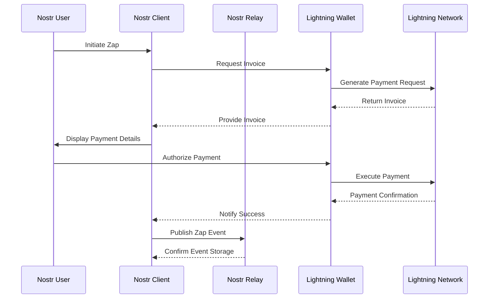

# Lightning Wallet Integration

!!! info "Learning Objectives"
    By the end of this lesson, you'll understand:
    
    - The role of Lightning Network in the Nostr ecosystem
    - Different wallet architectures and their security implications
    - How to configure Lightning integration with Nostr clients
    - Best practices for key management and operational security

## Lightning Network Integration

The Lightning Network provides instant, low-cost Bitcoin payments that enable new economic models within the Nostr protocol. **Zaps** - Lightning-powered micropayments - create direct value transfer between users, facilitating content monetization and network incentives.

This integration transforms social interaction from engagement-based metrics to value-based transactions, enabling creators to receive immediate compensation for their contributions.

## Wallet Architecture Types

### Custodial Wallets

**Technical Characteristics:**
- Private keys managed by service provider
- Simplified user experience with reduced technical complexity
- Immediate availability without channel management requirements
- Centralized counterparty risk

**Implementation Considerations:**
- Lower barrier to entry for new users
- Regulatory compliance requirements for service providers
- Potential for account restrictions or service termination
- Simplified backup and recovery processes

### Non-Custodial Wallets

**Technical Characteristics:**
- User-controlled private key management
- Direct Lightning Network node operation or trusted node connection
- Channel liquidity management requirements
- Enhanced privacy and sovereignty

**Implementation Considerations:**
- Increased technical complexity and user responsibility
- Backup and recovery procedures critical for fund security
- Channel management and liquidity considerations
- Greater resistance to external control or censorship

## Wallet Selection Matrix

| Criteria | Custodial Solutions | Non-Custodial Solutions |
|----------|-------------------|------------------------|
| **Security Model** | Trust-based | Self-sovereign |
| **Key Management** | Service provider | User responsibility |
| **Technical Complexity** | Low | Medium to High |
| **Privacy Level** | Limited | Enhanced |
| **Availability** | High | Variable |
| **Regulatory Risk** | Higher | Lower |

## Recommended Implementations

### Web-Based Integration: Alby

**Technical Specifications:**
- Browser extension with WebLN protocol support
- NIP-07 compliance for Nostr event signing
- Built-in Lightning node connectivity
- OAuth-style authorization for web applications

**Integration Process:**
1. Install browser extension from official distribution channels
2. Complete account creation and backup phrase documentation
3. Configure Lightning node connectivity (custodial or self-hosted)
4. Enable NIP-07 permissions for Nostr applications

### Mobile Solutions

#### Wallet of Satoshi (Custodial)
**Technical Features:**
- Simplified Lightning Network abstraction
- Instant payment processing
- Lightning address support (LNURL-pay)
- Minimal configuration requirements

#### Phoenix (Non-Custodial)
**Technical Features:**
- Automatic channel management
- ACINQ node infrastructure
- On-chain backup mechanisms
- Advanced fee management options

#### Breez (Non-Custodial)
**Technical Features:**
- Built-in Lightning Service Provider (LSP)
- Self-hosted node option
- Podcast integration with streaming payments
- Point-of-sale functionality

## Configuration and Integration

### Lightning Address Setup

Lightning addresses provide human-readable payment identifiers following the format `username@domain.com`. This abstraction simplifies the payment process while maintaining Lightning Network compatibility.

**Implementation Steps:**
1. Obtain Lightning address from wallet provider
2. Configure address in Nostr client profile metadata
3. Verify payment functionality through test transactions
4. Monitor payment notifications and confirmations

### Nostr Client Configuration

**Profile Metadata Configuration:**
```json
{
  "kind": 0,
  "content": {
    "name": "User Name",
    "about": "User description",
    "picture": "https://example.com/avatar.jpg",
    "lud16": "username@domain.com"
  }
}
```

The `lud16` field contains the Lightning address, enabling automatic zap functionality across compatible Nostr clients.

## Practical Exercise: Wallet Setup and Testing

!!! example "Lightning Integration Laboratory"
    
    **Objective:** Configure and test Lightning wallet integration with Nostr protocol
    
    **Phase 1: Wallet Selection and Setup**
    1. Evaluate wallet options based on technical requirements and risk tolerance
    2. Complete wallet installation and initial configuration
    3. Document backup procedures and security measures
    4. Fund wallet with minimal amount for testing purposes
    
    **Phase 2: Nostr Integration**
    1. Configure Lightning address in Nostr client profile
    2. Verify profile propagation across relay network
    3. Test zap functionality with small amounts
    4. Monitor transaction confirmations and notifications
    
    **Phase 3: Operational Validation**
    1. Send test zaps to other users or yourself
    2. Receive zaps and verify notification systems
    3. Analyze transaction fees and processing times
    4. Document any connectivity or reliability issues

## Security Implementation

### Key Management Best Practices

**Backup Procedures:**
- Document seed phrases using offline, physical storage
- Verify backup integrity through recovery testing
- Implement multi-location storage with appropriate security
- Establish clear succession planning for fund recovery

**Operational Security:**
- Use dedicated devices for significant fund management
- Implement strong authentication mechanisms
- Regular security audits of connected applications
- Monitor for unauthorized access or unusual activity

### Fund Management Strategies

**Risk Mitigation:**
- Maintain minimal balances in hot wallets for daily operations
- Use cold storage for long-term fund security
- Implement spending limits and approval processes
- Regular fund movement to reduce exposure windows

## Payment Flow Architecture



## Economic Model Analysis

### Value Transfer Mechanisms

**Micropayment Economics:**
- Transaction costs approaching zero enable micro-value transfer
- Direct creator compensation without platform intermediaries
- Market-driven content valuation through payment amounts
- Network effects from value-based engagement metrics

**Network Incentives:**
- Quality content receives proportional compensation
- Spam reduction through payment requirements
- Relay operator compensation through usage fees
- Developer incentives through application monetization

## Troubleshooting and Diagnostics

### Common Integration Issues

**Connection Problems:**
- Verify wallet application permissions and authorizations
- Check Lightning Network connectivity and channel status
- Confirm Lightning address configuration and propagation
- Test with different Nostr clients for compatibility verification

**Payment Failures:**
- Analyze Lightning Network routing and liquidity constraints
- Verify recipient Lightning address validity and functionality
- Check payment amount limits and wallet balance sufficiency
- Monitor for temporary network congestion or connectivity issues

**Performance Optimization:**
- Configure optimal relay selections for payment notifications
- Implement connection pooling for improved responsiveness
- Cache Lightning invoices to reduce generation latency
- Monitor payment success rates and failure patterns

## Advanced Configuration

### Custom Lightning Infrastructure

**Self-Hosted Solutions:**
- Lightning node deployment and management
- Channel liquidity management strategies
- Backup and monitoring system implementation
- Integration with existing infrastructure and security systems

**Enterprise Considerations:**
- Multi-signature wallet configurations
- Automated payment processing and reconciliation
- Compliance and audit trail requirements
- Scalability planning for high-volume operations

## Next Steps

Lightning wallet integration enables participation in Nostr's value-based economy. Understanding the technical architecture and security considerations prepares you for advanced protocol development and deployment.

<div class="next-lesson">
  <a href="../nostr-tools/" class="btn btn-primary">
    Development Tools and Infrastructure →
  </a>
</div>

---

## Technical Validation

!!! question "Integration Comprehension Assessment"
    
    1. What are the primary trade-offs between custodial and non-custodial wallet architectures?
    2. How does the Lightning address system simplify payment processes?
    3. What security considerations are critical for Lightning wallet operations?
    4. How do zaps change the economic incentives in social networking?
    
    ??? success "Technical Analysis"
        1. **Custodial wallets** trade security and sovereignty for simplicity, while **non-custodial wallets** provide full control at the cost of increased complexity and responsibility
        2. **Lightning addresses** abstract complex payment requests into human-readable identifiers, enabling seamless integration with existing communication protocols
        3. **Key management, backup procedures, and operational security** are fundamental to preventing fund loss and maintaining system integrity
        4. **Direct value transfer** creates immediate feedback loops between content quality and creator compensation, fundamentally altering engagement incentives

---