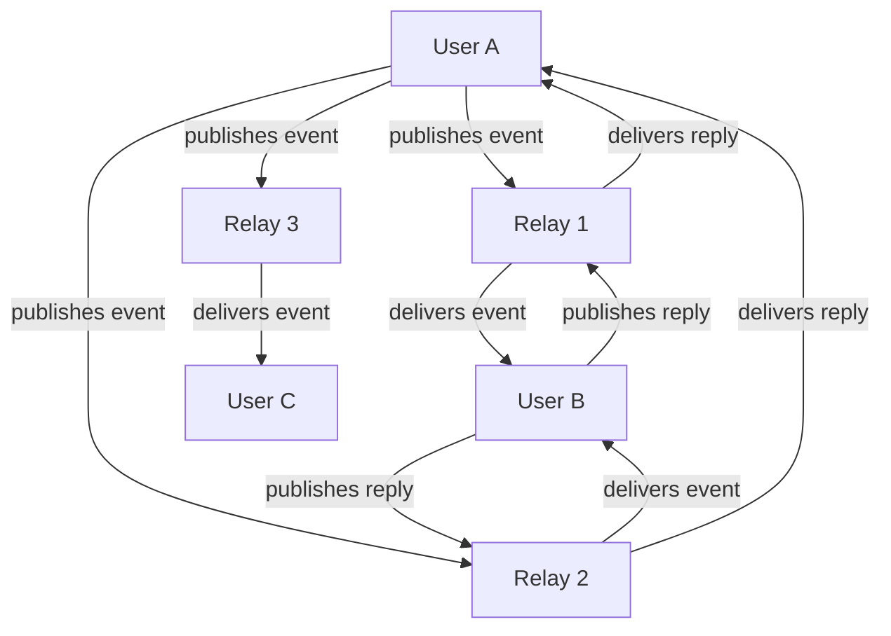

# What is Nostr?

!!! info "Learning Objectives"
    By the end of this lesson, you'll understand:
    
    - What Nostr stands for and its core principles
    - How Nostr differs from traditional social media
    - The basic architecture of the Nostr network
    - Why decentralization matters

## Introduction

**Nostr** stands for "Notes and Other Stuff Transmitted by Relays". It's a simple, open protocol that enables global, decentralized, and censorship-resistant social media.

Unlike traditional social media platforms, Nostr doesn't rely on a central server or company. Instead, it uses a network of relays to distribute messages, giving users complete control over their identity and data.

## Core Principles

### 1. Decentralization
No single point of failure or control. The network consists of many independent relays that anyone can run.

### 2. Censorship Resistance
Since there's no central authority, no single entity can silence users or remove content from the entire network.

### 3. User Ownership
Users own their identity (cryptographic keys) and can move between different clients and relays freely.

### 4. Simplicity
The protocol is intentionally simple, making it easy to implement and understand.

## How Nostr Works



### The Basic Flow

1. **Users** create and sign messages (called "events") with their private keys
2. **Relays** receive, store, and forward these events to other users
3. **Clients** connect to multiple relays to publish and retrieve events

## Key Components

### Events
Everything in Nostr is an "event" - a JSON object containing:

```json
{
  "id": "event_id_hash",
  "pubkey": "user_public_key", 
  "created_at": 1234567890,
  "kind": 1,
  "tags": [],
  "content": "Hello Nostr!",
  "sig": "signature"
}
```

### Relays
Servers that:

- Accept events from users
- Store events (temporarily or permanently)
- Send events to other users upon request
- Can implement their own policies

### Clients
Applications that:

- Generate and manage user keys
- Create and sign events
- Connect to relays
- Display content to users

## Nostr vs Traditional Social Media

| Aspect | Traditional Social Media | Nostr |
|--------|-------------------------|-------|
| **Control** | Platform owns your account | You own your identity |
| **Censorship** | Platform can ban/silence | Censorship-resistant |
| **Data** | Platform owns your data | You control your data |
| **Portability** | Locked to one platform | Move freely between clients |
| **Algorithm** | Platform controls feed | You choose your experience |

## Interactive Example

Let's see how a simple Nostr event looks:

=== "Event Structure"

    ```json
    {
      "id": "a1b2c3d4e5f6...",
      "pubkey": "npub1xyz...",
      "created_at": 1672531200,
      "kind": 1,
      "tags": [
        ["t", "nostr"],
        ["t", "decentralized"]
      ],
      "content": "Just published my first note on Nostr! 🚀",
      "sig": "signature_here..."
    }
    ```

=== "Human Readable"

    **From:** npub1xyz... (Alice)  
    **Time:** January 1, 2023 at 12:00 PM  
    **Type:** Text Note  
    **Tags:** #nostr #decentralized  
    **Content:** Just published my first note on Nostr! 🚀

## Why Does This Matter?

!!! example "Real-World Benefits"
    
    **For Users:**
    
    - ✅ No risk of losing your account
    - ✅ No algorithmic manipulation
    - ✅ True data ownership
    - ✅ Global, uncensorable communication
    
    **For Developers:**
    
    - ✅ Simple protocol to implement
    - ✅ No API restrictions
    - ✅ Build on open standards
    - ✅ Interoperable applications

## Common Misconceptions

!!! warning "Myth vs Reality"
    
    **Myth:** "Nostr is just another blockchain"  
    **Reality:** Nostr doesn't use blockchain technology at all
    
    **Myth:** "It's too technical for regular users"  
    **Reality:** Users interact through user-friendly clients, just like any app
    
    **Myth:** "There's no moderation"  
    **Reality:** Relays and clients can implement their own moderation policies

## Next Steps

Now that you understand what Nostr is, let's explore why it's important and how it compares to existing solutions.

<div class="next-lesson">
  <a href="../why-nostr/" class="btn btn-primary">
    :material-arrow-right: Why Nostr? →
  </a>
</div>

---

## Quick Quiz

Test your understanding:

!!! question "Check Your Knowledge"
    
    1. What does Nostr stand for?
    2. Who owns your identity in Nostr?
    3. What are the main components of the Nostr network?
    4. How does Nostr achieve censorship resistance?
    
    ??? success "Answers"
        1. Notes and Other Stuff Transmitted by Relays
        2. You own your identity through cryptographic keys
        3. Users, Relays, and Clients
        4. Through decentralization - no single point of control 