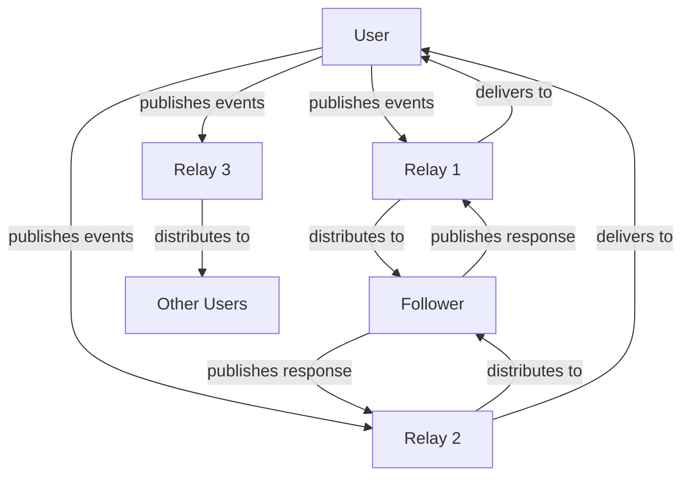

# What is Nostr?

!!! info "Learning Objectives"
    By the end of this lesson, you'll understand:
    
    - What Nostr stands for and its core principles
    - How Nostr differs from traditional social media platforms
    - The fundamental components of the Nostr protocol
    - The benefits of decentralized social networking

## Introduction

**Nostr** stands for "Notes and Other Stuff Transmitted by Relays." It is a simple, open protocol that enables global, decentralized, and censorship-resistant social networking.

Unlike traditional social media platforms, Nostr operates without a central authority, giving users complete control over their identity and data through cryptographic key pairs.

## Core Principles

### Decentralized Architecture
Nostr operates on a network of independent relays rather than centralized servers, eliminating single points of failure and control.

### User Sovereignty
Users maintain full ownership of their identity through cryptographic keys, ensuring no platform can ban or silence them permanently.

### Protocol Simplicity
The protocol prioritizes simplicity over complexity, making it reliable, performant, and easy to implement.

### Censorship Resistance
The distributed nature of relays ensures that content cannot be globally censored by any single entity.

## How Nostr Works



The basic flow involves:

1. **Event Creation**: Users create signed events using their private keys
2. **Relay Distribution**: Events are sent to multiple relays for storage
3. **Content Discovery**: Other users query relays to retrieve relevant events
4. **Interaction**: Users can respond, creating new events in the network

## Protocol Components

### Events
All content in Nostr is represented as events - JSON objects containing:

```json
{
  "id": "event_identifier",
  "pubkey": "author_public_key", 
  "created_at": 1234567890,
  "kind": 1,
  "tags": [],
  "content": "Message content",
  "sig": "cryptographic_signature"
}
```

### Relays
Independent servers that store and forward events. Key characteristics:

- **Autonomous Operation**: Each relay operates independently
- **Configurable Policies**: Relays can implement custom rules and filters
- **Redundancy**: Users connect to multiple relays for reliability

### Clients
Applications that provide user interfaces for interacting with Nostr:

- **Key Management**: Handle cryptographic operations securely
- **Relay Communication**: Connect to multiple relays simultaneously
- **Content Rendering**: Display events in user-friendly formats

## Comparison with Traditional Platforms

| Aspect | Traditional Social Media | Nostr |
|--------|-------------------------|-------|
| **Identity Control** | Platform-owned accounts | User-controlled cryptographic keys |
| **Censorship** | Platform policies apply globally | Per-relay policies, user choice |
| **Data Ownership** | Platform retains all data | Users own their content |
| **Platform Lock-in** | High switching costs | Portable identity across clients |
| **Algorithm Control** | Platform-determined feeds | User-configurable content discovery |

## Technical Example

Here's a basic event creation and publishing flow:

=== "Event Structure"

    ```json
    {
      "id": "a1b2c3d4e5f6...",
      "pubkey": "user_public_key",
      "created_at": 1672531200,
      "kind": 1,
      "tags": [
        ["t", "nostr"],
        ["t", "decentralized"]
      ],
      "content": "Understanding the Nostr protocol",
      "sig": "digital_signature"
    }
    ```

=== "Publishing Flow"

    ```javascript
    // 1. Create event
    const event = {
      kind: 1,
      created_at: Math.floor(Date.now() / 1000),
      tags: [["t", "nostr"]],
      content: "Learning about decentralized protocols"
    }
    
    // 2. Sign event
    const signedEvent = finishEvent(event, privateKey)
    
    // 3. Publish to relays
    relays.forEach(relay => {
      relay.publish(signedEvent)
    })
    ```

## Benefits and Advantages

!!! success "Key Benefits"
    
    **User Empowerment**
    
    - ✅ Complete control over digital identity
    - ✅ Immunity from arbitrary account suspension
    - ✅ Data portability across applications
    - ✅ Algorithmic choice and transparency
    
    **Technical Advantages**
    
    - ✅ Simple, well-defined protocol specification
    - ✅ High reliability through decentralization
    - ✅ Extensible design for future capabilities
    - ✅ Minimal infrastructure requirements

## Common Misconceptions

!!! warning "Clarifications"
    
    **"Nostr requires blockchain technology"**  
    False. Nostr is a simple protocol that does not use blockchain or cryptocurrency.
    
    **"Decentralized means unmoderated"**  
    Incorrect. Individual relays can implement moderation policies, and users can choose their preferred content filters.
    
    **"Technical complexity prevents mainstream adoption"**  
    The protocol complexity is abstracted away by user-friendly client applications.

## Next Steps

Understanding Nostr's architecture provides the foundation for learning about cryptographic identity management.

<div class="next-lesson">
  <a href="../keys/" class="btn btn-primary">
    :material-arrow-right: Keys & Identity →
  </a>
</div>

---

## Knowledge Check

!!! question "Review Questions"
    
    1. What does the acronym "Nostr" represent?
    2. How does Nostr achieve censorship resistance?
    3. What are the three main components of the Nostr ecosystem?
    4. Why doesn't Nostr require blockchain technology?
    
    ??? success "Answer Key"
        1. "Notes and Other Stuff Transmitted by Relays"
        2. Through decentralized relay architecture with no single point of control
        3. Events (content), Relays (infrastructure), and Clients (applications)
        4. It uses simple cryptographic signatures for verification without requiring distributed consensus 