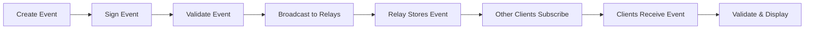

# Understanding Nostr Events

!!! info "What You'll Learn"
    In this tutorial, you'll understand:
    
    - What Nostr events are and how they work
    - Event structure and required fields
    - Different types of events (kinds)
    - How to create, sign, and verify events
    - Event tags and their purposes

!!! tip "Prerequisites"
    - Basic understanding of [Nostr fundamentals](../getting-started/what-is-nostr.md)
    - Basic JavaScript knowledge
    - Understanding of cryptographic signatures

## What is a Nostr Event?

A Nostr event is the fundamental unit of data in the Nostr protocol. Everything that happens on Nostr - from posting a note to following someone - is represented as an event. Think of events as immutable, cryptographically signed messages that can be shared across the network.

## Event Structure

Every Nostr event follows a standardized JSON structure with specific required fields:

```json
{
  "id": "4376c65d2f232afbe9b882a35baa4f6fe8667c4e684749af565f981833ed6a65",
  "pubkey": "6e468422dfb74a5738702a8823b9b28168abab8655faacb6853cd0ee15deee93",
  "created_at": 1673347337,
  "kind": 1,
  "tags": [
    ["e", "5c83da77af1dec6d7289834998ad7aafbd9e2191396d75ec3cc27f5a77226f36"],
    ["p", "f7234bd4c1394dda46d09f35bd384dd30cc552ad5541990f98844fb06676e9ca"]
  ],
  "content": "Hello Nostr! This is my first note.",
  "sig": "908a15e46fb4d8675bab026fc230a0e3542bfade63da02d542fb78b2a8513fcd0092619a2c8c1221e581946e0191f2af505250431fcc808d5210a7d8e858c3e"
}
```

### Required Fields

Let's break down each field:

| Field | Type | Description |
|-------|------|-------------|
| `id` | string | 32-byte hex-encoded SHA256 hash of the serialized event |
| `pubkey` | string | 32-byte hex-encoded public key of the event creator |
| `created_at` | number | Unix timestamp in seconds |
| `kind` | number | Event type identifier (0-65535) |
| `tags` | array | Array of tag arrays for metadata and references |
| `content` | string | Arbitrary content string |
| `sig` | string | 64-byte hex signature of the event hash |

## Creating Your First Event

Let's create a simple text note event step by step:

=== "JavaScript"

    ```javascript
    import { 
        generatePrivateKey, 
        getPublicKey, 
        finishEvent,
        getEventHash,
        signEvent 
    } from 'nostr-tools'

    // Generate keys (in practice, you'd load existing keys)
    const privateKey = generatePrivateKey()
    const publicKey = getPublicKey(privateKey)

    // Create the unsigned event
    const unsignedEvent = {
        kind: 1,
        created_at: Math.floor(Date.now() / 1000),
        tags: [],
        content: "Hello Nostr! This is my first event.",
        pubkey: publicKey
    }

    // Calculate the event ID and sign it
    const eventId = getEventHash(unsignedEvent)
    const signature = signEvent(unsignedEvent, privateKey)

    // Complete event
    const signedEvent = {
        ...unsignedEvent,
        id: eventId,
        sig: signature
    }

    console.log('Created event:', signedEvent)
    ```

=== "Alternative (using finishEvent)"

    ```javascript
    import { generatePrivateKey, getPublicKey, finishEvent } from 'nostr-tools'

    const privateKey = generatePrivateKey()
    const publicKey = getPublicKey(privateKey)

    // finishEvent handles ID calculation and signing automatically
    const event = finishEvent({
        kind: 1,
        created_at: Math.floor(Date.now() / 1000),
        tags: [],
        content: "Hello Nostr! This is my first event."
    }, privateKey)

    console.log('Created event:', event)
    ```

## Event Serialization

The event ID is calculated by hashing a specific serialized representation of the event. This ensures that any modification to the event will result in a different ID.

```javascript
// The serialization format is a JSON array:
const serializedEvent = JSON.stringify([
    0,                    // Reserved (always 0)
    publicKey,           // Public key as hex string
    createdAt,           // Unix timestamp as number
    kind,                // Event kind as number
    tags,                // Tags as array of arrays
    content              // Content as string
])

// The ID is the SHA256 hash of this serialized data
const eventId = sha256(serializedEvent)
```

!!! warning "Serialization Rules"
    When serializing events for ID calculation:
    
    - Use UTF-8 encoding
    - No whitespace or formatting
    - Escape these characters in content: `\n`, `\"`, `\\`, `\r`, `\t`, `\b`, `\f`

## Event Kinds

Event kinds determine how clients should interpret and display events. Here are the most common ones:

### Regular Events (Stored by Relays)

| Kind | Name | Description | NIP |
|------|------|-------------|-----|
| 0 | User Metadata | Profile information | NIP-01 |
| 1 | Short Text Note | Twitter-like posts | NIP-01 |
| 3 | Follow List | Who a user follows | NIP-02 |
| 4 | Encrypted Direct Message | Private messages | NIP-04 |
| 5 | Event Deletion Request | Request to delete events | NIP-09 |
| 6 | Repost | Share another event | NIP-18 |
| 7 | Reaction | Like/dislike events | NIP-25 |

### Replaceable Events (Latest Overwrites Previous)

| Kind | Name | Description | NIP |
|------|------|-------------|-----|
| 10000 | Mute List | Blocked users | NIP-51 |
| 10001 | Pin List | Pinned events | NIP-51 |
| 10002 | Relay List | User's relays | NIP-65 |

### Addressable Events (Replaceable with Identifier)

| Kind | Name | Description | NIP |
|------|------|-------------|-----|
| 30000 | Follow Sets | Named follow lists | NIP-51 |
| 30001 | Generic Lists | Categorized lists | NIP-51 |
| 30023 | Long-form Content | Blog posts/articles | NIP-23 |

## Working with Tags

Tags provide metadata and create relationships between events. They're arrays where the first element is the tag name:

### Common Tag Types

```javascript
// Reference another event
["e", "event_id", "relay_url", "marker"]

// Reference a user
["p", "pubkey", "relay_url", "petname"]

// Hashtag
["t", "bitcoin"]

// Content identifier
["d", "my-article-slug"]

// Subject/title
["subject", "My Article Title"]
```

### Example: Creating a Reply

```javascript
const replyEvent = finishEvent({
    kind: 1,
    created_at: Math.floor(Date.now() / 1000),
    tags: [
        ["e", originalEventId, "", "reply"],     // Reply to this event
        ["p", originalAuthorPubkey]              // Notify the author
    ],
    content: "Thanks for sharing this!"
}, privateKey)
```

### Example: Profile Metadata

```javascript
const profileEvent = finishEvent({
    kind: 0,
    created_at: Math.floor(Date.now() / 1000),
    tags: [],
    content: JSON.stringify({
        name: "Alice",
        about: "Bitcoin developer and privacy advocate",
        picture: "https://example.com/alice.jpg",
        nip05: "alice@example.com"
    })
}, privateKey)
```

## Event Validation

When receiving events, always validate them:

=== "Basic Validation"

    ```javascript
    import { verifySignature, getEventHash } from 'nostr-tools'

    function validateEvent(event) {
        // Check required fields
        const requiredFields = ['id', 'pubkey', 'created_at', 'kind', 'tags', 'content', 'sig']
        for (const field of requiredFields) {
            if (!(field in event)) {
                return false
            }
        }

        // Verify the ID matches the content
        const calculatedId = getEventHash(event)
        if (calculatedId !== event.id) {
            return false
        }

        // Verify the signature
        if (!verifySignature(event)) {
            return false
        }

        return true
    }

    // Usage
    if (validateEvent(receivedEvent)) {
        console.log('Event is valid!')
    } else {
        console.log('Invalid event received')
    }
    ```

=== "Advanced Validation"

    ```javascript
    function validateEventAdvanced(event) {
        // Basic validation
        if (!validateEvent(event)) {
            return { valid: false, error: 'Basic validation failed' }
        }

        // Check timestamp (not too far in future/past)
        const now = Math.floor(Date.now() / 1000)
        const oneDay = 24 * 60 * 60
        
        if (event.created_at > now + oneDay) {
            return { valid: false, error: 'Event too far in the future' }
        }
        
        if (event.created_at < now - (365 * oneDay)) {
            return { valid: false, error: 'Event too old' }
        }

        // Check kind is valid
        if (event.kind < 0 || event.kind > 65535) {
            return { valid: false, error: 'Invalid kind' }
        }

        // Check pubkey format
        if (!/^[0-9a-f]{64}$/.test(event.pubkey)) {
            return { valid: false, error: 'Invalid pubkey format' }
        }

        return { valid: true }
    }
    ```

## Event Broadcasting

Once you have a valid event, you can broadcast it to relays:

```javascript
import { relayInit } from 'nostr-tools'

async function broadcastEvent(event, relayUrls) {
    const results = []
    
    for (const url of relayUrls) {
        try {
            const relay = relayInit(url)
            await relay.connect()
            
            const pub = relay.publish(event)
            
            pub.on('ok', () => {
                console.log(`Published to ${url}`)
                results.push({ url, success: true })
            })
            
            pub.on('failed', (reason) => {
                console.log(`Failed to publish to ${url}: ${reason}`)
                results.push({ url, success: false, reason })
            })
            
        } catch (error) {
            console.error(`Error with ${url}:`, error)
            results.push({ url, success: false, error: error.message })
        }
    }
    
    return results
}

// Usage
const relays = [
    'wss://relay.damus.io',
    'wss://nos.lol',
    'wss://relay.snort.social'
]

await broadcastEvent(myEvent, relays)
```

## Practical Exercise

Let's build a simple event creator and validator:

=== "Event Creator"

    ```javascript
    class EventCreator {
        constructor(privateKey) {
            this.privateKey = privateKey
            this.publicKey = getPublicKey(privateKey)
        }

        createTextNote(content, replyTo = null) {
            const tags = []
            
            if (replyTo) {
                tags.push(['e', replyTo.id, '', 'reply'])
                tags.push(['p', replyTo.pubkey])
            }

            return finishEvent({
                kind: 1,
                created_at: Math.floor(Date.now() / 1000),
                tags,
                content
            }, this.privateKey)
        }

        createProfile(profile) {
            return finishEvent({
                kind: 0,
                created_at: Math.floor(Date.now() / 1000),
                tags: [],
                content: JSON.stringify(profile)
            }, this.privateKey)
        }

        createReaction(targetEvent, reaction = '+') {
            return finishEvent({
                kind: 7,
                created_at: Math.floor(Date.now() / 1000),
                tags: [
                    ['e', targetEvent.id],
                    ['p', targetEvent.pubkey]
                ],
                content: reaction
            }, this.privateKey)
        }
    }

    // Usage
    const creator = new EventCreator(myPrivateKey)

    const note = creator.createTextNote("Hello Nostr!")
    const profile = creator.createProfile({
        name: "Alice",
        about: "Nostr developer"
    })
    const reaction = creator.createReaction(someEvent, '🚀')
    ```

=== "Test It Out"

    ```html
    <!DOCTYPE html>
    <html>
    <head>
        <title>Event Creator</title>
        <script type="module">
            import { generatePrivateKey, getPublicKey, finishEvent } from 'https://unpkg.com/nostr-tools@1.17.0/lib/esm/index.js'

            const privateKey = generatePrivateKey()
            const publicKey = getPublicKey(privateKey)

            document.getElementById('create-note').onclick = () => {
                const content = document.getElementById('note-content').value
                
                const event = finishEvent({
                    kind: 1,
                    created_at: Math.floor(Date.now() / 1000),
                    tags: [],
                    content
                }, privateKey)

                document.getElementById('output').textContent = JSON.stringify(event, null, 2)
            }
        </script>
    </head>
    <body>
        <h1>Event Creator</h1>
        <textarea id="note-content" placeholder="Enter your note..."></textarea><br>
        <button id="create-note">Create Event</button>
        <pre id="output"></pre>
    </body>
    </html>
    ```

## Understanding Event Flow

Here's how events flow through the Nostr network:



## Best Practices

!!! tip "Event Creation Best Practices"
    
    1. **Always validate events** before broadcasting
    2. **Use appropriate kinds** for different content types
    3. **Include relevant tags** for discoverability
    4. **Keep content reasonable** - some relays have size limits
    5. **Use proper timestamps** - not too far in past/future
    6. **Handle failures gracefully** when broadcasting

!!! warning "Security Considerations"
    
    - Never share your private key
    - Always verify signatures on received events
    - Be cautious with events from unknown sources
    - Validate all event fields before processing

## Next Steps

Now that you understand events, you can:

- Learn about [relay communication](./relay-communication.md)

---

<div class="tutorial-navigation">
  <a href="../simple-client/" class="btn btn-outline">
    ← Previous: Simple Client
  </a>
  <a href="../relay-communication/" class="btn btn-primary">
    Next: Relay Communication →
  </a>
</div>
